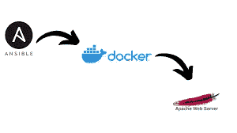

# 用于在 Docker 容器上配置 web 服务器的可行行动手册

> 原文：<https://medium.com/analytics-vidhya/ansible-playbook-for-configure-the-webserver-on-docker-container-3269506c35e7?source=collection_archive---------20----------------------->



## 配置 Docker

## 👉启动并启用 Docker 服务
👉从 Docker Hub
获取 httpd 服务器镜像👉运行 docker 容器并将其公开
👉复制/var/www/html 目录
中的 html 代码，启动 web 服务器

## 1 >为 Docker 安装配置软件包

首先，为了安装 docker 软件，我们必须创建一个存储库。

```
- name: "Creating  An yum repo for docker..... "
    yum_repository:
            name: "docker"
            description: "repo for DOcker"
            baseurl: "[https://download.docker.com/linux/centos/7/x86_64/stable/](https://download.docker.com/linux/centos/7/x86_64/stable/)"
            gpgcheck: no
```

## 2 >安装 Docker 软件

现在，我们有两个安装 docker 软件的选项。

第一个选项我们可以直接使用 ansible 的 package 模块，但是在这个过程之后会出现错误。这不能帮助我们安装一个完美的 docker 软件版本。正如我们所知，docker 软件的安装也可以通过帮助命令模块来完成，但在这里，在这种情况下，我们可以使用 shell 模块而不是命令模块，因为在命令模块中，我们不能使用 shell 模块中的 shell 关键字，但我们可以这样做(for–no best)。

第二种选择是，我们可以安装 docker 软件，并查看已安装的 docker 版本。现在，我们可以复制这个相同的版本，我们将运行相同版本的包模块，这将下载完美的 docker 软件。

```
- name: "Installing Docker ....."
    package:
       name: "docker-ce-18.09.1-3.el7.x86_64"
       state: present
```

## 3 >启动 Docker 服务

现在让我们借助 ansible 模块启动 docker 服务。现在我们要拉 httpd 的图像。因此，我们将使用一个模块，在 docker image 的帮助下提取 docker 的图像，但我们将面临一个问题，因为它需要一个名为“docker-py”的 python 模块。为了安装这个 python 模块，我们需要一个由 ansible 提供的 pip 模块。

```
- name: "docker_image module need an python module i.e. docker-py ..."
    pip:
      name: docker-py- name: "Pulling Image httpd ....."
    docker_image:
            name: httpd
            source: pull
```

## 4 >现在复制(。html)代码到完美的地方！！

我们将创建一个. html 页面，并在复制模块的帮助下传输该文件。我们必须确保我们已经在一个安全的地方复制了这个文件。

```
- name: "Copying the html file (page) ...."
    copy:
        dest: "~/index.html"
        content: "Hii This page is Hosted From the HTTPD docker image !!"
```

## 5 >午餐 Docker 容器并将其暴露！！

现在，我们将在映像 HTTPD 的帮助下启动 docker 容器，但当此映像启动时，我们将在一个端口公开此映像，启动时，我们将向此映像附加一个目的地。html 文件的位置。

```
- name: "Lunching the docker image i.e. httpd ...."
    community.general.docker_container:
            name: webOS
            image: httpd
            ports:
                 - "888:80"
            state: started
```

## 6 >允许防火墙通过我们暴露该容器的端口

现在我们必须允许 docker 图像暴露的端口。

```
- name: "lets allow firewall for the port which we have routed for to the docker webserver !!"
    firewalld:
            port: "888/tcp"
            state: enabled
            permanent: yes
            immediate: yes
```

完整脚本→[https://github . com/shashwatsingh 22/ansi ble/tree/main/play _ for _ docker](https://github.com/Shashwatsingh22/Ansible/tree/main/play_for_docker)

谢谢大家！！