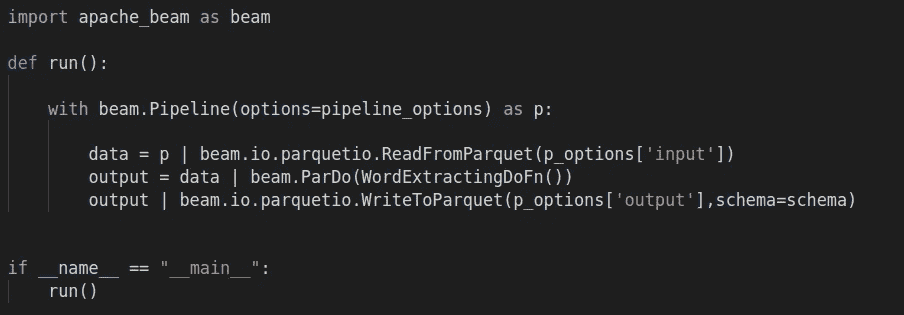
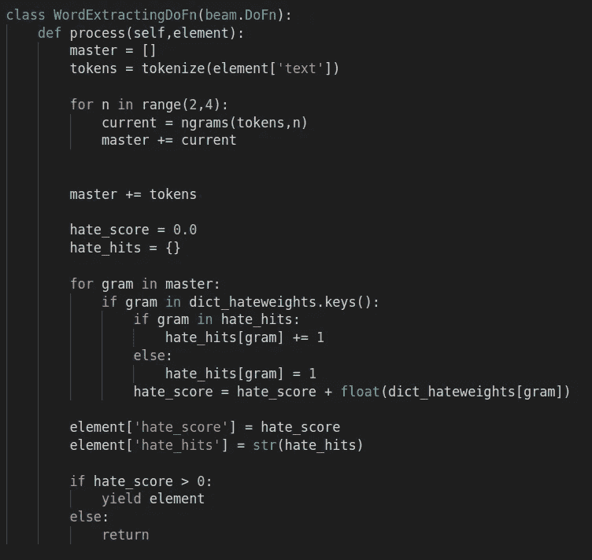
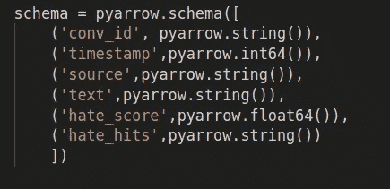

# 阿帕奇光束-一个简单的指南。

> 原文：<https://medium.com/analytics-vidhya/apache-beam-an-easy-guide-172304900014?source=collection_archive---------12----------------------->

如今，大数据框架风靡一时。理由很充分:需要处理和分析的数据量是巨大的。以至于我们经常无法在个人电脑上处理一些数据集。

这就是大数据的用武之地。这个想法是使用多台计算机来处理给定的数据集。这通常需要在 AWS 或 Azure 这样的云服务中运行大量虚拟机，然后使用 Spark 或 Dask 这样的特定框架来解决数据问题。通过这种方式，我们可以利用几十台，有时甚至几百或几千台单独的计算机(或“节点”)来处理我们的数据。

那么，如何以这种方式使用多台机器呢？正如我提到的，通常这需要使用特定的框架。其中最著名的是 MapReduce 和 Spark。这些框架不同于使用传统 python 库进行分析或 ML。它们几乎是不同的语言，或者至少是我们通常使用的语言的扩展。它们的工作方式也不同，我们必须适应它们，让它们发挥作用。然后，是将我们的代码部署到实际集群的不那么容易的步骤。

最近，在我实习的时候，我试图分析一个相对较大的新闻文章数据集。我发现试图在这些上运行简单的矢量化会使我的 colab 实例崩溃。我意识到是时候升级游戏，进入大数据世界了。

首先我用 Spark 做了实验。后来我听说了一个叫 Dask 的东西。最后有人推荐 Apche Beam。Apache Beam 的优势在于，当与 Google 的数据流结合使用时，它几乎完全消除了集群设置方面的问题。几乎完全。我们仍然需要传递一些配置，但是我们不需要弄乱 Docker 映像和手动设置 worker 节点等。

不幸的是，关于 Beam 的文档很少，而且很难找到存在的文档。因此，在让 Beam 为自己工作后，我想我应该写一篇帖子来帮助那些可能发现自己和我走在同一条路上的人。

光束有两个主要部分:p 集合和 p 转换。Pcollections 是 Beam 使用的数据结构，PTransforms 是应用于这些 PCollections 的转换。在一个典型的 Beam 脚本中，我们将数据读入一个 PCollection，对该数据进行转换，然后将该应用程序的输出写入另一个 PCollection。

让我们看一些示例代码:

我们从导入光束模块开始。然后，我们从该模块实例化一个管道对象(参见以“with beam”开头的行。管道”)。这个管道对象是我们构建希望在集群上运行的实际管道的地方。您可能会看到，管道中的主要操作符是“|”操作符。这个操作符基本上是告诉 Beam 将左边的输入输入到右边的流程中。这个过程的结果存储在变量中。

例如，在上面的代码中，在管道的第一行(即在 beam 之后……我们看到行 data = p | beam . io . parquetio . ReadFromParquet。这里，我们获取 pipline 对象本身并将其输入 ReadFromParquet 转换。这个转换读取一个 parquest 文件，并将其转换成一个 PCollection。pipline 的第一步通常包括以这种方式将 pipline 对象输入到转换中。此转换生成的 Pcollection 存储为“数据”。

在下一行中，我们将这个“数据”变量通过管道传递给另一个转换，特别是 ParDo 转换。这是光束独有的一种特殊类型的变换。尽管 beam 有许多固有的变换，如 sum、grou 等，ParDo 变换是一种灵活的方式，可以对数据执行自定义变换。ParDo 会将指定的函数应用到 Pcollection 的每一行。

注意，我们向 ParDo 传递了一个名为 WordExtractingDFn 的东西。这是我们为 Beam 构建的自定义函数。实际上它是一个物体。Beam 中自定义函数的工作方式是，我们必须扩展 DoFn 类，并在这个扩展中定义一个名为“process”的方法，这就是我们函数逻辑的编写位置。这里有一个完整的例子:

在这里，您可以看到实践中的方法。我们定义了一个名为 WordExtractingDoFn 的新类，它扩展了 beam。DoFn 级，内置于 Beam 中。然后，我们定义我们的“process”方法，该方法具有我们希望应用于当前行的逻辑，该逻辑作为“element”传递到方法中。在这种情况下，我们使用 tokenize 函数(在别处定义——只要它在 process 方法中被调用，就没问题。只有这样，它才会被光束实际应用)。我们生成令牌，然后从这些令牌生成各种 ngrams，然后我们做一些自定义的术语计数和评分。我们向行中添加新的“列”来保存我们的输出(参见“element['hates_score']等)。然后我们返回新行(作为元素),然后将该行添加到输出 Pcollection 中。

在 Beam 中要考虑的一个重要概念是“模式”。模式基本上是我们的 Pcollection 中的列名。通常，我们必须手动指定这些模式。这里的情况不是这样，因为当您读取一个 Parquet 文件时，Beam 会推断出一个模式。然而，CSV 文件不是这种情况，如果希望引用传递到 DoFn 方法的行中的特定字段(即列),则必须指定模式。以下是如何创建模式的示例:

注意，模式是使用 pyarrow 库的 schema 方法构建的。

这是如何开始使用 Apache Beam 的快速入门。请继续关注下一篇文章，我将带您完成将管道部署到云的过程！