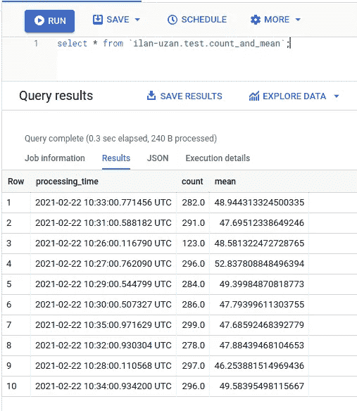

# 阿帕奇光束-从零到英雄 Pt。2:流式管道

> 原文：<https://medium.com/analytics-vidhya/apache-beam-from-zero-to-hero-pt-2-streaming-pipelines-2aa9b53ab387?source=collection_archive---------9----------------------->


马修·施瓦茨在 [Unsplash](https://unsplash.com?utm_source=medium&utm_medium=referral) 上的照片

系列上一篇:
[阿帕奇光束——从零到英雄 Pt。1:批量流水线](/analytics-vidhya/apache-beam-from-zero-to-hero-pt-1-batch-pipelines-ee117c37abc8)

在这篇文章中，我们将实现一个流管道，同时涵盖 Apache Beam 的其余基本概念。让我们首先解释什么是流式管道，以及它与批处理管道的区别。

# 介绍

批处理管道和流式管道之间的基本区别在于，批处理管道会一直运行，直到完成输入数据(数据量是有限的)，而流式管道会一直运行(当然，直到手动停止)，因为输入数据是无限的。

我们可以用不同的方式来说:批处理管道从有界的 PCollections 获得数据，而流式管道从无界的 PCollections 获得数据——让我们更详细地讨论这些术语。

# 有界与无界 p 集合

PCollection 是有界还是无界由生成它的数据源决定。如果我们从数据库或文件等数据源读取数据(就像上一篇文章中那样)，我们会得到一个有界的 PCollection，如果我们从 Pub/Sub(或基本上任何其他排队数据源)读取数据，我们会得到一个无界的 PCollection。

这两种类型的 p 集合在管道中的处理方式不同。虽然可以读取和处理有界的 PCollection，而不需要为数据指定任何批处理方法，但是对于无界的 p collection，我们必须定义一种方法来将连续的数据流分成批处理，以便对其应用一些转换——在 Apache Beam 中，这被称为 **Windowing** ，我将在本文中进一步讨论这一点。

让我们从实现一个流管道开始，并回顾它的不同组件，就像我们在上一篇文章中所做的那样。

# 管道要求

我们将通过以下步骤实现管道:

*1。****read-from-pubsub****:从 Google Cloud Pub/Sub 中读取源源不断的 JSON 元素*这里我们将使用* ***Pub/Sub 连接器。*** *2。* ***滤镜*** *:只通过那些“持续时间”字段不超过 100 的元素——我们将学习* ***滤镜变换。*** *3。* ***窗口*** *:每分钟批量处理元素——我们将学习如何使用* ***窗口。*** *4。* ***计算-度量*** *:计算每批的这两个度量:
(1)元素数量
(2)“持续时间”字段的平均值
5。****Write-to-bq****:将结果写入 big query——这里我们将再次重温* ***BigQuery 连接器*** *，它在流管道中的工作方式与批处理管道略有不同..*

*每个元素都是 JSON 格式，结构如下:
{ "id": 1，" type": "chair "，" duration": 20 }*

首先，我们需要建立管道的基本结构:

```
import argparse
import apache_beam as beam
from apache_beam.options.pipeline_options import PipelineOptions, StandardOptionsdef run(argv=None, save_main_session=True):
  parser = argparse.ArgumentParser()
  parser.add_argument(
  ... known_args, pipeline_args = parser.parse_known_args(argv)
  pipeline_options = PipelineOptions(pipeline_args) **pipeline_options.view_as(StandardOptions).streaming = True** with beam.Pipeline(options=pipeline_options) as p:
    (p
      ....)if __name__ == '__main__':
  run()
```

我们通过在选项中指定来将管道定义为流式管道。现在有了基本的结构，让我们实现第一步——使用*发布/订阅连接器*从发布/订阅订阅中读取数据。

# 发布/订阅连接器

Pub/Sub 是 Google 针对消息传递和事件驱动系统的托管解决方案，我们将使用它作为管道的数据源。我们使用函数 *ReadFromPubSub* 返回一个无界的 PCollection:

```
with beam.Pipeline(options=pipeline_options) as p:
  (p
 **| 'Read from pubsub' >> beam.io.ReadFromPubSub(subscription=known_args.subscription))**
```

这里我们可以向函数传递其他几个参数，比如“with_attributes”和“timestamp_attribute ”,你可以在[这里](https://beam.apache.org/releases/pydoc/2.27.0/apache_beam.io.gcp.pubsub.html)中读到更多关于它们的内容，但是在我们的例子中，缺省值就足够了。

接下来的步骤需要将元素访问为 dict，为此，我们需要首先将传入消息的有效负载从 base64 转换为 UTF-8，然后将其转换为字典:

```
(p
  | 'Read from pubsub' >>  beam.io.ReadFromPubSub(subscription=known_args.subscription)
 **| 'To Json' >> beam.Map(lambda e: json.loads(e.decode('utf-8'))))**
```

下一步是过滤掉“持续时间”大于 100 的元素。我们通过*滤波器*变换来实现。

# 过滤数据

Apache Beam 中有一个特殊的过滤器转换，它获得一个布尔函数——只有当函数返回 true 时，元素才会被向前传递:

```
**def within_limit(x, limit):
  return x <= limit**with beam.Pipeline(options=pipeline_options) as p:
  (p
    | 'Read from pubsub' >> beam.io.ReadFromPubSub(subscription=known_args.subscription)
    | 'To Json' >> beam.Map(lambda e: json.loads(e.decode('utf-8')))
 **| 'Filter' >> beam.Filter(within_limit, 100))**
```

下一步是每分钟批量处理我们的数据。为此，我们需要将*窗口*引入到我们的管道中。

# 开窗术

由于流式管道处理无限的数据流，因此某些操作需要批处理策略才能工作(执行聚合。例如)。

Apache Beam 提供了几个现成的窗口函数，我们也可以自己编写一个。在我们的例子中，我们可以使用已经提供的固定时间窗口*** -只需将数据分成 1 分钟一批:

```
with beam.Pipeline(options=pipeline_options) as p:
  (p
    | 'Read from pubsub' >>   beam.io.ReadFromPubSub(subscription=known_args.subscription)
    | 'To Json' >> beam.Map(lambda e: json.loads(e.decode('utf-8')))
    | 'Filter' >> beam.Filter(within_limit, 100) **| 'Window' >> beam.WindowInto(window.FixedWindows(6)))**
```

* * *只要 PCollection 元素具有 timestamp 属性，就可以使用 *fixedWindows* 函数。在我们的例子中， *ReadFromPubSub* 返回一个元素的 PCollection，将消息的发布时间戳作为时间戳属性，因此我们不需要添加任何东西。你可以在[这里](https://beam.apache.org/documentation/programming-guide/#windowing)阅读更多关于不同类型的窗口功能。

下一步，我们需要为每批计算 2 个指标。在前一篇文章中，我们可以使用像 *sum* 这样的现成集合，而这一次我们需要编写自己的集合——我们需要引入一个*自定义组合器*。

# *自定义合并器*

为了计算每批的平均值和计数，我们需要实现 CombineFN 类(这是几种方法之一):

```
class CountAndMeanFn(beam.CombineFn):
  def create_accumulator(self):
    return 0.0, 0 def add_input(self, sum_count, input):
    (sum, count) = sum_count
    return sum + input[‘duration’], count + 1

  def merge_accumulators(self, accumulators):
    sums, counts = zip(*accumulators)
    return sum(sums), sum(counts)

  def extract_output(self, sum_count):
    (sum, count) = sum_count
    return {
      'processing_time': datetime.utcnow()
        .strftime('%Y-%m-%dT%H:%M:%S.%fZ'),
      'count': count,
      'mean': sum / count if count else float('NaN')
    }
```

让我们来分解一下:

1.  在 *create_accumulator* 方法中，我们定义了累加器的初始状态。
2.  在 *add_input* 方法中，我们实现了向当前累加器添加元素的行为。我们希望对元素计数+对持续时间字段求和(以便能够在以后计算平均值)。
3.  在 *merge_accumulators* 方法中，我们实现了将多个累加器合并为一个累加器的行为(如果在这个步骤中有多个工人，这是相关的)。
4.  在 *extract_output* 中，我们定义了累加器的最终输出——在我们的例子中，用我们刚刚计算的度量向前传递一个 JSON 元素；

让我们将它添加到管道中——我们不想按任何特定的键分组，而是要总结整个批处理，所以我们将使用 *CombineGlobally* :

```
(p 
  | 'Read from pubsub' >> beam.io.ReadFromPubSub(subscription=known_args.subscription)
  | 'To Json' >> beam.Map(lambda e: json.loads(e.decode('utf-8')))
  | 'Filter' >> beam.Filter(within_limit, 100)
  | 'Window' >> beam.WindowInto(window.FixedWindows(300))
 **| 'Calculate Metrics' >> beam
                            .CombineGlobally(CountAndMeanFn())
                            .without_defaults())**
```

我们现在要做的就是将数据加载到 BigQuery 中。

# 再次写入 BigQuery

**(为了简洁起见，从现在开始我将使用 BQ 而不是 big query)*

在批处理和流管道中，写入 BQ 的工作方式略有不同。阿帕奇梁对 BQ 有 2 种可能的加载方式:
1。FILE_LOADS 方法——这是我们在上一篇文章中已经讨论过的方法(它是批处理管道的默认方法)。
2。STREAMING_INSERTS 方法——这是流式管道的默认方法。

两者之间的区别非常明显——FILE _ LOADS 方法将要写入 BQ 的行聚集到文件中，然后加载这些文件，而在 STREAMING_INSERTS 方法中，行是“一次一行”插入的(BQ 针对流功能优化了该过程，如果您自己尝试一次插入一行，实际上会导致非常差的性能)。

可以为流式管道定义 FILE_LOADS 加载方法，尽管默认设置为***:

1.  便宜多了。BigQuery 流并不便宜，而将文件加载到 BigQuery 是免费的- [这篇](/google-developer-experts/trimming-down-over-95-of-your-bigquery-costs-using-file-loads-d08dd3d8b2fd)文章详细描述了如何通过使用 FILE_LOADS 来大幅削减 BQ 成本。
2.  有一个流大小限制——最大行大小是 5MB，而在 BigQuery 中通常是 100MB。虽然超过 5MB 的行并不常见，但随着时间的推移，这可能会成为一个真正的问题。

其他一些已知的限制在[这里](https://cloud.google.com/bigquery/quotas#streaming_inserts)描述。

***如果您真的需要流插入提供的相对较低的延迟，那么它是值得考虑的，但也值得考虑您是否使用了正确的工具来完成这项工作——也许 BigQuery 在这里不一定是最合适的选择。

由于我使用 Google Cloud Platform 的免费层来写这篇文章，所以我将使用 FILE_LOADS 方法——我需要手动指定 FILE_LOADS 作为加载方法，并添加一个触发频率(在加载到 BQ 之前，一批中应该有多少条记录):

```
(p 
  | 'Read from pubsub' >> beam.io.ReadFromPubSub(subscription=known_args.subscription)
  | 'To Json' >> beam.Map(lambda e: json.loads(e.decode('utf-8')))
  | 'Filter' >> beam.Filter(within_limit, 100)
  | 'Window' >> beam.WindowInto(window.FixedWindows(300))
  | 'Calculate Metrics' >> beam
                            .CombineGlobally(CountAndMeanFn())
                            .without_defaults()
 **| 'Write to BigQuery' >> beam.io.WriteToBigQuery(
                             known_args.table_spec,
                             schema=table_schema,
                             method=                                                                                
                     beam.io.WriteToBigQuery.Method.FILE_LOADS,**
                             **triggering_frequency=1,** 
                             **write_disposition=
                     beam.io.BigQueryDisposition.WRITE_APPEND,
                             create_disposition=
                     beam.io.BigQueryDisposition.CREATE_IF_NEEDED))**
```

为了使用 STREAMING_INSERTS 方法，您可以删除触发频率和方法规范。

就这样，我们的管道完工了。让我们运行它(我生成了一个 writer 进程，它在后台向 Pub/Sub 写入消息，它在 repo 中可用):

```
$ python -m main --temp_location gs://tests_tmp_1/tmp
```

我们每分钟都在汇总数据，所以在运行管道 10 分钟后，我停止了它，这是 BQ 中的结果:



# 结论

帖子里的完整代码可以在[这里](https://github.com/SockworkOrange/blog-posts/tree/main/apache-beam-streaming-pipelines)找到。希望你现在已经有了一个基本的(也许更多)流式管道，它们如何与批处理管道区分开来，当然，还有如何用 Python 自己实现一个。