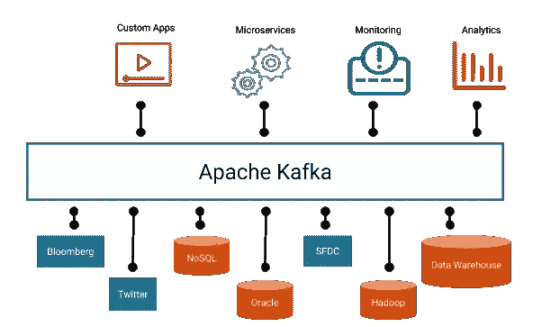
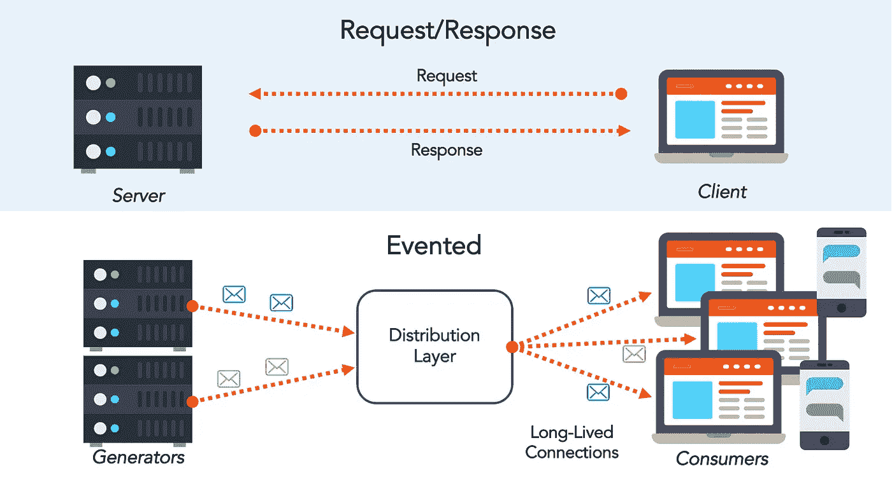
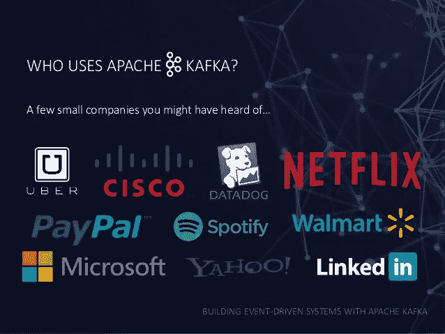
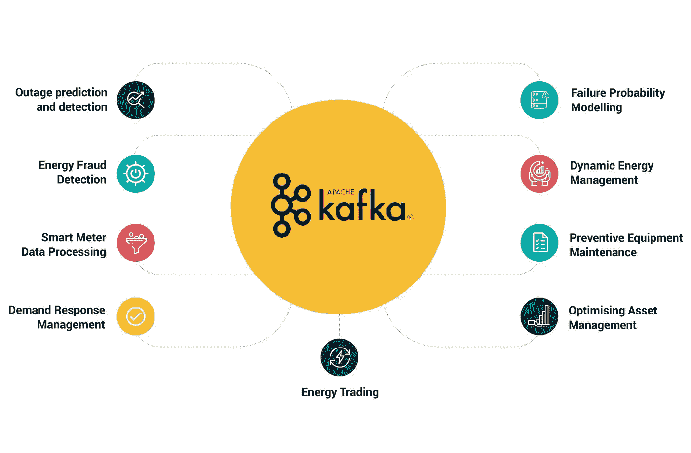
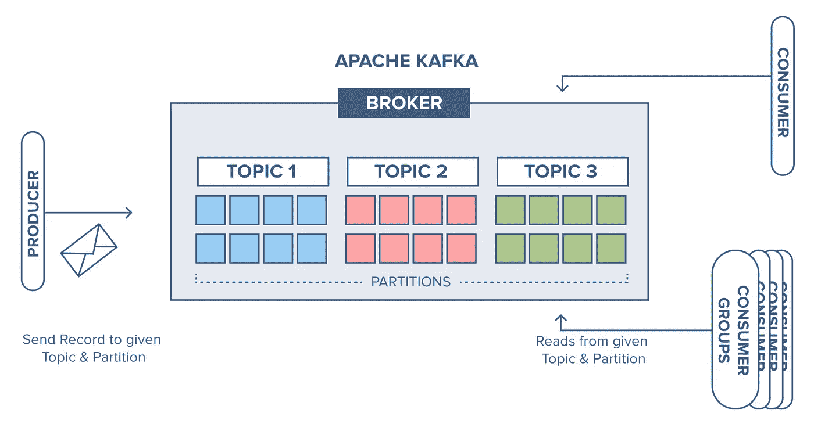
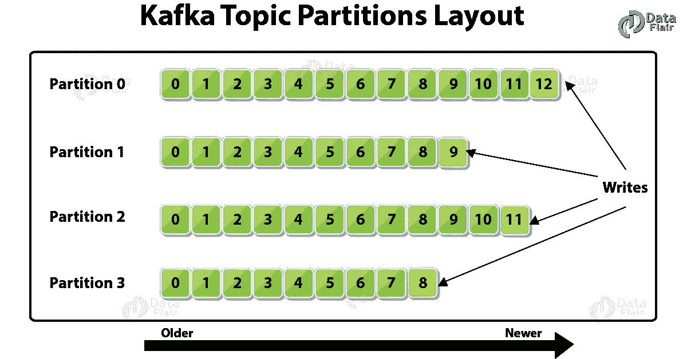

# Apache Kafka 架构-Apache Kafka 入门

> 原文：<https://medium.com/analytics-vidhya/apache-kafka-architecture-getting-started-with-apache-kafka-771d69ac6cef?source=collection_archive---------1----------------------->

在这篇博文中，我将尝试解释什么是 Apache Kafka，它是如何工作的，何时使用，向 Kafka 写入数据，以及从 Kafka 读取数据。令人愉快的读物。



资源:[http://www.techmonks.org/kafka-terminology/](http://www.techmonks.org/kafka-terminology/)

我们先来看看过去的建筑。在 90 年代，客户机-服务器体系结构很流行。这里有一个整体结构。在 ***的单片*** 结构中；所有结构都包含在一个应用程序中。随着时间的推移，上网人数增加了。版本更新已经成为一种持续的需求。由于这个原因，喜欢这种结构的人越来越少。

然后 ***微服务*** 脱颖而出。但是，由于微服务中有太多的应用程序，应用程序如何相互通信的问题一直是个大问题。

随着时间的推移，新的组件开始出现。每个新发布的组件都会导致应用程序网络中出现许多新的连接。

在接下来的时间里，两种不同的架构开始被使用。

`Request/Response Architecture`；在这个架构中，一个部分调用另一个部分，并等待它的响应。这个网络非常庞大和复杂。随着数据量的增长，使用这种架构变得有点困难。

另一个是`Event-Driven Architecture`； ***消息总线*** 使得这种架构的实现成为可能。现在，与`Event`的交流已经在军种之间开始了。没有服务直接联系对方。

每个部分都异步地做事情，彼此之间没有联系。还有很多其他应用使用`Message Bus`。阿帕奇卡夫卡就是其中之一，可以说是最受欢迎的。



资源:[https://realtimeapi.io/hub/event-driven-apis/](https://realtimeapi.io/hub/event-driven-apis/)

## 那么阿帕奇卡夫卡是如何传递这种信息的呢？

在卡夫卡那里，信息被发送到叫做`Topic`的地方。每个主题都有一个名称。另外，其他人也可以阅读这些主题。

## 什么是阿帕奇卡夫卡？

Apache Kafka，就其最一般的定义而言，是一个分布式消息传递系统。卡夫卡的一些特征是:

*   流处理平台
*   开源软件
*   分布式的计算机系统
*   完全可扩展
*   高性能-低延迟

阿帕奇卡夫卡；被许多大公司使用，如网飞、苹果、优步、Spotify 和 LinkedIn。现在，实时流处理对公司来说变得非常重要。



资源:[https://www . slide share . net/brianritchie 1/building-event driven-systems-with-Apache-Kafka](https://www.slideshare.net/brianritchie1/building-eventdriven-systems-with-apache-kafka)

## 我们能用阿帕奇卡夫卡做什么？

*   欺诈和异常检测
*   推荐引擎
*   监控/指标
*   活动跟踪
*   集成系统
*   实时流处理



资源:[https://axual.com/apache-kafka-use-cases-in-real-life/](https://axual.com/apache-kafka-use-cases-in-real-life/)

## 阿帕奇·卡夫卡的建筑

卡夫卡建筑有 4 个演员。这些是；

*   经纪人
*   动物园管理员
*   生产者
*   消费者



资源:[https://www . cloudkarafka . com/blog/2016-11-30-part 1-Kafka-for-初学者-什么是-apache-kafka.html](https://www.cloudkarafka.com/blog/2016-11-30-part1-kafka-for-beginners-what-is-apache-kafka.html)

每个 Kafka 集群由一个或多个`Brokers`组成。每个代理相互依赖地工作。每个经纪人都有自己唯一的识别号。在代理中发送给 Kafkaya 的消息被存储和处理。计算机内存不用于数据存储。数据存储在硬盘上。

`Zookeeper`是开源软件。卡夫卡用 Zookeeper 来管理所有经纪人。发送的数据从不存储在这里。动物园管理员的职责是:

*   协调经纪人。
*   选择主分区。
*   确保经纪人相互了解。
*   发现新的或删除的经纪人或新增加的，改变的主题。

`Producer`；向 Kafka 写入数据。`Consumer`从 Kafka 读取数据。

在现实生活中，经纪人和动物园管理员的数量应该由奇数组成，并且应该至少为 3。这样做的原因是为了确保复制过程可以正确执行，并防止出现诸如`Split-Brain`之类的问题。

复制是将数据复制所需的次数。换句话说，数据的副本被创建和再现。复制次数应该是多少？我们可以用一个简单的公式证明这一点。

```
Number of **Brokers** > =Number of **Replications**
```

## 如何向阿帕奇卡夫卡写数据？

Apache Kafka 使用 Topic 存储数据。每个主题都有自己的名字。主题存储在代理上。

主题中有分区。所以 Topic 是一个由分区组成的结构。数据实际上被写入主题中的任何分区。我们可以决定确定每个主题的分区数量。

分区实际上使用了日志原理。也就是后面不断添加数据。我们不能添加分区的开头或中间。数据按照发送到分区的顺序写入。这是从旧到新的顺序。写入的数据不能再次更改。分区中的数据不会永远存储在这里。Kafka 有两种存储配置。这些是:

*   基于时间的保留(例如 7 天)
*   基于数据大小的存储(例如 100 GB)

为分区中的每条消息定义一个偏移量。使用该偏移量读取数据。实际上，偏移量是用来确定数据的位置的。



资源:[https://dzone . com/articles/Apache-Kafka-topic-architecture-amp-partitions](https://dzone.com/articles/apache-kafka-topic-architecture-amp-partitions)

## 我们为什么要创建分区？

*   到`Aggregation`根据生产者数据中规定的特征
*   保持数据有序(`Sorting — Event-Sourcing`
*   通过增加`Parallelism`读取数据更快
*   更有效地存储数据(`Efficiency`

## 如何将数据写入分区？

我们可以给我们发送给卡夫卡的信息一个密钥。Kafka 将相同的键值写入同一个分区。假设我们不给钥匙。在这种情况下，卡夫卡采用了循环法。换句话说，它通过将传入的消息分成多个分区来编写它们。比如我们给类别 Key-Value，Kafka 就把同一个类别的数据写入同一个分区。

***关于分区要知道的一些事情:***

例如，如果只有一个分区，那么读写数据的性能将会非常低。平行将不复存在。

一次只有一个具有相同 ID 的用户可以读取一个分区。

使用分区，我们可以按我们想要的方式路由大消息。

***领袖分区选举***

每个分区的一个复制副本被指定为主导分区。数据总是被写入这些主分区。然后，这些主分区通过将数据发送到其他副本来提供同步。如果主分区崩溃，Kafka 会将其中一个副本指定为主分区。

***制作者确认***

ack = 0→最快但风险最大的方法。数据被发送到 Kafka，它继续不等待回答。

ack = 1→中快，认为是安全的。数据被发送到 Kafka，它等待直到数据被写入主分区，然后继续。

ack = 2→最慢、最安全的方法。数据被发送到 Kafka，数据被写入主分区在主分区写入其他副本之后，系统继续。

## 如何从阿帕奇卡夫卡中读取数据？

卡夫卡在读取数据时首先确定的是从哪个位置读取数据。这个位置叫做偏移量。如果读者已经阅读或停止，那么他在 Zookeeper 中最后停留的地方是清楚的。卡夫卡继续阅读。

## 卡夫卡的信息阅读策略

可以用 3 种不同的策略读取数据。

*   **最多一次:**消息丢失的风险很高。分别应用读取、提交、处理和保存到数据库步骤。
*   **至少一次:**这是最首选的策略。我们确保处理消息时没有错误。分别应用读取、处理、保存到数据库和提交步骤。
*   **恰好一次:**传入的消息被保存在一个事务中。即使过程中有任何中断，消息也不会消失。但是这种方法对性能有巨大的影响。应该只在必要的时候使用。分别应用读取、事务和提交步骤。

感谢阅读这篇博文。要了解更多信息，您可以从下面的资源中进行研究。您对内容的建议和反馈对我来说非常重要。你可以通过评论来表明你的想法。祝大家快乐！

## 资源

1.  [https://www.youtube.com/c/BarisDereTR](https://www.youtube.com/c/BarisDereTR)
2.  [https://www.youtube.com/watch?v=ccmb4uZOSp4&list = plzyko 7600 kn 9 ttvg 0 mfyzp 82 abidejywq](https://www.youtube.com/watch?v=ccmb4uZOSp4&list=PLZYKO7600KN9ttvG0mFYzP82AbIdeJYwq)
3.  [https://www.instaclustr.com/apache-kafka-architecture/](https://www.instaclustr.com/apache-kafka-architecture/)
4.  [https://kafka.apache.org/documentation/](https://kafka.apache.org/documentation/)