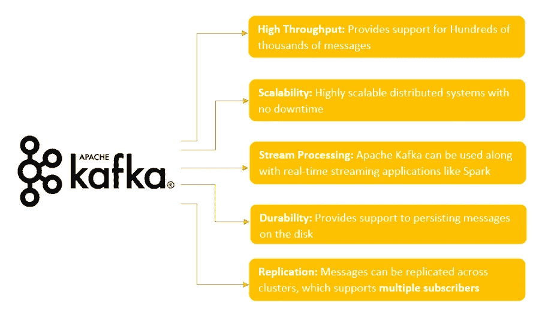
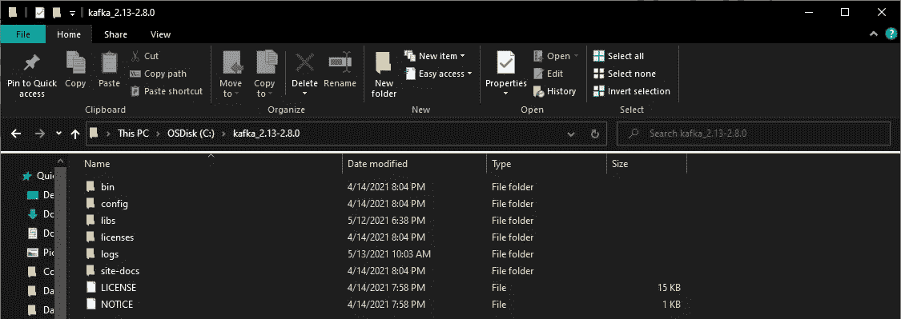
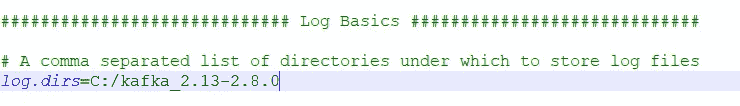
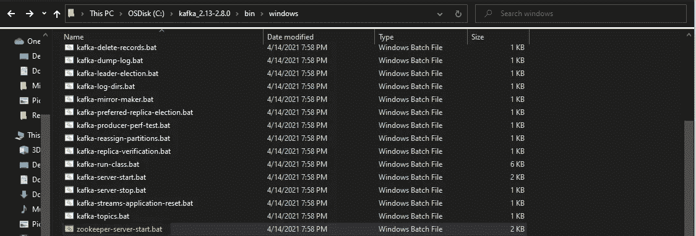
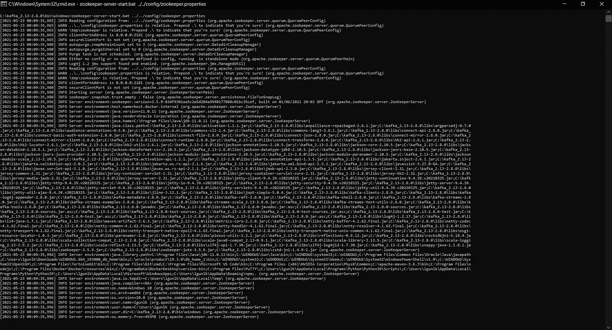
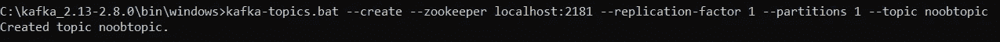
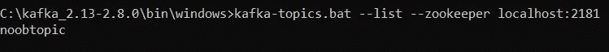
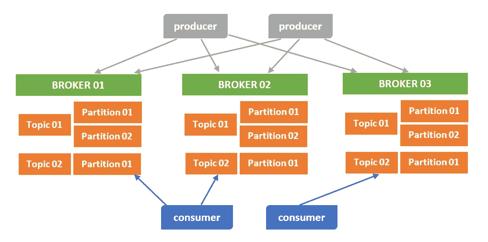
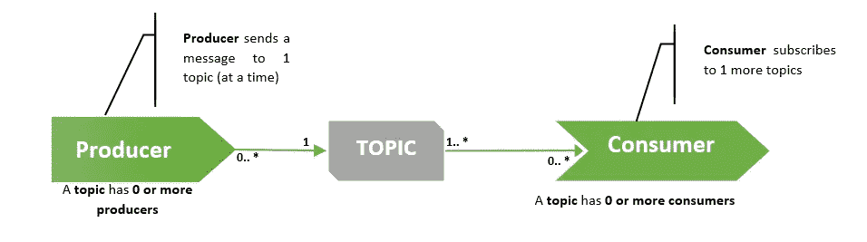
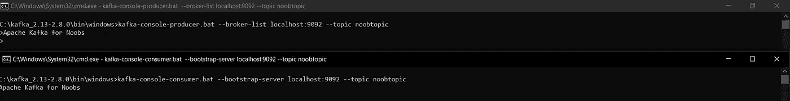

# 阿帕奇卡夫卡为 Noobs

> 原文：<https://medium.com/analytics-vidhya/apache-kafka-for-noobs-37e7e8ecca04?source=collection_archive---------5----------------------->

*本文主要介绍 Apache Kafka，并指导如何在 Windows 环境下设置和配置 Apache Kafka，以及如何创建 Kafka 消费者和生产者。*


什么是阿帕奇卡夫卡？

# **阿帕奇卡夫卡和关键术语**

**Apache Kafka 是一个分布式流媒体平台**，支持**推送和订阅**数据流。Apache Kafka 速度快、可伸缩、耐用且容错。此外，它还具有管理大量数据的能力，可用于实时数据处理。



阿帕奇·卡夫卡的特征

# 关键术语

*   Kafka 在称为 ***主题的类别中维护消息的提要。***
*   **将消息发布到 Kafka 主题的进程**被称为 ***生产者。***
*   **处理**订阅**到**话题**以及处理**发布**消息的**被称为 ***消费者。***
*   Kafka 作为一个由一个或多个服务器组成的**集群**运行，每个服务器被称为一个 ***代理。***
*   所有组件之间的通信通过基于 TCP(传输控制协议)协议的高性能、简单的二进制 API 进行。

# **Kafka 设置和配置**

# 1.从以下链接安装适用于 Windows 环境的 Java JDK 8:

[](https://www.guru99.com/install-java.html) [## 如何在 Windows 中下载和安装 Java JDK 8

### 在本教程中，学习如何在 Windows 中下载和安装 Java JDK 8 并设置环境变量。

www.guru99.com](https://www.guru99.com/install-java.html) 

# 2.从下面的链接下载 Apache Kafka:

[](https://kafka.apache.org/downloads) [## 阿帕奇卡夫卡

### 2.8.0 是最新版本。目前的稳定版本是 2.8.0。您可以通过以下方式验证您的下载…

kafka.apache.org](https://kafka.apache.org/downloads) 

# 3.在 Windows 环境中解压缩下载的“Kafka _ 2.13–2 . 8 . 0 . tgz”



解压缩的卡夫卡文件夹

# 4.修改*‘server . properties’*文件中的日志路径

在***【server . properties】***文件中搜索***【log . dirs】****关键字，并将位置更新为解压后的文件夹位置***【C:\ Kafka _ 2.13–2 . 8 . 0’。****

**

*现在，让我们看看下面的命令来启动 Apache Kafka 服务器以及某个主题的消费者和生产者。*

# *3.运行 Apache Zookeeper 服务器*

*Apache Zookeeper 作为集中式服务，用于维护命名、配置数据，并提供分布式系统内的同步。Apache Zookeeper 跟踪 Kafka 集群节点的**状态，它还跟踪 Kafka 主题、分区等**。Apache Zookeeper 允许多个客户端同时执行读写操作，并充当系统内的共享配置服务。**ZAB(Zookeeper atomic broadcast)协议**充当整个系统的大脑，使其能够充当原子广播系统并发布有序更新。*****

*让我们在 Window 环境中启动 Apache Zookeeper 服务器。*

*浏览到***' C:\ Kafka _ 2.13–2 . 8 . 0 \ bin \ windows '***文件夹。*

**

*Zookeeper 文件夹位置'***C:\ Kafka _ 2.13–2 . 8 . 0 \ bin \ windows***'*

*从这个位置***‘C:\ Kafka _ 2.13–2 . 8 . 0 \ bin \ windows’，*** 打开一个命令提示符，执行下面的命令:*

```
*C:\kafka_2.13-2.8.0\bin\windows>zookeeper-server-start.bat ../../config/zookeeper.properties*
```

*上述命令将在我们的 Windows 环境中成功启动 Apache Zookeeper 服务器，它将使用在***' C:\ Kafka _ 2.13–2 . 8 . 0 \ config \ Zookeeper . properties '中定义的配置设置。****

*** *记住，Apache Zookeeper 服务器将运行在端口:2181**

**

*Apache Zookeeper 服务器启动的命令提示符日志*

*现在，让我们启动我们的 Apache Kafka 服务器。*

# *4.运行 Apache Kafka 服务器*

*要开始运行 Apache Kafka 服务器，Apache Zookeeper 应该在后台运行。*

*从这个位置***' C:\ Kafka _ 2.13–2 . 8 . 0 \ bin \ windows '***打开另一个命令提示符，执行下面的命令:*

```
*C:\kafka_2.13–2.8.0\bin\windows>kafka-server-start.bat ../../config/server.properties*
```

*上述命令将在我们的 Windows 环境中成功启动 Apache Kafka 服务器，它将使用在***‘C:\ Kafka _ 2.13–2 . 8 . 0 \ config \ Server . properties’中定义的配置设置。****

*** *记住，Apache Kafka 服务器将运行在端口:9092**

# *5.创造卡夫卡主题*

*Kafka **主题**表示发布和存储消息的类别或提要名称。**卡夫卡消息传递**架构被组织成主题。最终，在卡夫卡中收发的一条记录属于某个话题。卡夫卡中的**生产者**将某个记录写入特定的**主题**中，感兴趣/被分配的**消费者**从订阅的主题中读取该记录。*

*由于发送或接收的每条消息都属于一个特定的**主题**，最初，我们需要在创建**消费者**或**生产者之前创建一个主题。***

*从这个位置打开另一个命令提示符***' C:\ Kafka _ 2.13–2 . 8 . 0 \ bin \ windows '***并执行下面的命令:*

```
*kafka-topics.bat — create — zookeeper localhost:2181 — replication-factor 1 — partitions 1 — topic noobtopic*
```

**

*成功的卡夫卡主题创作*

*我们已经创建了一个单独的 Kafka 服务器，所以我们将把 ***【复制因子】*** 设置为 1，并且我们需要创建一个单独的 ***【分区】****【as 1】*。让我们列出使用下面的命令创建的主题。*

```
*kafka-topics.bat — list — zookeeper localhost:2181*
```

**

*列出创建的卡夫卡主题*

# *6.创造卡夫卡生产者*

**

*卡夫卡数据生产者和消费者*

*我们已经在前一步***【noobtopic】***中创建了一个 Kafka 主题，现在将创建一个**生产者，它将向主题流提供数据。**制作者将制作记录，这些记录将作为指定主题的记录添加到 Kafka 服务器。*

*从这个位置***' C:\ Kafka _ 2.13–2 . 8 . 0 \ bin \ windows '***打开另一个命令提示符，执行下面的命令:*

```
*kafka-console-producer.bat --broker-list localhost:9092 --topic noobtopic*
```

*通过以上命令的执行，我们为主题***‘noobtopic’创建了一个**生产者**。*****制作人**现在可以开始给这个话题添加唱片了。*

# *7.创造卡夫卡式的消费者*

**

*消费者和生产者之间的关系*

*由**制作者**添加的记录/数据可以被订阅相同主题的**消费者**消费。现在让我们创建一个**消费者**来消费来自创建的主题' ***noobtopic '的记录。****

*从这个位置打开另一个命令提示符***' C:\ Kafka _ 2.13–2 . 8 . 0 \ bin \ windows '***，执行下面的命令:*

```
*kafka-console-consumer.bat — bootstrap-server localhost:9092 — topic noobtopic*
```

*由于我们已经创建了一个**消费者**，我们可以消费来自**生产者的输入数据流。**此外，我们可以为 ***【主题】、*** 创建多个**消费者**，只要**生产者将记录添加到主题中，**消费者就可以接收发布的数据。*

*现在我们来看看添加记录的过程。*

**

*生产者和消费者将记录推送到主题*

# *结论*

*希望您对 Apache Kafka 以及在 Windows 环境中设置和配置 Kafka 服务器的过程有了基本的了解。*

**

*感谢阅读！😊你不再是菜鸟了😉*

*保持联系，获取更多信息。*

# *参考资料:*

*[](https://kafka.apache.org/documentation/) [## 阿帕奇卡夫卡

### 下面是对 Apache Kafka 的一些流行用例的描述。有关这些领域的概述…

kafka.apache.org](https://kafka.apache.org/documentation/) [](https://www.goavega.com/install-apache-kafka-on-windows/) [## 在 Windows - Goavega 上设置和运行 Apache Kafka

### 通过我之前的帖子，希望你对阿帕奇卡夫卡有所了解。在这里，我们将介绍如何安装…

www.goavega.com](https://www.goavega.com/install-apache-kafka-on-windows/)*