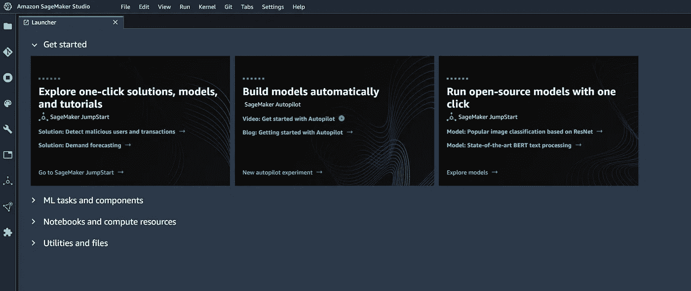

# 带有 AWS Sagemaker Studio 的 Apache Spark 和 BigQuery

> 原文：<https://medium.com/analytics-vidhya/apache-spark-and-bigquery-with-aws-sagemaker-studio-180db7575f85?source=collection_archive---------12----------------------->

用新的库扩展 Sagemaker Studio 容器映像的功能。

在下面的文章中，您将了解如何扩展 Sagemaker Studio Spark 容器映像，以包含额外的库并与 BigQuery 等 Google 云服务进行交互。然后，我们将创建一个笔记本，使用 Amazon Sagemaker Studio 从 BigQuery 表中检索数据。

SageMaker 工作室(图片由作者提供)