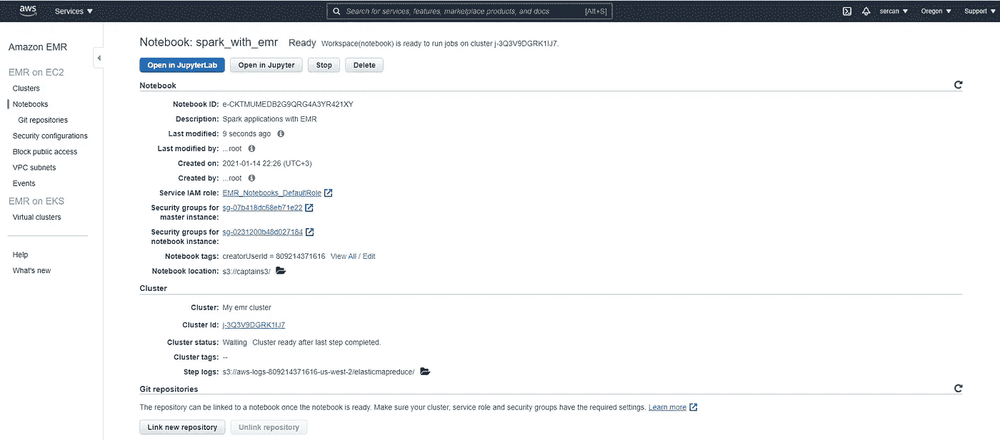

# 使用 Jupyter 笔记本的 Apache Spark 应用程序与 Amazon EMR 和 S3 服务

> 原文：<https://medium.com/analytics-vidhya/apache-spark-applications-with-amazon-emr-and-s3-services-using-jupyter-notebook-41968a1c2d7?source=collection_archive---------7----------------------->

技术每天都在发展，甚至每秒钟都在不停地发展，它也在许多不同的方面改善着我们的生活。在 20 世纪 90 年代，1 兆字节的芯片 ram 容量对于 Amiga 500 游戏电脑来说是一场巨大的革命，这样我们甚至可以玩街头霸王或真人快打这样的流行游戏😀有这种能力。

这些年来发生了很多变化，从 1mb 到 petabytes，甚至到 Exabytes……根据 CSIRO 的说法，在未来十年，天文学家预计每小时将处理来自 SKA 望远镜的 10pb 数据。这确实是一个巨大而令人兴奋的发展，包括一个非常重要的问题；

我们将如何处理海量数据？

好的，好的，不要惊慌，我们还有第二个引擎😀(是的，我实际上是一名飞行员)。玩笑归玩笑，如今许多公司都有非常大的数据中心或服务器来访问计算能力和存储等服务。除此之外，这些类型的服务可以通过基于时间或基于功率的定价在互联网上按需交付，我们称之为“云计算”。

使用云计算服务比购买和维护物理数据中心和服务器更实惠、更高效。

还有一些比较知名的云计算服务，比如亚马逊 Web 服务，微软 Azure，谷歌云平台。今天，我们将在 Jupyter 笔记本上使用 AWS 进行 Spark 应用。

# 什么是 AWS？

AWS (Amazon Web Services)是亚马逊提供的高度可扩展、全面、快速、可靠和用户友好的完整云计算平台。它也是最受欢迎的，因为它是云计算世界的第一个代表。AWS 提供了许多工具，如 VPC、EC2、EMR 和 S3。你可以从 AWS 网页轻松注册，无需支付任何费用。

今天，我们将在示例中使用 AWS EMR 和 S3 服务。所以让我们更好地了解这些服务。

# 什么是 EMR？

Amazon Elastic MapReduce (EMR)是一个 Amazon Web Services (AWS)平台，使用 Apache Spark、Apache Hive、Apache HBase、Apache Flink 和 Presto 等著名的开源工具进行大数据处理和分析。EMR 为 Pb 级的大数据提供可扩展、灵活和快速的计算。

# 什么是 S3？

亚马逊简单存储服务(亚马逊 S3)为互联网提供对象存储服务，旨在存储来自任何来源的数据(高达 5tb 的单个文件),并提供可扩展性、数据可用性、安全性和性能。此外，亚马逊声称 S3 提供了 99.99%的耐用性和 99.99%的可用性。

到目前为止，我试图向您简要介绍云计算、AWS 及其组件 EMR 和 S3。现在是动手练习的时候了，以便更好地理解 AWS 与我们心爱的 Jupyter 笔记本的用法。

*** * *重要提示**:请记住，AWS 是一家付费服务提供商，在您注册并定义您的信用卡后，AWS 将为您提供一种现收现付的定价方式。作为新会员，您还可以享受一些免费服务，但无论如何，只要您在服务运行时不花费太多时间，并且在完成计算后不要忘记终止服务，使用 EMR 服务的价格将非常低(我的例子中不到 1 美元)。在我们完成示例后，我将向您展示如何终止服务。

所以让我们开始我们的例子；

注册 AWS 后，我们将从 AWS 管理控制台的“存储”列表中选择 S3 服务。

在 S3 控制台中，我们将选择“Create bucket”按钮，只需为它命名(您可以将其余部分保留为默认值),然后单击页面底部的“Create bucket ”,就可以轻松创建我们的 S3 bucket。

现在我们已经创建了我们的 S3 桶。您可以从 S3 控制台选择新创建的存储桶，并在其中上传数据文件。我将为我们的示例上传 2 个数据文件(u.data 和 u.item)。

我们成功上传了将用于 Spark 应用程序的数据文件。现在我们可以返回到 AWS 管理控制台，这次我们将从“分析”列表中选择 EMR 工具。

在 EMR 控制台中，我们将选择“创建集群”按钮，并开始创建我们的 EMR 集群。我们将首先为我们的群集命名，然后选择软件配置。我会选择兼容 Jupyter 笔记本的“emr-5.30.1”版本。我们还会选择硬件配置。通常我们必须根据我们要处理的数据大小来指定它，但是今天我们将为我们的示例选择一个足够大的值(m4.xlarge)。我还将选择“在没有 EC2 密钥对的情况下继续”(您可以随时在 EC2 控制台中创建 EC2 密钥对)，并单击最后的“创建集群”按钮。

当我们在群集页面中看到“正在运行”时，我们将拥有新的 EMR 群集。

我们可以返回到 EMR 控制台，我们将看到我们的集群已经创建完毕，正在等待我们。到目前为止，我们已经创建了我们的 S3 桶和 EMR 集群。现在是时候创建我们的笔记本了。

从左侧菜单中选择“笔记本”，在新页面中，我们将配置我们的笔记本。首先，我们将命名它并选择我们现有的 EMR 集群。我们还将选择保存笔记本文件的 S3 存储桶。最后，我们将单击“创建笔记本”按钮，当我们在控制台上看到“就绪”消息时，我们将拥有我们的笔记本。

恭喜你！！！现在，我们已经拥有了 Spark 应用程序所需的所有工具。我们已经创建了用于获取数据并保存回数据的 S3 存储桶、用于使用 Apache Spark 的 EMR 集群和用于打开 Jupyter 笔记本的笔记本。

选择“在 Jupyter 中打开”按钮后，我们会看到一些熟悉的东西，让我们感觉又回到了甜蜜的家😀

让我们选择笔记本并开始编写 SparkSql 查询，同时不要忘记从“kernel”菜单中选择 Pyspark 内核。

对于我们的例子，我将做一些非常简单的事情。我们有两个关于电影的数据文件。我会试着找出评分最高的电影及其名称，并在最后加入 2 个文件，以找出其平均评分。就像我上面提到的，我将使用 SparkSQL api 进行查询。

当然是《星球大战》😀…因此，我们进行了查询，还创建了一个新的数据帧，并将其保存回我们的 S3 存储桶。让我们从 S3 控制台再次检查我们的铲斗。

正如您在上面的截图中看到的，我们设法将数据保存到我们的 bucket 中，作为一个 CSV 文件。

所以我们已经完成了我们的项目，除了一件更重要的事情；终止我们的 EMR 集群。

在我们完成任务后，终止集群是非常重要的。否则 AWS 会继续定价。在 EMR 控制台中，勾选我们已经创建的 EMR 集群，然后选择“终止”按钮。短时间内会终止，不会说；我会回来的！！！😀

此外，你也可以停止你的笔记本(笔记本是不付费的)，并从 S3 控制台删除你的 S3 桶。

# 结论

在本文中，我尝试简要介绍了如何通过 Jupyter Notebook 将 AWS 用于 Spark 应用程序。AWS 中还有许多更有用的工具，您可以通过在 AWS 网页中搜索 [AWS 文档](https://docs.aws.amazon.com/)来提高自己的知识。

我希望这篇文章对你有所帮助。在下一篇文章中，我将讲述如何在本地创建和运行 Spark 独立集群。

我将很高兴听到您的任何意见或问题。愿数据伴随你！