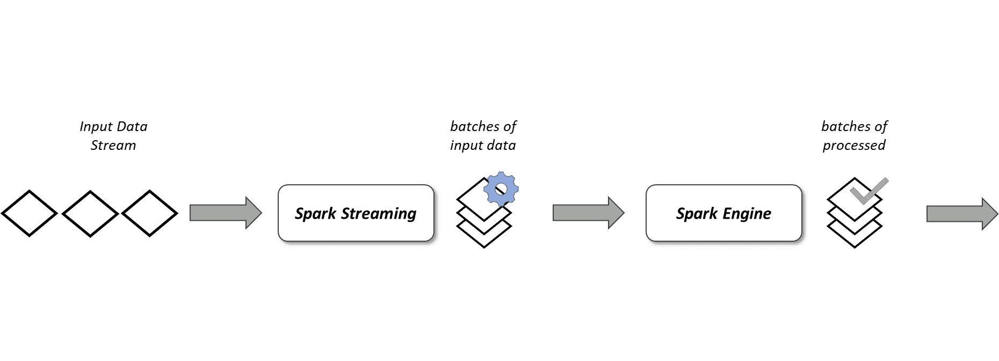
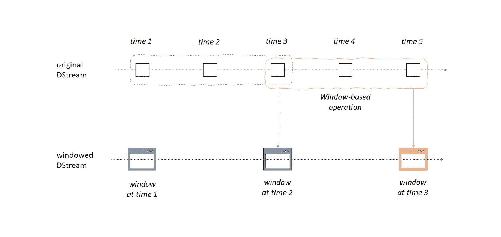

# 使用 Pyspark 的 Apache Spark 离散化流(数据流)

> 原文：<https://medium.com/analytics-vidhya/apache-spark-discretized-streams-dstreams-with-pyspark-4882026b4fa4?source=collection_archive---------4----------------------->



火花流

# 什么是流媒体？

试着想象一下。根据互联网实时统计数据，每秒钟有近 9000 条推文被发送，1000 张照片被上传到 instagram，超过 200 万封电子邮件被发送，还有近 8 万次搜索。

如此多的数据从许多来源不间断地生成，并以小数据包的形式同时发送到另一个来源。

许多应用还会生成持续更新的数据，如机器人、车辆和许多其他工业和电子设备中使用的传感器，用于监控进度和性能的数据流。

这就是为什么每秒产生的大量数据必须实时快速处理和分析，这意味着“**流**”。

# 数据流

火花数据流(离散流)是火花流的基本概念。数据流是连续的数据流。数据流从 Kafka、Kinesis、Flume、TCP sockets 等不同类型的源接收输入，或者在对原始数据进行一些处理后接收输入。DStream 也是 RDD(弹性分布式数据集)的连续流。数据流中的每个 RDD 都包含特定时间间隔的数据。Spark 流还具有数据流的容错功能，就像 rdd 一样。

让我们看看我们的 DStream 示例

```
from pyspark.context import SparkContext
from pyspark.streaming import StreamingContext
from time import sleepsc = SparkContext(appName="DStream_QueueStream")
ssc = StreamingContext(sc, 2)

rddQueue = []
for i in range(3):
    rddQueue += [ssc.sparkContext.parallelize([j for j in range(1, 21)],10)]inputStream = ssc.queueStream(rddQueue)
mappedStream = inputStream.map(lambda x: (x % 10, 1))
reducedStream = mappedStream.reduceByKey(lambda a, b: a + b)
reducedStream.pprint()ssc.start()
#sleep(6)
ssc.stop(stopSparkContext=True, stopGraceFully=True)
```

如您所见，首先，我们创建了一个 Spark 上下文，然后创建了一个 streaming 上下文，其中包含“2 ”,这意味着我们希望每 2 秒钟读取一次流数据。

我们已经创建了一个输入数据，它是一个从 1 到 20 的整数列表。借助 Spark 上下文并行化，我们将数据分成 10 个分区，并使用 for 循环重复 3 次。最后，我们有一个输入流，每 2 秒钟读取一次。让我们看看我们的输入数据的结构，我们在 Spark 流上下文中将其包装为`queueStream`。

```
rddQueue[ParallelCollectionRDD[0] at readRDDFromFile at PythonRDD.scala:262,
 ParallelCollectionRDD[1] at readRDDFromFile at PythonRDD.scala:262,
 ParallelCollectionRDD[2] at readRDDFromFile at PythonRDD.scala:262]rddQueue[0].glom().collect()[[1, 2],
 [3, 4],
 [5, 6],
 [7, 8],
 [9, 10],
 [11, 12],
 [13, 14],
 [15, 16],
 [17, 18],
 [19, 20]]
```

在一些像 map 和 reduce 函数这样的转换之后，我们有一个动作`pprint`，它将开始计算。最后，流从 ssc.start()开始，经过 6 秒钟的睡眠时间后，我们用 ssc.stop()命令终止了数据流。

以下是我们的 DStream 示例的输出数据:

```
-------------------------------------------
Time: 2021-01-01 22:57:16
-------------------------------------------
(8, 2)
(0, 2)
(1, 2)
(9, 2)
(2, 2)
(3, 2)
(4, 2)
(5, 2)
(6, 2)
(7, 2)

-------------------------------------------
Time: 2021-01-01 22:57:18
-------------------------------------------
(8, 2)
(0, 2)
(1, 2)
(9, 2)
(2, 2)
(3, 2)
(4, 2)
(5, 2)
(6, 2)
(7, 2)

-------------------------------------------
Time: 2021-01-01 22:57:20
-------------------------------------------
(8, 2)
(0, 2)
(1, 2)
(9, 2)
(2, 2)
(3, 2)
(4, 2)
(5, 2)
(6, 2)
(7, 2) 
```

现在让我们试着用另一个例子来证明它

```
from pyspark.context import SparkContext
from pyspark.streaming import StreamingContext
from time import sleepsc=SparkContext("local[*]","StreamingExample")
ssc=StreamingContext(sc,5)
lines=ssc.textFileStream(r'home/data')words=lines.flatMap(lambda x:x.split(" "))
mapped_words=words.map(lambda x:(x,1))
reduced_words=mapped_words.reduceByKey(lambda x,y:x+y)
sorted_words=reduced_words.map(lambda x:(x[1],x[0])).transform(lambda x:x.sortByKey(False))
sorted_words.pprint()ssc.start()
sleep(20)
ssc.stop(stopSparkContext=True, stopGraceFully=True)-------------------------------------------
Time: 2021-01-02 00:46:20
-------------------------------------------
(4, 'and')
(4, 'can')
(3, 'data')
(3, 'be')
(2, 'of')
(2, 'like')
(2, 'algorithms')
(2, 'processing')
(2, 'Spark')
(2, 'live')
(2, 'processed')
(1, 'an')
(1, 'high-throughput,')
(1, 'using')
 ...

-------------------------------------------
Time: 2021-01-02 00:46:25
-------------------------------------------
```

在第二个例子中，我们有一个文本文件作为输入数据，其中有一小段是关于 Spark 流的。在对数据(一个著名的单词 count☺的例子)进行一些转换后，我们开始流式传输，每 5 秒读取一次。最重要的部分是，输入数据应该在我们用 ssc.start()命令开始流式传输后立即发送。文本文件的最后修改时间必须在流的开始时间之后。

# 窗口操作



基于窗口的操作

最后，我想提一下数据流的窗口操作。它提供在数据的滑动窗口上应用变换。本质上，任何火花窗操作都需要两个主要参数；

*   窗口持续时间，定义窗口的持续时间
*   滑动持续时间，定义执行窗口操作的持续时间

关于这两个参数的另一件重要事情是，它们必须是源数据流的批处理间隔的倍数。

让我们试着用下面的例子来说明窗口操作

```
from pyspark.context import SparkContext
from pyspark.streaming import StreamingContextsc = SparkContext(master=”local[*]”, appName=”WindowWordcount”)
ssc = StreamingContext(sc, 1)
ssc.checkpoint(r”C:\Users\SERCAN\Desktop\databases\checkpoint”)lines = ssc.socketTextStream(“localhost”, 9999)
words = lines.flatMap(lambda line: line.split(“ “))
pairs = words.map(lambda word: (word, 1))
pairs.window(10, 5).pprint()ssc.start()

-------------------------------------------
Time: 2021-01-02 01:53:28
-------------------------------------------

-------------------------------------------
Time: 2021-01-02 01:53:33
-------------------------------------------
('foo', 1)

-------------------------------------------
Time: 2021-01-02 01:53:38
-------------------------------------------
('foo', 1)
('bar', 1)

-------------------------------------------
Time: 2021-01-02 01:53:43
-------------------------------------------
('bar', 1)
('baz', 1)

-------------------------------------------
Time: 2021-01-02 01:53:48
-------------------------------------------
('baz', 1)

-------------------------------------------
Time: 2021-01-02 01:53:53
-------------------------------------------
```

在第三个例子中，我使用 socket 从命令终端提供输入数据。输入时间为:

01:53:30 —福

01 时 53 分 35 秒—小节

01:53:40 —巴兹

正如您在第一个 10 秒窗口(:28-:38)的示例中看到的，我们只能看到“foo，1 ”,但在第二个窗口中，我们仍然可以看到“foo ”,而且我们现在还可以看到“bar，1 ”,也可以看到:33-:43 窗口。在第三个窗口中，这一次“foo”消失了，因为它的窗口关闭了，但是现在我们有了来自新窗口(:38–48)的“baz，1 ”,并且还有用于:33–43 窗口的“bar”。最后，对于第四个窗口，现在我们只有“baz ”,因为它的窗口时间结束于:48。

# 结论

在本文中，我试图介绍 DStreams，它是 Spark Streaming 的一个非结构化部分。数据流代表连续的数据流。就像《星火》中的 RDD 一样，数据流也变得过时了，但了解基础知识或从基础开始总是好的。

我希望这篇文章对你有所帮助。在下一篇文章中，我将讨论 Spark Streaming 的结构化部分，这是一个构建在 Spark SQL 引擎上的可伸缩且容错的流处理引擎。

我将很高兴听到您的任何意见或问题。愿数据伴随你！