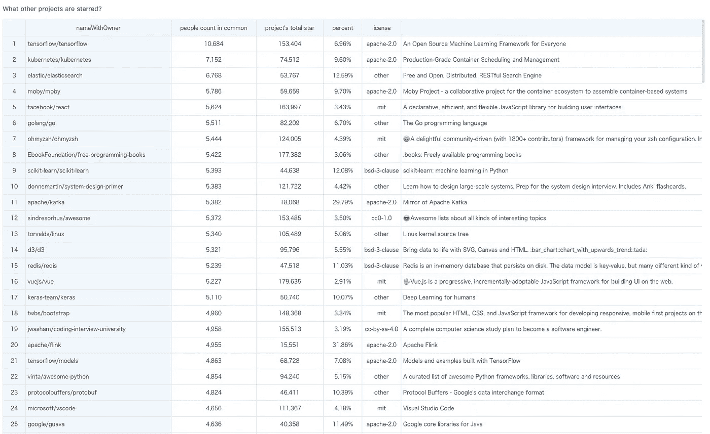

# Apache Spark:对于在 Github 中出演 Spark 的人来说，还出演了哪些项目？

> 原文：<https://medium.com/analytics-vidhya/apache-spark-for-those-who-starred-spark-in-github-what-else-projects-were-starred-dc66f938678e?source=collection_archive---------12----------------------->

最近我写了一个工具“universe-lite”:[https://github.com/GuandataOSS/universe-lite](https://github.com/GuandataOSS/universe-lite)。

> *这是一个轻量级的 ELT & ETL 工具，基于 Duckdb 和 Apache Parquet，与 Python & Java 插件无缝集成。其中还描述了普通配置文件(类型安全配置格式)中 ETL 步骤。*

既然已经有锤子了，就想找几个钉子练一下。

日常工作中，我大量使用 Apache Spark。所以，第一个想法是我想知道:对于那些主演 Apache Spark Github repo 的人来说，他们还对哪些回购感兴趣？是否有一些伟大的工程我还没有学会？

那么，我们开始吧。目标很明确，但道路艰难。但是“解决的问题比解决的问题多”，在解决了几个意想不到的问题之后，我终于得到了所有的数据，这是一个有 12，115，030 行的数据集。(我后面会讲到“universe-lite”工具，以及后面如何使用它获取 Github 数据)。

# 1.Spark 的明星数量变化趋势

*   条形图代表每月增加的新计数，y 轴在左侧
*   折线图代表累计总数，y 轴在右侧

# 2.还有哪些项目同时被打上了星号

排名前五的项目是:

*   张量流(10684)
*   库伯内特斯(7152)
*   弹性搜索(6768)
*   莫比(5786)(原名:docker)
*   反应(5624)

它们都是非常成功和受欢迎的开源项目。

# 3.还有哪些“星火相关”项目被列入

第 2 节中列出的顶级项目都是流行的开源项目。但我更想知道的是那些“星火相关”的项目。

那么，我如何判断哪些项目与 spark 相关或无关呢？第一个尝试是检查该项目的“名称”或“描述”是否包含关键字“spark”。但是结果不太乐观。

然后，另一种方法出现了:我将过滤上表中的数据，只保留 20%以上的“百分比”。通过这种方式，这意味着:很高比例的项目追随者也是星火。所以，那些项目很有可能在 Spark 生态系统里。

结果表是:

排名前五的项目是:

*   卡夫卡(5382)
*   弗林克(4955)
*   hadoop (4473)
*   scala (3693)
*   阿卡(3236)

是的，那些和预期的一样。

# 4.在主演过 Spark 的人中，“总主演项目数”分布是怎样的

我的 Github 账户参与了大约 700 个项目。我想知道:有多少项目是别人主演的？

根据这张图表:

*   3634 人，在 Github 只出演了不到 10 个项目
*   大多数人只主演了不到 1000 个项目
*   “发出最多星星的人”在近 50K 个项目中担任主角

# 结尾词

数据有价值，图表会说话。稍后我还会带来更多的数据故事，敬请期待！