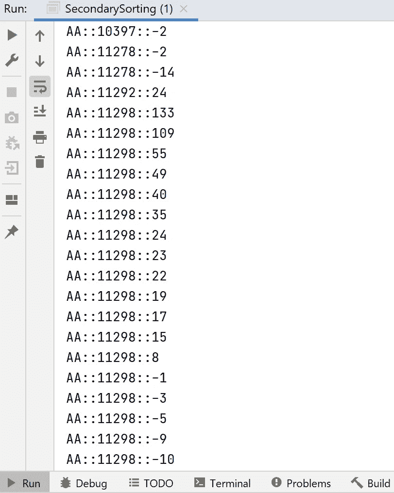

# Apache Spark:Java 中 Spark 的二级排序

> 原文：<https://medium.com/analytics-vidhya/apache-spark-secondary-sorting-in-spark-in-java-b9fcba989fab?source=collection_archive---------7----------------------->

我们可能都见过 Mapreduce/Hadoop 中的二级排序及其关键实现。关于这一点有足够的信息和博客。让我们来学习如何在 Java 中使用 Spark 实现二次排序。

在我们继续之前，您可以从这里引用数据集—[https://www . ka ggle . com/bhoomika 216/airline-dataset-for-analysis？select=FINALdata1.csv](https://www.kaggle.com/bhoomika216/airline-dataset-for-analysis?select=FINALdata1.csv)

根据定义， ***二级排序问题涉及到 reduce 阶段中与键相关的值的排序。有时，它被称为值到键的转换。二级排序技术将使我们能够对传递给每个 reducer 的值进行排序(按升序或降序)。简单来说，你可以用 sql*** 把它和 ORDER BY 联系起来。 ***同样，它依赖于使用一个组合键，该组合键将包含我们想要用于排序的所有值*** 。现在，使用这个你可能已经从 kaggle 下载的数据集，我们将尝试实现二次排序。现在让我们来看一下，我们使用的数据是航空公司的准点表现数据，也有几个可用的数据点，但我们将重点关注哪些航空公司的航班最晚到达，以及这些航班最晚到达发生在哪个机场。从这个语句中，我们可以确定我们的排序顺序:AirlineId(或 UNIQUE_CARRIER)、AirportId(或 DEST _ 机场 _ID)和延迟时间(或 ARR_DELAY)。我的意思是说——订单由(**唯一 _ 承运人** ) ASC，(**DEST _ 机场 _ID** ) ASC， **ARR_DELAY** DESC。在我们进入代码之前，我们需要首先理解这些方法，至少有两种可能的方法来对 reducer 值进行排序。这些解决方案可以应用于 MapReduce/Hadoop 和 Spark 框架。

## 第一种方法—

***在内存或减速器排序中进行二次排序***

在这种方法中，我们在每个 reducer 的节点/执行器上收集分组数据，这些数据将在内存中进行缓冲和排序(使用 Java 的`Collections.sort())`)。由于内存排序，这种方法存在可伸缩性问题。一旦分组的数据超出了 reducer 的节点/执行器的内存，就会抛出内存不足异常，因此作业将会失败。它将适用于小规模数据集。

## 第二种方法—

***使用 Spark 框架进行二次排序或混排排序***

在这种方法中，我们将首先理解“组合键”。当来自有效负载的值被提升并被附加到键或自然键时，形成组合键。让我们对此进行更多的讨论——

# 输入格式

输入数据为 CSV 格式，包含以下各列，粗体显示的是我们将应用二次排序的值:

月日，星期日，航班日期，**唯一承运人，**承运人始发地机场 ID，始发地城市市场 ID，始发地州 ABR， **DEST 机场 ID** ，DEST 城市市场 ID，DEST 州 ABR，CRS DEP 时间，DEP 时间，DEP 延迟新时间，出租车外出，车轮关闭，车轮开启，出租车进入，CRS 到达时间，到达时间，**到达延迟【T5**

二次分拣将按照类似的顺序进行，由( **UNIQUE_CARRIER** ) ASC，(**DEST _ 机场 _ID** ) ASC，**ARR _ DELAY**desc；

**组合键将类似于** —

```
UNIQUE_CARRIER,DEST_AIRPORT_ID,ARR_DELAY
```

这里的“自然”关键字是“唯一承运人”**、 **DEST 机场 ID** 和 **ARR_DELAY** 是我们将包含在自然关键字中的值。定义组合键(通过将 DEST _ 机场 _ID 和 ARR_DELAY 添加到自然键，即 UNIQUE_CARRIER)使我们能够使用 Spark 框架对 reducer 值进行排序，即系统洗牌将首先按键的第一部分排序，然后按第二部分排序。我们将看到我们如何在 Spark 中实现这一点，现在，只要记住我们从 Spark 1.2 开始就有了一个名为“repartitionandsortwithpartitions()”的东西。现在让我们看看代码，以了解到底做了什么。**

```
package com.spark.rdd.tutorial;

import org.apache.spark.Partitioner;
import org.apache.spark.SparkConf;
import org.apache.spark.api.java.JavaPairRDD;
import org.apache.spark.api.java.JavaRDD;
import org.apache.spark.api.java.JavaSparkContext;
import org.apache.spark.api.java.function.Function;
import org.apache.spark.api.java.function.PairFunction;
import scala.Tuple2;

import java.io.Serializable;
import java.util.ArrayList;
import java.util.Comparator;
import java.util.List;

public class SecondarySorting {
    public static void main(String args[]) {
        SparkConf conf = new SparkConf().setMaster("local[*]").setAppName("app");
        JavaSparkContext jsc = new JavaSparkContext(conf);

        JavaRDD<String> javaRDD = jsc.textFile("D:\\data\\airlineDataSmall.csv");

        JavaRDD<String[]> map = javaRDD.map(new Function<String, String[]>() {
            @Override
            public String[] call(String s) throws Exception {
                String[] split = s.split(",");
                return split;
            }
        });
        JavaPairRDD<CustomKey, List<String>> pairRDD = map.mapToPair(new PairFunction<String[], CustomKey, List<String>>() {
            @Override
            public Tuple2<CustomKey, List<String>> call(String[] s) throws Exception {
                CustomKey key = new CustomKey();
                key.setUniqueCarrier(s[3]);
                key.setDestAirportId(s[8]);
                key.setArrivalDelay(Integer.*valueOf*(s[20]));

                List<String> l = new ArrayList<>();
                l.add(s[2]);
                l.add(s[5]);
                l.add(s[6]);

                return new Tuple2<>(key, l);
            }
        });

        JavaPairRDD<CustomKey, List<String>> customKeyListJavaPairRDD = pairRDD.repartitionAndSortWithinPartitions(new CustomPartitioner(), new CustomComparator());

        List<Tuple2<CustomKey, List<String>>> collect = customKeyListJavaPairRDD.collect();
        for (Tuple2<CustomKey, List<String>> l : collect) {
            System.*out*.println(l._1().getUniqueCarrier() + "::" + l._1().getDestAirportId() + "::" + l._1().getArrivalDelay());
        }
    }

    public static class CustomPartitioner extends Partitioner {
        @Override
        public int numPartitions() {
            return 1;
        }

        @Override
        public int getPartition(Object key) {
            if (key instanceof CustomKey) {
                return((CustomKey) key).getUniqueCarrier().hashCode()%numPartitions();
            }
            return -1;
        }
    }

    public static class CustomComparator implements Comparator<CustomKey>, Serializable 
    {
        @Override
        public int compare(CustomKey o1, CustomKey o2) 
        {
            int value1 = o1.getUniqueCarrier().compareTo(o2.getUniqueCarrier());
            if (value1 != 0)
            {
                return value1;
            } 
            else 
            {
                int value2 = o1.getDestAirportId().compareTo(o2.getDestAirportId());
                if (value2 != 0) 
                {
                    return value2;
                } 
                else 
                {
                    return o2.getArrivalDelay().compareTo(o1.getArrivalDelay());
                }
            }
        }
    }
}
```

自定义密钥类-

```
package com.spark.rdd.tutorial;

import java.io.Serializable;

public class CustomKey implements Serializable
{
    private String uniqueCarrier;
    private String destAirportId;
    private Integer arrivalDelay;

    public String getUniqueCarrier() {
        return uniqueCarrier;
    }

    public void setUniqueCarrier(String uniqueCarrier) {
        this.uniqueCarrier = uniqueCarrier;
    }

    public String getDestAirportId() {
        return destAirportId;
    }

    public void setDestAirportId(String destAirportId) {
        this.destAirportId = destAirportId;
    }

    public Integer getArrivalDelay() {
        return arrivalDelay;
    }

    public void setArrivalDelay(Integer arrivalDelay) {
        this.arrivalDelay = arrivalDelay;
    }
}
```

## 创建键值对

数据为 CSV 格式，将被转换为键值格式。二级排序的重要部分是在键中包含哪些值以支持额外的排序。“自然”关键字是唯一的承运人，DEST 机场 ID 和 ARR_DELAY 是我们将包含在关键字中的值。使用 javaRDD.map()和 map.mapToPair()在代码中完成了相同的操作，请参考上面的代码。

## 分割和排序代码

现在我们需要对数据进行分区和排序。有两点我们需要考虑。

1.  我们需要按 UNIQUE_CARRIER 对数据进行分组，以便在缩减阶段到达同一个分区。但是我们的键是一个有 3 个字段的组合键。仅仅按键分区是不行的。因此，我们将创建一个定制的分区器，它知道使用哪个值来确定数据将到达的分区。这已经在上面的代码中通过扩展[划分器](https://spark.apache.org/docs/2.3.0/api/java/org/apache/spark/Partitioner.html)类完成了。
2.  我们还需要告诉 Spark 我们希望我们的数据如何排序，比如按(**UNIQUE _ CARRIER**ASC，(**DEST _ 机场 _ID** ) ASC，**ARR _ DELAY**desc；意思是，我们希望 **ARR_DELAY** 按降序排列，因此延迟最大的航班将首先列出。这是通过实现一个定制的 java 比较器来实现的。参考上面的代码。

```
CustomComparator implements Comparator<CustomKey>, Serializable {}
```

## 摘要

现在是时候将我们的分区和排序付诸行动了。这是通过使用`repartitionAndSortWithinPartitions` 实现的，它不是一个分组操作。它只会将具有相同键的数据移动到相同的分区，并根据[ordereddfunctions](https://spark.apache.org/docs/2.3.0/api/java/org/apache/spark/rdd/OrderedRDDFunctions.html)类上的比较器方法对其进行排序。来自 spark java doc，它说—

> 根据给定的分割器对 RDD 进行重新分区，并在每个分区中按键对记录进行排序。
> 
> 这比调用 repartition 然后在每个分区内排序更有效，因为它可以将排序下推到 shuffle 机制中。

输出—



我们可以看到按 **UNIQUE_CARRIER** 、**DEST _ 机场 _ID** 和 **ARR_DELAY 排序的结果。**