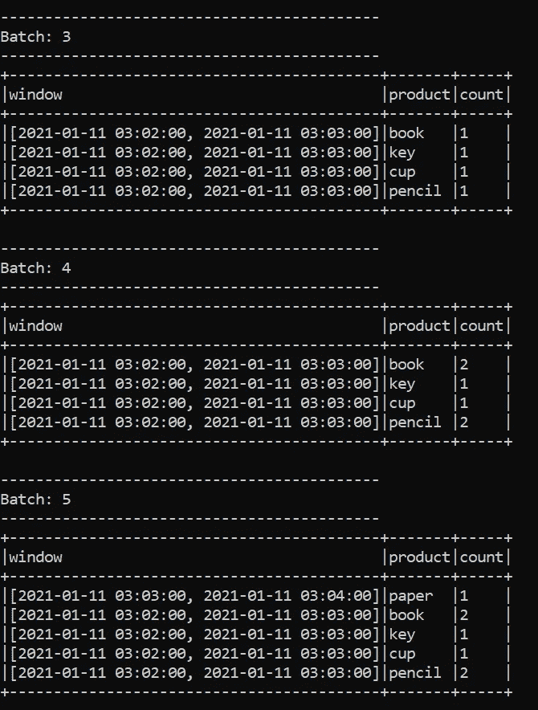

# 使用 Pyspark 的 Apache Spark 结构化流

> 原文：<https://medium.com/analytics-vidhya/apache-spark-structured-streaming-with-pyspark-b4a054a7947d?source=collection_archive---------0----------------------->

在上一篇文章中，我们讨论了 Apache Spark 离散化流(d Streams ),这是 Spark 流的一个基本概念。在本文中，我们将研究 Spark 流的结构化部分。

结构化流构建在 Apache Spark 的 SparkSQL 引擎之上，该引擎将在继续接收数据时处理流的运行。就像 Spark 的其他引擎一样，它具有可扩展性和容错性。结构化流通过流特性增强了 Spark DataFrame APIs。

结构化流还确保在检查点和缓存选项的帮助下尽快恢复任何故障。总之，结构化流是一种可扩展的、容错的和近乎即时的操作。

现在是时候用第一个例子来弄脏我们的手了😉

对于这个例子，我们将使用 csv 文件作为我们的流的输入数据。我将简单地在我们的目录中上传 5 个 csv 文件。这些 csv 文件包含一些关于随机生成的人的数据(每个文件 10 行)和一些关于他们的信息，如他们的年龄、职业、城市和工资。下面你可以看到一个输入数据的例子；

Csv 数据示例

首先，我们将从 Python 导入所需的 Pyspark 库，并启动 SparkSession。

请记住，结构化流处理总是需要为流中的数据指定一个模式。

我们将使用“readStream”将数据加载到流数据帧中。我们还可以用“isStreaming”方法检查我们的流状态。

是啊！它正在工作…现在我们已经创建了一个流数据帧。现在是我们演示的棘手部分，🧐，当我们在做一个例子时，我们的 csv 数据不是实时创建的，所以我们必须模拟流条件。我们将把每个 csv 文件一次一个地复制到我们在上面的代码中的“readStream”中指定的路径中，而不是在数据进来时进行流式处理。这就是为什么我们还将“maxFilesPerTrigger”选项设置为 1，这告诉我们一次只能传输一个 csv 文件。

让我们看看树格式的 DataFrame 的模式

接下来，我们将应用一些转换，这些转换将向我们显示每个职业的人数，以及每个新文件都会更新的数据框架中降序排列的职业平均工资。

现在，除了最后一点之外，我们已经为流式传输做好了准备；我们需要为到目的地的流指定一个“format()”，并为确定要写入流接收器的数据指定一个“outputMode()”。

最常用的格式是控制台，卡夫卡，拼花和内存。我将使用控制台选项作为格式，这样我们就可以从终端跟踪我们的流结果。

对于 outputMode()方法，我们有三个选项。这些是；

*   append:只有新行会被写入接收器。
*   complete:每次有更新时，所有行都将被写入接收器。
*   update:每次有更新时，只有更新的行将被写入接收器。

我还将使用“完整”选项，因为我们的数据框架中有一个聚合。

最后，我们可以用“start()”方法开始流式传输。

现在是时候一次加载一个 csv 文件了。记住，我们有 5 个不同的 csv 文件，每个文件包含 10 行数据。

让我们来看看终端加载每个文件后的结果(批次 0 到 4)

在第一个 csv 文件之后

在第二个 csv 文件之后

在第三个 csv 文件之后

在第四个 csv 文件之后

在第五个 csv 文件之后

正如您从截图中看到的，我们从流数据创建的 DataFrame 随着新文件的加载更新了它的列。

# 结构化流中的窗口操作

正如我在上一篇关于数据流的文章中提到的窗口操作，我想用下面的例子来演示它；

在本例中，我们使用 socket 作为我们的格式，这使我们能够在 netcat 实用程序的帮助下从终端输入数据。假设我们有一个市场，我们想知道我们每分钟卖出的产品数量。因此，我们通过在终端中键入产品名称，并从另一个终端(控制台格式)以数据帧的形式获得结果。

首先看看我们用作数据输入插座的终端

我在大约两分钟内(03:02- 03:04)从终端输入了几个产品名称。让我们看看来自控制台的结果，这是一个 Anaconda 终端。

我们的查询非常成功。现在我们很容易理解结构化窗口流的概念。正如您可以从终端屏幕截图中看到的，我们的数据帧用新的数据更新了自己。我们实现了我们的期望，通过从最近的时间开始排序，有一个数据框显示我们每一分钟的销售额。

最后，我们将使用“stop()”方法停止流式传输

# 结论

在本文中，我试图通过使用 Pyspark API 向您简要介绍 Apache Spark 中结构化流的基础知识。在结构化流上定义了更高级的操作。您可以通过在 Apache Spark 文档中搜索 pyspark 的 [Spark 结构化流编程指南](https://spark.apache.org/docs/latest/structured-streaming-programming-guide.html)和 [Python Api 文档](https://spark.apache.org/docs/latest/api/python/pyspark.streaming.html)来提高您的知识。

我希望这篇文章对你有所帮助。在下一篇文章中，我将通过使用 Amazon Elastic MapReduce 服务(EMR)的云环境，讲述如何将 Jupyter Notebook 用于我们的 Spark 应用程序。

我将很高兴听到您的任何意见或问题。愿数据伴随你！