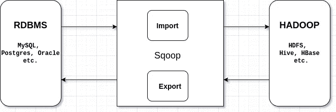
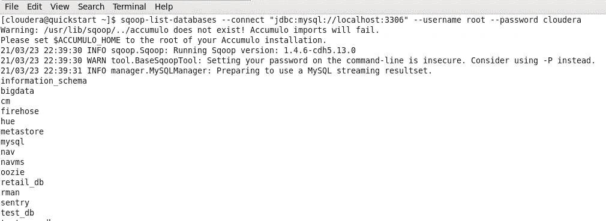
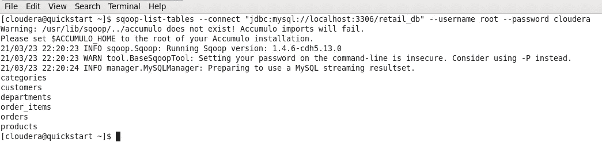
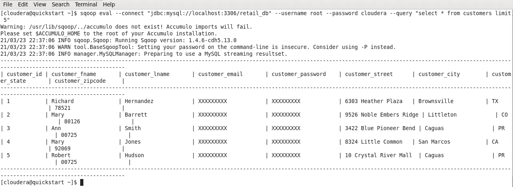
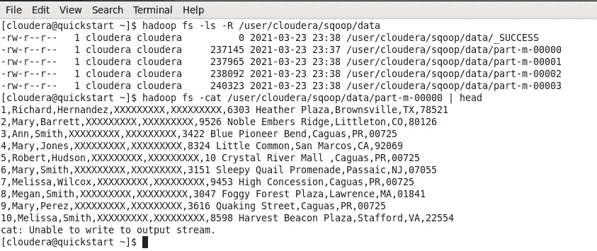
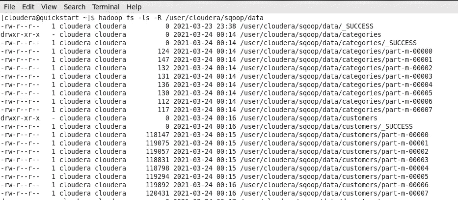

# Apache Sqoop -大数据世界的智能工具。

> 原文：<https://medium.com/analytics-vidhya/apache-sqoop-one-smart-tool-for-big-data-world-3dd0f029da77?source=collection_archive---------7----------------------->

W 当我们谈论大数据世界时，总会涉及三个方面，它们是存储、处理&可扩展性。在这里，我们总是喜欢存储大量的数据，在给定的时间内高效地处理它&高于所有高度可扩展的设计系统。数据摄取是任何大数据项目的初始阶段，也是最有趣的阶段。在这种快速变化的大数据工具技术中，我仍然喜欢并考虑 Apache Sqoop，因为它非常适合结构化数据的数据摄取。因此，让我们开始看看它是什么，并花一天时间使用这个工具。

**1。什么是 Apache Sqoop？**

Apache -sqoop 是一个工具，用于将大量数据从关系数据库(RDBMS)导入到 HDFS，并将数据从 HDFS 导出到 RDBMS。



在本文中，我们将主要关注以下内容。

*   满载
*   增量负载
*   边界查询，拆分依据
*   压缩
*   安全集成

**2。一些基本的 Sqoop 命令。**

在开始任何事情之前，让我们试着理解一下 Sqoop 中的一些基本命令。

```
sqoop-list-databases \
--connect "jdbc:mysql://localhost:3306" \
--username root \
--password cloudera
```

上面将列出特定 MySQL 用户的所有数据库，即这里的`root`。
这里的`3306`是我为我的 MySQL 数据库提供服务的端口，`root`是带有密码的用户名`cloudera`。



现在让我们尝试列出特定数据库的所有表。

```
sqoop-list-tables \
--connect "jdbc:mysql://localhost:3306/retail_db" \
--username root \
--password cloudera
```

我先展示一下输出再解释。



它为用户`root`列出了`retail_db`数据库中的所有表。

我们还可以使用以下命令运行一些简单的 SQL 查询。

```
sqoop eval \
--connect "jdbc:mysql://localhost:3306/retail_db" \
--username root \
--password cloudera \
--query "select * from customers limit 5"
```



如果您仔细观察，这三个简单的 sqoop 命令展示了其语法和用法的要点。让我们试着把它变得简单一些。

让我们打开一个 shell，现在尝试将一个表从 MySQL 导入到 HDFS。

```
sqoop import \
--connect "jdbc:mysql://localhost:3306/retail_db" \
--username root \
--password cloudera \
--table customers \
--target-dir /user/cloudera/sqoop/data
```



让我们试着理解这个导入命令。在这里，我们试图将`retail_db`数据库从 MySQL 数据库导入到 HDFS 目录，即`/user/cloudera/sqoop/data`。

该目录有 5 个文件，第一个文件`_SUCCESS`将为空，它的存在表明我们已经成功地将数据导入 HDFS。目前，我们有四个包含导入数据的文件。现在你可能会问，为什么只有四个文件？我来详细说明一下。

Apache-Sqoop 执行一种特殊类型的 MapReduce 作业，默认情况下，4 个 mappers 运行 0 个 reducers，我们不需要任何聚合。

当然，如果不想要默认的映射器数量，即 4 个，可以通过使用`-m`或`--num-mapper`来指定映射器的数量。

现在让我们试着从数据库中导入所有的表。

```
sqoop-import-all-tables \
--connect "jdbc:mysql://localhost:3306/retail_db" \
--username root \
--password cloudera \
-m 8 \
--as-textfile \
--warehouse-dir /user/cloudera/sqoop/data
```

上面的命令有`--warehouse-dir`而不是`--target-dir`,让我们简单地通过查看 HDFS 目录来理解这一点。



在这里，它将根据 HDFS 目录中的表名自动创建文件夹。在这里，我们将看到我们有 8 个文件包含导入的数据，而不是 4 个文件，因为我们通过`-m 8`命令传递了 8 个映射器。

默认情况下，sqoop 将数据导入到`textfile`格式，但 sqoop 支持其他文件格式，如`parquet`、`avro`、`sequence`等。&可以用
`--as-<file_format>`来指定。

**3。分裂智慧和边界查询**

正如我们现在所知，Sqoop 在后台运行 MapReduce 作业，并并行运行多个 mappers 来从 RDBMS 导入数据。现在，我们应该关心的是，在并行导入数据时，它如何划分数据？

当数据库表中有一些主键(pk)并且 pk 的值按顺序分布时，Sqoop 实际上可以很好地工作。如果数据库中没有主键，导入时将只运行一个映射器(如果指定)。让我们通过一个简单的例子来理解这些概念。

假设我们在`retail_db`数据库中有`customers`表，该表将`id`列作为主列，其值在`1-10001`的范围内，如果我们使用默认数量的映射器，即 Sqoop 中的 4，那么 Sqoop 将通过以下方式计算`split_size`

```
split_size = (max(pk) - min(pk)) / num_of_mappers 
```

所以这里的`spilt_size`将是 2500，Sqoop 将创建`boundary_query`

```
1-2500 --> mapper 1
2501-5000 --> mapper 2
5001-7500 --> mapper 3
7501-10001 --> mapper 4
```

因此，sqoop 导入工作是基于主键划分的，它在内部查找主键的最小值和最大值。基于可用映射器的数量，它将创建`split_size`并执行`boundary_queries`

如果没有主键，那么可以使用`--autoreset-to-one-mapper`将映射器的编号自动重置为 1，或者可以使用`split_by`，我们将进一步讨论。

如果数据中有异常值，也可以在导入时提供硬编码的边界值。现在假设我们有主键`column`值`1-10000, 35001`。我们可以看到`35001`在这里是一个异常值，当 Sqoop 尝试创建`split_size`时，它将是`8750`，它将尝试创建类似于`1-8750, 8751-17500, 17501-26250, 26250-35001`的东西，我们可以清楚地看到，4 个映射器中的大部分工作将由第一个映射器完成，其他三个映射器的处理量很少，这对性能不利。通过指定`pk`的最大值和最小值，可以智能地对边界查询进行硬编码。比如`--boundary-query "select 1, 10000"`。这里我们刚刚丢弃了离群值。

**4。Sqoop 的一些重要概念。**

*   **由
    分割**当表格中没有`pk` 或者`pk`有很多离群值时，应该使用`split_by`。如果可以的话，应该尝试在索引数字列上应用 split by。对于文本列也可以这样做，但是在生产环境中不鼓励这样做。
*   **增量/增量加载** Sqoop 提供了一种增量导入模式，可用于
    仅检索比之前导入的一组
    行更新的行。
    -不支持 check-col(col)char
    -incremental(mode)append，last modified
    -last-value(value)
    Sqoop 支持两种类型的增量导入:`append`和`lastmodified`。您可以使用`— incremental`参数来指定
    要执行的增量导入的类型。在导入一个表时，应该指定 append 模式，在这个表中，新行随着行 id 值的增加而不断增加。一个用`--check-column`指定包含行 id 的列。Sqoop 导入校验列的值大于用`--last-value`指定的值的行。
    sq OOP 支持的另一种表更新策略称为`lastmodified`模式。当源
    表的行可能被更新时，应该使用这个，并且每个这样的更新将把
    最后修改的列的值设置为当前时间戳。在
    检查列中保存了比用`--last-value`指定的时间戳
    更新的时间戳的行被导入。
*   **压缩
    如果有人想使用另一种压缩算法，那就使用`--compression-codec <name_of_alogorithm>`。**
*   **列选择** 导入时使用`**--columns**` 到选择列。
*   **Where 子句** 使用`**--where**` 参数根据条件过滤数据。这就像使用`where` SQL 语句一样。
*   **详细** 运行 sqoop 命令时，使用`**--verbose**` 获取更多详细日志。
*   **删除目标目录**
    如果导入时存在，使用`**--delete-target-dir**`。
*   **导入数据时处理空值** 使用****替换非字符串空值，使用`**--null-string ..**` 替换字符串空值****
*   ******导入时验证** 可以使用`**--validate**`验证导入到 HDFS 的行数和 MySQL 中存在的行数****

******5。安全集成******

****在 Sqoop 中主要有四种提供密码的方式，它们是****

*   ****`--password <raw_text>`作为原始文本****
*   ****`--p`在控制台中输入****
*   ****`--password-file <file-path>`密码文件的路径****
*   ****`--password-alias <name>`加密文件的名称****

****让我们在这里讨论最重要的一个`--password-alias`它在安全性方面确实很好。它使用带有`jceks` ( java cryptography 加密密钥库)的加密密码文件。****

****可以使用以下命令创建它****

```
**hadoop credential create <name-of-encrypted-file>
-provider jceks://hdfs/user/cloudera/<file-location>**
```

****让我们看一个使用它的例子****

```
**sqoop eval \
-Dhadoop.security.credential.provider.path=jceks://hdfs/<file-path>\
--connect jdbc:mysql://quickstart.cloudera:3306/retail_db \
--username root \
--password-alias <name-of-encrypted-file> \
--query "select count(*) from customers"**
```

******6。Sqoop Job:自动化事物******

*   *****为什么选择 Sqoop 工作？* 保存的作业记住了用于指定作业的参数，因此
    它们可以通过调用作业重新执行。
    如果保存的作业被配置为执行增量导入，则在
    保存的作业中更新关于最近导入的行的
    状态，以允许作业仅继续导入最新的
    行。****
*   *****难点是什么？* 当我们在上面的例子中进行增量导入时，我们必须手动跟踪最后一个值，然后在下一次运行时提供该值。这是一个手动过程&是一个很大的难点。这个问题的解决方案是创建一个 Sqoop 作业。****
*   *****创建一个 Sqoop 作业(用于增量导入)*****

```
**sqoop job \
-Dhadoop.security.credential.provider.path=jceks://hdfs/<file-path>--create job_orders \
-- import \
--connect jdbc:mysql://quickstart.cloudera:3306/retail_db \
--username root \
--password-alias <name-of-encrypted-file> \
--table orders \
--warehouse-dir /user/cloudera/data \
--incremental append \
--check-column order_id \
--last-value 0**
```

****注:请注意，此处`import`前有一个空格。****

*   ****列出所有 sqoop 作业-> `sqoop job --list`****
*   ****执行 sqoop 作业-> `sqoop job --exec <job-name>`****
*   ****检查 sqoop 作业的状态-> `sqoop job --show <job-name>`****
*   ****删除一个 sqoop 作业-> `sqoop job --delete <job-name>`****

******7。结论******

****我知道这篇文章已经很长了，但是主要目标是涵盖 sqoop 的所有重要主题。希望你在阅读时觉得有用并喜欢。快乐学习。****