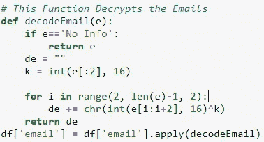

# 房地产市场、网络报废和使用 Python 的 EDA

> 原文：<https://medium.com/analytics-vidhya/apartment-market-web-scrapping-and-eda-using-python-a9eacf6d64e2?source=collection_archive---------12----------------------->

在本指南中，我们将了解阿尔巴尼亚地拉那的房地产市场。本文将介绍使用 python 进行 web 报废的指南，并执行探索性数据分析，从而从原始数据中提取有价值的见解。

大约 5520 套公寓(待售和出租)的数据来自 21 世纪不动产的网站。这些数据是 21 世纪的财产，只能在获得授权的情况下获取(我有授权)，这项研究的目的纯粹是教育，所以请合乎道德地使用本指南，并在删除其他网站的数据时始终请求授权。


**地拉那的回忆**

> 你不是沧海一粟。你是整个海洋中的一滴水。鲁米

## **数据采集**

在我们开始网络报废过程之前，让我们快速浏览一下将从中提取公寓数据的网站。这里可以找到[这里](https://www.century21albania.com/en/properties?display=grid&type=Apartment&city=Tirana&page=1)。我们感兴趣的财产类型“公寓”和城市“地拉那”。应用过滤器后，每个页面的属性如下所示 12 个属性，共有 460 个页面(到目前为止),我们将使用 python 脚本逐一查看这些页面以提取数据。


**21 世纪网站外观**

下面列出了每个公寓需要提取的信息(如果存在的话)。我们将演示为一个单独的房产提取这些信息的过程，然后展示通过所有页面上的所有房产的代码(460*12 = 5520 套公寓)。


**每个属性所需的信息**

**进口**

```
# Requests is an elegant and simple HTTP library for Python
**import requests**
# pandas is a powerful open source data analysis tool
**import pandas as pd** 
# Beautiful Soup is a library for Data Scrapping
**from bs4 import BeautifulSoup**
# tqdm package to have a progressive bar during data extraction
**from tqdm import tqdm**
# Numpy is a package for scientific computing of arrays
**import numpy as np**
# A module which contains statistical functions
**from scipy import stats**
# Opens the passed URL in a browser
**import webbrowser**
# String Manipulation
**import re**# Plotting Packages
**import matplotlib.pyplot as plt
from pyecharts.charts import Bar
from pyecharts import options as opts
import seaborn as sns**
```

**拆网**

首先我们进入网页，右键点击> inspect，显示源代码。将光标移过页面元素，找到包含我们数据的属性元素，它有一个类*“col-LG-3 col-MD-4 property”。*


**检查元素以发现属性元素的类别**

现在，为了获得这个属性元素的源代码，我们在请求中传递网页的链接，并确保您也传递这些头。然后，将内容( **r** 包含整个页面的源代码)传递给 **BeautifulSoup** ，同时我们指定元素**【div】**和类***【col-LG-3 col-MD-4 property】、*** ，从而创建 **properties、**一个包含每个属性元素源代码的列表。我们可以通过打印列表的长度和第一个元素的内容来改变它。

```
**r = requests.get**(**f"**[https://www.century21albania.com/en/properties? display=grid&type=Apartment&city=Tirana&page=1](https://www.century21albania.com/en/properties?display=grid&type=Apartment&city=Tirana&page=1)**"**, 
                  **headers={**'User-agent': 'Mozilla/5.0 
                           (X11; Ubuntu; 
                            Linux x86_64; rv:61.0)   
                            Gecko/20100101 Firefox/61.0'**})****properties = BeautifulSoup(r.content,** "html.parser")**.find_all(**"div", {"class":"col-lg-3 col-md-4 property"**})**
```


**列表中第一个属性对应的源代码**

上面显示了与列表的第一个属性相对应的部分代码，同时还有一些突出显示的元素，如卡的**属性 URL、价格、标题**和**地址**。让我们提取这些信息:


**提取物业 URL、价格、标题和地址**

我们首先创建一个空列表来存储所需的信息，然后遍历之前创建的属性列表，并通过在 find 方法上输入适当的类名来提取信息。例如，为了提取 URL，我们找到 link **"a"** 类型的所有 HTML 元素，并获取第二个元素，因为第二个链接对应于特定的属性元素。类似地，我们使用 **class="card-title"** 定位价格元素 **class="text-primary mb-2 "，** title 元素，使用**" class = card-subtitle mt-1m b-0 text-muted "，**定位地址元素，然后我们提取这些段落的文本。使用*尝试排除*可防止信息缺失时出错。

现在，要获得其余信息，我们必须使用之前获得的酒店 URL 访问每个特定的酒店网页。比如这个[房产](https://www.century21albania.com/en/property/870255/apartament-11-per-shitje-te-21-dhjetori-bond39474.html)，我们会提取代理商的信息:**卖家**(姓名)**邮箱**和**电话**号码，在带有**“class = card card-list”的卡片下。**


**卖家卡**

对于每个物业，我们将提取给定的详细信息**总面积**、**内部面积**、**卧室、浴室**、**类型、状态、可用性、网站视图、文档、客厅、楼层**和**土地面积**，在**“class = card-body col-MD-12”下。**


**详细的房产信息**

下面是整个脚本，使我们能够从第 1 页移动到第 460 页，并为每一页提取 12 个属性的信息。首先，我们获取属性卡元素，然后获取属性 URL，我们移动到该 URL 并提取代理的信息和详细的属性特征。然后我们从主页面中提取价格、标题和地址。我们使用 **tqdm** 包来可视化带有进度条的 for 循环，这需要一个多小时才能完成。我们把数据放在数据框里。


**报废网页脚本**

我们把数据放在一个数据帧上，它看起来像这样:

```
# Convert the list of uneven dictionaries to Pandas Dataframe
**df = pd.DataFrame.from_records(all_properties)**
```


**DF 的前五条记录**

根据良好的实践重命名列，现在我们准备开始清理和探索性数据分析。


**DF 栏目**

## EDA 和清洗

## **房产网址**


## **代理**

我们可以看到公司有 **210 个唯一代理**。我们可以通过房产数量来直观显示排名前 20 位的代理商。顶级代理商在平台上有 149 套房产待售或出租。


**按物业数量排名的前 20 名代理商**

## **电子邮件**

正如您在数据框中看到的，电子邮件字段是加密的。这是因为它们属于 **class="cf_email"** 类型，这意味着电子邮件受 CloudFlare 保护。我们需要应用如下的解密函数:



**解密功能**


**解密前后的邮件**

## **电话号码**


**电话号码数值计数**

```
# To convert the data to uniform format we remove the '+' sign
**df['phone'] = df['phone'].str.replace('+','')**
```

## 价格

我们需要删除额外的符号，并将金额从字符串转换为整数。


**清洁价格栏**

## **标题**

使用标题描述，我们可以使用它来分割出租公寓和出售公寓的数据集，为此，我们有两个函数来控制标题是否包含单词“**出租**或“**出售**”以及每个类别的同义词。我们添加两个用 0 或 1 编码的列，这取决于公寓是否属于该类别。删除属于这两个类别或不属于这两个类别的行(因为既有公寓出租也有公寓出售)，我们只剩下 **5'185** 属性**。**


**租售**

```
# Drop rows where the apartment is for sale and for rent or with a ambigious title:
**df = df.drop(df[(df['sale'] == 1) & (df['rent']== 1)].index)
df = df.drop(df[(df['sale'] == 0) & (df['rent']== 0)].index)
df = df.reset_index(drop=True)**
```

## **地址**

我们删除了特殊字符，去掉了尾随空格。然后，我们可以说明哪些区域有更多公寓可供出售/出租。我们可以看到“*唐·博斯科*”的公寓报价更高，其次是“*弗雷斯库*”一个拥有许多新住宅建筑的区域。


**各区公寓数量(前 10)**

## **总面积**


我们看到公寓的平均总面积是 105.9 平方米。下面我们通过将公寓分成 50-170 平方米的几个部分来展示它们的总面积:


**按总面积计算的公寓**

## **内部区域**

我们删除非数字字符，并将字符串转换为浮点型。所有公寓的室内总面积为 457，774 平方米。


**清洁内部区域**

## **浴池**

如下图所示，我们可以通过浴室的数量来统计公寓的数量，我们看到 57%(2823 套公寓)有一间浴室。有一处房产有 133 间浴室，在检查后，我们发现这是代理人误闯的。因此，我们删除了像这样有问题的行。


## 状态

在根据公寓的状态对其进行适当排列后，我们对两个主要类别进行编码，即“**新的**”和“**用过的**”。大多数公寓 **66%** 是新建的，因为地拉那市的建筑业在过去几年非常活跃。


**按状态分类的公寓**

## 有效性

如果我们将数据按可用性进行分类，并按出租或出售进行分组，我们可以看到 **17% (889)** 的公寓已售出，在**2212**套可用公寓中， **1581 套(71%)** 用于出售而非出租。


**租售对比**

## 网站访问量

如上图，从网站浏览量的分布来看，公众对租房更感兴趣。在**2266995 个**总浏览量中，大部分 **59%** 指向出租公寓。下图显示了网站访问量排名靠前的代理。我们可以看到，尽管代理人" *Oltion Lulja* "只有 107 套公寓，相比之下" *Eriola Kurti* "有 147 套公寓，他仍然设法获得了更多关于其房产的意见。


**代理商的网站浏览量**

## 证明文件

这一栏提供了关于财产所有权证书的信息。这是相当数量的公寓，其中 26%没有任何信息(很可能表明缺乏财产文件)


**抵押状态**

## 地板

这一栏包含公寓的楼层数。一层以上的公寓数量为**3602**，这表明所提供的公寓大多位于高层住宅建筑上，也说明了城市建筑高度方面的平均景观。


**公寓的楼层**

## 价格

平均公寓售价为 **105，792 欧元，**而 50%的公寓价格在 **75，000 欧元和 **130，000 欧元之间。**有一些异常值，我们可以删除如下:**

```
# Remove Price which is two standard deviations away, basically top 5 percent, outliers. 2390 Left
**df_sale = df_sale[(np.abs(stats.zscore(df_sale['price'])) < 2)]**# Remove The lower Outliers, 2374 Left
**df_sale = df_sale[df_sale['price']>20000]**
```


这是关于数据提取和探索性数据分析的简单指南。如果你需要帮助或有问题或需要完整的代码，给我写信！

**谢谢:)**