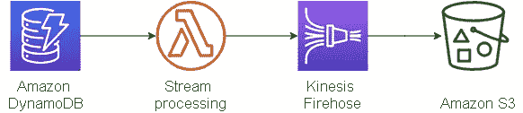
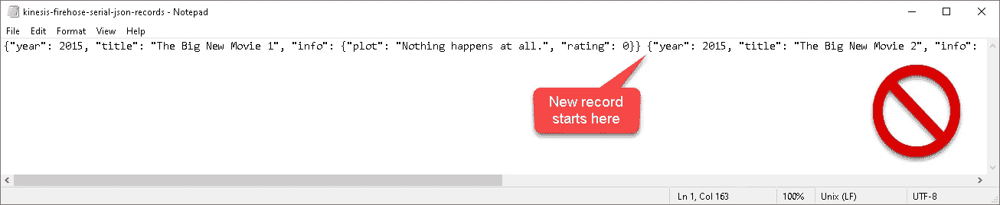
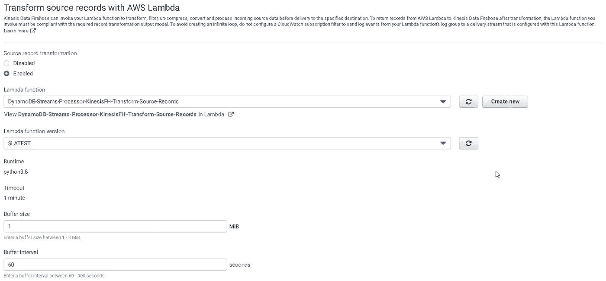
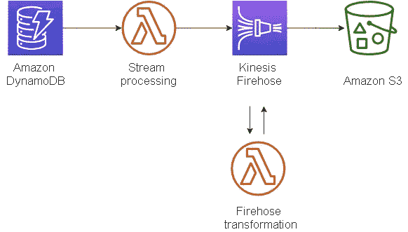
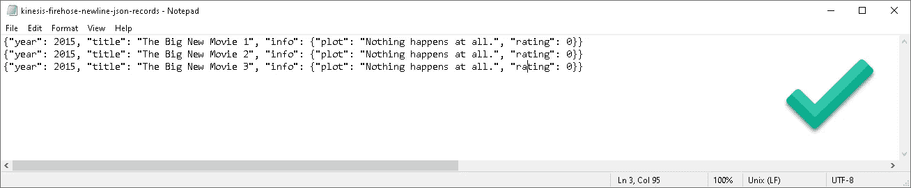

# 用 Python 和 AWS Lambda 向 Amazon Kinesis Firehose JSON 格式的记录添加新行

> 原文：<https://medium.com/analytics-vidhya/append-newline-to-amazon-kinesis-firehose-json-formatted-records-with-python-f58498d0177a?source=collection_archive---------0----------------------->

我在墨西哥瓜纳华托

简单吧？然而，这被证明是如此难以捉摸，至少对我来说，而且比我愿意承认的时间更长。

*如果你想跳过景区路线，直接进入解决方案，向下滚动到下面的代码；更好的是，ctrl+f“kine sis-FH-JSON-newline”否则，享受漫步。*

*场景。我正在使用亚马逊 DynamoDB (DDB)流。我有一个 AWS Lambda 函数，它将这些流推送到 Kinesis Firehose。然后，消防软管将这些数据推送到 S3。它很好地将我的记录作为 JSON 字符串输入 S3，因为 Firehose 有助于控制数据流。*

无消防软管转换的数据管道

到目前为止，我的(部分)数据管道工作得很好，除了一个问题。当每个 JSON 格式的记录保存到文件中时，它们被连续保存——每个记录被记录在一行或一行中，一个接一个。当您在记事本中打开这个文件时，您会看到每个记录在文件的顶部以菊花链的形式连接在一起。我不希望它像那样存储，因为它不直观，并且以后将很难处理。

我希望每条记录的结尾都有一个回车符，这样它们就可以垂直堆叠在一列中，而不是水平堆叠在一行中。

JSON 记录:这是 Kinesis Firehose 将每个记录保存到文件的方式。

我从我的 S3 桶中下载了上图所示的文件。该文件演示了 Kinesis Firehose 如何将我的每个 JSON 记录保存到文件中。我对两件事感到惊讶，1) Kinesis Firehose 没有一个简单的“复选框”来为我添加换行符，2)我不容易找到 Python 解决方案。

**base64 编码/解码**

在我的第一个 Lambda 中，这并不像将 DDB `newImage`转换成一个字符串，然后添加`+ "\n"`，再将其转换回字典或 JSON 那么简单。我要么得到一个错误(当我使用`json_loads()`时)，要么什么都不会发生(当我使用`ast.literal_eval()`时)，所以我怀疑消防软管的`client.put_record()`正在剥离回车。消防水管流是用 base64 编码的，为了正确工作，我必须用 Python 中的 T5 把记录解码成一个字符串，然后再编码成 utf-8。详见 kinesis-fh-json-newline.py 代码。

*我是这样做的:*

1.  创建一个新的 Lambda 并使用下面的 kinesis-fh-json-newline.py 代码，或者使用下面的 Node.js 版本。
2.  当你创建你的 Kinesis 消防水带流时，启用“用 AWS Lambda 转换
    源记录”(选择“启用”)。如果您已经创建了您的流，您仍然可以通过编辑现有的流来启用此功能。
3.  为转换选择新创建的 Lambda 函数。这个转换 lambda 还可以做很多其他的事情，比如 ETL。在我的例子中，我只需要在每个记录的末尾添加一个新行，这样当我在文本编辑器中打开文件并查看它时，每个条目都在一个单独的行上。

下面是我用于第二个 Lambda 的 Python 和 Node.js 的测试解决方案代码:

添加换行符的 Python 解决方案:

添加换行符的 Node.js 解决方案:

一些帮助我拼凑 Python 版本的好参考资料:

*   Kinesis 消防软管演示(Node.js 解决方案来源):[https://www.youtube.com/watch?v=wRGd2G82Opo&t = 242s](https://www.youtube.com/watch?v=wRGd2G82Opo&t=242s)
*   使用 Python 的亚马逊网络服务(AWS) Kinesis 消防软管教程:[https://www.youtube.com/watch?v=6_03i26_DrQ](https://www.youtube.com/watch?v=6_03i26_DrQ)
*   了解无服务器 web 应用程序的数据库选项:[https://AWS . Amazon . com/blogs/compute/understanding-database-options-for-your-server less-web-applications/](https://aws.amazon.com/blogs/compute/understanding-database-options-for-your-serverless-web-applications/)

**在第一个 Lambda 中添加一个换行符，在 Kinesis Firehose 之前**

我也能在第一个 Lambda(上面的数据管道图中的“流处理”)中实现这一点，而不是使用 Kinesis Firehose 转换源记录功能。我从 DynamoDB 流中获取新图像，并按照以下顺序执行:编码、解码、添加新行(" \n ")、编码、解码。可能有更干净的方法。然而，我选择使用第二个 Lambda 函数来转换源记录特性，因为此时它对我来说似乎更清晰。

在任何情况下，单个 Lambda 解决方案看起来都是这样的:

**用 AWS Lambda 转换源记录**

在 Python 中创建新的 Lambda 之后，转到你的 Kinesis 数据 Firehose 交付流并编辑你的流。启用“用 AWS Lambda 转换源记录”部分中的“源记录转换”,并从列表中选择您新创建的 Lambda，最后，保存您的更改。应该可以了！

消防水带转换λ

您的新数据管道流应该如下所示:

用于添加换行符的带消防软管转换的数据管道。

重新测试你的 Lambda 函数，瞧！现在，每条记录都应该有一个回车符，并且是预期的、直观的格式。

JSON 记录:每条记录的末尾都有换行符。

我想听听你的想法。您曾经需要连续保存记录吗？有没有我遗漏的更简单的解决方案？肯定有！欢迎评论、反馈和建议。

*未来篇。*在未来的文章或系列文章中，我将详细介绍如何完成整个数据管道，以便我们可以将数据从 DynamoDB 导入 Amazon RDS，从而为使用 Amazon QuickSight 进行数据分析做好准备。

如果你喜欢这篇文章或者这个解决方案对你有帮助，请鼓掌。最多可以鼓掌 50 次，谢谢。