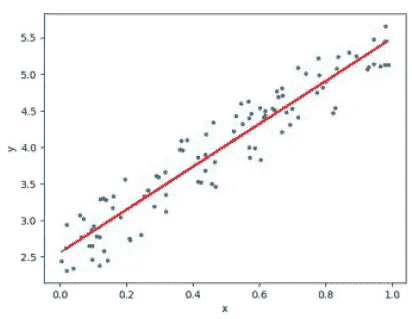

# OLS 统计模型的应用和解释

> 原文：<https://medium.com/analytics-vidhya/application-and-interpretation-with-ols-statsmodels-499c69ef6834?source=collection_archive---------4----------------------->

米卡·鲍梅斯特在 [Unsplash](https://unsplash.com?utm_source=medium&utm_medium=referral) 上的照片

在这篇文章中，首先讲述了监督学习中的线性回归模型，然后介绍了在 Statsmodels 库中的 OLS 在 Python 中的应用。

如你所知**机器学习**是一种基于更多数据的人工智能形式，它们可以改变动作和反应，这将使效率更高，适应性更强，可扩展性更强。例如导航应用和推荐引擎。它是统计学和计算机科学的交叉。通过学习历史数据的模式以及数据之间的某种关系来构建模型，以进行数据驱动的预测。ML 分为:

1.监督

2.无人监督的

3.强化学习

在本文中，我们将讨论监督学习中的线性回归。**监督学习**，模型基于结果已知的数据。根据该模型，对数据集中没有标签信息的数据的结果进行预测。例如，垃圾邮件分类是一种监督学习。众所周知，大量的电子邮件是垃圾邮件。给定一封新邮件，该算法将预测该新邮件是否是垃圾邮件。有两种主要类型的监督机器学习问题，称为分类和回归。

**回归**:预测给定的数值量。预测一个人的体重或今年会有多少雪是一个回归问题，我们根据以前的值和其他相关特征来预测数值函数的未来值。

# 线性回归

线性模型是在实践中广泛使用的一类模型，在过去的几十年里得到了广泛的研究，其根源可以追溯到一百多年前。线性模型使用输入要素的线性函数进行预测。

换句话说，它的主要目的是找到表达因变量(y)和自变量/s(x)之间关系的线性函数。Xp 代表 pth 预测值，βp 量化该变量和响应之间的关联
。我们将βp 解释为 Xp 增加一个单位对 Y 的平均
影响，保持所有其他预测因子不变。还有，βp 也可以称为学习系数。

用数学理解回归

x:自变量(新数据)，y:因变量

没有贯穿所有数据点的直线。因此，这里的目标是拟合一条直线的最佳拟合，以尽量减小预期值和实际值之间的误差。线性回归有两个主要目的。首先，通过确定影响因变量的变量来估计因变量的值。第二是确定哪些自变量被认为影响因变量，或者因变量如何以及以何种方式受到影响。**回归损失函数*、*、**与我们远离真实值时所经历的损失的平方成正比。在训练模型时，我们不仅关心最小化样本的损失，还关心最小化整个数据集的损失。

***平方损失*** ***:一个流行的损失函数***

=标签和预测值之差的平方

=(观察—预测( **x** ))

=(y—y’)

***那么，OLS Statsmodels 在线性回归模型中的地位如何呢？***

**OLS(普通最小二乘法)**是一个统计模型，它将帮助我们识别对输出有影响的更重要的特征。OLS 是一种估计量，其中β0 和βp 的值(来自上述等式)的选择方式应使观察到的因变量和预测的因变量之间的平方和最小。这就是为什么它被命名为普通最小二乘法。

***OLS stats models 如何应用？***

首先，我们需要知道我们将使用的数据集。数据集在一本名为《r 中的统计学习与应用导论》的书里，这个数据集反映了广告支出。通过电视、广播和报纸提供广告支出，从而实现销售。首先我们定义变量 **x** 和 **y** 。在下面的例子中，使用 *pandas* 从 *csv* 文件中读取变量。(“ *usecols* ”路径可用于避免将索引作为变量)。

导入包含熊猫的数据集

*df.info* 显示了数据集的结构，这意味着该数据集有 200 个观察值，所有变量都是连续的，没有遗漏的观察值。

数据集的结构

它的描述性统计可以用 *df.describe()来检验。T*

而 TV 变量的自变量平均值为 147，其最小值应为 0.7。标准偏差值被认为是由最小值产生的。可以看出，中间值并没有远离平均值。补充一下，标准差这么大不是问题。这只是表明变量的分布更不均匀。我们可以说，当我们看其他独立的广播和报纸以及销售因变量时，有一个均匀的分布，偏度和峰度是看不到的。(偏度和峰度是从四分位数之间的差异来分析中值、平均值和标准差)。

描述统计学

*df.corr()* 显示变量之间的相关性。

如果我们考察变量之间的相关性，电视变量和销售变量之间的正相关性告诉我们，随着电视广告的增加，销售变量也会增加。收音机变量和销售变量之间存在适度的正相关关系。

变量之间的相关性

我们也可以用“ *Seaborn* 库”中的 pairplot 来观察这些相关关系。

变量和变量间相关性的配对图

当我们检查变量的分布时，我们注意到报纸的分布向左倾斜。如果我们检查电视和销售的变量，我们在线性回归中观察到强烈的正相关。其中斜率表示关系的严重性。

通过探索性数据分析了解了总体结构。现在我们将使用“ *Statsmodels* ”库安装我们的模型。我们为 OLS 和分割操作导入了" *statsmodels* 和" *sklearn* "库。

导入所需的库

我们用 *drop.na ()* 将数据集中的自变量分离为 X 即自变量，因变量 y 即“销售额”。我们按照一定的比例划分数据集，对模型进行训练和测试。这里的比率是这样的，它是测试大小的整个数据集的 20%。

*Random_state，w* e 必须写入“ *random_state* ”值，以便不会为每个模型产生不同的值。

模型结构

该模型是用因变量 y_train 和自变量 X_train 建立的。模型*拟合*后，我们可以通过 *summary* 功能观察模型的输出。我们无法获得使用“ *sklearn* ”建立的模型的详细统计信息。使用 OLS 函数建立模型后，可以查看和解释模型的显著性、系数、p 值、t 值、置信区间等。

OLS 模型结果

为了解释这一结果，最重要的值之一“R- *平方*值是自变量在解释因变量可变性方面的成功。即考虑自变量“*电视台*”、“*电台*”、“*报纸*”对因变量“*销售额*”的影响。

“*调整 R 的平方*”和“ *R 的平方*”之间的差异随着“R 的平方”中的每个变量而增加。但是通过“*调整 R 的平方*，它通过降低其灵敏度给我们一个更精确的值。

这里的“ *F 统计量*”告诉我们模型建立后的意义。*探针(F-统计)*是 p 值的值。因为 p 值小于 0.05，所以该模型显得很重要。

“ *coef* 值显示为βp 值，“ *const* 为常系数，即β0，2.9791。“电视”是 0.04447，“广播”是 0.1892，“报纸”是 0.0028。" *P > | t |* "当我们看系数的值时，因为 P 值小于 0.05。(“报纸”的系数为“P > | t |”考虑到数值，因为大于 0.05 所以意义不大，模型可能不包含。)我们看到它们都是有意义的。*【0.025，0.975】*“是置信区间。我们可以说，我们在模型中发现的系数产生了具有 95%置信区间的显著值。

注意:我们不能在这里检验模型的预测成功。

OLS 统计模型的回归函数

如你所见，我们可以简单地用我们使用的模型写一个回归函数。如果有我们想要的费用，我们可以将它们的值放在需要的地方，并查看“销售”因变量的结果。

***结果***

本文首先对线性回归进行了理论解释。尽可能多地处理回归代码并不是逻辑。还展示了如何使用“Statsmodels”库进行深度分析。

 [## 在 Kurulması ve Yorumlanması中制作 Python ile Basit do rusal regression 模型

### 但是，如果您不愿意的话，请联系我们。

yigitsener.medium.com](https://yigitsener.medium.com/makine-%C3%B6%C4%9Frenmesinde-python-ile-basit-do%C4%9Frusal-regresyon-modelinin-kurulmas%C4%B1-ve-yorumlanmas%C4%B1-4cf918e1adf)  [## dorusal 回归(线性回归)

### 但是 yazmda dorusal 表示遗憾。奥马尔·法伊达尔·比尔·埃里克·奥卢尔。Keyifli okumalar…

medium.com](/@bernatas/doğrusal-regresyon-linear-regression-8f562c19aadf)  [## 统计学习导论

### Technometrics 颁发的 2014 年 Eric Ziegel 奖得主。随着数据收集的规模和范围不断扩大…

www.statlearning.com](https://www.statlearning.com/)  [## 数据科学设计手册

### 《数据科学设计手册》是对数据科学的介绍，侧重于所需的技能和原则…

www.data-manual.com](https://www.data-manual.com/) 

[http://Nora cook . io/Books/Python/introductiontomachinellingwithpython . pdf](http://noracook.io/Books/Python/introductiontomachinelearningwithpython.pdf)