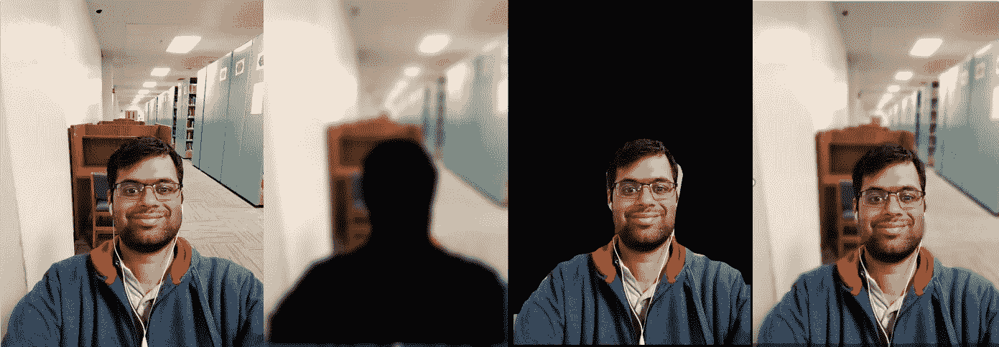

# 前景和背景分离在深度学习中的应用

> 原文：<https://medium.com/analytics-vidhya/application-of-foreground-and-background-separation-with-deep-learning-e5f47c60bce6?source=collection_archive---------11----------------------->

在基于神经网络的目标检测出现之前，前景和背景分离一直是一个巨大的问题。必须使用图像处理技术，如基于颜色的分割、基于深度的分割和其他传统技术。今天，在现成的深度学习模型的帮助下，掩盖感兴趣的区域并从背景中分离前景变得非常容易。

**应用:-**

1.  具有深度学习的人像模式
2.  在家工作时视频通话背景模糊

**深度学习人像模式**

当从 DSLR 相机中捕捉图像时，肖像模式变得很出名。高端 DSLR 相机有一个选项来减少相机的焦距，以确保相机可以捕捉图像，主要集中在场景中的小距离对象上，并自动模糊背景。这种图像变得非常有名，因为它会自动锐化相机前面的主体/对象。

这种趋势通过在智能手机上增加两个摄像头来捕捉深度信息而得以延续。基于深度阈值，分割感兴趣区域非常容易。由于双摄像头可以提供深度信息，人像模式开始在手机上流行。

随着基于对象检测的网络的流行，无需高端 DSLR 或双摄像头的人像模式成为可能。

让我们了解一下没有双摄像头或高端 DSLR 的人像模式是如何工作的。

1.  首先你需要一个好的相机和主体。捕捉聚焦良好、无任何失真或明显噪点的图像。

2.获取图像并将其通过对象检测网络，并从区域建议网络获得输出前景边界。

3.将前景和背景分离为两个独立的图像。

4.模糊背景，锐化前景。

总而言之:-

原始图像、人物检测和背景模糊、前景和背景分离、最终肖像模式(图片由作者提供)

这样，一个人可以用一个低成本的相机创建肖像模式。

该代码可在 github 上获得。

【https://github.com/sumedhvdatar/PortraitSegmentation 

**2。视频通话时背景模糊**

有了 COVID，世界上大多数人都可以在家工作。在家工作需要进行多次视频通话。许多人不喜欢展示他们工作的环境或背景，想要隐藏起来。团队共享和协作平台，如 **zoom** 和**微软团队**发布了一项功能，开启相机的用户可以选择模糊背景或添加不同的背景。这个想法和上面解释的一样。

它清楚地显示了神经网络可以有多强大。在一个简单的前置笔记本电脑摄像头的帮助下，同样的技术可以被应用，它帮助世界各地的许多人打开他们的相机，表达他们想要的东西，同时感到非常舒服。

**结论**

前景和背景减法只是深度学习的应用之一，类似地，深度学习在许多不同的领域都有应用。个人所要做的就是带来一些创造力，并在正确的地方应用深度学习，这将对人们的生活产生持久的影响。

来源:

 [## 使用 OpenCV 进行 Alpha 混合(C++ / Python)

### 在本教程中，我们将学习如何阿尔法混合两个图像。想要将一个透明的 PNG 图像覆盖到另一个上…

learnopencv.com](https://learnopencv.com/alpha-blending-using-opencv-cpp-python/) 

用于图像风格化的自动人像分割申 1、Aaron Hertzmann2、Jiaya Jia1、Sylvain Paris2、Brian Price2、Eli Shechtman2 和 Ian Sachs2 香港中文大学 2Adobe 研究