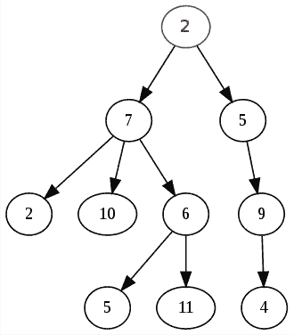
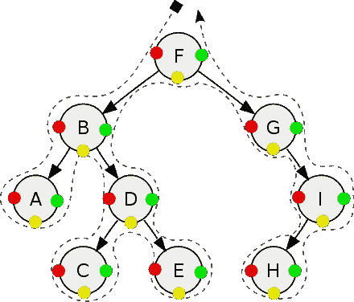
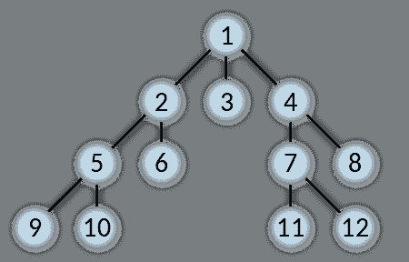

# 树形数据结构的应用

> 原文：<https://medium.com/analytics-vidhya/application-of-tree-data-structure-5871b65af403?source=collection_archive---------18----------------------->

我们来谈谈树型数据结构(程序员不会把他们的树倒过来，大自然会)。

首先要谈的是，嗯…它到底是什么？

我相信每个人都熟悉下面的树的可视化表示:

树形数据结构的可视化表示(感谢:维基百科)

维基百科是怎么定义的？

> 在计算机科学中，**树**是一种广泛使用的抽象数据类型，它模拟分层树结构，具有根值和带有父节点的子树，表示为一组链接的节点。

不是很有帮助。

总之:树是一种组织数据的方式，每个节点可以引用任意数量的子节点，但是任何子节点只能被一个节点引用，而根(第一个)节点不能被任何子节点引用。

# 好极了。但我为什么要在乎呢？

树数据结构非常有用，因为几乎任何树遍历算法都可以在 O( *n* )时间内解决。如果您有一个具有自然层次结构形式的数据集，例如一个文件夹结构，那么编写遍历算法使其在合理一致的时间框架内返回数据的能力就是一种非常强大的能力。如果您使用几乎任何形式的有序树，例如二叉查找树，其中树上的每个节点都根据它们在树中的位置被赋予一个索引号，那么这个时间将会减少到 O( *log* ( *n* ))。

## 树遍历:深度优先

不同的树遍历方法在不同的情况下是有利的。遍历树的两种主要方法是*广度优先*和*深度优先。*

深度优先遍历(感谢:维基百科)

深度优先算法是这样一种算法，该算法在向上一层或多层并分支到兄弟分支之前，优先考虑尽可能深入树中。深度优先向下递归遍历二叉树的模式如下:

*   检查左边的子节点，
*   如果有，拿着它，
*   否则，向右走。
*   如果你不能向右走，就一直往上走，直到你能向右走。
*   右转后，再左转，然后
*   递归重复，直到所有节点都用尽。

这确保了算法将在移动到下一条分支之前耗尽一条分支上的所有节点，并重复该循环。

## 树遍历:广度优先

与深度优先遍历方法类似的是广度优先方法。

广度优先遍历(感谢:维基百科)

广度优先的方法与深度优先的方法正好相反，事实上，顾名思义。广度优先搜索算法看起来像这样:

*   如果我在根节点上，向下一个。
*   如果我有兄弟姐妹，看看他们。这样做，直到我检查完所有的兄弟姐妹。
*   如果我没有未检查的兄弟姐妹，向下一个。
*   递归重复，直到所有节点都用尽。

假设是二进制数据树，这两种树遍历方法最终将获得相同的结果，并且具有相似的速度，并且一种方法优于另一种方法的使用将取决于具体情况。

## 总结

将一个树数据结构应用于其他数据结构，或者将不同类型的遍历方法应用于其他数据结构，很大程度上取决于您试图解决的问题的情况和上下文。本文只介绍了两种最基本和最常见的遍历方法，并且只针对二叉树，但是必须说明的是，本文并没有穷尽所有的遍历方法，也没有涉及有序树或更高级的遍历方法，比如 inorder 或 postorder 遍历。