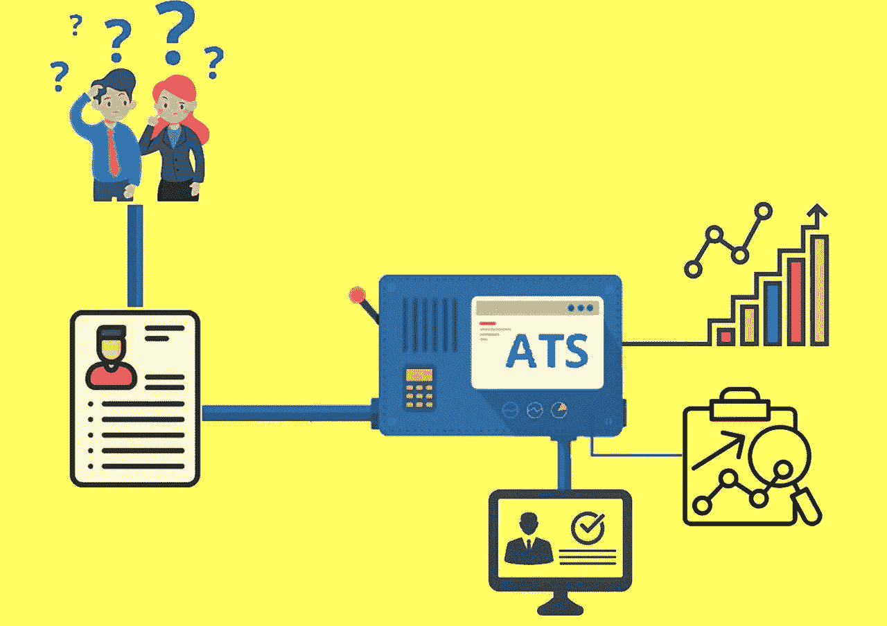
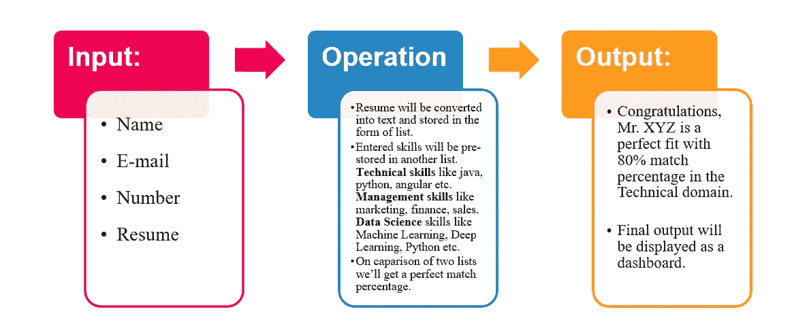
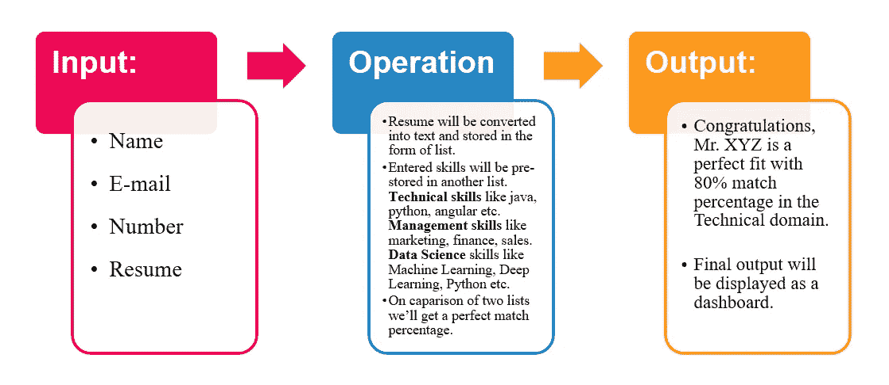
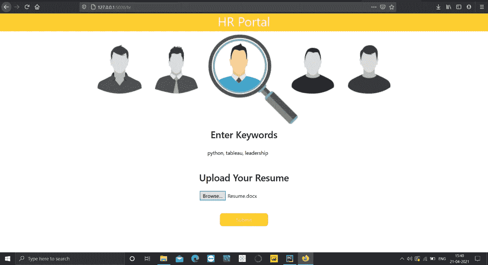
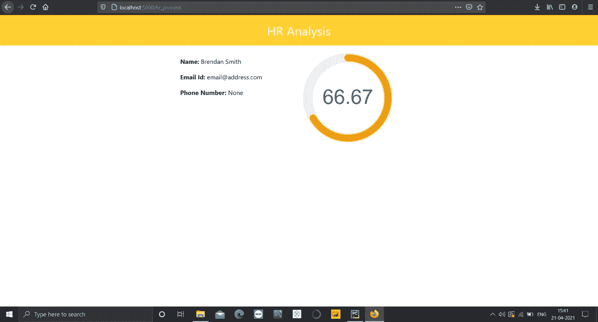
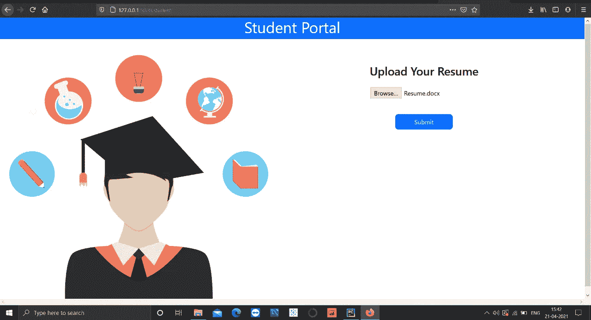
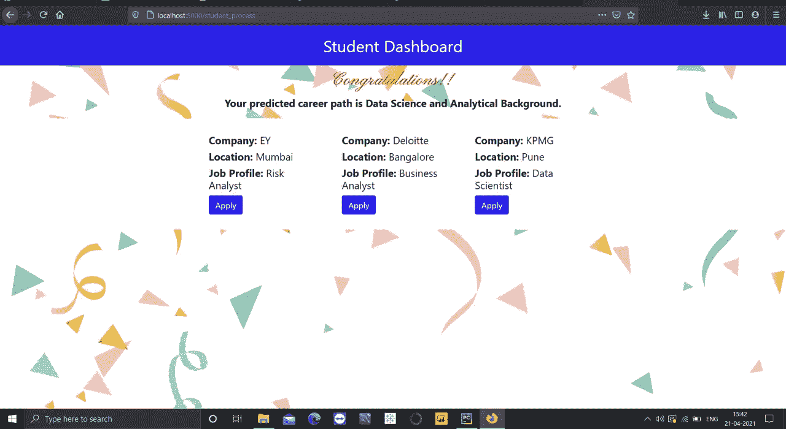

# 申请跟踪和职业预测系统

> 原文：<https://medium.com/analytics-vidhya/application-tracking-and-career-prediction-system-4aa1f712482a?source=collection_archive---------12----------------------->

图片由英国扩音器提供

一个应用程序跟踪和职业预测系统(ATCPS)自动化整个招聘过程，并帮助您的招聘人员顺利地找到最优秀的候选人。根据 Software Advice 最近的一份报告，近 26%的招聘人员表示，使用申请人跟踪系统是申请人拥有良好求职体验的最重要因素之一。除了为招聘人员提供方便之外，ATCPS 也是学生求职的辅助工具。目的是通过向我们的同学和其他希望找到适合他们技能的工作的学生展示可能的职业道路来提供帮助。

让我们从人力资源部分开始

图片由 Orgzit.com 拍摄

*   公司将为他们的工作角色定义一组关键词或技能。
*   然后，该软件会将该列表与候选人简历中提到的单词进行比较，这些单词将作为输入。
*   根据匹配情况，结果将以百分比的形式显示，表明候选人对特定工作的适合程度。
*   然后人力资源可以在很短的时间内决定面试哪些候选人。

现在到了学生的部分

作者图片

*   这个软件将主要帮助学生确定他们的职业道路，并帮助他们找到相应的职位空缺。
*   用户必须提供他们的简历，以便将其中的技能与技术、管理和数据科学等领域的一组预定义单词进行比较。
*   匹配百分比将显示，用户可以决定哪个领域是他们的理想选择。

## 拟议系统

在开始实现之前，我们决定了我们的系统应该是什么样子。

***拟定系统人力资源官***

HRO 的拟议系统

系统将输入的学生简历作为 word 文档。该系统还输入特定工作角色所需技能的关键字。然后，系统将简历转换成文本，从而找到所需的关键词。那些具备必要技能的学生会被人力资源部门选中申请他们的空缺职位。系统还显示学生技能与所需工作描述的匹配百分比。

***拟生制***

为学生提议的制度

系统有一组预定义的关键字，分配给它适合的特定种类的工作角色。然后，它将输入作为学生的简历。文档格式。然后，它将简历转换成文本格式，在这个过程中找到关键词。简历中的这些关键词会与预先定义的关键词进行比较，并显示学生适合的工作角色类型。它还显示与学生可以直接申请的特定工作角色相关的公司。

## 我们是如何执行的？

让我们从上传简历开始。为了将简历文件转换成计算机可读的文本，我们使用了名为 **docx2txt** 的库。 **docx2txt，**一个纯粹基于 python 的实用程序，用于从 docx 文件中提取文本。代码取自并改编自 python-docx。然而，它也可以从页眉、页脚和超链接中提取文本。它现在还可以提取图像。更多详情你可以点击这里访问[。](https://pypi.org/project/docx2txt/)

简历上传后，将被解析为一个模型，并对数据进行预处理。

spaCy 是一个用于高级自然语言处理的开源软件库，用编程语言 Python 和 Cython 编写。该库在麻省理工学院的许可下发布，其主要开发者是软件公司的创始人 Matthew Honnibal 和 Ines Montani。如需了解更多详情，请访问此处的[。](https://spacy.io/models)

**自然语言工具包(NLTK)** 是一个平台**，用于**构建 Python 程序，该程序处理人类语言数据，以应用于统计自然语言处理(NLP)。它包含用于标记化、解析、分类、词干、标记和语义推理的文本处理库。欲了解更多详情，您可以访问[此处](https://www.nltk.org/book/ch07.html)。

简历上传后，将进行数据预处理。这些是我在项目中做的基本步骤。

**去除多余的空格-** 我们所掌握的内容信息通常会在单词中间、句子前后包含额外的区域。因此，首先，我们利用普通的发音从每个句子中消除了这些额外的区域。

**删除标点符号**-内容中出现的标点符号不会增加信息的价值。标点符号，当附加到任何单词上时，会在分隔不同的单词时产生问题。

**大小写规范化**——在这里，我们将内容中所有字符的大小写转换成大写或小写。因为 python 是一种区分大小写的语言，所以它会以一种意想不到的方式处理 nlp 和 NLP。通过使用 str.lower()或 str.upper()，我们可以轻松地将字符串转换为小写或大写。

标记化基本上是将一个表达式、一个句子、一个部分或者整个记录分割成更小的单元，比如单个单词或者术语。这些更小的单元中的每一个都被称为代币。在准备一种有特色的语言之前，我们需要区分由一系列字符组成的单词。这就是为什么标记化是继续 NLP 最基本的进步。这是很重要的，因为内容的重要性可以通过分析内容中出现的单词来解释，而不需要很大的努力。

**消除停用词-** 停用词包括:我、他、她、和、然而、曾经、曾经、存在、有等等，这些都没有给信息增加意义。所以这些词应该被删除，这有助于减少我们信息中的亮点。这些都是在对内容进行标记化之后消除的。

## 我们使用了什么方法？

让我们从我们使用的方法开始。从 HRO 部分开始，我们创建了一个包含关键词和相关词的数据库。例如:nlp 在这一类别下，我们放置了所有类似 NLP、自然语言处理、nltk、spacy 等词，因此，如果简历中出现了这些词，模型会自动将其视为 NLP。在此之后，我们可以很容易地提取姓名，号码和匹配的百分比进行比较，他们与 HRO 输入的关键字。

***最终输出***

HRO 主页

HRO 的最后一页

现在来看学生部分的实现，我创建了 3 个数据库，一个用于技术，另一个用于管理角色，第三个用于数据科学和分析背景。

***最终输出***

学生主页

学生的最后一页

## 未来范围

我们计划在不久将来通过改进以下方面来改进我们项目:

**面试时间安排** —公司可以列出候选人名单，并向他们发送面试时间表。

**录用管理** —显示用户申请工作的公司以及公司的回复。

**数据库连接** —这将确保用户顺利登录，并允许人力资源人员一次点击上传多份简历。

**App 开发** —可以开发基于该软件的应用。

要看这个项目的完整视频，你可以访问[这里](https://www.linkedin.com/posts/jeetika-khandelwal_career-recruitment-research-activity-6794607926800588800-0nM7)。