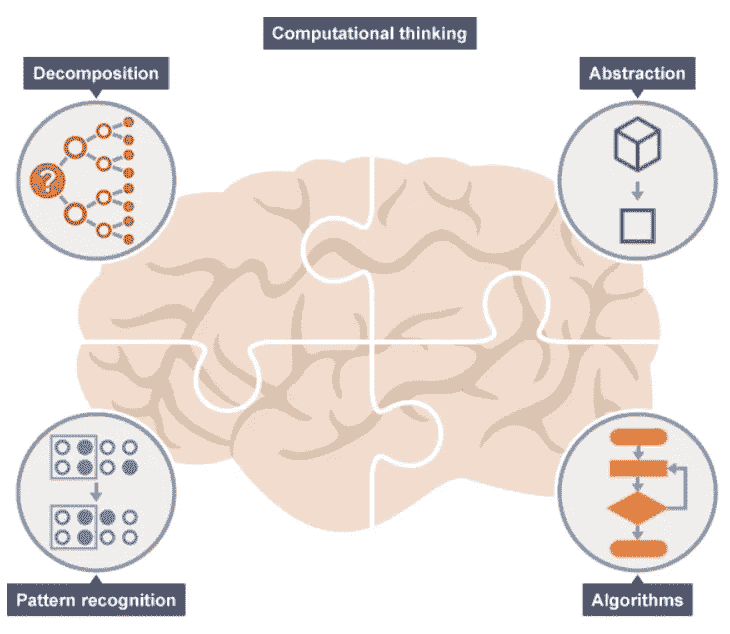
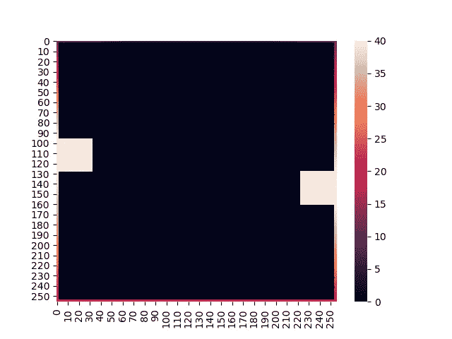
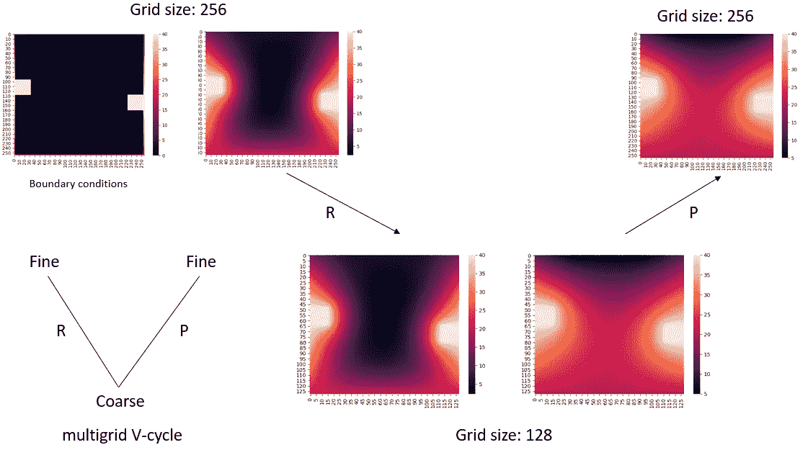

# 使用 Python 的应用计算思维——多重网格方法

> 原文：<https://medium.com/analytics-vidhya/applied-computational-thinking-using-python-multigrid-methods-64c86113e60b?source=collection_archive---------3----------------------->

想象一下，你被要求解决一个复杂的问题，让事情变得更具挑战性的是，你不能使用你通常使用的工具，这有助于解决问题。听起来很有挑战性，对吧？如果没有这一战略，它肯定会失败。在本文中，我们将讨论解决复杂问题的一般过程，即计算思维。

计算思维是用计算机、人类或机器能够有效地执行的方式来表述问题和表达其解决方案的思维过程。

计算思维包括 4 个基本步骤，

1.  **分解**——把一个复杂的问题分解成一个更小的问题。
2.  **模式识别**——寻找问题之间和问题内部的相似性。
3.  **抽象—** 只关注我们真正需要的东西，忽略无关的信息。
4.  **算法**——开发计算机代码来解决问题。

图 1:计算思维

当你不只是在寻找问题的答案，而是寻找问题的最佳答案时，这种计算思维的方法将会很有用。

# **多重网格方法**

在本文中，为了理解计算思维的方法，我们将介绍多重网格方法的概念。我们将使用多重网格方法以非常简单的方式解决拉普拉斯问题。

让我们从单一网格开始，然后我们将移动到多重网格

# **物理问题**

让我们考虑图 1 所示的 2D 物理问题，我们想解决这个问题的拉普拉斯方程。

图 2:物理问题

拉普拉斯方程由下式给出:

设置，

拉普拉斯方程的离散化将看起来像，

解决上述问题的雅可比迭代方法采用以下形式，

# **让我们用 Python 编码**

**边界条件**

我们将在(n×n)网格中离散化区域，并应用边界条件。对于我们的示例，我们将在四个不同的网格(32 x 32)、(64 x 64)、(128 x 128)和(256 x 256)上进行模拟。

我们将使用热图进行可视化。

图 3:带边界条件的网格

让我们编码雅可比步骤，

允许对四个不同的网格进行模拟(雅可比步骤),直到满足模拟标准。

图 32x32 网格(左)和 64x64 网格(右)的模拟结果

图 128x128 网格(左)和 256x256 网格(右)的模拟结果

结果如下:

表 1:模拟结果

从图 4 和图 5 中我们可以清楚地看到，随着网格越来越细，解决方案变得越来越平滑，但这是以计算时间为代价的。同样清楚的是，与较细的网格相比，模拟在较粗的网格上收敛得更快。**因此，现在的问题是，我们有没有什么方法可以减少计算时间，并且仍然可以得到精确的结果，就像我们在更精细的网格上得到的结果一样**？**这不过是计算思维**。要回答这个问题，如果我们在较粗的网格上运行模拟，然后在较细的网格上映射结果，会怎么样？那能行吗？让我们看看！

# **多重网格方法**

在数值分析中，**多重网格法** ( **MG 法**)是一种使用离散化层次来求解微分方程的算法。多重网格的主要思想是加速基本迭代法的收敛。多重网格方法有多种选择，在求解单次迭代的速度和所述迭代的收敛速度之间有不同的折衷。三种主要类型是 V 型循环、F 型循环和 W 型循环。在本文中，我们将使用 V-Cycle。

以下是多重网格方法的基本步骤，

1.  用更细的网格离散化区域。
2.  运行几次 Jacobi 迭代。(预平滑)
3.  将细网格的结果插值到粗网格中。(限制)
4.  运行模拟直到收敛。
5.  将结果插值回更精细的网格。(延长)
6.  再次运行 Jacobi 几次迭代(平滑后)

让我们看看限制和延长的 python 代码是什么样子的，

对于我们的 2D 离散问题，我们将从用(256 x 256)网格离散化区域开始，运行模拟几次迭代，将结果插值到较粗的网格(128 x 128)，运行模拟直到收敛，将结果插值回较细的网格(256 x 256)，最后再次运行模拟几次迭代。

图 6:多重网格垂直循环

图 7:单一网格(左)和多重网格(右)的模拟结果

表 2:模拟结果

我们可以从表 2 中看到，模拟运行时间是如何减少的。在本文中，我们看到了如何使用计算思维来加速计算运行时间，同时我们也看到了求解微分方程的多重网格方法的工作原理。

这篇文章的灵感来自麻省理工学院的计算思维课程。

如果你更有兴趣看看详细的代码，请到我的 GitHub [上查看 https://GitHub . com/sanghvirajit 19/Laplacian _ Problem/tree/working](https://github.com/sanghvirajit19/Laplacian_Problem/tree/working)

# **结论**

因此，作为计算思想家，我们掌握着如何通过使用较少的计算资源来解决任何复杂的问题，从而获得最佳结果。

# **参考**

[1] [第 18 讲——分层思维、贪婪算法、雅可比方法和多重网格](https://computationalthinking.mit.edu/Fall20/lecture18/)