# 在 Kaggle 数据集上应用计算机视觉技术

> 原文：<https://medium.com/analytics-vidhya/applying-computer-vision-techniques-on-a-kaggle-dataset-ba6d3fb8cc52?source=collection_archive---------3----------------------->


*图片由 Unsplash/ Sean Lim 提供

我们现在有丰富的数据资源来满足我们对学习的渴望。这些数据以不同的形式、包装和交付方式出现。我们在之前的博客中使用了多种方法:

*   一个中等大小的玩具数据集来自 Fast.ai 库[这里](https://becominghuman.ai/testing-the-waters-of-deep-learning-8d687b21bb92)，
*   Fast.ai 库中的大型玩具数据集[这里](/@yrodriguezmd/developing-a-taste-for-deep-learning-241cabb43277)，
*   在此导出外部数据集[，](https://becominghuman.ai/starting-the-dive-into-deep-learning-c57c987cc390)
*   通过网络抓取创建我们自己的数据集[这里](https://becominghuman.ai/feeding-frenzy-in-deep-learning-3e4408bf3170)。

从 Kaggle 获取数据并不像我最初认为的那样是一种轻松的下载-上传方法。我能够找到正确的公式，并决定将数据集应用于深度学习。

对于这个小型项目，我们将展示:

A.如何在 Colab 中使用 Kaggle 数据集，以及

B.如何使用 Fast.ai FastBook 第七课[中描述的标准化、调整大小和测试时间增强计算机视觉技术。](https://colab.research.google.com/github/fastai/fastbook/blob/master/07_sizing_and_tta.ipynb)

所以，打开 Kaggle，和我一起探索吧！

***A .在 Colab*** 中使用 Kaggle 数据集

1.  **在 Kaggle 中选择一个数据集。**

a.如果您还没有帐户，请创建一个。这是免费的，处理速度很快。

b.探索您感兴趣的数据集/竞赛。本博客涉及[计算机视觉/鸟类图像分类](https://www.kaggle.com/gpiosenka/100-bird-species)。

c.为每个类选择一个至少包含 20 幅影像的数据集。否则，您可能会遇到错误。

d.我已经能够使用。jpg 和。图像的 png 格式。如果遇到格式。tfrec，查找原始数据集的链接。

e.请在设置前完成此操作。如果您在设置时分心，您的笔记本电脑运行可能会中断，您将需要重新运行。

*注意*:你可以在 Colab 中看到 Kaggle 数据集的列表，但是，最初的内容检查最好在 Kaggle 网站上完成。

**2。设置。**

a.*笔记本*

你可以在 Kaggle 里运行一个笔记本。但是，对于这次运行，我们将在 Colab 中进行。如果你是 Colab 的新手，请[在这里看步骤 1a-b](https://becominghuman.ai/feeding-frenzy-in-deep-learning-3e4408bf3170)。

如果选择了大数据集，我建议使用 GPU 和高 RAM 运行时间。

*b .安装和进口*

一. Fast.ai 库的一般设置。

在 Colab 笔记本中，运行以下命令:

```
!pip install -Uqq fastbook
import fastbook
fastbook.setup_book()
from fastbook import *
#!pip install fastai -U  # unhash if this is your first use
import fastai
from fastai.vision.all import *
```

二。使用 Kaggle 数据集的特定设置。

*   在 Kaggle 页面中，打开您的“帐户”。

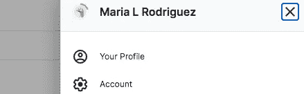

*   创建新的 API 令牌。

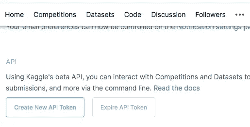

*这会给你一个. json 文件。

*   在您的 Colab 笔记本中，安装 kaggle 并上传 API Token/ kaggle json 文件。

```
!pip install -q kaggle
from google.colab import files
files.upload()
```

*   创建 kaggle 目录并启用访问。

```
!mkdir ~/.kaggle
!cp kaggle.json ~/.kaggle/!chmod 600 ~/.kaggle/kaggle.json
```

**3。收集您的数据。**

*a .下载的代码格式。*

*   ！卡格尔
*   *数据集*或*竞赛*(即在 Kaggle 中，你的集合是来自数据集还是竞赛板块？)
*   下载
*   小路

对于路径，请使用 kaggle.com 后面的 url 部分。例如:

这里使用的 Kaggle 数据集可以在*数据集*集合中找到，url 是:[https://www.kaggle.com/gpiosenka/100-bird-species](https://www.kaggle.com/gpiosenka/100-bird-species)。

```
!kaggle datasets download 'gpiosenka/100-bird-species/train'
```

我指定了 train，但是它还是下载了 train 和验证集。

*b .从下载的 zip 文件中获取单个文件，并在完成后删除 zip 文件。*

```
!unzip \*zip && rm *.zip
```

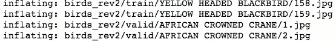

*c .指定路径。*

```
train_path = 'birds_rev2/train'
```

就是这样！不需要创建数据帧或进行任何其他预处理。

***B .先进成像技术的例子。***

如果您想了解成像转换的介绍或复习，请[参考该资源](/@yrodriguezmd/developing-a-taste-for-deep-learning-241cabb43277)。您可以使用您在这里下载的相同数据集，只需稍作修改:从步骤 3 开始，使用(train_path)而不是(path/'images ')。

我们将看看标准化、调整大小和测试大小增加如何影响从非预训练模型发展而来的学习者的准确性。有关更详细的描述，请参考此处的[和](https://colab.research.google.com/github/fastai/fastbook/blob/master/07_sizing_and_tta.ipynb)。

1.  **基线模型**

```
dblock = DataBlock(
    (ImageBlock(), CategoryBlock()),
    get_items = get_image_files,
    get_y = parent_label,
    splitter = RandomSplitter(seed=42),
    item_tfms = Resize(460),
    batch_tfms = aug_transforms(size=224))
dls = dblock.dataloaders(train_path)
dls.train.show_batch()
```

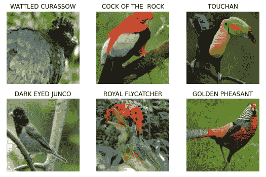

```
dls.train.show_batch(unique=True)
```

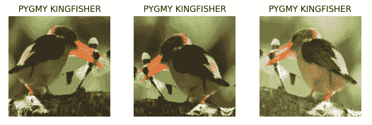

我们可以欣赏一些基线转换，如裁剪，L-R 方向和光线强度。

```
model = xresnet50(n_out = dls.c)
learn_base = Learner(dls, model, loss_func = CrossEntropyLossFlat(),
                     metrics = accuracy)
learn_base.fit_one_cycle(5, 3e-3)
```

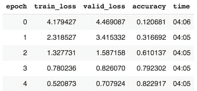

*   [Learner](https://docs.fast.ai/learner.html#Learner) 是 Fast.ai 中组装数据、模型和训练的代码类。
*   [Xresnet](https://docs.fast.ai/vision.models.xresnet.html) 是一个顺序的、非预训练的神经网络。
*   [n_out](https://github.com/fastai/fastai/blob/master/fastai/vision/models/xresnet.py#L22) = dls.c 表示类别或标签的数量。
*   [交叉熵损失](https://pytorch.org/docs/stable/_modules/torch/nn/modules/loss.html#CrossEntropyLoss)是模型能够学习的计算。它来源于类别的预测概率。概率值的范围从 0 到 1。当这些值被转换为[交叉熵](https://machinelearningmastery.com/cross-entropy-for-machine-learning/)时，接近 0 的概率(非常差的预测)变得更加明显，因此受到更多惩罚。
*   [交叉熵损失平](https://docs.fast.ai/losses.html)是对交叉熵损失的重组，以方便处理。
*   虽然计算机需要损失提供的梯度信息，但人类的解释更适合于精度度量。

```
learn_base.lr_find()
```

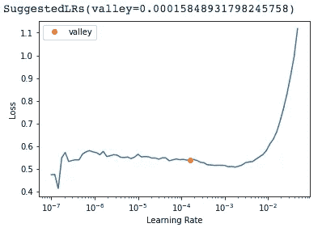

我们的基线学习率是 0.003，根据 lr_find 保持这个比率是合理的。

```
learn_base.show_results()
```

可视化一些基线结果:

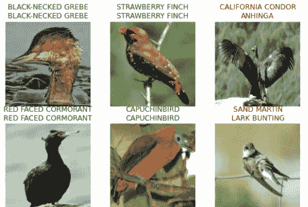

顶部标签是实际值，底部标签是预测值。如果您想了解如何区分标签(实际与预测)，请参考[步骤 6.a 此处](https://becominghuman.ai/feeding-frenzy-in-deep-learning-3e4408bf3170)。

快速的网络搜索可以给我们一些比较的图像来理解学习者不正确的预测。

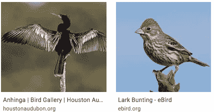

*解释*:使用交叉熵损失和 0.003 的学习率，从零开始训练的基线模型在 5 个时期的学习后给出了 82%的准确度。

**2。应用规范化转换。**

```
dblock = DataBlock(
      (ImageBlock, CategoryBlock),
      get_items = get_image_files,
      get_y = parent_label,
      item_tfms = Resize(460),
      batch_tfms = [*aug_transforms(size=224),
                    Normalize.from_stats(*imagenet_stats)]) #
dls_norm = dblock.dataloaders(train_path, bs=64)
```

让我们浏览一下样本数据，看看数字层面的变化:

```
x, y = dls.one_batch()          # baseline
xn, yn = dls_norm.one_batch()   # normalized
```

基线和标准化的 x 和 y 具有相同的形状:64 个批次项目，3 个 RGB 通道，以及我们指定的 224 x 224 像素大小。

```
print('Non-normalized tensors:', x[0][0][0][:10])
print('Mean:',x.mean(dim = [0,2,3]))
print('Std:', x.std(dim = [0,2,3]))print('Normalized tensors:', xn[0][0][0][:10])
print('Mean:',xn.mean(dim = [0,2,3]))
print('Std:', xn.std(dim = [0,2,3]))
```

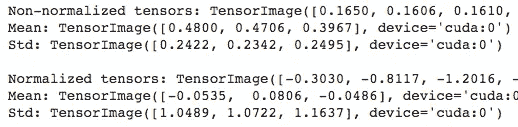

规范化允许将不同的值集合放在相同的范围内，以便进行比较。组平均值为 0，标准偏差为 1。

随着数字的变化，让我们来想象一下效果:

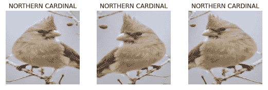

```
model = xresnet50(n_out = dls_norm.c)
learn_norm = Learner(dls_norm, model, loss_func =    CrossEntropyLossFlat(), metrics = accuracy)
learn_norm.fit_one_cycle(5, 3e-3)
```

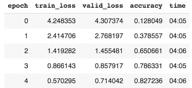

标准化仅产生了最小的改进，可能是因为图像已经相对相似。

可视化一些结果:

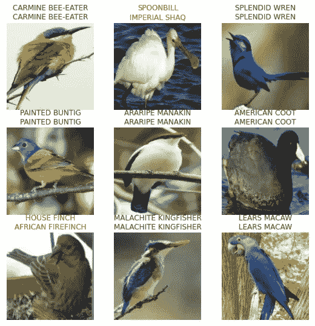

将被错误分类的鸟类与网上的一些资源进行比较，可以发现造成混淆的一些可能原因，尤其是主色和整体形状。


*解释*:使用交叉熵损失和 0.003 的学习率，从零开始训练的标准化模型在 5 个时期的学习后给出 83%的准确度。

**3。应用渐进尺寸**

从一个小尺寸的图像开始训练。

```
dblock = DataBlock(
      (ImageBlock, CategoryBlock),
      get_items = get_image_files,
      get_y = parent_label,
      item_tfms = Resize(460),
      batch_tfms = aug_transforms(size=128)) # start small
dls_128 = dblock.dataloaders(train_path, bs=64)model = xresnet50(n_out = dls_128.c)
learn_128 = Learner(dls_128, model,
                    loss_func = CrossEntropyLossFlat(),
                    metrics = accuracy)
learn_128.fit_one_cycle(2, 3e-3)
```

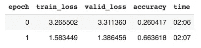

进展到更大尺寸的图像。

```
dblock = DataBlock(
      (ImageBlock, CategoryBlock),
      get_items = get_image_files,
      get_y = parent_label,
      item_tfms = Resize(460),
      batch_tfms = aug_transforms(size=224)) # bigger
dls_224 = dblock.dataloaders(train_path, bs=64)
```

并将新的 dls 应用于先前训练过的学习者。

```
learn_128.dls = dls_224
learn_128.fit_one_cycle(3, 3e-3)
```

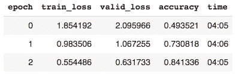

我们可以看到，小规模的初始训练和逐步扩大的训练导致了比基线稍好的准确度(84.1%比 82.3%)。小尺寸图像的运行速度快了一倍(2 分钟对 4 分钟)。

*解释*:在使用交叉熵损失和 0.003 的学习率的 5 个时期的学习之后，从零开始训练的尺寸调整模型给出了 84%的准确度。它还能稍微加快训练速度。

**4。使用测试时间增加(TTA)。**

验证集图像通常经过中心裁剪。不用说，这种默认技术会丢失一些信息。TTA 通过从原始图像的多个区域进行裁剪来解决这个问题。

```
# using the baseline dblock and dls
model = xresnet50(n_out = dls.c)
learn = Learner(dls, model,
                loss_func = CrossEntropyLossFlat(),
                metrics = accuracy)learn.fit_one_cycle(5, 3e-3)preds, targs = learn.tta()
accuracy(preds, targs).item()
```

从基线 0.8251 开始，结果精度为 0.8277。

*解释*:TTA 步骤提供了基线模型 0.2-0.3%的精度改进。

**5。结合这些先进的转换技术。**

对于我们的最终建模，我们将利用渐进的规模，从 128 到 224。我们将使用 fine_tune，默认情况下它执行规范化。我们将把 TTA 应用到学习者身上。

```
dblock = DataBlock(
 (ImageBlock, CategoryBlock),
 get_items = get_image_files,
 get_y = parent_label,
 item_tfms = Resize(460),
 batch_tfms = aug_transforms(size=128))  #

dls_128 = dblock.dataloaders(train_path, bs=64)model = xresnet50(n_out = dls_128.c)
learn_ = Learner(dls_128, model,
                    loss_func = CrossEntropyLossFlat(),
                    metrics = accuracy)
learn_.fit_one_cycle(2, 3e-3)dblock = DataBlock(
      (ImageBlock, CategoryBlock),
      get_items = get_image_files,
      get_y = parent_label,
      item_tfms = Resize(460),
      batch_tfms = aug_transforms(size=224))   #
dls_224 = dblock.dataloaders(train_path, bs=64)learn_.dls = dls_224
learn_.fine_tune(3, 3e-3)  #
```

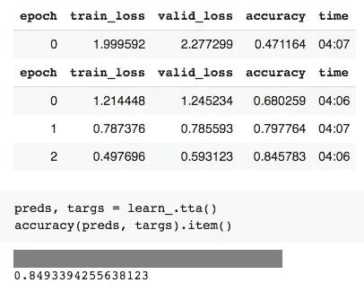

```
interp = ClassificationInterpretation.from_learner(learn_)
interp.most_confused(min_val = 5)
```

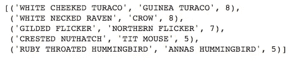

为了进行比较，我们可以说大多数人也会发现这些图像很难区分。

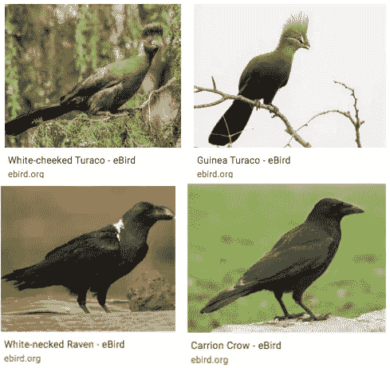

*解释*:使用交叉熵损失和 0.003 的学习率，在 5 个时期的学习之后，从零开始训练并使用渐进调整大小、归一化和 TTA 的最终模型给出了 85%的准确度。对于一般的鸟类分类方案，错误分类被认为是合理的。需要区分物种的学术论文可能会受益于更多的历元运行和使用[区分学习率](/@yrodriguezmd/developing-a-taste-for-deep-learning-241cabb43277)。

**6。让我们来玩吧！**

```
btn_upload = widgets.FileUpload()
btn_upload
```


```
img = PILImage.create(btn_upload.data[-1])
out_pl = widgets.Output()
out_pl.clear_output()
with out_pl: display(img.to_thumb(250))
pred, pred_idx, probs = learn_.predict(img) # rev
lbl_pred = widgets.Label()
lbl_pred.value = f'Prediction: {pred}; Probability: {probs[pred_idx]:.04f}'
btn_run = widgets.Button(description = 'Classify')
btn_rundef on_click_classify(change):
  img= PILImage.create(btn_upload.data[-1])
  out_pl.clear_output()
  with out_pl: display(img.to_thumb(200))
  pred, pred_idx, probs = learn_.predict(img) #rev
  lbl_pred.value = f'Prediction: {pred}; Probability: {probs[pred_idx]:0.4f}'btn_run.on_click(on_click_classify)
btn_upload = widgets.FileUpload()from ipywidgets import *
VBox([widgets.Label('Select the bird you want to identify!'),
      btn_upload, btn_run, out_pl, lbl_pred])
```

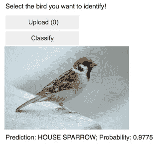

让我们看看如果甘道夫是一只鸟，他会是什么样子——

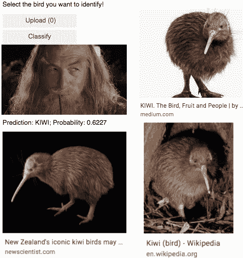

足够接近:0)

***总结:***

我们能够利用 Colab 笔记本中的 Kaggle 数据集。我们使用非预训练模型应用了高级计算机视觉转换，并在验证集上实现了 85%的准确率。

我希望你和我一样开心！

*玛丽亚*

在 LinkedIn 上与我联系:[https://www.linkedin.com/in/rodriguez-maria/](https://www.linkedin.com/in/rodriguez-maria/)

或者在推特上关注我:[https://twitter.com/Maria_Rod_Data](https://twitter.com/Maria_Rod_Data)