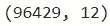
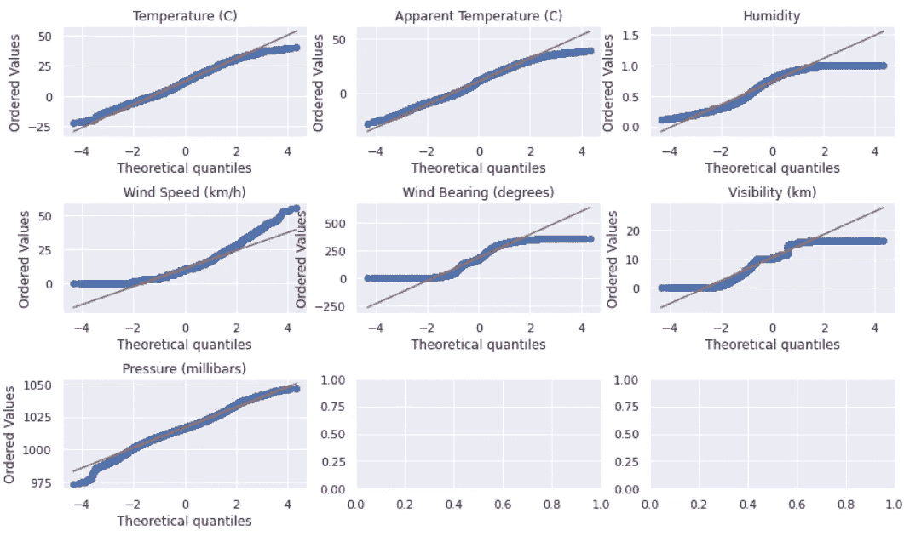

# 对天气数据集应用线性回归

> 原文：<https://medium.com/analytics-vidhya/applying-linear-regression-on-a-weather-data-set-e84901120f88?source=collection_archive---------2----------------------->


图片由 [Mylene2401](https://pixabay.com/users/mylene2401-10328767/?utm_source=link-attribution&amp;utm_medium=referral&amp;utm_campaign=image&amp;utm_content=5298312) 来自 [Pixabay](https://pixabay.com/?utm_source=link-attribution&amp;utm_medium=referral&amp;utm_campaign=image&amp;utm_content=5298312)

本文将讨论如何应用预处理步骤、降维以及为真实数据集构建线性模型。数据集选自 [Kaggle](https://www.kaggle.com/) ，包含 2006 年至 2016 年匈牙利塞格德[地区每小时/每天的真实历史天气数据汇总。](https://en.wikipedia.org/wiki/Szeged?oldformat=true)

[](https://www.kaggle.com/budincsevity/szeged-weather?select=weatherHistory.csv) [## 塞格德 2006-2016 年的天气

### 每小时/每天汇总温度、压力、风速等信息

www.kaggle.com](https://www.kaggle.com/budincsevity/szeged-weather?select=weatherHistory.csv) 

**用例**:湿度和温度有关系吗？湿度和表观温度之间呢？给定湿度，你能预测表观温度吗？

我们将首先使用数据集中最相关的特征来预测表观温度。然后，我们将尝试在只给定湿度的情况下预测表观温度，并计算模型的准确性。

我们将要遵循的步骤如下所述。

*   处理缺失值和异常值
*   转换
*   特征编码
*   标准化
*   维度缩减(使用 PCA)
*   模特培训

**将使用 Jupyter Labs** ，代码将基于它。让我们先添加几个必需的导入。

```
import pandas as pd
from matplotlib import pyplot as plt
import scipy.stats as stats
import numpy as np
import seaborn as sns
```

是时候导入和理解数据集了。

```
df = pd.read_csv('weatherHistory.csv', parse_dates=['Formatted Date'])
print(df.shape)print(df.info())
print(df.describe(include='all'))
```


df.shape


df.info()

我们可以看到总共有 12 列，包括 8 个数字列和 4 个对象类型列。并且 96453 个数据记录是可用的。


df.describe(include='all ')

# 处理缺失值和异常值

## 删除重复项

我们可以看到“格式化日期”列显示了一些重复的日期值。具体时间不可能有两个记录。可以删除这些重复项。我们将保留第一条记录，删除其他记录，删除每个重复的数据行。

```
df = df.drop_duplicates(['Formatted Date'], keep='first')
print(df.shape)
```



df.shape

24 条数据记录因重复而被删除。我们将按“格式化日期”对数据框进行排序，并重置索引。

*注意:我们重置了索引，因为删除数据行也会删除相应的索引值。缺少索引时，会对稍后执行的数据框连接操作产生负面影响。*

```
df.sort_values(by=['Formatted Date'], inplace=True)
df.reset_index(inplace=True, drop=True)
```

## 处理缺失值

在数据框描述中，我们看到“大声覆盖”列下的所有记录都是 0 值。因此，可以删除该列。因为我们不打算执行时间序列分析，所以“格式化日期”列不再有用。然后让我们计算每列的空值百分比。

```
df = df.drop(columns=['Loud Cover', 'Formatted Date'])
print(df.isnull().sum(axis=0) * 100/len(df))
```


df.isnull()。总和(轴= 0)* 100/长度(df)

只有 0.54%的“Precip Type”值为空。因为这是极少量的总数据记录，所以最好删除它们。

```
df = df[df['Precip Type'].notna()]
```

有关缺失值处理的更多详细信息，请参考此[文章](https://towardsdatascience.com/how-to-handle-missing-data-8646b18db0d4)。

## 处理异常值

识别异常值的最佳方法是绘制箱线图并进行分析。我们将使用“seaborn”库并绘制箱线图。

```
sns.set(rc={'figure.figsize':(20,8)}, style='whitegrid')
sns.boxplot(data=df)
```


sns.boxplot(数据=df)

在单独分析每列的箱线图后，可以在名为“湿度”、“风速”和“压力”的三列中识别异常值。其他列可以被认为是倾斜的。


```
df = df[df['Humidity'] != 0.0]
df = df[df['Wind Speed (km/h)'] <= 60]
df = df[df['Pressure (millibars)'] > 0]
df.reset_index(inplace=True, drop=True)
print(df.shape)
```


df.shape

所有识别出的异常值都将被丢弃，数据框索引将被重置。现在数据集中剩下 10 列和 94601 个数据行。

在这篇[文章](/towards-artificial-intelligence/handlingoutliers- in-machine-learning-f842d8f4c1dc)中阅读更多关于机器学习中异常值的内容。

# 转换

**Q-Q 图**和**直方图**可用于识别数据集的任何偏斜度。让我们为所有数字列绘制 Q-Q 图和直方图。

```
fig, axes = plt.subplots(3,3)
plt.subplots_adjust(hspace = 0.4)
for i, column in enumerate(columns[2:9]):
    stats.probplot(df[column], dist="norm", plot=axes[int(i/3)][i%3])
    axes[int(i/3)][i%3].set_title(column)
plt.show()
```



Q-Q 图

```
fig, axes = plt.subplots(3,3)
for i, column in enumerate(columns[2:9]):
    temp_df = pd.DataFrame(df[column], columns=[column])
    temp_df.hist(ax=axes[int(i/3)][i%3])
plt.show()
```


直方图

从这些图表中我们可以看出，

*   “湿度”数据集向左倾斜。
*   “风速”数据集是右偏的。

让我们对这两列进行适当的转换。

```
from sklearn.preprocessing import FunctionTransformer

# squre root transformation for 'Wind Speed'
sqrt_transformer = FunctionTransformer(np.sqrt, validate=True)
data_transformed = sqrt_transformer.transform(df[['Wind Speed (km/h)']])
df[feature_name] = data_transformed# power transformation with power of 2 for 'Humidity'
power_transformer = FunctionTransformer(lambda x: x**2, validate=True)
data_transformed = power_transformer.transform(df[['Humidity']])
df[feature_name] = data_transformed
```

*注:由于“风速”包含 0 值，我们应用了* ***平方根变换*** *。为了平衡，2 次方的* ***次方变换*** *已应用于‘湿度’。阅读这篇* [*文章*](https://heartbeat.fritz.ai/hands-on-with-feature-engineering-techniques-transforming-variables-acea03472e24) *可以更好地理解转换技巧。*

# 特征编码

我们可以在数据集中看到三个分类列，分别是“Precip Type”、“Summary”、“Daily Summary”。让我们使用一键编码对这些列进行编码，因为我们正在训练一个线性模型。

*注意:对于线性模型，建议使用一热编码，而不是标签/整数编码。这背后的原因是标签编码导致在数据集中发现不相关的模式。这是因为当分类值编码为 1、2 等时，模型给予值 2 的权重大于值 1。*

```
df['Precip Type'] = df['Precip Type'].astype('category').cat.codes
encoded_summary = pd.get_dummies(df['Summary'])
encoded_daily_summary = pd.get_dummies(df['Daily Summary'])df = df.join(encoded_summary)
df = df.join(encoded_daily_summary)
df = df.drop(columns=['Daily Summary', 'Summary'])
```

“Precip Type”有两个唯一的值，即 rain 和 snow，它们已被编码为 0 和 1。“Summary”列有 26 个唯一值，在执行一次热编码后，已将其转换为 26 个附加行。“每日摘要”列有 214 个唯一值，在执行一次性编码后，该列已被转换为 214 个额外的行。

这里有一篇很棒的关于分类数据编码的文章。

# 将数据拆分为训练和测试

为了避免数据泄露，我们将对训练和测试数据集分别执行标准化和 PCA。我们将把数据集分成 0.8 比 0.2 的训练和测试。(“表观温度”已被选为预测目标。)

*注意:如果我们同时考虑训练和测试数据集并进行标准化，它也可以通过揭示更多与测试数据集相关的信息来帮助模型。*

```
df_data = df.drop('Apparent Temperature (C)', axis=1)
df_target = pd.DataFrame(df['Apparent Temperature (C)'], columns=['Apparent Temperature (C)'])
x_train, x_test, y_train, y_test = train_test_split(df_data, df_target, test_size=0.2, random_state=42)
```

# 数据缩放/标准化

```
std_columns = ['Temperature (C)',
               'Humidity',
               'Wind Speed (km/h)',
               'Wind Bearing (degrees)',
               'Visibility (km)',
               'Pressure (millibars)']
```

执行标准化时，应该忽略所有编码的列。

```
from sklearn.preprocessing import StandardScaler# for feature data
scaler_train = StandardScaler()
scaler_train.fit(x_train[std_columns])
x_train_scaled = scaler_train.transform(x_train[std_columns])
x_test_scaled = scaler_train.transform(x_test[std_columns])
df_x_train_standardized = pd.DataFrame(x_train_scaled, columns = std_columns)
df_x_test_standardized = pd.DataFrame(x_test_scaled, columns = std_columns)# for target data
scaler_target = StandardScaler()
scaler_target.fit(y_train)
y_train_scaled = scaler_target.transform(y_train)
y_test_scaled = scaler_target.transform(y_test)
df_y_train_standardized = pd.DataFrame(y_train_scaled, columns = ['Apparent Temperature (C)'])
df_y_test_standardized = pd.DataFrame(y_test_scaled, columns = ['Apparent Temperature (C)'])
```

让我们绘制训练数据集的相关矩阵，并尝试识别重要特征。
*注:我们为了容易而忽略了范畴特征。*

```
sns.set(rc={'figure.figsize':(6,6)})
sns.heatmap(df_x_train_standardized.corr(), annot=True)
```


热图—标准化

我们看不出任何特征之间有任何显著的相关性。

# 使用主成分分析(PCA)进行降维

让我们将训练数据放入 PCA 中，并确定最有影响的组件数。

```
from sklearn.decomposition import PCA

pca = PCA()
pca.fit(x_train)
pca.explained_variance_ratio_
```


pca.explained_variance_ratio_

通过分析上面的输出，我们可以保留多达 **11 个组件**。现在，让我们将训练和测试数据放入 PCA 中，并将其减少到 11 个组件。

```
pca = PCA(n_components=11)
pca.fit(x_train)
pca_x_train = pca.transform(x_train)
pca_x_test = pca.transform(x_test)
```

# 模型训练—线性模型

```
from sklearn import linear_model

lm = linear_model.LinearRegression()
model = lm.fit(pca_x_train, y_train)
```

我们已经将训练特征数据和目标数据拟合到线性模型。我们可以说我们现在已经训练好了模型。让我们使用训练特征数据来预测训练目标值，并计算训练准确度。

## 模型评估

```
predictions = lm.predict(pca_x_train)
y_train_pred = pd.DataFrame(predictions, columns=['Predicted Apparent Temperature (C)'])
```

**预测的均方误差(MSE)、均方根误差(RMSE)和解释方差**被计算为模型的精度测量值。

```
from sklearn.metrics import mean_squared_error
from math import sqrt

# Mean Squred Error
mse = mean_squared_error(y_train, y_train_pred)
print('Mean squared error(Train) :', round(mse, 4))

# Root Mean Squared Error
rmsq = sqrt(mean_squared_error(y_train, y_train_pred))
print('Root mean squared error(Train) :', round(rmsq, 4))

# Accuracy
score = lm.score(pca_x_train, y_train)
print('Explained variance of the predictions(Train) :', round(score * 100, 4))
```


训练准确性

我们已经达到了 **98.83%的训练准确率**。现在让我们使用测试特征数据预测测试目标值，并计算
测试精度。

```
predictions = lm.predict(pca_x_test)
y_pred = pd.DataFrame(predictions, columns=['Predicted Apparent Temperature (C)'])# Mean Squred Error
mse = mean_squared_error(y_test, y_pred)
print('Mean squared error(Testing) :', round(mse, 4))

# Root Mean Squared Error
rmsq = sqrt(mean_squared_error(y_test, y_pred))
print('Root mean squared error(Testing) :', round(rmsq, 4))

# Accuracy
score = lm.score(pca_x_test, y_test)
print('Explained variance of the predictions(Testing) :', round(score * 100, 4))
```


测试准确度

我们已经达到了 **98.81%的测试精度**。让我们画出预测的表观温度与实际的表观温度相差多少。

```
sns.set(rc={'figure.figsize':(20,10)})
plt.plot(y_pred[:200], label='Predicted', color='blue')
plt.plot(y_test[:200], label='Actual', color='red')
plt.xlabel('x - axis')
plt.ylabel('y - axis')
plt.title('Predicitons vs Actual')
plt.legend()
plt.show()
```


这里只考虑前 200 条记录。我们可以在这里和那里看到一些偏差。

# 结论

对于我们的线性模型来说，98.81%是一个相当不错的精度水平。湿度与温度和表观温度呈低负相关关系。如果我们试图只给出湿度来预测表观温度，那就不太准确了。

由于温度与表观温度具有非常高的正相关性，我们已经达到了非常高的模型精度。我们可以在不考虑温度的情况下尝试预测表观温度。

# 未来的工作

*   仅给定湿度，预测表观温度。
*   在不考虑温度的情况下预测表观温度。
*   用奇异值分解(SVD)测试模型精度。

# 资源

*   完整的 Jupyter 笔记本解决方案

[](https://github.com/JayaShakthi97/machine-learning/blob/main/Solution_174119U.ipynb) [## jayashakthi 97/机器学习

### 这是理解带有预处理技术的线性回归的笔记本。…

github.com](https://github.com/JayaShakthi97/machine-learning/blob/main/Solution_174119U.ipynb) 

*   天气数据集— Kaggle

[](https://www.kaggle.com/budincsevity/szeged-weather?select=weatherHistory.csv) [## 塞格德 2006-2016 年的天气

### 每小时/每天汇总温度、压力、风速等信息

www.kaggle.com](https://www.kaggle.com/budincsevity/szeged-weather?select=weatherHistory.csv) 

特别感谢 Subha Fernando 博士(Moratuwa 大学高级讲师)对本文创作的指导和激励。