# 多元线性回归在房价预测中的应用

> 原文：<https://medium.com/analytics-vidhya/applying-multiple-linear-regression-in-house-price-prediction-47dacb42942b?source=collection_archive---------3----------------------->

**多元线性回归**是指一种统计技术，用于根据两个或多个变量的值来预测一个变量的结果。它有时简称为多元回归，是线性回归的延伸。我们要预测的变量称为因变量，而我们用来预测因变量的值的变量称为自变量或解释变量。

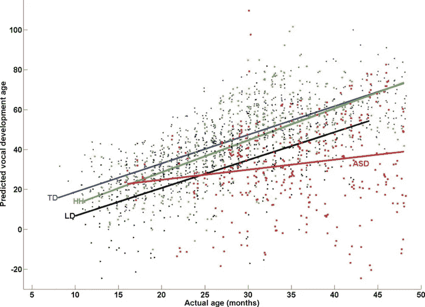

**多元线性回归**用于估计**两个或多个自变量**与**一个因变量**之间的关系。当您想知道以下内容时，可以使用多元线性回归:

1.  两个或多个自变量和一个因变量之间的关系有多强(例如，降雨量、温度和施肥量如何影响作物生长)。
2.  自变量的某个值处的因变量的值(例如，在一定的降雨量、温度和施肥水平下，作物的预期产量)。

# 多元线性回归公式

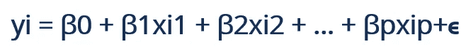

其中:

*   **yi** 是因变量或预测变量
*   **β0** 为 y 截距，即 xi 和 x2 均为 0 时 y 的值。
*   **β1** 和 **β2** 是回归系数，分别代表相对于 **xi1** 和 **xi2** 中一个单位变化的 y 变化。
*   βp 是每个独立变量的斜率
*   **ϵ** 是模型的随机误差(残差)项。

# 多元线性回归的假设

多元线性回归基于以下假设:

**1。因变量和自变量之间的线性关系**

**2。自变量之间相关性不高**

**3。残差的方差是常数**

**4。观察的独立性**

接下来，让我们看看如何使用多元线性回归算法实现房价预测。


**导入库**

```
# Import numpy and pandas package import pandas as pd
import numpy as np # Data visualizationfrom matplotlib import pyplot as plot
import statsmodels.api as sm
import seaborn as sns
```

**读取数据集**

```
data = pd.read_csv(r'Housing.csv')
```

**数据检查**

```
data.head(5)
```

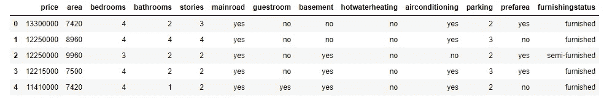

显示前 5 条记录

```
data.info()
```

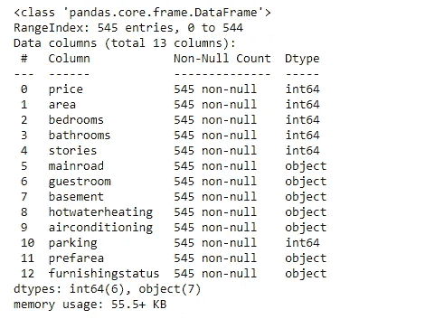

阐释了列的数据类型定义

```
data.describe()
```

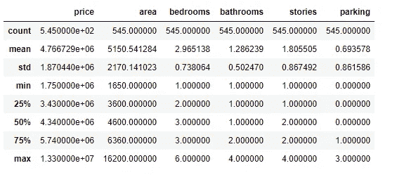

描述数据集的描述性统计数据

```
data.shape()
```

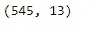

行和列的总数

**数据清理**

检查数据集中是否存在空数据

```
data.isnull().sum()
```

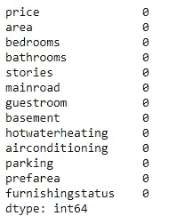

空()检查

最后，数据集中没有空数据。似乎没有必要替换 0 值。

**检测异常值**

> 异常值是远远超出其他观察值的极端值。

创建了单独的函数来检测数据集的异常值。这里使用了使用 Seaborn 库的箱线图。

```
def detectOutliers():
    fig, axs = plot.subplots(2,3, figsize = (10,5))
    plt1 = sns.boxplot(data['price'], ax = axs[0,0])
    plt2 = sns.boxplot(data['area'], ax = axs[0,1])
    plt3 = sns.boxplot(data['bedrooms'], ax = axs[0,2])
    plt1 = sns.boxplot(data['bathrooms'], ax = axs[1,0])
    plt2 = sns.boxplot(data['stories'], ax = axs[1,1])
    plt3 = sns.boxplot(data['parking'], ax = axs[1,2])
    plot.tight_layout()detectOutliers()
```

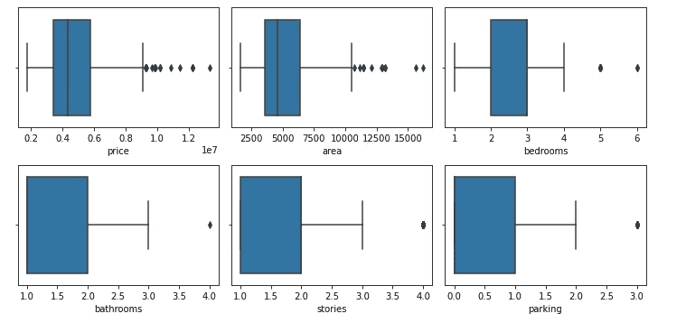

离群点检测

价格和面积有相当大的异常值。下一步是丢弃离群值。

```
# Outlier reduction for priceplot.boxplot(data.price)
Q1 = data.price.quantile(0.25)
Q3 = data.price.quantile(0.75)
IQR = Q3 - Q1
data = data[(data.price >= Q1 - 1.5*IQR) & (data.price <= Q3 + 1.5*IQR)]# Outlier reduction for areaplot.boxplot(data.area)
Q1 = data.area.quantile(0.25)
Q3 = data.area.quantile(0.75)
IQR = Q3 - Q1
data = data[(data.area >= Q1 - 1.5*IQR) & (data.area <= Q3 + 1.5*IQR)]
```

为了验证异常值仍然存在，

```
detectOutliers()
```

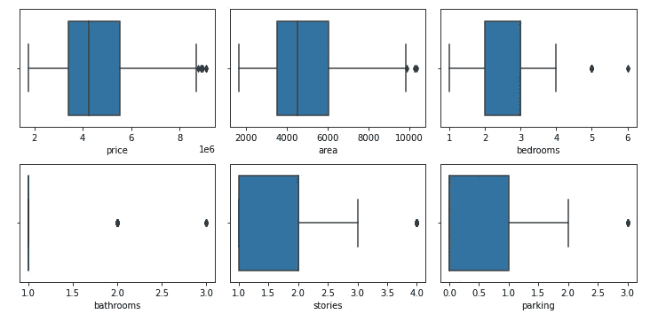

价格和面积中的异常值已移除

**数据可视化**

```
sns.pairplot(data)
plot.show()
```

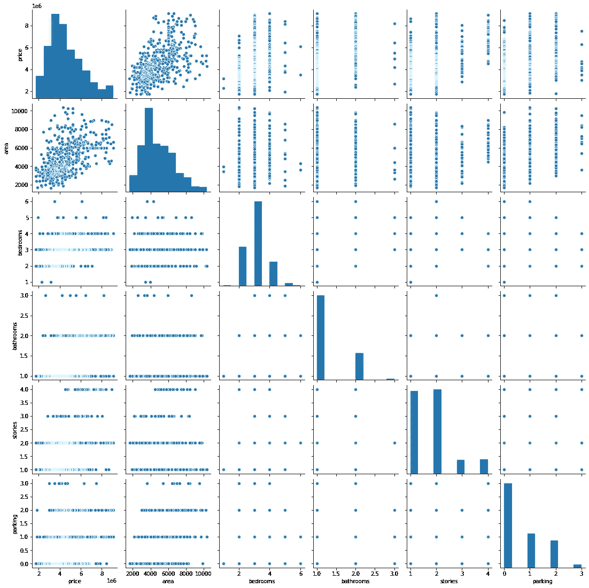

配对图

下一步可视化分类变量

```
plot.figure(figsize=(20, 12))
plot.subplot(3,3,1)
sns.boxplot(x='mainroad', y='price', data=data)
plot.subplot(3,3,2)
sns.boxplot(x='guestroom', y='price', data=data)
plot.subplot(3,3,3)
sns.boxplot(x='basement', y='price', data=data)
plot.subplot(3,3,4)
sns.boxplot(x='hotwaterheating', y='price', data=data)
plot.subplot(3,3,5)
sns.boxplot(x='airconditioning', y='price', data=data)
plot.subplot(3,3,6)
sns.boxplot(x='furnishingstatus', y='price', data=data)
plot.show()
```

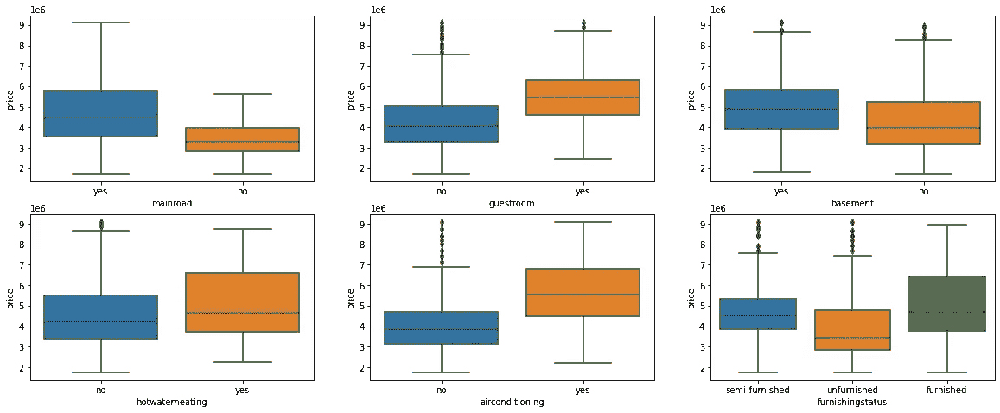

箱线图

**数据准备**

如您所见，分类变量的数据包含是/否、半提供/未提供/提供。

为了使数据符合回归线，我们需要数字数据而不是字符串。所以，需要把那些字符串值转换成 int。

```
def toNumeric(x):
    return x.map({"no":0,"yes":1})def convert_binary():     
    for column in list(data.select_dtypes(['object']).columns):
        if(column != 'furnishingstatus'):
            data[[column]] = data[[column]].apply(toNumeric)convert_binary()
```

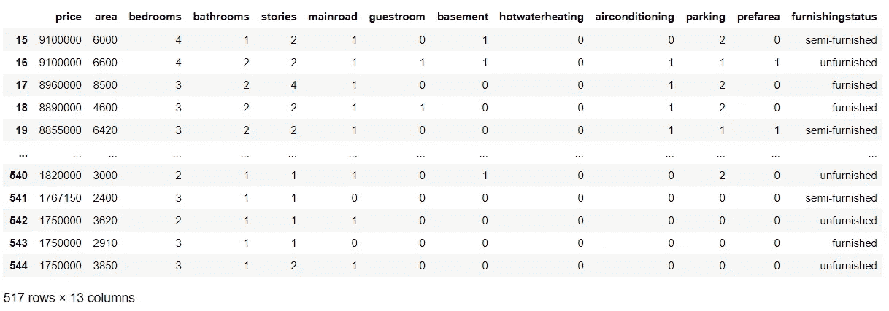

映射的是/否值

接下来，将 furnishingstatus 列拆分为三个级别，即家具/未家具/半家具。为了实现对虚拟变量的需求

```
status = pd.get_dummies(data['furnishingstatus'])
status
```

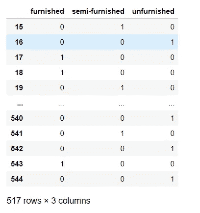

虚拟变量

现在，你不需要三列。您可以删除`furnished`栏，因为只需最后两栏即可识别家具的类型，其中

*   `00`将对应`furnished`
*   `01`将对应`unfurnished`
*   `10`将对应于`semi-furnished`

删除第一列家具

```
status = pd.get_dummies(data['furnishingstatus'], drop_first=True)
```

如下连接状态和主数据帧，

```
data = pd.concat([data, status], axis=1)
```

取消不再需要的色谱柱配置状态。

```
data.drop(columns='furnishingstatus',inplace=True)
```

经过所有更改后，数据框看起来像这样

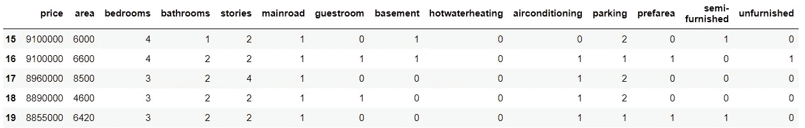

数据清理后

包括 X 数据框中除价格以外的字段。对于 Y，只包括价格字段。

```
Y = data.price# includes the fields other than prices
X = data.iloc[:,1:]
```

**多重共线性**

*当回归模型中的两个或多个独立变量高度相关时，会出现多重共线性。*

> 让我从我们的日常生活中举一个简单的例子来解释这一点。科林喜欢边嚼薯片边看电视。他看的电视越多，吃的薯条就越多，就越开心！
> 
> 现在，如果我们可以量化快乐，并在科林忙着做他最喜欢的活动时测量他的快乐，你认为哪个会对他的快乐产生更大的影响？吃薯片还是看电视？这很难确定，因为当我们试图通过吃薯片来衡量科林的快乐时，他开始看电视。当我们试图通过看电视来衡量他的快乐时，他开始吃薯片。
> 
> 对科林来说，吃薯片和看电视是高度相关的，我们无法单独确定这些活动对他的快乐的影响。这就是多重共线性问题！

```
from sklearn.preprocessing import MinMaxScaler
from statsmodels.stats.outliers_influence import variance_inflation_factor
def preprocessing(X):    
    scaler = MinMaxScaler()
    X_scaled = scaler.fit_transform(X)
    variables = X_scaled
    vif = pd.DataFrame()
    vif["VIF"] = [variance_inflation_factor(variables, i) for i in range(variables.shape[1])]
    vif["Features"] = X.columns
    print(vif)
```

通过变量检查多重共线性是否存在，

```
preprocessing(X)
```

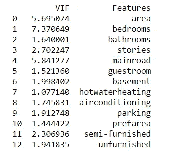

多重共线性-I

根据经验，大于 5 的 VIF 值意味着非常严重的多重共线性。从以上结果来看，区域和卧室具有严重的共线性。

我们需要删除这些列，并确认共线性仍然存在。

```
X.drop(['area','bedrooms'], axis=1, inplace=True)
preprocessing(X)
```

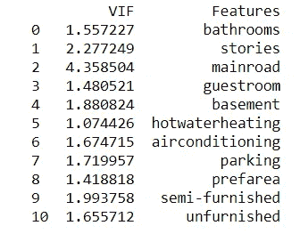

多重共线性-II

最后，数据集中不存在多重共线性。因此，我们可以继续下一步，拆分训练集和测试集。

**将数据分成训练集和测试集**

将 X 和 Y 应用于训练和测试数据集，各自的坐标为 x_train & x_test。

```
from sklearn.model_selection import train_test_split
x_train,x_test,y_train,y_test = train_test_split(X,Y,test_size = 0.25,random_state=355)
```

创建线性回归模型参考。使用参考值，用训练数据拟合直线。现在，为了提供训练，我们已经准备好了数据集，这意味着我们将使我们的回归模型适合训练集。

```
from sklearn.linear_model import LinearRegression
regression = LinearRegression()
regression.fit(x_train,y_train)
```

作出预测

```
y_predict = regression.predict(x_test)
```

绘制 y_test 和 y_pred 以了解价差。

```
plot.scatter(y_test,y_predict)
fig.suptitle('y_test vs y_pred', fontsize=20)             
plot.xlabel('y_test', fontsize=18)                        
plot.ylabel('y_pred', fontsize=16)
```

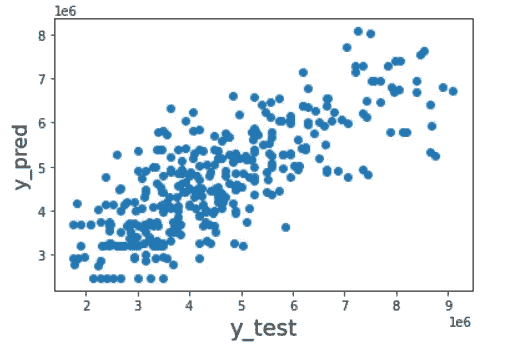

y_test vs y_pred

```
import statsmodels.api as sms
model_1 = sms.OLS(y_train, x_train).fit()
model_1.summary()
```

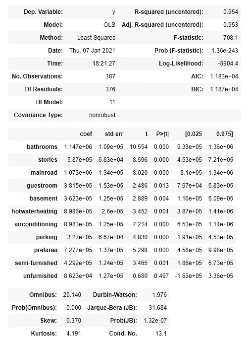

统计汇总

该模型具有更高的 R 平方值(0.954)，这意味着该模型解释了更多的方差，并为数据提供了更好的拟合。

希望大家对如何实现多个自变量的线性回归模型有所了解。

我们将在接下来的几天里赶上另一个有趣的话题。

快乐学习:)