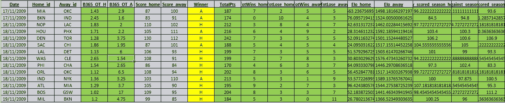
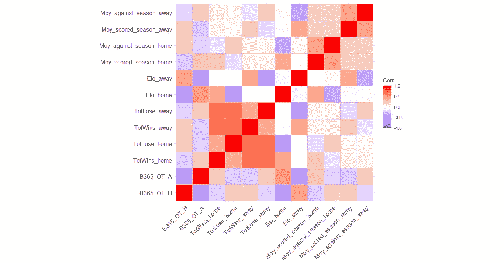
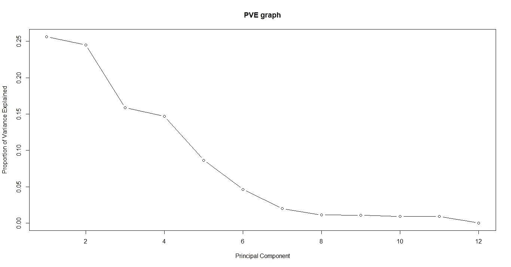
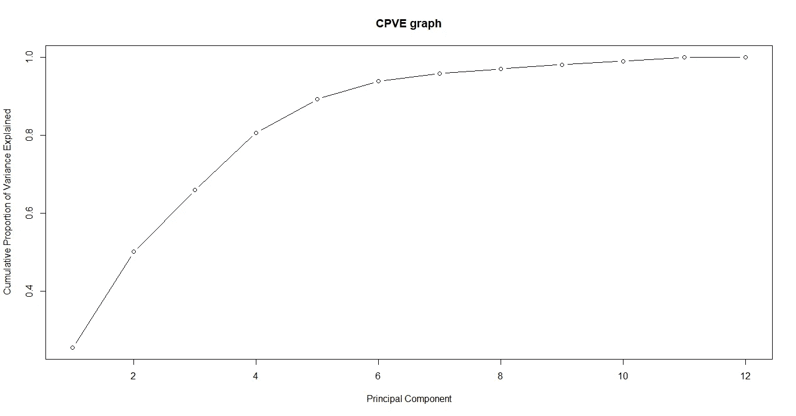

# 在 R 中应用主成分分析

> 原文：<https://medium.com/analytics-vidhya/applying-pca-in-r-e41468c94f15?source=collection_archive---------24----------------------->

> 并最终导出模型

PCA 是一种强大的机器学习技术，可用于多种任务:数据可视化、数据分析和探索、减少数据集的差异、增加信噪比，甚至创建适合机器学习和深度学习训练的数据集。

然而，对于许多人来说，潜在的概念和实现似乎遥不可及，有时是因为这种技术没有被很好地引入。关于理论部分，我建议阅读一些学术著作，如 *ISLR* [1]。《T2》《ISLR》是一本特别的教科书，希望学习统计知识的人可以使用。本文将通过一个简单的例子介绍在 *R* 中的实现、语法和应用的可能性。

0 —我们将使用的数据

I —安装 PCA 并保存部件

II —我们以后应用它的例子

三、结论

**0 —我们将使用的数据**

我们将使用的数据可以在[2]中找到。它由 12054 场 *NBA* 比赛，以及日期、最终结果和体育分析中常用的几个预测变量(输赢记录、攻防表现)组成。这只是一个示例数据集，显然我要展示的代码与这个特定的数据集无关。数据集如下所示:

图 1:数据集概述(绿色为预测变量，黄色为结果，灰色为杂项信息)

相关矩阵如下图所示，我们可以观察到一些变量非常相关。相同的信息在数据集中出现多次:

图 2:训练集中预测变量的相关矩阵

首先，我们导入库，加载数据集，并只选择感兴趣的变量，即预测变量。我们还将数据集分为训练集和测试集(这对于现实生活中的应用更现实)，以展示我们如何将 PCA 应用于新数据(测试集):

图 3:加载数据，选择感兴趣的变量并绘制相关矩阵

*注意:完整代码可从【3】*获得

**I —安装 PCA 并保存组件**

下面的代码允许我们构建 PCA 对象。参数'*标度*是对应于我们是否希望在拟合 PCA 模型之前缩放变量的布尔值。人们普遍承认，在处理不在同一单位的变量时，这是一个好主意。然后，我们可以绘制出我们制造的每台电脑中解释的方差比例( *PVE* )，并最终得出累积 PVE。我们最终将 PCA 组件保存为。 *csv* 对象。这些对象基本上是矩阵，当我们想应用 PCA 而不必每次都去适应它时，这些对象是有用的(见下一节对新数据的预测)。

图 4:在创建的每个主成分中解释的方差比例

图 5:累积 PVE 图

图 6:拟合 PCA，绘制 PVE 和 CPVE 图，保存 PCa 的对象

**II —我们稍后应用它的示例**

一旦我们构建了 PCA 模型并保存了它的组件，我们就可以使用它们将 PCA 应用于新数据。我们简单地将 *scale()* 函数用于保存的组件，并通过矩阵乘法完成 PCA 应用。最后两行断言我们已经正确地完成了计算:

图 7:对新数据应用 PCA，断言我们正确地计算了数据

**三—结论**

我们已经展示了如何用 *R* 编程语言构建、训练和导出 PCA 对象。此外，我们还展示了如何在训练集的每个构建组件中绘制解释的方差(PVE)的比例。

不要犹豫，留下任何反馈/问题/ *掌声*或联系我获取更多信息。

**另一篇文章** *(用机器学习构建体育博彩算法)* [新冠肺炎如何阻止我在 2020 年成为百万富翁|作者 sébastien Cararo | Analytics vid hya | 2020 年 12 月| Medium](/analytics-vidhya/how-covid-19-prevented-me-from-being-a-millionnaire-in-2020-5b2144e8bdef)

**联系人:** sebcararo@hotmail.fr

**来源**

[1] *ISLR*

[(PDF)R 中的统计学习及其应用介绍(ISLR 第六版)| ym Xue—Academia.edu](https://www.academia.edu/38159350/An_Introduction_To_Statistical_Learning_with_Applications_in_R_ISLR_Sixth_Printing_)

[2]数据集位置

[https://raw . githubusercontent . com/SEB 943/PCA _ and _ ML _ R/main/Data/Example _ dataset . CSV](https://raw.githubusercontent.com/Seb943/PCA_and_ML_R/main/Data/Example_dataset.csv)

[3]代码位置

[PCA _ and _ ML _ R/PCA _ in _ R . R at main SEB 943/PCA _ and _ ML _ R(github.com)](https://github.com/Seb943/PCA_and_ML_R/blob/main/Codes/PCA_in_R.R)