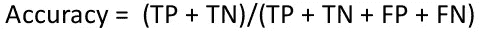
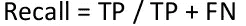

# 了解分类模型的评估指标——案例重要性。

> 原文：<https://medium.com/analytics-vidhya/appreciating-evaluation-metrics-for-classification-models-with-case-importance-86f40a1a097f?source=collection_archive---------12----------------------->

一个晴朗的日子，我在报纸上看到关于印度新冠肺炎阳性和阴性病例的新闻，报道说无症状的人(没有任何新冠肺炎症状)也获得了新冠肺炎阳性检测结果，他们被隔离在家或转移到护理中心。我想知道诊断这种疾病的设备和工具是如何给出实际结果的，它们可能是错的，也可能是真的。他们的诊断有百分之多少是正确的。我决定寻找数据科学中的评估指标，以便更好地理解这一点。

**什么是评估指标？**

假设我们为你的分类任务建立了多个模型，在这里预测一个人是否会患疾病，但我如何决定哪一个更好？

我如何知道我的模型表现如何？它在预测结果方面有多好？

所有这些问题都可以借助评估指标来回答。

**混乱矩阵**

混淆矩阵是用于评估分类模型性能的 P×P 矩阵，其中 P 是目标类别的数量。该矩阵将实际目标值与机器学习模型预测的目标值进行比较。

对于二进制分类问题，我们将有一个 2 x 2 矩阵，如下所示，有 4 个值:

一个好的模型是 TP 和 TN 比率高，而 FP 和 FN 比率低的模型。

**精度**

这是在真实预测中实现的正确性的一种度量。简而言之，它告诉我们，在所有积极的预测中，有多少预测实际上是积极的。

对于分类问题的评估，准确性是一个有效的选择，这些问题是平衡的，没有偏斜，或者没有类别不平衡。

***案例重要性-*** *在评估模型的整体性能时，可以考虑准确性，假设有 100 封邮件，其中 98 封不是垃圾邮件，2 封是垃圾邮件，而我们的模型预测所有邮件都不是垃圾邮件，那么我们的模型有 98%的准确性，但我们在现场的实际结果并不好，因为假阴性(在我们的情况下不是垃圾邮件)可能携带一些强编码病毒，可能会影响我们的财务应用程序。*

*我们需要了解成本评估的其他指标。*

**精度**

这是在真实预测中实现的正确性的一种度量。简而言之，它告诉我们，在所有积极的预测中，有多少预测实际上是积极的。

当我们想要非常确定我们的预测时，精度是评估度量的有效选择。

***案例重要性****——当误报的成本很高时，精确度很有帮助。所以我们假设问题涉及到脑瘤的检测。如果我们有一个精度非常低的模型，那么许多患者将被告知他们患有肿瘤，这将包括一些误诊。许多额外的测试和压力都岌岌可危。当假阳性过高时，那些监测结果的人在受到假警报的轰炸后会学会忽略它们。*

**召回/灵敏度**

它是对正确预测的实际观测值的度量，即有多少正类观测值实际上被预测为正。

也就是所谓的敏感。当我们想要捕捉尽可能多的正面信息时，召回是评估指标的有效选择。

***案例重要性****——漏报成本高时召回有帮助。如果我们需要探测来自一个愚蠢国家的核导弹呢？假阴性会带来毁灭性的后果。如果做错了，我们都难逃一死。当假阴性频繁出现时，我们会受到我们想要避免的事情的打击。*

**特异性**

有多少实际的负数据点被模型识别为负的。

特异性值越高，意味着真阴性值越高，假阳性率越低。特异性的较低值意味着真阴性的较低值和假阳性的较高值。

**F1 得分**

F1 分数是一个介于 0 和 1 之间的数字，是精确度和召回率的调和平均值。

F1 分数在某种程度上保持了分类器的精确度和召回率之间的平衡。如果你的准确率低，F1 就低，如果召回率又低，你的 F1 分数就低。

我们使用调和平均值，因为它对非常大的值不敏感，不像简单平均值。

也就是说，良好的 F1 分数意味着您的误报率和漏报率较低，因此您可以正确识别真正的威胁，并且不会受到误报的干扰。F1 的分数为 1 时被认为是完美的，而当分数为 0 时，模型就是彻底的失败。

**受试者工作特性(ROC 曲线)**

ROC 曲线(接收器操作特征曲线)是显示分类模型在所有分类阈值下的性能的图表。该曲线绘制了两个参数:

1.  真阳性率- TP /总阳性率
2.  假阳性率— FP /总阴性

ROC 曲线绘制了 TPR 对不同分类阈值的 FPR。降低分类阈值会将更多的项目分类为阳性，从而增加假阳性和真阳性。下图显示了典型的 ROC 曲线。

**AUC:ROC 曲线下面积**

**AUC** 代表“ROC 曲线下面积”也就是说，AUC 测量整个 ROC 曲线下的整个二维面积

AUC 提供了对所有可能的分类阈值的综合绩效衡量。解释 AUC 的一种方法是将模型对随机正例的排序高于随机负例的概率。

AUC 值的范围从 0 到 1。预测 100%错误的模型的 AUC 为 0.0；预测 100%正确的一个具有 1.0 的 AUC

**结论:-**

所有的模型都有些错误，但有些是有用的。也就是说，所有的模型都会产生一些假阴性，一些假阳性，可能两者都有。

虽然我们可以调整模型以最小化其中一个或另一个，但我们经常面临权衡，即假阴性的减少会导致假阳性的增加，反之亦然。

我们需要优化对您的特定问题最有用的性能指标。