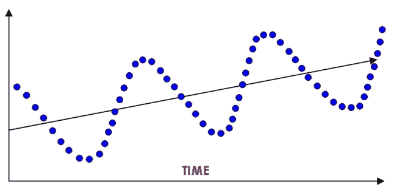

# 时间序列分析方法

> 原文：<https://medium.com/analytics-vidhya/approaches-for-time-series-analysis-db27fe252c70?source=collection_archive---------6----------------------->

**STEPAR(逐步自回归)**

这里，我们将时间趋势模型拟合到序列中，并取每个值与估计趋势之间的差值。这个过程称为去趋势。然后，使用自回归模型拟合剩余的变化。在接下来的部分中，我们将了解自回归模型。

**指数级**

指数平滑预测是对综合移动平均过程的预测；然而，加权参数是由用户指定的，而不是从数据中估计的。一般来说，较小的平滑权重适用于趋势缓慢变化的序列，而较大的权重适用于趋势快速变化的不稳定序列

**温特斯法**

温特斯方法使用类似于指数平滑的更新方程来拟合模型的参数。

**xt=(a+bt)s(t)+ ϵt**

其中 a 和 b 是趋势参数，函数 s(t)选择季节参数。

**随机过程**

随机或随机过程是按时间顺序排列的随机变量的集合。连续随机过程的一个例子是心电图，离散随机过程的一个例子是 GDP。

**在什么意义上可以把 GDP 看成一个随机过程？**

以 1970 年 28728 亿美元的国内生产总值为例，理论上，1970 年第一季度的国内生产总值可以是任何数字，这取决于当时的经济和政治环境。2872.8 这个数字是所有这些可能性的具体实现。你可以把 28728 亿美元的数值想象成 1970 年第一季度 GDP 所有可能数值的平均值。正如我们使用样本数据来推断总体一样，在时间序列中，我们使用实现来推断潜在的随机过程。

**平稳随机过程**

如果一个随机过程的均值和方差随时间保持不变，并且两个时间段之间的协方差的值仅取决于两个时间段之间的距离或间隙或滞后，而不取决于计算协方差的实际时间，则称该随机过程是平稳的。这样一个时间序列将趋向于回到它的均值(称为均值回归)，围绕这个均值的波动(用它的方差来衡量)将有一个大致恒定的幅度。如果一个时间序列在刚刚定义的意义上不是平稳的，则称之为非平稳时间序列。

**为什么平稳时间序列如此重要？**

如果时间序列是非平稳的，那么每组时间集数据将有其自身的特征。所以我们不能将一个集合的行为推广到其他集合。

非平稳过程:方差在变化

非平稳过程:均值在变化

这是一种非平稳过程。随机行走这个术语经常被拿来和醉汉的行走相比较。离开酒吧，醉汉在时间 t 移动随机距离 ut，并且继续无限地走，最终将离酒吧越来越远。股票价格也是如此。今天的股价等于昨天的股价加上一次随机震荡。有两种类型的随机漫步:

无漂移随机行走(无常数项):其中 ut 是白噪声误差项，均值= 0，方差= σ2

有漂移的随机游走(有漂移参数):其中δ是漂移参数

**无漂移随机行走**

**带漂移的随机游走(δ = 0.06)**

**单位根问题**

用 **Yt= ρY(t-1)+ut，**表示的随机过程，其中 **0≤ρ≤1，**称为单位根随机过程。如果ρ实际上是 1，我们就面临所谓的单位根问题，即过程是非平稳的；我们已经知道，在这种情况下，Yt 的方差不是平稳的。单位根这个名称是因为ρ=1。因此，术语非平稳性、随机游动和单位根可以视为同义词。然而，如果，如果 **|ρ|≤1，**即ρ的绝对值小于 1，则可以表明时间序列 Yt 是平稳的。在实践中，找出一个时间序列是否有单位根是很重要的。

**单位根过程(ρ = 1):非平稳**

**单位根过程(-1 < ρ < 1):平稳**

把它们放在一起

平稳和非平稳随机过程(或时间序列)之间的区别对于在构建的时间序列中观察到的趋势(所考虑的时间序列的缓慢长期演变)是确定性的还是随机的具有至关重要的影响。一般来说，如果一个时间序列中的趋势是完全可预测且不可变的，我们称之为确定性趋势，而如果是不可预测的，我们称之为随机趋势。为了使定义更加正式，请考虑以下 Yt 时间序列模型:

**案例 1:纯随机漫步**

如果 **β1=0，β2=0，β3=1** ，我们得到， **Yt= Y(t-1)+ ut** 它只不过是一个没有漂移的 RWM，因此是非平稳的。再次，**δYt =(Yt—Y(t-1))= ut**哪个是静止的。因此，没有漂移的 RWM 是一个差分平稳过程。

**情况 2:具有漂移的随机行走**

如果 **β1≠0，β2=0，β3=1** ，我们得到， **Yt= β1+Y(t-1)+ ut** 这是一个有漂移的 RWM，因此是非平稳的。再次，**δYt =(Yt—Y(t-1))=β1+ut**这意味着 Yt 会呈现正 **(β1 > 0)** 或负 **(β1 < 0)** 的趋势。这样的趋势被称为随机趋势。这又是一个差分平稳过程，因为**δYt**是平稳的。

**情况 3:确定性趋势**

如果 **β1≠0，β2≠0，β3=0，**我们得到， **Yt=β1+ β2 t+ ut** 这叫趋势平稳过程。虽然过程 **β1+ β2** t 的均值不是常数，但它的方差是。一旦知道了β1 和β2 的值，就可以很好地预测平均值。因此，如果我们从 Yt 中减去平均值，得到的序列将是平稳的，因此称为趋势平稳。这种去除(确定性)趋势的过程称为去趋势。

**案例 4:具有漂移和确定性趋势的随机游走**

如果 **β1≠0，β2≠0，β3=1，**我们得到， **Yt=β1+ β2 t+Yt-1+ ut** 我们有一个有漂移的随机游走和一个确定的趋势。**δYt =(Yt—Y(t-1))=β1+β2t+ut，**这意味着 Yt 是非平稳的。

**情况 5:具有稳定成分的确定性趋势**

如果 **β1≠0，β2≠0，β3 < 1，**我们得到， **Yt=β1+ β2 t+β3 Yt-1+ ut** 它围绕一个确定性的趋势是平稳的。

**确定性趋势对随机趋势**

**我们如何检验时间序列是否平稳？**

到目前为止，我们所有人可能对平稳随机过程的本质及其重要性都有了很好的了解。大致有三种方法可以确定所考虑的时间序列是否是平稳的。第一种方法是绘制时间序列并查看图表。在前几个主题中，我们已经看到了非平稳序列是什么样子的。例如，如果图表显示上升趋势，这表明数据的平均值正在变化。这可能表明数据是不稳定的。这种直观的感觉是更正式的平稳性测试的起点。检验平稳性的其他方法是自相关函数或相关图和单位根检验。

**什么是自相关函数或相关图？**

自相关是指时间序列与其过去和未来值的相关性。一阶自相关系数是第一个 **N — 1 个**观测值 **x1，x2，x3，…，x(N—1)**和下一个 **N — 1 个**观测值 **x2，x3，x4，…，xN 的简单相关系数。**同样，我们可以定义更高阶的自相关系数。所以对于不同的阶或滞后，我们会得到不同的自相关系数。因此，我们可以将自相关系数定义为滞后的函数。这个函数称为自相关函数，它的图形表示称为相关图。

经验法则是计算时间序列长度的三分之一到四分之一的 ACF。任何自相关系数的统计显著性都可以通过其标准误差来判断。Bartlett 已经证明，如果一个时间序列是完全随机的，也就是说，它表现出白噪声，样本自相关系数遵循均值= 0 和方差= 1/样本大小的正态分布。

**单位根检验**

正如我们从单位根随机过程中学到的

**Yt= ρY(t-1)+ut，**其中 **-1≤ρ≤1** 。我们还知道，在单位根的情况下，ρ=1。出于理论原因，我们将等式转换如下:

**Yt — Y(t-1)=(ρ-1) Y(t-1)+ ut。或者，δYt =δY(t-1)+ut**

其中 **δ=(ρ-1)，δ**是第一个差分算子。

这里，我们将检验零假设，即δ=0，即ρ=1，这意味着所考虑的时间序列是非平稳的。

现在的问题是，在零假设下，yt1 估计系数的 t 值即使在大样本中也不遵循 t 分布。Dickey 和 Fuller 已经证明，在零假设下，yt1 系数的估计 t 值遵循τ (Tau)统计量。为了纪念发现者，这个测试被称为迪基-富勒(DF)测试。在进行 DF 测试时，我们假设误差项 ut 是不相关的。但是如果 ut 是相关的，Dickey 和 Fuller 开发了一种测试，被称为增强的 Dickey-Fuller(ADF)测试。

**单位根检验的问题**

除了 ADF，还有其他的单位根检验。包括 ADF 在内的这些测试都有局限性。大多数 Dickey Fuller 类型的检验倾向于接受单位根的零值，这种情况比所保证的更频繁。也就是说，即使不存在单位根，这些测试也可以找到单位根。

我们如何转换一个非平稳的时间序列？

**差分平稳过程(DSP):** 如果一个时间序列有单位根，那么这个时间序列的一阶差分就是平稳的。

**趋势平稳过程(TSP):** 趋势平稳过程在趋势周围是平稳的。因此，使这样一个时间序列平稳的最简单的方法是对它进行时间回归，然后回归的残差将是平稳的。

应该指出的是，如果一个时间序列是 DSP，但我们把它当作 TSP，这被称为欠差分。另一方面，如果一个时间序列是 TSP，但是我们把它当作 DSP，这就叫做过差分。这些类型的规范错误的后果可能是严重的。

**综合随机过程**

如果一个时间序列必须微分一次才能使其平稳，我们就对这样的时间序列进行一阶积分。类似地，如果一个时间序列必须差分两次(即取第一次差分中的第一次差分)才能使其平稳，我们称这样的时间序列为 2 阶积分。比如纯随机游走是非平稳的，但是它的一阶差分是平稳的。所以我们称无漂移随机行走为一阶积分。一般来说，如果一个(非平稳的)时间序列必须被微分 d 次才能使其平稳，那么这个时间序列就被称为是 d 阶的积分，记为 Yt∞I(d)。如果一个时间序列在开始时是平稳的，那么我们说它是零阶积分。大多数经济时间序列一般为 I(1)；也就是说，它们通常只有在求一阶差分后才会变得稳定。

**现在我们如何预测？**

在预测之前，我们需要对时间序列进行建模。如果一个时间序列是平稳的，我们可以用多种方法来建模。

**自回归(AR)过程**

设 Yt 表示 t 时刻的 GDP，如果我们将 Yt 建模为:**(Yt-δ)= a1(Yt-1-δ)+ut**其中δ是 Y 的均值，ut 是均值为零、方差为常数σ2 的不相关随机误差项，那么我们说 Yt 遵循一阶自回归或 AR(1)随机过程。这里，时间 t 处的 Y 值取决于其在前一时间段的值和随机项；Y 值表示为与其平均值的偏差。这里，时间 t 处的 Y 值取决于其在前一时间段的值和随机项；Y 值表示为与其平均值的偏差。一般来说，我们可以有一个 AR(p)如下:

**(Yt-δ)= a1(Yt-1-δ)+a2(Yt-2-δ)+…+AP(Yt-p-δ)+ut**

**移动平均线(MA)过程**

假设我们将 Y 建模为: **Yt = μ + bout + b1ut-1**

其中，μ是常数，与之前一样，u 是白噪声随机误差项。这里，t 时刻的 Y 等于常数加上当前和过去误差项的移动平均值。因此，在目前的情况下，我们说 Y 遵循一阶移动平均，或 MA(1)过程。更一般地，MA(q)过程表示为:

**Yt =μ+bout+b1ut-1+b2ut-2+…+bqut-q**

简而言之，移动平均过程只是白噪声误差项的线性组合。

**自回归移动平均(ARMA)过程**

当然，很有可能 Y 同时具有 AR 和 MA 的特性，因此是 ARMA。因此，Yt 遵循 ARMA(1，1)过程，如果它可以写成:

**θ + a1Yt-1 + bout + b1ut-1**

其中θ代表常数项。这个表达式也可以推广到 ARMA(p，q)过程。

**自回归综合移动平均(ARIMA)过程**

在最后一节中，我们学习了 d 阶的积分随机过程，这意味着我们必须对一个时间序列求 d 次差才能使它平稳。所以，给定一个时间序列，我们首先要对它求差，然后应用 ARMA(p，q)对它建模。然后我们说原始时间序列是 ARIMA(p，d，q)。因此，ARIMA(2，1，2)时间序列在其变得平稳之前必须被差分一次(d=1 ),并且(第一次差分的)平稳时间序列可以被建模为 ARMA(2，2)过程，即，它具有两个 AR 和两个 MA 项。当然，如果 d=0(即一个序列开始时是平稳的)，ARIMA(p，d=0，q)= ARMA(p，q)。注意，ARIMA(p，0，0)过程意味着纯 AR(p)平稳过程；ARIMA(0，0，q)表示纯 MA(q)平稳过程。给定 p、d 和 q 的值，就可以知道正在模拟什么过程。

**盒子–詹金斯方法**

B–J[Box–Jenkins]的目标是识别和估计可以解释为生成样本数据的统计模型。如果这个估计的模型用于预测，我们必须假设这个模型的特征在一段时间内是不变的，特别是在未来的时间段内。因此，我们必须要么有一个平稳的时间序列，要么有一个经过一次或多次差分后仍然平稳的时间序列。

我们到底在寻找什么？

建模时间序列时最重要的问题是如何知道它是遵循纯 AR 过程(如果是，p 的值是多少)还是纯 MA 过程(如果是，q 的值是多少)或 ARMA 过程(如果是，p 和 q 的值是多少)或 ARIMA 过程，在这种情况下，我们必须知道 p、d 和 q 的值。BJ 方法在回答前面的问题时很方便。该方法包括四个步骤:

**识别:**找出 p、d、q 的合适值

**估计:**确定适当的 p 和 q 值后，下一步是估计模型中包含的自回归和移动平均项的参数。

**诊断检查:**选择了一个特定的 ARIMA 模型，并估计了它的参数，我们接下来要看选择的模型是否合理地符合数据。

**预测**

**那么，我们如何找到 p、d 和 q 呢？**

识别的主要工具是自相关函数(ACF)、部分自相关函数(PACF)和由此产生的相关图，它们只是 ACF 和 pacf 相对于滞后长度的曲线。

**识别 d**

如果序列在很大程度上具有正的自相关性，那么它可能需要更高阶的差分

如果滞后-1 自相关为零或负值，或者自相关都很小且模式较少，则该序列不需要更高阶的差分。如果滞后-1 自相关为-0.5 或更负，则该序列可能是过度差分的

最佳差分顺序通常是标准偏差最低的差分顺序

**识别 AR(p)**

ACF 以指数形式衰减或以阻尼正弦波模式衰减或两者兼有，并且 PACF 通过滞后 p 具有显著的尖峰

**识别马(q)**

PACF 指数衰减，并且 ACF 通过滞后 q 具有显著的尖峰

**我们如何估计参数？**

估计 Box-Jenkins 模型的参数是一个非常复杂的非线性估计问题。因此，参数估计应该留给适合 Box-Jenkins 模型的高质量软件程序。拟合 Box-Jenkins 模型的主要方法是非线性最小二乘法和最大似然估计。最大似然估计通常是首选技术。

**模型有多好？**

一个简单的诊断是从开发的模型中获得残差，并获得这些残差的 ACF 和 PACF，比方说，直到滞后 25。自相关和部分自相关的相关图给人的印象是从模型估计的残差是完全随机的。

# 参考

# 学术文献

*   [博什纳科夫，2011 年] G .博什纳科夫。 [*关于随机系数模型的一阶和二阶平稳性*](http://www.maths.manchester.ac.uk/~goran/research-reports/psrr03-2009.pdf) 。线性代数应用 434，415–423。2011.
*   [Breitung，2002 年] [*单位根和协整的非参数检验。*](https://pdfs.semanticscholar.org/e31b/c65824cc156d43d25b6ece0e9613b398233d.pdf) 《计量经济学杂志》，108 卷 2 期，第 343–363 页。
*   [达尔豪斯，2012 年]达尔豪斯河(2012 年)局部平稳过程。在*统计手册*(第 30 卷，第 351-413 页)中。爱思唯尔。
*   【Nason，2006】[Nason，GP](https://research-information.bristol.ac.uk/en/persons/guy-p-nason(c22adede-c5fc-4692-9b91-24afa15868b6).html) 2006，[平稳与非平稳时间序列](https://research-information.bristol.ac.uk/en/publications/stationary-and-nonstationary-time-series(c0005c54-b407-414e-944c-92fca5df2a2b).html)。在 H Mader & SC Coles(编)*火山学中的统计学。*地质学会，第 129–142 页。
*   [Vogt，2012 年] Vogt，M. (2012 年)。局部平稳时间序列的非参数回归。*统计年鉴*， *40* (5)，2601–2633。
*   古吉拉特语，基本计量经济学，第 5 版，塔塔麦格劳-希尔
*   使用 SPSS 发现统计数据，第二版，Sage 出版物
*   Hair，j .，Anderson，r .，巴宾，b.《多元数据分析》,第 7 版，普伦蒂斯霍尔
*   n . k . malhotra，Dash，s,《营销研究:应用导向》,第 5 版，培生教育
*   Rud，O. P,《数据挖掘食谱:营销、风险和客户关系管理的建模数据》, John Wiley & Sons，2000 年

# 在线参考

*   [特征方程的根与其逆的根的倒数](https://stats.stackexchange.com/questions/185200/roots-of-characteristic-equation-reciprocal-to-roots-of-its-inverse)
*   [随机过程特征](https://www.mathworks.com/help/econ/stationary-stochastic-process.html)
*   [趋势平稳与差异平稳过程](https://www.mathworks.com/help/econ/trend-stationary-vs-difference-stationary.html)