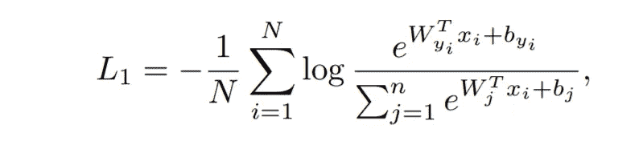
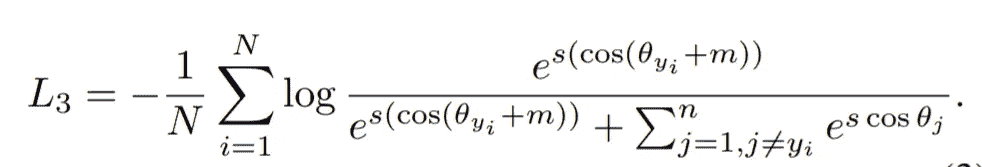
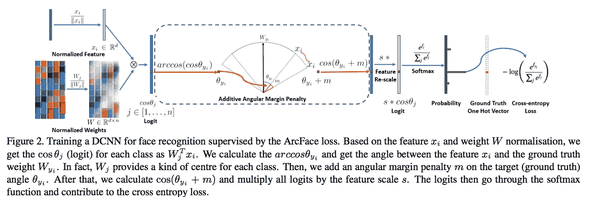
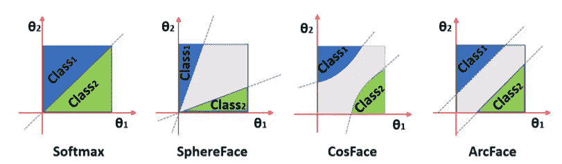
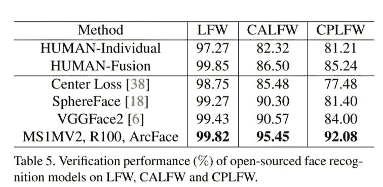

# ArcFace:面部识别模型

> 原文：<https://medium.com/analytics-vidhya/arcface-facial-recognition-model-2eb77080aa80?source=collection_archive---------3----------------------->

ArcFace 是用于面部识别的开源先进模型。作者姜康等人在 2018 年发表了一篇题为[**arc Face:深度人脸识别的加性角裕度损失**](https://arxiv.org/abs/1801.07698) 的论文。在 [LFW 数据集](http://vis-www.cs.umass.edu/lfw/)中表现出了 **99.82%** 准确率的优异表现。本文对论文进行了简要的分析和说明。

[https://www.iflexion.com/blog/facial-recognition-software](https://www.iflexion.com/blog/facial-recognition-software)

# 介绍

DCNNs 用于面部识别已经有一段时间了。有许多研究论文提出了各种版本的模型来完善识别和验证人脸的技术。一些是使用 Softmax 分类器的[多类分类器](https://papers.nips.cc/paper/2014/hash/e5e63da79fcd2bebbd7cb8bf1c1d0274-Abstract.html)，其他的产生人脸的[嵌入(FaceNet)](https://arxiv.org/abs/1503.03832) 。然而，许多这种方法的一个主要问题是损失函数缺乏区分人脸的强辨别能力。

以前的工作，如 [Sphereface](https://arxiv.org/abs/1704.08063) 提出了 DCNN 的最后一个全连接层的权重与不同类别的人脸具有相似性的想法。这被用来开发一个损失函数，该函数实现了“类内紧密性和类间差异”。然而，为了实现这一点，sphereface 必须做出许多假设，导致网络训练不稳定。 [CosFace](https://arxiv.org/abs/1801.09414) 更进一步使损失函数更有效，但它也遭受不一致性。

相反，Arcface 会对 DCNN 要素的点积和最后一个完全连接图层的权重进行附加惩罚。根据论文作者的说法，这最大限度地减少了以前工作中解决的问题，并证明更具吸引力、更有效、更易于实施和更高效。

# 方法

最广泛使用的分类损失函数 softmax loss 如下所示:

最大损失函数

其中'**'表示深度特征， **b** 为偏差， **N** 为批量， **n** 为类号，**【w】**为最后一层的权重，**嵌入特征**维数为 512。这对于区分不同类别的高相似性嵌入来说不是最佳的，这导致了性能差距。这就是 Arcface 的用武之地。它在损失函数中提供了以下变化。**

****

**弧面损失函数**

**弧面损失函数本质上取权重**‘w’**和**‘x’**特征的点积，其中 **θ** 是**‘w’**和**‘x’**之间的角度，然后对其加上罚值**‘m’**。**‘w’**使用 l2 范数进行归一化，**‘x’**已经使用 l2 范数进行归一化，并通过因子**s’进行缩放。**这使得预测仅依赖于角度 **θ** 或权重和特征之间的余弦距离。整个过程如下所示。**

****

**来自原始纸张的图像**

# **估价**

**本文提出的损失函数显示了清晰的类间区别，并减少了类内差距，使其优于以前提出的其他方法。该论文还对最近的面部识别方法进行了特别广泛的评估，并在各种基准数据集上与 ArcFace 进行了比较。**

****

**来自原始纸张的图像**

**上图显示了二元分类情况下不同损失函数的决策余量。虚线代表决策边界，灰色区域是决策余量。此外，下表详细介绍了 ArcFace 在 3 个不同基准数据集上的性能，并与其他几种方法进行了对比。**

****

**来自原始纸张的图像**

# **结论**

**文章浓缩了 ArcFace 的关键概念，并说明了它的意义。原文链接[这里](https://arxiv.org/abs/1801.07698)代码可以在[这里](https://github.com/deepinsight/insightface)找到。它的一个优秀 pytorch 实现可以从这个 [repo 中复制。](https://github.com/ronghuaiyang/arcface-pytorch)**