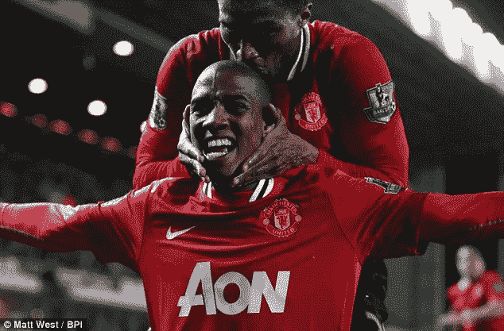
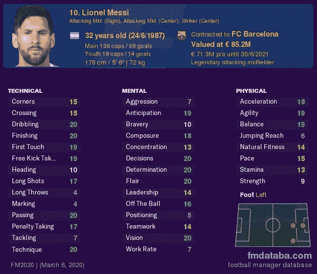
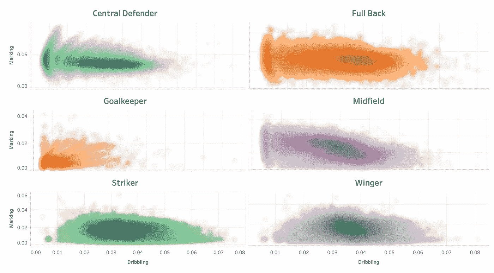

# 足球运动员是否处于最佳位置？(使用足球经理数据集)

> 原文：<https://medium.com/analytics-vidhya/are-footballers-playing-in-their-best-positons-using-football-manager-dataset-a5346605541?source=collection_archive---------3----------------------->

在足球世界里，当人们想到一名优秀的前锋时，他们往往会想到像莱昂内尔·梅西和克里斯蒂亚诺·罗纳尔多这样能够进很多球的球员。对于中场位置来说，创造力是一个关键。这个位置的球员要有很好的传球技术，控制比赛。就后卫而言，他们的主要任务是防守和阻止对手进球的机会。然而，人们对一个球员位置的看法已经完全改变了。在边后卫的位置上，许多边锋球员担任进攻位置。比如前曼联球员安东尼奥·瓦伦西亚和阿什利·扬，就从边锋变成了边后卫。此外，亚历山大·津琴科，过去踢攻击中场，现在在曼城踢边后卫。对于防守者来说，唯一的防守技能可能不足以成为一名好的防守者，因为许多球队都玩控球足球，并从防守者那里控球。因此，好的防守者也必须拥有像中场一样的传球技术。在这篇文章中，我们将使用足球经理数据库来查找足球运动员是否在符合他们技能的位置上踢球，并尝试回答他们是否有任何位置可以踢得比当前位置更好？。

阿什利·扬和安东尼奥·瓦伦西亚为曼联效力

**足球经理作为数据库**

> "我们还没有使用足球经理，但我们会这样做."

> “有很多俱乐部都在使用它。这不会是我们招聘策略的核心支柱，但它可以帮助…足球球探在球场上进行观察。然后，他们发送这些报告，我们用数据进行验证。或者我们查询一个数据库，它为我们产生符合特定标准的球员，然后我们请球探核实。这是双向的。所有的招募都是由于数据证实了球探所看到的。最好的招聘方式是将两者混合。”

> **前阿森纳、热刺和利物浦球探兼足球总监达米安·科莫利在 ESPN 新闻**上说

足球经理是足球运动员统计数据最可靠的来源之一，即使只是模拟游戏。这位足球经理在全世界有 2000 多个球探网络。你可能想知道它有多大？。像英超冠军曼城这样的大足球俱乐部，队里有大约 40 名球探。

本文使用的数据集来自 Kaggle 网站。它是足球经理 2017 游戏的数据库，拥有超过 15 万名足球运动员的资料。该数据包含玩家在每个领域的技能得分(满分为 20 分)。

[足球经理数据(15 万+球员)| Kaggle](https://www.kaggle.com/ajinkyablaze/football-manager-data)

莱昂内尔·梅西足球经理比赛数据

为了找到一个球员的最佳位置，我们应该首先观察各种能力之间的关系。下图显示了所有玩家能力的热度图。

我们可以看到，前 11 项技能彼此高度相关。这些都是守门员技巧。所以在这些技能上得分高的球员，更倾向于当守门员。此外，还有一些有趣的技能，如天赋和运球。擅长运球的球员也有很好的天赋。然而，他们往往在防守技能上得分较低，如铲球或盯人。因此，每个职位的技能集都有一个模式，机器学习的聚类方法可能适用于这个问题。

在我们进入聚类部分之前，为了确保数据具有可以聚类到一个位置组的模式，我们绘制了两种不同技能之间的数据:运球和盯人。因为运球是进攻位置的技术，而盯人是防守位置的技术。使用二维散点图可以显示分组模式。

从图表中，我们可以看到每个职位被清楚地分成一组。后卫和中场有相似技术，因为他们都是进攻和防守的角色。此外，后卫和边锋有很高的运球技术，但后卫有更高的盯人能力。由于守门员的职责与其他位置完全不同，他们在这两项技能上得分较低。

我们可以得出结论，足球运动员的位置分布存在某种模式，因此机器学习聚类方法有望很好地解决这个问题。

**K 均值聚类**

选择的聚类方法是 K 均值聚类。该方法是无监督的机器学习。在本文中，由于我们将位置标记为 6 个组，因此 k-均值聚类将观察值划分为选定数量的组 k；守门员、后卫、后卫、中场、边锋和前锋。我们选择的 K 的个数也是 6。

**结果**

形成 K 均值聚类，结果从 0 到 5 分为 6 组。在第 4 组中，有几乎相同的位置标签。原因是守门员有一种完全不同于其他位置的独特技能。第 1、3 和 5 组的大多数分别是中场、前锋和后卫。组 0 和组 2 由许多位置之间的混合组成。但是，我们可以把他们分别描述为边锋和后卫。

中场和边后卫的球员通常有相似的技能，这使得他们既能胜任进攻又能胜任防守。区别可能在于传球技术。此外，在后卫和边锋，他们也需要速度和技术来配合球。结果非常合理，在这些位置之间存在混淆。此外，结果可能表明，处于这些职位的人很可能会转换到其他角色，因为他们拥有合适的技能。

上图显示了雷达图，该图结合了所描述职位的前 5 项技能和聚类中的比较组。守门员的技能组合与聚类组 4 相同。在中场和后卫位置上，聚类组和真实位置的前 5 名技能相同，但贡献率不同。其他职位看重一些不同的技能，但也有一些共同的技能。雷达图的结果显示，符合聚类技能集的玩家也可能在那个位置上发挥出色，即使初始位置不是那个位置。

**结论**

换一个球员的位置一点都不差。相比之下，球员可能会找到正确的位置，比以前打得更好。结果显示，在许多位置，技能组合非常相似，这使得玩家可以切换到其他位置。如果你是一个足球游戏的爱好者，并发现这篇文章的结果很有趣，请在足球经理，国际足联，PES 或任何你喜欢的游戏中尝试。对我来说，在老版本的足球经理游戏中，我曾经让史蒂文杰拉德踢前锋，结果非常精彩！