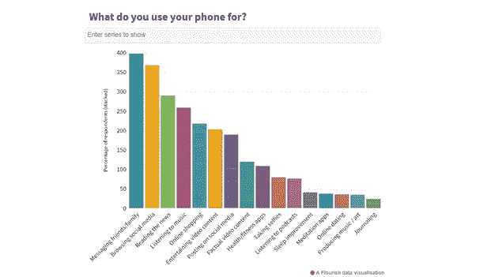

# 智能手机正在取代聪明人吗？

> 原文：<https://medium.com/analytics-vidhya/are-smartphones-replacing-smart-people-7af509329da6?source=collection_archive---------11----------------------->

## 以及我们在 21 世纪都需要面对的问题

多梅尼科·洛亚在 [Unsplash](https://unsplash.com?utm_source=medium&utm_medium=referral) 上拍摄的照片

法官先生:你被指控沉迷于技术。被告如何辩护？

被告被指控有罪。

法官先生:好吧，你可以选择你的惩罚:

1.一个月过着正常的生活，除了工作和学习，不使用手机和电脑。

2.在普通监狱呆一个月，可以用手机。

你认为你会选择哪一个？

我可能是错的，也许以偏概全是不公平的，但是我相信很多人会选择第二种选择。

**科技与人类**

技术是一件伟大的事情，正如许多伟大的事情一样，它往往会创造一种习惯。而我们，人类，是习惯性的生物，我们会很快接受任何让我们生活更舒适的东西。

但是舒适是有代价的，有时是微妙的代价。

如今我们的智能手机是我们生活中不可或缺的物品之一。不带电话出门和裸体出门(真正的裸体)一样严重。

*   我们从手机上获得从一个地方到另一个地方的路线，所以我们不必计划我们的旅行，甚至不知道我们的城市。
*   我们从手机上得到指示，选择最好的餐馆、商店或产品等。
*   我甚至听到人们说，当我的手机上有 XYZ 在线翻译时，为什么还要学习一门新的语言。
*   我们让电话告诉我们什么对我们来说是好的，值得去买，去听，去看，去学。

我不打算争论它的好处。他们不言自明。我将花几分钟思考一下潜在的缺点。

## **第一个缺点**

我们开始不用我们的思想和本能去做事。

在我们镇上，我们不知道如何自己移动，我们依靠电话。

我们不是为自己尝试新事物，犯我们自己的错误(我们应该从中学习)，而是跟随大众的意见或一群我们不认识但被标记为有影响者的人的意见。

我们能确定这些人背后的驱动力是什么吗？

结果，我们慢慢地开始失去思想的独立性，失去独立自主的能力，不需要任何附属品。

最糟糕的是，我们面带微笑，表面上感觉强大，但不经意间我们的基础被削弱了。

由专业机构和认证门户网站进行的研究，如 UNC Health、verywellmind，甚至政府部门如 PMC(美国国家医学图书馆)都倾向于证实这种模式。

*   [*https://health talk . unchealthcare . org/the-effects-of-smart phone-usage-on-the-brain/#:~:text = smart phones % 20 can % 20 make % 20 your % 20 brain % 20 E2 % 80% 9 clazy % E2 % 80% 9D&text = Research % 20 shows % 20 this % 20 过度依赖%20on，on % 20 人的%20memory%2C%E2%80%9D%20Dr*](https://healthtalk.unchealthcare.org/the-effects-of-smartphone-usage-on-the-brain/#:~:text=Smartphones%20Can%20Make%20Your%20Brain%20%E2%80%9CLazy%E2%80%9D&text=Research%20shows%20this%20overreliance%20on,on%20people's%20memory%2C%E2%80%9D%20Dr.)
*   [*https://www . verywell mind . com/how-do-smarts-affect-the-brain-2794892*](https://www.verywellmind.com/how-do-smartphones-affect-the-brain-2794892)
*   [*https://www.ncbi.nlm.nih.gov/pmc/articles/PMC7366948/*](https://www.ncbi.nlm.nih.gov/pmc/articles/PMC7366948/)

然而，从好的方面来看，我们应该有更多的空闲时间，不是吗？

同样，我的猜测是，不知何故我们没有它。

## **第二个缺点**

在科技赋予我们的所有空闲时间里，我们都在做些什么？

一些研究表明，我们在电话上的大部分时间都花在了非生产性的活动上(尽管我们可能会有相反的想法)，比如社交媒体、有趣的视频、在众多媒体提供商中的任何一家同时观看几部精彩的电视剧、无休止/无意义的聊天群，等等。

[*https://elitecontentmarketer.com/screen-time-statistics/*](https://elitecontentmarketer.com/screen-time-statistics/)

由于这个原因，消费信息和富有洞察力的思考之间的平衡被严重破坏，偏向于前者。你可以从年轻一代身上看到这一点，从他们越来越不能跳出思维定势来解决问题，从他们缺乏主动性，从他们依赖技术来解决几乎所有他们必须处理的问题上看到这一点。

虽然我也不年轻了:-)，但有时我意识到我也受到了风暴的影响，开始失去一些有利于舒适的技能，我不认为我是一个例外。

尽管这是我们社会众所周知的事实，但据我所知，这仍然是一个有待解决的问题。当然，公平地说，也有例外，但趋势似乎越来越强。

**总之**

鉴于技术解决了我们的许多日常问题，我们选择投资我们应该拥有的空闲时间的许多活动正在使我们的头脑变得愚蠢，并创造了一代消费者和追随者，而不是思想家。

根据詹姆斯·R·弗林 2009 年的研究，从那以后，人们的平均智商一直在下降，其中一个主要原因与技术和媒体消费有关。

在 procon.org 的一篇文章中，提到了这一点和关于此事的其他研究来源:[*https://www . procon . org/headlines/is-the-internet-making-us-dumb-top-3-pros-and-cons/*](https://www.procon.org/headlines/is-the-internet-making-us-stupid-top-3-pros-and-cons/)

在智能手机成为联系他人和世界的主要方式的今天，虚拟的自由和人为的“聪明”带来的后果会随着时间的推移对人们的思想产生负面影响。

[*https://www . broadbandsearch . net/blog/mobile-desktop-internet-usage-statistics*](https://www.broadbandsearch.net/blog/mobile-desktop-internet-usage-statistics)

很明显，尽管这一事实现在已经为人所知并得到了研究，但目前仍没有全球性的解决方案。

最后，我想给你留一个开放性的问题…

我们如何利用技术，尤其是人工智能，开始扭转这一趋势？除此之外，要避免越来越常见的“哦，我的天哪！我的电池快没电了，我忘了带充电器……”