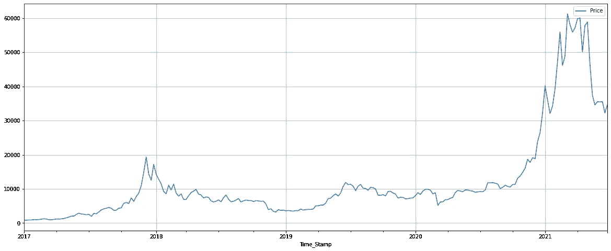
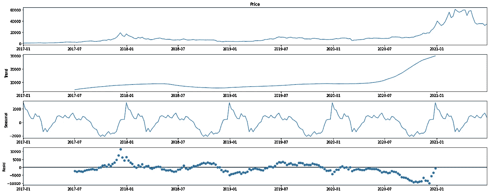
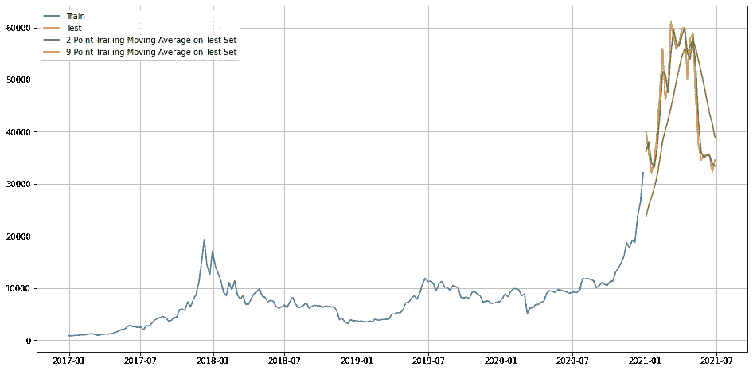
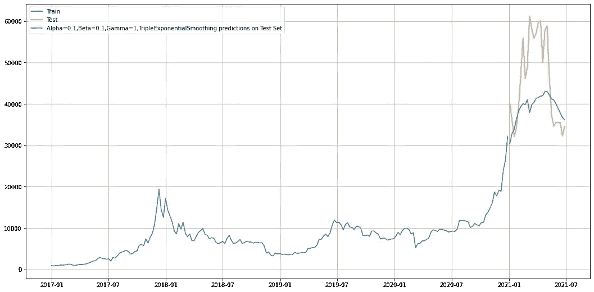
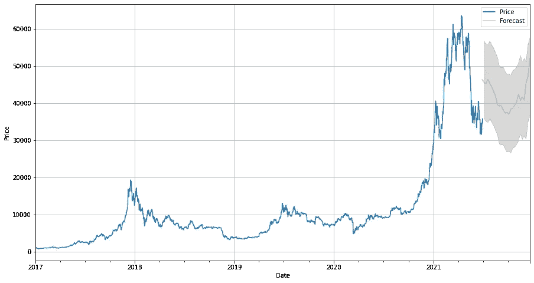

# 我们真的处于一个新时代的黎明:用时间序列预测比特币。

> 原文：<https://medium.com/analytics-vidhya/are-we-really-at-the-dawn-of-a-new-era-predicting-bitcoin-using-time-series-9c4fe9a7534?source=collection_archive---------15----------------------->

我想用一个激动人心的例子来说明数据是如何同时具有洞察力和误导性的。第二次世界大战期间，在飞机上对弹痕进行了分析，以确定易受攻击的区域。在从足够数量的飞机上收集数据并绘制成图后，一个清晰的图形被识别出来。最大数量的弹痕出现在飞机的机翼和机身上，因此决定增加机翼和机身的装甲。但是，这些数据被送到一位匈牙利裔犹太统计学家亚伯拉罕·瓦尔德那里进行最终审查，他指出了一个关键的缺陷。如果被击中的飞机不是机身或机翼，而是没有到达大本营，那该怎么办？接下来增加了驾驶舱、引擎和尾部的装甲，这些地方弹痕很少，但可能是易受攻击的地方。

请在 https://www . Trevor brag don . com/blog/when-data-gives-the-error-solution 阅读全文。

嗯！让我们回到比特币。

随着比特币的涨跌突然激增，一大批新的加密货币突然加入联盟，我们似乎正站在一个新时代的黎明。鉴于 21 世纪的下一场大革命只不过是区块链技术的事实，投资者有充分的理由放心，正如这位物理学家所说，就像不断膨胀的宇宙一样，他们在加密方面的投资也可能扩大。然而，市场并不是那么直截了当，并持有所有不容易被投资者察觉的惊喜，投资者最近涌入了加密货币市场。那么我们来分析一下，从比特币的历史数据中，我们能感知到什么。我们是站在这些所谓的加密货币时代的黎明还是黄昏？

要了解加密货币和区块链之间的关系，请阅读普华永道的完整报道:[https://www . PWC . com/us/en/industries/financial-services/fin tech/bit coin-区块链-cryptocurrency.html](https://www.pwc.com/us/en/industries/financial-services/fintech/bitcoin-blockchain-cryptocurrency.html) 。

我将从维基百科对时间序列的简单介绍开始，时间序列是我们分析所基于的统计方法，然后我们将在时间序列中使用移动平均和指数平滑模型进行预测。

维基百科引用的时间序列是 ***“一系列*** [***数据点***](https://en.wikipedia.org/wiki/Data_point) ***按时间顺序编入索引(或列出或绘制)。最常见的是，一个时间序列是一个*** [***序列***](https://en.wikipedia.org/wiki/Sequence) ***在连续的等间距时间点拍摄的。因而它是一个由*** [***离散时间***](https://en.wikipedia.org/wiki/Discrete-time) ***数据组成的序列。时间序列的例子有海洋的高度*** [***潮汐***](https://en.wikipedia.org/wiki/Tides)*[***太阳黑子***](https://en.wikipedia.org/wiki/Sunspots) ***以及道琼斯工业平均指数*** ***的每日收盘值****

*在我们的分析中，我们从 2017 年开始每周对比特币进行收盘。(*数据由 Investing.com 提供)**

**

***图 1:比特币周收盘价(Investing.com 提供)***

*以上是 2017 年 1 月至 2021 年 6 月 30 日比特币收盘价周线图。我们可以看到价格从 2020 年第四季度开始突然上涨，然后在 2021 年突然下跌。除此之外，我们还可以看到许多价格的上涨和下跌，这似乎是绝对随机和不可察觉的。让我们了解一下，我们可以从比特币的这种随机游走中获得什么。为此，我们将进一步分解时间序列。用外行人的语言来说，我们将统计数据分为趋势、季节性和随机误差*(简单地说就是数据中无法解释的那部分随机性)。**

**

***图 2:时间序列的加法分解***

*从顶部开始的第一个图表是每周比特币价格的原始折线图，第二个是每周价格中捕获的趋势，第三个是数据中的季节性，最后是那些既没有被趋势也没有被季节性捕获的数据点。在上面的四个图表中，我们主要关注的是周价格的季节性，这可以从第三个图表中清楚地看到。所谓季节性，我们指的是在固定的时间间隔内价格涨跌的清晰模式。*

*现在，我们知道比特币的价格遵循某种季节性模式，让我们尝试使用一个简单的箱线图从 2017 年到 2020 年中期(即价格开始向北飙升之前)进一步验证这一点。*

**

***图 3:比特币周收盘价月度箱线图***

*我们在上面得到的只是一些上下有胡须的彩色盒子…对，但是他们很有洞察力。12 个盒子，即每个月一个……顺便说一下，这些盒子代表从 2017 年开始每个月的中间 50%的数据点，所以盒子和它的胡须*(那个 T 形的东西附在盒子上)*更宽的数据范围……..因此，在 12 个框中，我们看到 12 月、1 月和 2 月的数据范围最广。你知道比特币的价格在 11 月底是 19，698.10 美元，到 12 月底涨到 28，949.4 美元，到 2 月底涨到 45，164 美元。*

***诡异！我之前怎么没看出来？***

*如果人们清楚地看到，在盒子的较低尾部下方可能有一些异常值，也就是说，当比特币以远低于中间值的价值交易时的数据点，故事就不会到此结束。不用说，比特币在 5 月 1 日的价格是 57807.10 美元，在 5 月 31 日是 37298.60 美元。*

*但这些现在都是历史了，只有我们能从这些数据中进一步获得任何有意义的见解，吹嘘这些历史观点才有意义。因此，第一个也是最简单的技术是移动平均线分析。我不会花太多时间来解释，只是简单地放一个图表，这是不言自明的。要了解更多关于移动平均线的信息，请查看我的博客 https://manishbansal 3003 . blogspot . com/2021/06/wow-it-is-almost-so-easy-to-predict . html。*

**

***图 4: 2 & 9 周移动平均线对比现货价格***

*我们可以清楚地看到 9 天移动平均线是如何紧密跟随现货价格的。但是均线经常被指责为大器晚成，我们需要一些可以给我们一个早期信号的东西。为此，我们将使用 Holt——Winter 的三倍指数平滑法。我不会深入模型背后的数学，因为这显然超出了本文的范围，因为我们只是试图预测比特币价格的短期未来。但是，为了便于理解，我在 python 中使用了来自 **statsmodels.tsa.api** 的 Holt 模型，并对α、β和γ的值进行了多次迭代，创建了一个最接近测试数据的模型。下图显示了该模型如何基于训练数据(2021 年之前的比特币价格)的输入对测试数据(2021 年以后的比特币价格)进行处理。*

**

***图 5:使用列车数据预测测试数据***

*上面的图表清楚地表明，基于 2017 年 1 月至 2020 年 12 月 ***(蓝色绘制)*** 的数据，模型非常准确地预测了 2021 年 ***(绿色绘制)*** 期间比特币价格不可持续的初始上涨。根据模型的预测，原始数据遵循类似的模式 ***(用橙色绘制)*** 。我们现在将使用相同的模型来预测从 6 月 30 日开始的半年，即从 2021 年 7 月到 2021 年 12 月。*

**

***图 6:2021 年下半年比特币价格预测(TES 模型)***

*从上面的图表中我们可以预测，短期内比特币的价格可能会进一步下跌到 26000 美元，但之后会再次上涨。由此我们可以看到比特币价格的美好未来。然而，我们同时也必须承认，这涉及到许多复杂性，没有人能够 100%确定这些复杂的货币会发生什么，特别是当价格变动只是一个推文的问题时。但是，鉴于科学技术的进步，当世界离计划在外太空度假不远的时候，谁知道有一天我们的钱包会被这些数字货币统治。*