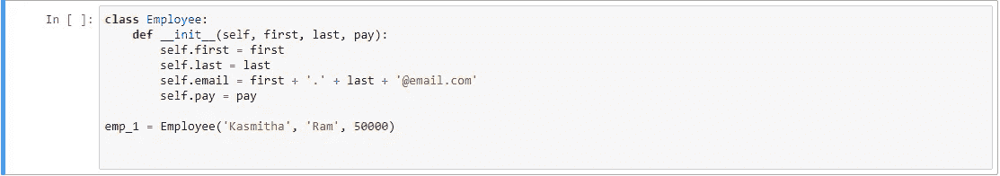
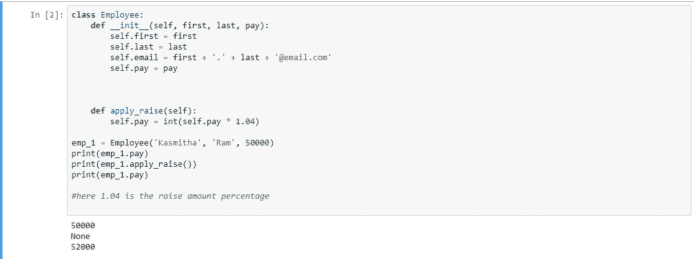
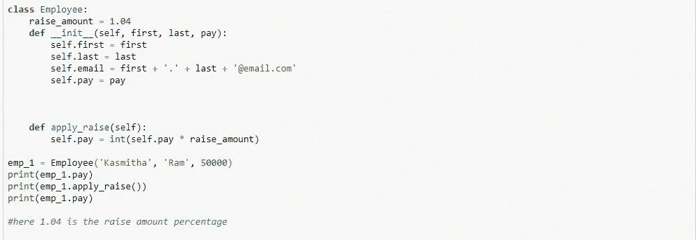
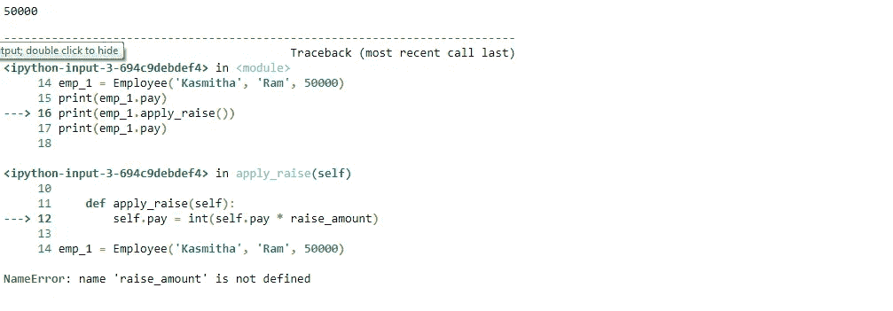
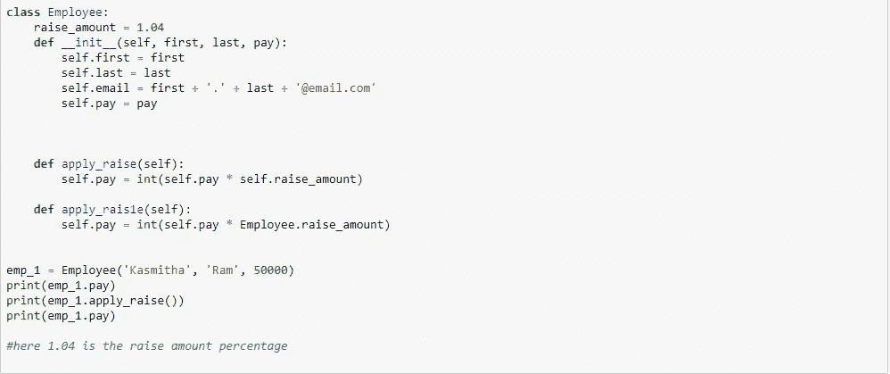
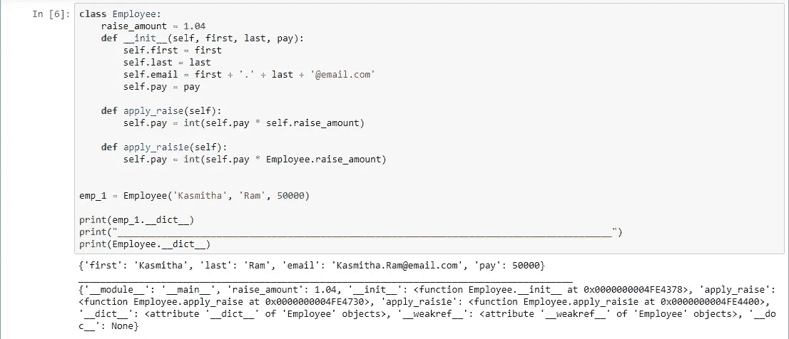

# 你不确定在 python 中哪里使用类变量吗？

> 原文：<https://medium.com/analytics-vidhya/are-you-not-sure-where-to-use-class-variables-in-python-cce0af8f514d?source=collection_archive---------0----------------------->

照片由 [Unsplash](https://unsplash.com?utm_source=medium&utm_medium=referral) 上的 [Clément Hélardot](https://unsplash.com/@clemhlrdt?utm_source=medium&utm_medium=referral) 拍摄

W 欢迎来到我关于 OOPS 概念的第二篇博客，在这篇博客中我将解释 python 中的类变量。我们可以讨论在哪些情况下可以使用类变量。如果您对类和实例变量等概念不熟悉，我已经就这些主题写了一篇博客。请参考这个[链接](/analytics-vidhya/the-concept-of-self-keyword-you-must-understand-8f83e28cc015)并回来更好地理解类变量。

> **教材定义:**
> 
> **类变量**——一个类的所有实例共享的变量。类变量定义在类中，但不在类的任何方法中。类变量不像实例变量那样经常使用。
> 
> **外行术语:**
> 众所周知**实例变量**是为特定类创建的每个实例所特有的变量。而**类变量**可以被认为是一个变量，它通常对于为该类创建的任何实例都保持不变。

好了，理论到此为止。现在让我们深入一些编码示例，以便更好地理解

在上面的图片中，您可以看到使用 self-keyword 声明的变量是实例变量，并且是唯一的，通常为该类创建的每个实例都会发生变化。这里 emp_1 是为 Employee 类创建的实例。

正如我已经提到的，类变量意味着在为该类创建的所有实例之间共享。员工类的一个很好的候选是员工奖金，这通常是特定组织中所有员工的共同奖金(根据加薪的百分比)。现在你可能会有一个问题，为什么要有单独的类变量，当它可以用下面这样的东西来完成的时候。

因此，在使用这种方法之前，有几件事情需要注意。*第一个问题是****raise _ amount****没有被同时声明为实例和类变量。因此不能通过类似于其他实例变量(如 pay、first 和 last name)的属性来调用它。*

第二个问题是，如果在多个地方提到了提高金额(1.04)，我们必须在多个地方进行更改，这是一种手动更新的方式。所以为了克服这些情况，我们使用类变量。

类别变量

类别变量错误

在上面的类变量图像中，您可以看到调用类变量(raise_amount)的方式导致了下一个图像中的错误。这里没有混淆，我们应该使用实例关键字(self)或者使用类本身来调用类变量。

因此，下面是调用变量的正确方法。可以调用类似 apply _ rais1e 函数的 apply_raise 函数的类变量。

调用类变量的正确方法

我可以理解你在这个阶段的困惑，因为 raise_amount 是一个类变量，我如何能够使用 instance(self 关键字)访问它们。让我们在这里把事情说清楚。参见下面的代码。

上图中的关键是，每当我试图使用 instances (emp_1)访问这里的属性(raise_amount)时，它将首先检查该实例是否有该属性，如果没有，那么它将在类中搜索该属性。所以这里 emp_1 没有属性 raise_amount，但是 Employee 类有属性 raise_amount。

是的，我们已经到了这个博客的结尾，现在你可以更好地了解类变量，以及类变量和实例变量之间的区别。

来源你一定要检查和来源，我从哪里得到灵感。

*   【https://www.youtube.com/results?search_query=corey+schafer 号
*   【https://www.youtube.com/results?search_query=thenewboston 

编码快乐！！