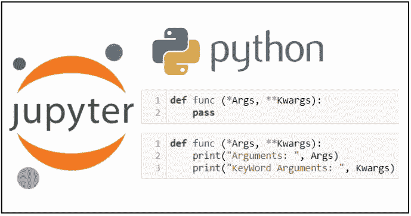
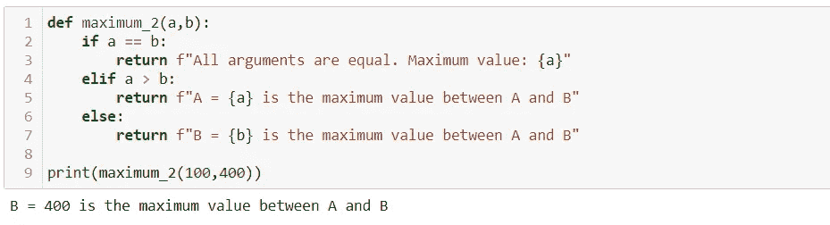
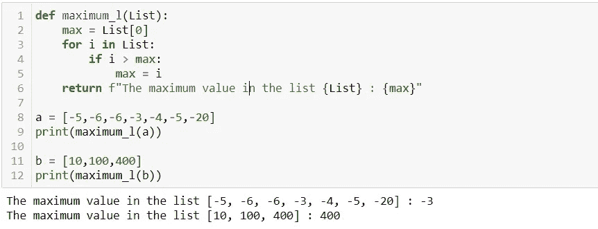
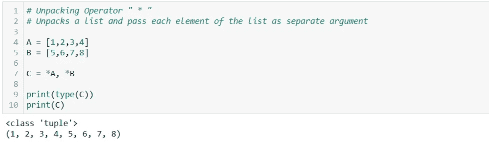
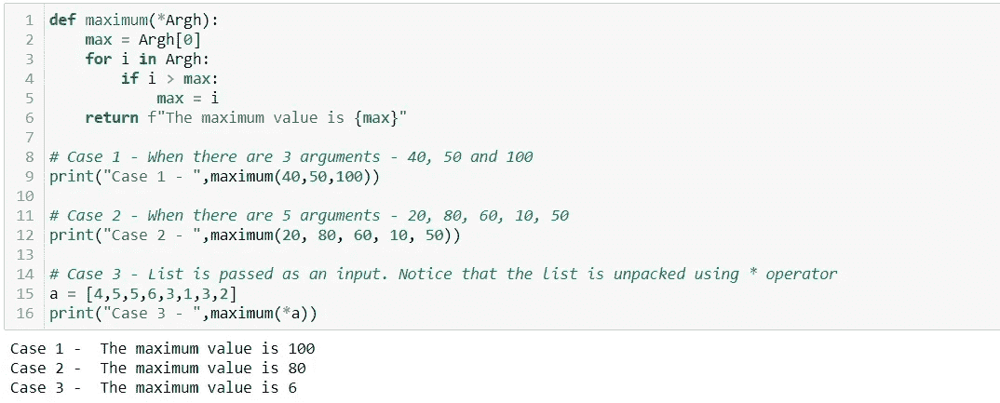
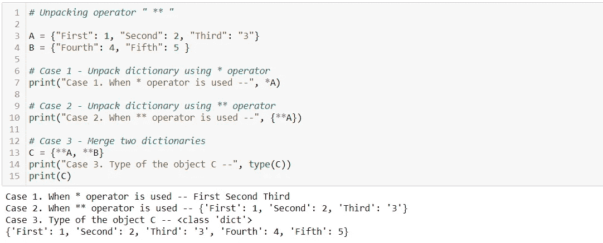
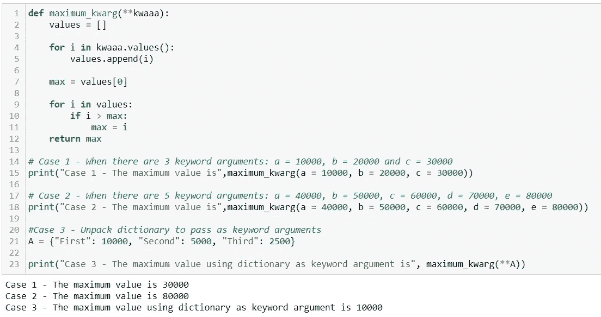

# * Python 中的 Args & **Kwargs

> 原文：<https://medium.com/analytics-vidhya/args-kwargs-in-python-b74295f3cd0?source=collection_archive---------3----------------------->

图片由 Self 编译，徽标归各自所有者所有

*Args 和**Kwargs 是一些重要的 Python 概念，一旦学会，将使您从初学者到中级/高级 Python 程序员的旅程变得更加轻松。本文作为一个教程，利用代码片段进行演示。

简单地说，*Args 和**Kwargs 的功能概括为—

> *Args 和**Kwargs 使 Python 程序员能够定义接受可变数量参数的函数。

不要害怕！！如果你没有真正理解上述说法的相关性。这篇文章正是为了帮助读者认识到*Args 和**Kwargs 在 Python 中定义函数时是如何有用的。

***Args** 是自变量的首字母缩写，即函数的参数所取的值。在图 1 中，函数 *maximum_2* 正在执行找出两个参数*【a】*和*【b】*之间的最大值的任务。值 a = 100 和 b = 400 是该函数的参数。

图 1

假设下一个任务是在许多参数中确定最大值，而不是两个。一种方法是创建一个值列表，并将其作为输入传递给一个函数。

在图 2 中，使用相同的方法定义了函数 *maximum_l* 。最大值由列表的第一个元素初始化(可以由列表中的任何元素初始化)。稍后，使用 for 循环来比较列表中的元素并确定最大值。

图 2

上面的方法会给我们正确的答案，但它仍然有一些问题。例如，事先准备一份论据清单是不方便的。有时，当代码被实时执行时，准备一个参数列表可能不是一个选项。此外，程序员可能会遇到这样的情况，他们不知道应该传递多少个参数来定义一个函数。*Args 和**Kwargs 用于解决这些问题。

> “名字里有什么”这句话也许有一定的道理。Python *Args 和**Kwargs 语句将会一致，因为 Args 和 Kwargs 这两个名称是不相关的，它们实际上只是一个名称。程序员可以使用任何想要的名字，真正重要的是*和**解包操作符的用法。

*拆包操作员:

*   将允许向函数传递不确定数量的参数。
*   将对列表进行操作以解包元素，元素被保存为数据类型——tuple，这是一个可迭代的对象。
*   可用于解包和合并两个列表，参见图 3

图 3

让我们用 **解包运算符*找出众多参数中的最大值。为了证明名称 Args 确实无关紧要，我们将使用名称 Argh！！为了定义图 4 中的功能*最大值*，

案例 1 和案例 2 展示了这样一个场景，其中传递了长度分别为 3 和 5 的多个参数来标识最大值。案例 3 告诉我们，即使列表也可以作为输入传递给函数，但是列表需要使用*操作符来解包。

图 4

****Kwargs** 是关键字参数的首字母缩写。它的工作方式与*Args 完全一样，但是它不接受可变数量的位置参数，而是接受可变数量的关键字或命名参数。

**开箱操作员:

*   将允许传递多个不同长度的关键字参数。
*   将从字典中解包键值对。
*   可以用来合并两个字典。

图 5

图 5 有三个案例/例子来展示**拆包操作员的功能。

情况 1 —当在字典上使用* unpacking 运算符时，输出只包含键-值对中的键。
情况 2——当在字典上使用**解包操作符时，输出包含键-值对。输出必须保存在字典中，以避免类型错误。
情况 3 —通过从两个字典中解包键值对，将两个字典合并在一起。

让我们继续我们找出最大值的例子，但是这一次，任务是找出关键字/命名参数中的最大值。我们不用**kwargs，而是用**kwaaa 来写我们的函数，只是因为*名字里有什么？*

在图 6 中，函数 *maximum_kwarg* 用于找出关键字参数中的最大值。该函数通过从关键字参数或字典中获取值来创建一个值列表。这个步骤是通过使用*dictionary _ name . values()*方法完成的。稍后，通过使用用于演示*Args 的函数 *maximum* (图#4) *、*中使用的相同逻辑来识别值列表中的最大值。

案例 1 和案例 2 展示了这样一个场景，其中传递了长度分别为 3 和 5 的多个关键字参数来标识最大值。
案例 3 告诉我们，即使是字典也可以作为输入传递给函数，但是字典中的键值对必须使用**操作符来解包。

图 6

图 6 总结了我们对*Args 和**Kwargs 的演示。读者应该能够定义 Python 函数，而不必关心参数的预先发现或赋值。向函数传递可变数量的参数或关键字参数的功能非常方便，特别是在处理 Decorators 和 Python 类时。下一篇文章将是关于装饰者的教程，它将利用*Args 和**Kwargs 的概念。

我希望这篇文章是有帮助的。非常感谢您的反馈。

谢谢大家！！