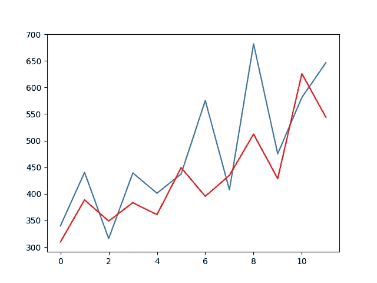
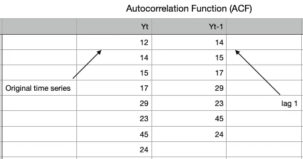
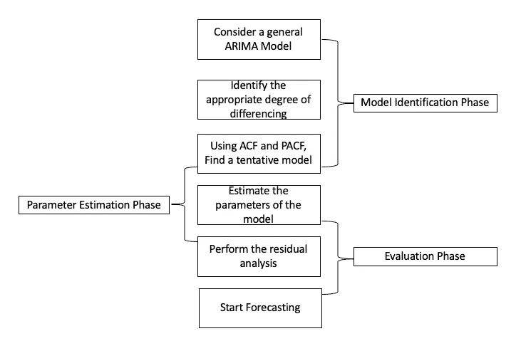

# ARIMA

> 原文：<https://medium.com/analytics-vidhya/arima-fc1f962c22d4?source=collection_archive---------1----------------------->

## 高级时间序列方法:自回归综合移动平均。

ARIMA 代表自回归综合移动平均线。

ARIMA —重要概念

ACF-PACF 与平稳性

## **自相关函数**

ACF:原始数据和滞后“h”时间段的相同数据之间的相关性

计算两个变量之间的相关系数。因为这里只有一个变量，我们需要计算自相关。

让我们了解一下这个系列中的数据点是如何与其前面的数据点相关联的。

有季节性和非季节性 ARIMA 模型可用于预测。

**非季节性 ARIMA 模型:**

这种方法有三个变量来说明 **P =滞后期**例如:(如果 P=3，那么我们将在计算的自回归部分使用时间序列的前三个周期)P 有助于调整拟合的线来预测序列

**纯自回归模型类似于线性回归**，其中预测变量是 P 个前期

在 ARIMA 模型中，我们使用差分法将时间序列转换成平稳序列(没有趋势或季节性的序列)。d 指时间序列达到稳定状态所需的差分变换次数。

平稳时间序列是指**均值和方差在一段时间内保持不变。**数列何时平稳比较容易预测。

***差分是一种将非平稳时间序列转化为平稳时间序列的方法。这是为 ARIMA 模型准备数据的重要一步。***

第一差值是当前时间段和先前时间段之间的差值。如果这些值不能围绕一个恒定的平均值和方差旋转，那么我们使用第一个差分的值找到第二个差分。我们重复这个过程，直到得到一个平稳序列。

确定系列是否充分差分的最佳方法是**绘制差分系列并检查是否有恒定的均值和方差。**

**Q** =该变量表示误差分量的滞后，其中误差分量是时间序列的一部分，不能用趋势或季节性来解释

> **自相关函数图(ACF):**

自相关是指时间序列与其过去值的相关程度，而 ACF 是用于查看点之间相关性的图，直到并包括滞后单位。在 ACF 中，相关系数在 x 轴上，而滞后数在 y 轴上显示。

**自相关函数图将让您知道给定的序列与其自身是如何相关的。**

通常在 ARIMA 模型中，我们使用 AR 或 MA。我们很少使用这两种 ARMA。我们使用 ACF 图来决定哪一个是我们应该用于时间序列的术语。

如果在滞后 1，处有一个**正自相关，那么我们使用 AR 模型**

如果在滞后 1，处存在**负自相关，那么我们使用 MA 模型**

绘制 ACF 图后，我们转向**部分自相关函数图(PACF)。**偏相关是时间序列中的观测值与先前时间步中的观测值之间的关系的总结，其中插入观测值的关系被移除。

**滞后 K 处的部分自相关是在去除了由较短滞后处的项引起的任何相关的影响之后得到的相关。**

如果 PACF 曲线在滞后 n 处下降，那么使用 AR(n)模型，如果 PACF 曲线的下降更加平缓，那么我们使用 MA 项。

自回归组件:纯粹的 ar 模型预测，仅使用过去值的组合，类似于线性回归，其中使用的 AR 项数量与预测中考虑的前期数量成正比。

**在模型中使用 AR 术语时:**

*   ACF 图显示自相关向零衰减
*   PACF 曲线很快接近零
*   平稳序列的 ACF 在滞后-1 时为正

移动平均线:时间序列图中的随机跳跃，其影响在两个或多个连续的时间段内都能感觉到。这些跳跃代表在我们的 ARIMA 模型中计算的误差，并代表 MA 分量将滞后的情况。一个纯粹的 MA 模型会像指数平滑法一样平滑这些突然的跳跃。

当模型符合以下条件时，在模型中使用 MA 术语

*   滞后-1 时负自相关
*   几个滞后之后急剧下降的 ACF
*   PACF 逐渐减少

综合成分:当时间序列不稳定时，该成分开始起作用。我们必须对级数求差以使其稳定的次数就是积分分量的参数(I 项)。

我们可以将我们的模型表示为 ARIMA( AR，I，MA)

> **季节性 ARIMA (SARIMA)款式:**

顾名思义，当时间序列表现出季节性时，就使用这种模型。这个模型类似于 ARIMA 模型，我们只需要添加一些参数来解释季节

我们可以把萨里玛写成:

**ARIMA(p，D，Q)**

*   P —自回归的次数
*   d——差异程度
*   q —移动平均项的数量
*   m —指每个季节的周期数
*   (P，D，Q)-表示时间序列季节性部分的(P，D，Q)

季节性差异考虑了季节和当前值的差异，它是以前季节的值。

*   在纯季节性 AR 模型中，ACF 衰减缓慢，而 PACF 截止到零
*   当季节性自相关为正时，使用 AR 模型
*   在纯季节性 MA 模型中，ACF 截止到零，反之亦然
*   当季节性自相关为负时，使用 MA 模型

利用 ARIMA 建立时间序列模型。

**最终步骤:**

*   **第一步——检查平稳性:**如果一个时间序列有趋势或季节性成分，在我们可以使用 ARIMA 预测之前，它必须是平稳的。
*   **第二步——差分:**如果时间序列不是平稳的，需要通过差分来平稳化。取第一个差值，然后检查平稳性。尽可能多地接受差异。一定要检查季节差异。
*   **第三步——筛选出一个验证样本:**这将用于验证我们的模型有多准确，使用训练测试验证分割来实现。
*   **步骤 4 —选择 AR 和 MA 术语:**使用 ACF 和 PACF 来决定是否包括 AR 术语、MA 术语、(或)ARMA。
*   **步骤 5 —建立模型:**建立模型，并将预测的周期数设置为 N(取决于您的需求)。
*   **步骤 6 —验证模型:**将预测值与验证样本中的实际值进行比较。