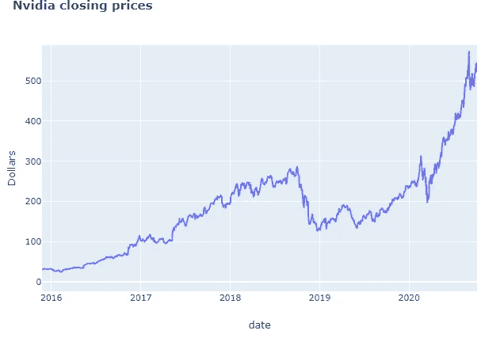
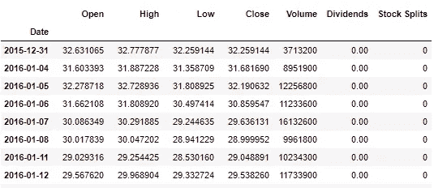
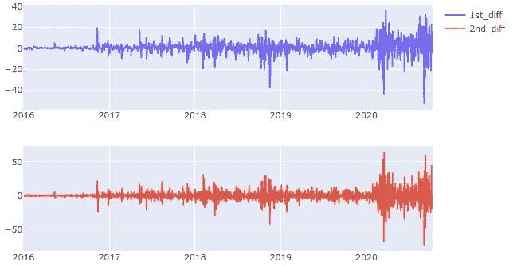
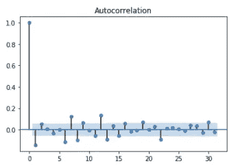
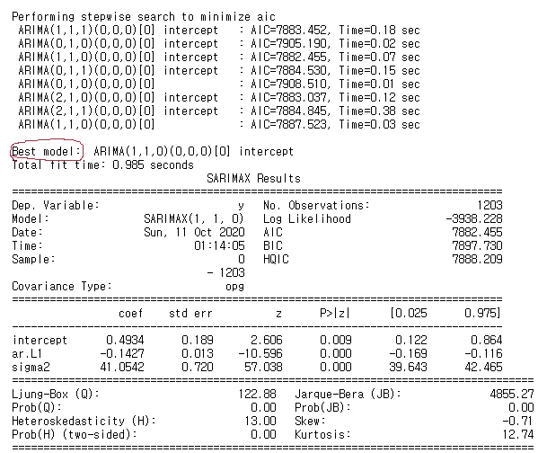
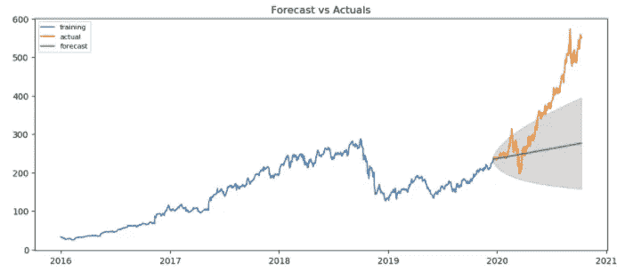
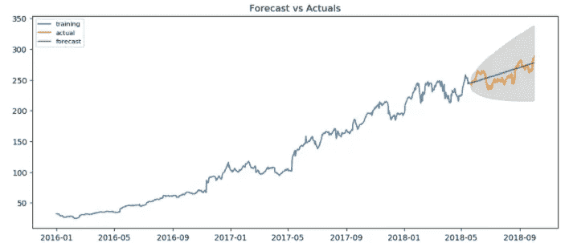

# 假人的 ARIMA

> 原文：<https://medium.com/analytics-vidhya/arima-for-dummies-ba761d59a051?source=collection_archive---------2----------------------->

由[阿格巴洛斯](https://unsplash.com/@agebarros?utm_source=unsplash&utm_medium=referral&utm_content=creditCopyText)在 [Unsplash](https://unsplash.com/s/photos/time-series?utm_source=unsplash&utm_medium=referral&utm_content=creditCopyText) 上拍摄的照片

在工作中，开发强化学习模型时，我遇到了一个自动回归模型，用于更新 RL 代理中的策略。这激活了我大脑中非常深的未被访问的部分，也就是“已经学习”的部分。我记得我写过一篇关于使用 ARIMA 的博客，它是自回归模型和移动平均模型的结合。我想这将是一个好主意，来回顾我的理解，也让我的博客曝光。所以开始了。

在进入 ARIMA 之前，我们必须回顾一下什么是“时间序列”。

# 时间序列

在特定时间通常以相等间隔观察到的数据点被称为时间序列数据。时间序列在现实生活中非常重要，因为大多数数据是以时间连续的方式测量的。股票价格每秒钟都会被记录下来。

时间序列分析用于预测未来。例如，使用过去 12 个月的销售数据来预测未来 n 个月的销售，因此我们可以采取相应的行动。

解释时间序列数据的四个组成部分:

1.  **趋势**:上升、下降或静止。如果你公司的销售额每年都在增长，那么它就呈现出上升的趋势。
2.  **季节性**:一定周期内重复的模式。夏天和冬天的区别。还包括特殊节日
3.  **不规则性**:影响时间序列数据的外部因素如 Covid、自然灾害等。
4.  **循环**:上下重复时序数据。

# ARIMA

**A** 自动 **R** 过度 **I** 整合 **M** 移动 **A** 平均
又名 Box-Jenkins 法。

*   这是一类使用自己的过去值进行预测的模型:滞后值和滞后预测误差。
*   AR 模型使用滞后值进行预测
*   MA 模型使用滞后预测误差进行预测
*   两种型号集成成为 ARIMA(“I”代表集成)
*   由三个参数组成: **p** ， **q** ， **d**

ARIMA 是一个简单的模型，它假设我们正在处理的时间序列数据满足以下条件:

1.  “非季节性”意味着不同的季节并不影响它的价值。当存在季节性时，我们使用季节 ARIMA 模型的简称 SARIMA
2.  没有异常。例:没有像 Covid 这样影响我们数据的不规则事件

现在我们知道什么是 ARIMA 模型，它期望什么，让我们更详细地讨论它有什么参数

## 因素

**p**—AR 项的顺序

*   用作预测值的 Y 的滞后数。换句话说，如果你试图预测 6 月份的销售额，你会使用几个月前(滞后)的数据？

**问** —马术语的顺序

*   滞后预测误差的数量->你将使用多少过去的预测误差？

**d** —最小差值周期

*   使时间序列数据**稳定**所需的最小差分次数。
*   已经稳定的数据将有 **d** = 0。

在阅读每个参数术语**固定**的解释时，我并不清楚，因此经过一些研究，我获得了回答我的问题的知识:

> 静止实际上是什么意思？

如果时间序列数据包含以下内容，则认为该数据是稳定的:

1.  常数平均值
2.  恒定方差
3.  独立于时间的协方差

在大多数情况下，时间序列数据随着时间的推移而增加，因此，如果你采取连续的部分，它将不会有恒定的平均值。下图是 Nvidia 股票价格，这是**非平稳**数据的一个例子。分割成 n 个周期，取均值，就不一样了。

检查我们的数据是否是平稳的是很重要的，因为时间序列数据需要在建模预测未来之前是平稳的。
通常它是不稳定的，因此我们**差分**它，从当前值中减去先前值。

因为拥有稳定的时间序列数据很重要，所以我们需要一种方法来检验它。检验时间序列数据是否平稳的常用方法有:

*   扩充迪基富勒(ADF)试验
*   菲利普斯-佩龙试验
*   科维亚特科夫斯基-菲利普斯-施米特-申(KPSS)试验
*   绘制滚动统计数据，如平均值、标准偏差

# python 中的模型构建

我们将使用 python 3.8 构建 ARIMA 模型，并预测 Nvidia 的收盘价。

Nvidia 股票从 2010 年 1 月 1 日到 2020 年 10 月 10 日的收盘价。

nvda_df

我们必须做的第一件事是，检查数据是否稳定。从我们之前看到的 Nvidia 股票收盘价格的线图来看，很明显它不是静止的，但是要确保测试它总是一个好的做法。

我们将使用**增强的 Dickey Fuller 测试来测试它。**为了测试数据是否平稳，我们使用假设检验，其中我们的零假设是“时间序列数据是非平稳的”。当 p 值小于 0.05(p 值)时，我们将拒绝零假设，这使得我们采取另一个假设“时间序列数据是平稳的”。

请注意，我们的零假设被拒绝，因为 p 值≥ 0.05。现在我们知道我们的数据不是静态的，但它并没有在这里结束，因为我们可以通过使用“差分”技术使它稳定。

通过使用一阶差分，我们可以看到我们的数据变得稳定。

一阶、二阶差分应用图

下面是一阶差分的自相关图。您可以看到，即使有一个滞后，也会立即导致负自相关，这表示过度差分。当自相关下降太快时，它可能指示过度差分，而如果自相关下降太慢(在超过 10 个滞后时间内保持正)，它指示差分不足。

自相关图

同样，当时间序列**稍微欠差**时，再次差会导致稍微过差，反之亦然。在这种情况下，不是求差，而是在略微欠差时添加 AR 项，在略微过差时添加 MA 项。

# 用 ARIMA 预测

最后是使用 ARIMA 模型进行预测的时候了。有手动选择 q，d，p 的方法，但是由于博客太长，我将在以后的博客中更深入地解释它，并向你展示选择参数的简单方法。

上面的代码尝试了 p、d、q 的所有组合，并输出最佳模型，即具有最低 AIC 的模型。现在创建最佳 ARIMA 模型并进行预测。注意，由于是时间序列数据**顺序问题**因此必须按顺序分割训练和测试数据。

整个数据集上的预测图

上面的图表证明我们的预测做得不好。这是因为 ARIMA 模型没有考虑不规则性，而且由于像 CES 和自动驾驶汽车的兴起这样的事件，Nvidia 价格飙升，我们的 ARIMA 模型做得很差。

截至 2018 年 10 月，似乎没有违规行为。当我们截断我们的数据以包括 2018 年 10 月之前的数据时，我们得到以下预测。

截至 2018 年 9 月的预测图

我们可以看到，当没有不规则性(假设之一)时，我们的 ARIMA 模型实际上做得很好。

总之，当我们处理没有不规则性和季节性的数据时，ARIMA 运行良好。还有更稳健的 ARIMA 版本，如 SARIMAX(带有外生变量的季节性 ARIMA 模型)，它不使用 ARIMA 提出的假设。我通常以自下而上的方式工作，因此我总是试图让事情简单，因此从建立最简单的基础模型开始，在我们的情况下是 ARIMA，然后向上移动到萨里玛和萨里马克斯。

# 参考

*   [https://www . machine learning plus . com/time-series/ARIMA-model-time-series-forecasting-python/#:~:text = ARIMA % 2C % 20 short % 20 for % 20 ' Auto % 20 regressive，used % 20 to % 20 forecast % 20 future % 20 values](https://www.machinelearningplus.com/time-series/arima-model-time-series-forecasting-python/#:~:text=ARIMA%2C%20short%20for%20'Auto%20Regressive,used%20to%20forecast%20future%20values)
*   [https://www.youtube.com/watch?v=e8Yw4alG16Q&t = 2047s](https://www.youtube.com/watch?v=e8Yw4alG16Q&t=2047s)
*   [https://machine learning mastery . com/time-series-data-stationary-python/](https://machinelearningmastery.com/time-series-data-stationary-python/)