# 数组两个指针

> 原文：<https://medium.com/analytics-vidhya/array-two-pointers-4b8d62d2b8a?source=collection_archive---------10----------------------->

这篇博客解释了*数组双指针*方法背后的底层算法，并涵盖了 LeetCode 中的一些问题，这些问题可以使用相同的方法来解决。希望这篇博客对准备技术轮的人有所帮助。

不再耽搁，让我们从正题开始。

## 两点

有时我们会遇到这样的问题:

1.  我们被**给定了一个阵，**和
2.  要么我们需要**找到一个子阵列**，
3.  或者，我们需要**找到一对**，使得**满足某些条件**。

在这种情况下，我们更喜欢使用双指针方法。下图提供了使用两个指针的两个例子:

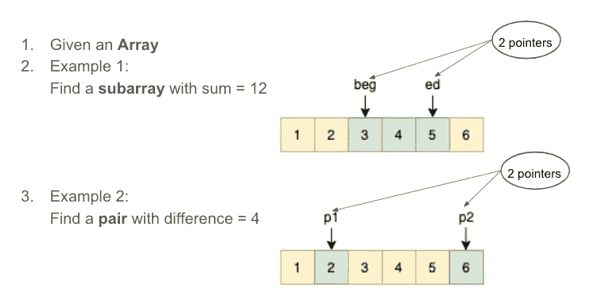

我们使用双指针方法的例子

> **那么，到底什么是*两个指针*的做法呢？** 从上面给出的例子来看，两个指针的使用给出了该方法的名称——*两个指针*的方法*。*在*双指针*方法中，我们使用 2 个指针，并在数组上高效地移动它们*以找到想要的解。*

*然而，仍然有一些问题需要澄清:“有效地”是什么意思？—在大多数情况下，两个指针都会遍历数组，对每个元素只访问一次。换句话说，每个元素被访问两次，每个指针访问一次。*

*因此，在大多数情况下，两点法的时间复杂度是 O(n)。*

*为了帮助我们理解这种方法是如何工作的，让我们看一个例子。*

## *例子*

*假设我们有一个数组= [1，2，3，4，5，6]，我们需要找到一个 sum = 9 的子数组。因此，我们得到了以下数据:*

*   *Array = [1，2，3，4，5，6]*
*   *期望= 9*

*让我们从方法开始。我们将初始化两个指针——“beg”和“ed”beg 代表开始，ed 代表结束。顾名思义，“beg”和“ed”指针将分别用于标记子数组的开始和结束。*

*我们首先将' *beg* '和' *ed* '放在数组的左边。如下图所示，子数组只包含一个值为 1 的元素。因此，子阵列的总和是 1。*

*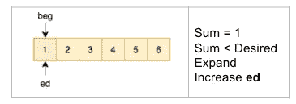*

*在上图中，由于总和小于期望值，即 9，我们决定扩展子数组。我们扩展子数组是因为我们想增加子数组中所有元素的总和。*

***为了展开，我们做了以下工作:***

*   *向右移动' *ed* '指针，即( *ed* ++)*
*   *将这个新元素添加到*总和*中，即*总和* += arr[ *ed**

*展开后，我们得到以下状态:*

*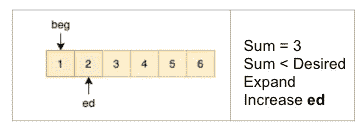*

*在上图中，总和的值是 3。由于 sum < desired, we expand again.*

*After expanding, we get the following state:*

*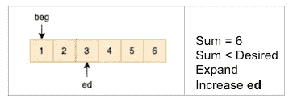*

*In the figure above, the value of the sum is 6\. Since sum < desired, we expand again.*

*After expanding, we get the following state:*

*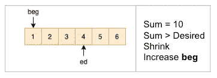*

*In the figure above, the value of the sum is 10\. Since the sum is greater than the desired value, i.e., 9, we decide to shrink the subarray. Shrinking the subarray will help us reduce the sum and increase the chances of finding the desired value.*

***要收缩，我们做如下操作:***

*   *用' *beg* 所指向的元素的值减少 *sum* ，即
    *sum*-= arr[*beg*]*
*   *向右移动' *beg* '指针，即( *beg* ++)*

*收缩后，我们得到以下状态:*

*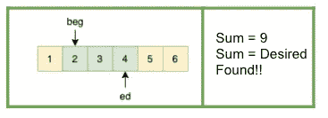*

*此时，我们看到 sum 的值是 9，等于期望值。*

*因此，使用 2 指针方法，我们已经成功地找到了给出期望的和 9 的子阵列。*

## *设计 2 指针方法时需要考虑的事项:*

*在使用 2 指针方法时，需要考虑的 4 个设计问题是:*

1.  ***什么时候扩大/缩小？***
2.  ***扩张/收缩将帮助我们实现什么？***
3.  ***如何扩大/缩小？***
4.  ***数组的顺序正确吗？***

*如果我们看看我们讨论过的例子，并试图回答这些问题；解决方案如下:*

1.  ***什么时候扩大/缩小？**当总和<需要时
    展开。
    当需要总和>时收缩。*
2.  *扩张/收缩将帮助我们实现什么？
    扩展帮助我们**增加**子阵列的大小和总和。
    缩小帮助我们**减小**子阵列的大小和总和。*
3.  ***如何扩大/缩小？**
    通过**增加 *ed*** 然后**增加 *sum*** *来展开。*
    收缩通过**减少*总和*** 然后**递增*求*** *。**
4.  ***数组的格式/顺序是否正确？**
    如果数组格式不正确，那么将违反问题 2 的答案。换句话说，如果数组格式不正确，我们就不能很有信心地说:
    i .扩展增加了 *sum* ，和，
    ii。缩小减少了*和**

*在我们的例子中，因为我们只有正数，我们知道*

1.  *扩展将使 *ed* 指向一个大于 0 的新值。由于该值将大于 0，*和*的值将总是在扩展时增加。*
2.  *缩小将会删除由 *beg* 指向的子数组的值。由于该值将大于 0， *sum* 的值将总是随着收缩而减小。*

*这是我们在解决 2 指针问题时需要记住的。有了这个细节，我们来试试 LeetCode 的几个问题。*

# *LeetCode 问题:*

## *问题 1:最小子阵列和*

*请阅读下面链接中的问题，并尝试自己解决。只有在你完成尝试后，才阅读解决方案。*

* [## 最小尺寸子阵列和- LeetCode

### 给定一个由 n 个正整数和一个正整数 s 组成的数组，求…

leetcode.com](https://leetcode.com/problems/minimum-size-subarray-sum/) 

我不会提供解决方案，因为它在 LeetCode 的[解决方案](https://leetcode.com/problems/minimum-size-subarray-sum/solution/)部分的方法#4 中有很好的解释。我还建议您从那里阅读代码，因为这是一个框架良好的代码，可以让您不必考虑各种极端情况。

不过，我会试着解释一个人遇到这样的问题应该如何思考。

问题中需要注意的几件事:

1.  我们得到了一个**数组，**和数组的每个元素都是一个**正数。**
2.  我们必须找到最小长度的**子阵列**。
3.  使得子阵列的**和≥ s**

这意味着我们必须**找到一个子阵列**，使得**满足条件**即 **sum ≥ s** 。这清楚地表明我们应该使用 **2 指针方法**。

事实上，这个问题与我们上面讨论的例子非常相似。如果我们尝试回答上面看到的 4 个设计问题，我们看到的唯一区别是第一个问题的答案，即:

1.  **什么时候扩大/缩小？**
    当总和<需要时展开。
    收缩当 ***总和≥期望*** 时。(注意区别)

除此之外，其他一切都保持不变。

**边题 1:** 对于这个 LeetCode 问题，你认为数组的格式/顺序是正确的吗？
**提示:**你能很有信心地说，膨胀时和增加，收缩时和减少吗？
**答:是的，**因为所有的值都是正的，所以和在扩大时增加，在缩小时减少。因此，数组的格式/顺序是正确的。

**附带问题 2:** 如果数组有负值，你认为数组的格式/顺序是否正确？
**Ans:** **不，**那么，这个数组就不会有正确的顺序。我们可以扩展数组，使其包含一个可能会减少总和的负值。因此，在扩展时，总和会减少，因此我们可以得出结论，数组的格式不正确。

## 问题 2:数组中的 K-diff 对

这个问题可以使用比 2 指针方法更好的方法来解决。然而，既然我们已经讨论了 2 指针方法，我将尝试使用 2 指针方法来解决它。以下是问题的链接:

 [## 数组中的 K-diff 对- LeetCode

### 给定整数数组 nums 和整数 k，返回数组中唯一 k-diff 对的数量。一个 k 差分对…

leetcode.com](https://leetcode.com/problems/k-diff-pairs-in-an-array/) 

需要注意的几件事:

1.  给定一个**整数数组**
2.  找到**唯一的**对，
3.  使得**对之间的间隙为 k**

我们看到已经给了我们一个数组，我们需要找到一对。这是我们可以使用 2 指针方法的另一个迹象。

我们会想到一个解决方案，其中第一个指针将引用该对的第一个值，第二个指针将引用该对的第二个值。我们的差距将被定义为:**差距= |arr[ed]-arr[beg]|**

请参考下图，以便更好地理解:

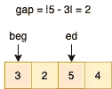

执行期间数组和指针的假想快照

现在，让我们尝试阐明 4 个设计问题:

1.  **什么时候扩大/缩小？** 当所需间隙<时膨胀
    当所需间隙≥时收缩
2.  **扩张/收缩将帮助我们实现什么？** 膨胀**要么增大**间隙，要么保持不变。
    收缩**减小**间隙或保持不变。
3.  **如何扩大/缩小？** 递增扩展 *ed* 递增收缩 *beg*
4.  **数组的格式/顺序是否正确？** 让我们想象一下，在执行我们的算法时，我们遇到了如下图所示的假设情况:

执行期间数组和指针的假想快照

如果我们遇到这样的情况，那么在扩展时，我们将增加 *ed* 。这将导致 *ed* 指向一个比之前指向的更小的值。这样一来，差距就会缩小。为了清楚起见，请看下图:

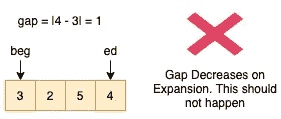

膨胀时间隙减小——违反了设计问题 2。

或者，如果我们收缩， *beg* 将开始指向一个比它之前指向的值更大的值，并且差距将增大。为了清楚起见，请看下图:

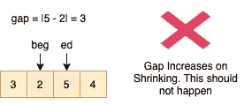

收缩时间隙增大——违反了设计问题 2。

这意味着当前阵列违反了第二个设计问题。**因此，数组的格式/顺序不正确。**

> 在这种情况下，我们用**对**数组进行排序，使其变成正确的格式。

将数组按升序排序后，可以说数组的顺序是正确的，不违反第二个设计问题的答案。通过查看下图可以更好地理解这一点:

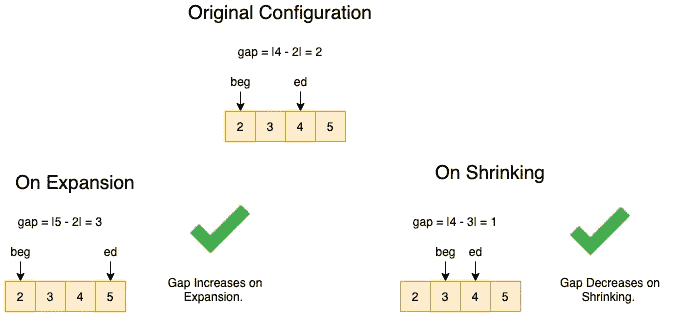

在上图中，我们可以观察到:

1.  在扩展时， *ed* 将开始指向一个大于或等于它所指向的值的值。因此，在膨胀时，间隙将增加或保持不变。
2.  收缩时， *beg* 将开始指向一个大于或等于它所指向的值的值。因此，在膨胀时，间隙将减小或保持不变。

到目前为止，我们已经处理好了几乎所有的事情，除了一件事:“我们还没有讨论处理这一对的独特性。”好吧，让我们试着想出一个算法，看看我们将如何处理这种情况:

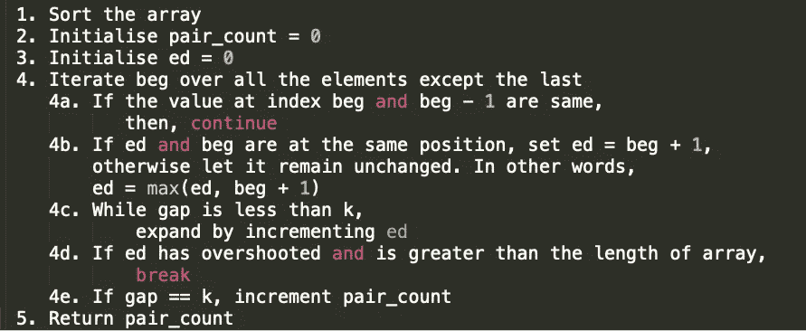

k-diff 对的算法。

让我们以 array = [1，1，1，2，3]和 k = 1 为例，通过它找出解决方案。下图用这个例子来解释算法。在图的左上方，我们可以看到指针和数组的初始状态。箭头显示了算法的步骤(上面给出了图)。这些步骤将数组和指针的状态更改为新的状态。

请花些时间浏览下面给出的图表并理解这种方法。

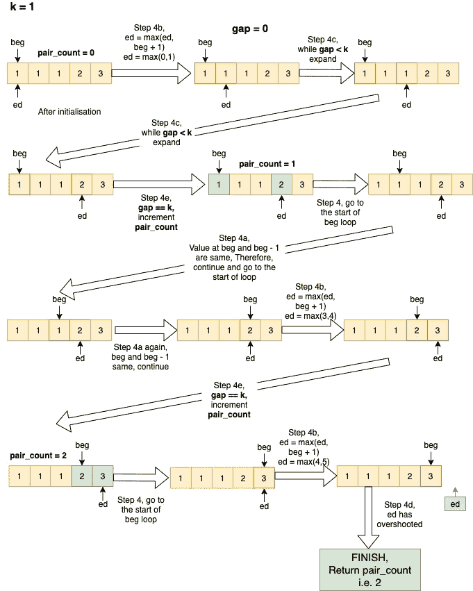

k-diff 对 2 指针演示

正如我们在上面的图像中看到的，唯一的对正在被自己处理。这是由于算法的步骤 4a 而发生的。它检查 beg 指向的前一个值是否与当前值相同，然后已经计算了该值的有效对，没有必要再次计算对。

**时间复杂度:**由于排序，算法整体时间复杂度为 **O(nlogn)** 。然而，只有双指针方法的复杂度是 O(n ),因为两个指针— *beg* 和 *ed —* 只遍历数组一次。

**代码:**代码参见[此](https://leetcode.com/problems/k-diff-pairs-in-an-array/discuss/995934/Java-two-pointers)链接。

上面的代码将有助于理解解决方案。但是，在上面的代码中，*右*指针(或 *ed* )被初始化为**右=左+ 1** 。在我们的例子中，我们将其定义为 **ed = max(ed，beg + 1)** 。这两种解决方案都可行，但进一步分析它们将是一个很好的练习。

**我的感受**:如果我考虑一个 arr = [1，1，1，2，3，5，6]和 k = 4 的例子，我发现如果我们使用
**ed = max(ed，beg + 1)** 可以避免一些多余的运算。然而，如果不是这样，请让我知道。我非常感谢你能提供的任何帮助。😃

## 结论

在这篇博客中，我们试图理解解决与 2 指针相关的问题的方法。通过更多的练习，读者将会成功地识别一个两个指针的问题，并仔细思考 4 个设计问题，提出一个解决问题的算法。这种思考 4 个设计问题的技巧不是一个标准。这是我在试图解决此类问题时遵循的原则。请随意提出你自己处理这个问题的方法。*