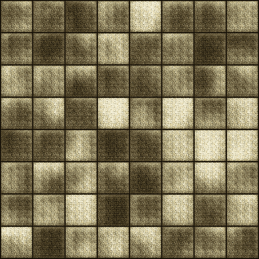

# “Art gan”——使用深度学习和 Pytorch 的基于艺术图像的简单生成对抗网络

> 原文：<https://medium.com/analytics-vidhya/artgan-a-b77ecb1bc25a?source=collection_archive---------1----------------------->


> 生成对抗网络，简称 GANs，是一种使用深度学习方法(如卷积神经网络)进行生成建模的方法。

# 简介:

这个关于“ARTGAN”的项目是一个简单的生成性对抗网络——基于艺术图像使用[深度学习](https://en.wikipedia.org/wiki/Deep_learning) & [PyTorch](https://pytorch.org/) 。这里我们使用 [matplotlib](https://matplotlib.org/) ， [PyTorch](https://pytorch.org/) 来实现我们的项目。

生成对抗网络，简称 GANs，是一种使用深度学习方法(如卷积神经网络)进行生成建模的方法。这种技术学习生成具有与给定训练集的训练集相同的统计数据的新数据。

生成建模是机器学习中的一项无监督学习任务，它涉及自动发现和学习输入数据中的规律或模式，使得模型可以用于生成或输出新的示例，这些示例很可能是从原始数据集中提取的。

如果有人让你想象一个人，我们的想象力会把我们引向什么？我们在头脑中创造了一个人吗？嗯，不。人类的大脑总是倾向于想到他们已经认识的人，所以我们会想到我们亲近的人或我们最后一次遇见的人，甚至可能是我们遇见的某个随机的人，但我们无法想到我们的眼睛从未捕捉到图像的人。这个任务官方可以用这个技术来完成，GAN。为了更好的理解，让我们举个例子。

假设我们有一个人的随机照片，现在这张照片可以很容易地使用 GAN 来创建逼真的假人类照片。这些照片看起来是真实的，而且是完全不同的人，但只是对另一张照片的处理。

GANs 是一种训练生成模型的聪明方法，它通过将问题框架化为具有两个子模型的监督学习问题，第一个是生成器模型，通过它我们可以训练生成新的示例，第二个是鉴别器模型，通过它我们可以将示例分类为真实的(来自领域)或虚假的(生成的)。这两个模型在一个零和游戏中一起训练，对抗，直到鉴别器模型被愚弄了大约一半的时间，这意味着生成器模型正在生成似是而非的例子。

GANs 是一个令人兴奋且快速变化的领域，它实现了生成模型的承诺，能够在一系列问题领域生成逼真的示例，最显著的是在图像到图像的翻译任务中，例如将夏天的照片翻译成冬天的照片或白天到夜晚的照片，创建不同场景的幻觉，以及生成甚至人类都无法辨别的物体、场景和人物的真实感照片。

在这里，我的整个项目是操纵图纸。

# 数据集:

我们可以使用 opendatasets 库从 Kaggle 下载数据集。opendatasets 使用 Kaggle 官方 API 从 Kaggle 下载数据集。按照下面提到的步骤查找您的 API 凭证:

1.登录[https://kaggle.com/,](https://kaggle.com/,)，然后点击右上角的个人资料图片，从菜单中选择“我的账户”。

2.向下滚动到“API”部分，然后单击“创建新的 API 令牌”。这将下载一个包含以下内容的文件 kaggle.json:

{"username ":"您的 _KAGGLE_USERNAME "，" key ":"您的 _KAGGLE_KEY"}

3.当您运行 opendatsets.download 时，会要求您输入您的用户名& [Kaggle](https://www.kaggle.com/) API，您可以从步骤 2 中下载的文件中获得该用户名。注意，您只需要下载 kaggle.json 文件一次。在 Google Colab 上，还可以使用 files 选项卡上传 kaggle.json 文件，所需的凭证会被自动读取。

```
!pip install opendatasets --upgrade --quietimport opendatasets as oddataset_url = 'https://www.kaggle.com/ikarus777/best-artworks-of-all-time'od.download(dataset_url)
```

# 将数据集导入 PyTorch:

## 将数据集导入 PyTorch

该数据集由两个文件夹组成:

图像:该文件夹包含艺术家文件夹中的所有图像文件。

调整大小:该文件夹包含一个文件夹中的所有图像文件。

由于 GAN 将数据分类为真实或虚假，因此不需要艺术家类别，所以我只使用了调整过大小的文件夹中的文件。使用 torchvision 的 ImageFolder 类。

```
data_dir = '/content/best-artworks-of-all-time/resized/'import osfor cls in os.listdir(data_dir):print(cls, ':', len(os.listdir(data_dir + '/' + cls)))from torchvision.datasets import ImageFolderdataset = ImageFolder(data_dir)len(dataset)
```

# 让我们来看看数据集中的一些艺术图片:

```
import matplotlib.pyplot as plt%matplotlib inlineimg, label = dataset[0]plt.imshow(img)img, label = dataset[500]plt.imshow(img)img, label = dataset[741]plt.imshow(img)
```


# 制作批量图片:

1.首先，我将调整所有图像的大小并居中裁剪，以确保它们都具有相同的形状和大小。

2.然后转换成张量，归一化。

3.然后创建数据加载器。

4.然后看一些样品。

```
import torchvision.transforms as ttfrom torch.utils.data import DataLoaderimage_size = 64batch_size = 128stats = (0.5, 0.5, 0.5), (0.5, 0.5, 0.5)train_ds = ImageFolder(data_dir, transform=tt.Compose([tt.Resize(image_size),tt.CenterCrop(image_size),tt.ToTensor(),tt.Normalize(*stats)]))train_dl = DataLoader(train_ds, batch_size, shuffle=True, num_workers=3, pin_memory=True)from torchvision.utils import make_griddef denorm(img_tensors):return img_tensors * stats[1][0] + stats[0][0]def show_images(images, nmax=64):fig, ax = plt.subplots(figsize=(8, 8))ax.set_xticks([]); ax.set_yticks([])ax.imshow(make_grid(denorm(images.detach()[:nmax]), nrow=8).permute(1, 2, 0))def show_batch(dl, nmax=64):
  for images, _ in dl:
    show_images(images, nmax)
    breakshow_batch(train_dl)
```


一批图像

# 使用 GPU:

为了无缝地使用 GPU(如果有可用的话)，我们定义了两个助手函数(get_default_device & to_device)和一个助手类“DeviceDataLoader ”,以便将模型和数据移动到 GPU(如果有可用的话)。

```
def get_default_device():"""Pick GPU if available, else CPU"""if torch.cuda.is_available():return torch.device('cuda')else:return torch.device('cpu')def to_device(data, device):"""Move tensor(s) to chosen device"""if isinstance(data, (list,tuple)):return [to_device(x, device) for x in data]return data.to(device, non_blocking=True)class DeviceDataLoader():"""Wrap a dataloader to move data to a device"""def __init__(self, dl, device):self.dl = dlself.device = devicedef __iter__(self):"""Yield a batch of data after moving it to device"""for b in self.dl:yield to_device(b, self.device)def __len__(self):"""Number of batches"""return len(self.dl)import torchdevice = get_default_device()devicetrain_dl = DeviceDataLoader(train_dl, device)
```

# **鉴频器网络:**

鉴别器网络顾名思义，它鉴别被操纵的图片，将图像作为输入，并试图将它们分类为“真实的”或“生成的”。在这个意义上，它就像任何其他神经网络一样。我们将使用卷积神经网络(CNN ),它为每幅图像输出一个数字。此外，我们将使用步长 2 来逐渐减小输出要素地图的大小。因此，给我们的项目一个更清晰的视图。

```
import torch.nn as nndiscriminator = nn.Sequential(# in: 3 x 64 x 64nn.Conv2d(3, 64, kernel_size=4, stride=2, padding=1, bias=False),nn.BatchNorm2d(64),nn.LeakyReLU(0.2, inplace=True),# out: 64 x 32 x 32nn.Conv2d(64, 128, kernel_size=4, stride=2, padding=1, bias=False),nn.BatchNorm2d(128),nn.LeakyReLU(0.2, inplace=True),# out: 128 x 16 x 16nn.Conv2d(128, 256, kernel_size=4, stride=2, padding=1, bias=False),nn.BatchNorm2d(256),nn.LeakyReLU(0.2, inplace=True),# out: 256 x 8 x 8nn.Conv2d(256, 512, kernel_size=4, stride=2, padding=1, bias=False),nn.BatchNorm2d(512),nn.LeakyReLU(0.2, inplace=True),# out: 512 x 4 x 4nn.Conv2d(512, 1, kernel_size=4, stride=1, padding=0, bias=False),# out: 1 x 1 x 1nn.Flatten(),nn.Sigmoid())discriminator = to_device(discriminator, device)
```

# 发电机网络:

生成器的输入通常是向量或随机数矩阵(称为潜在张量)，用作生成图像的种子。生成器会将形状为(128，1，1)的潜在张量转换为形状为 3 x 28 x 28 的图像张量。为了实现这一点，我们将使用 PyTorch 中的 ConvTranspose2d 图层，该图层被执行为转置卷积(也称为反卷积)。

```
latent_size = 128generator = nn.Sequential(# in: latent_size x 1 x 1nn.ConvTranspose2d(latent_size, 512, kernel_size=4, stride=1, padding=0, bias=False),nn.BatchNorm2d(512),nn.ReLU(True),# out: 512 x 4 x 4nn.ConvTranspose2d(512, 256, kernel_size=4, stride=2, padding=1, bias=False),nn.BatchNorm2d(256),nn.ReLU(True),# out: 256 x 8 x 8nn.ConvTranspose2d(256, 128, kernel_size=4, stride=2, padding=1, bias=False),nn.BatchNorm2d(128),nn.ReLU(True),# out: 128 x 16 x 16nn.ConvTranspose2d(128, 64, kernel_size=4, stride=2, padding=1, bias=False),nn.BatchNorm2d(64),nn.ReLU(True),# out: 64 x 32 x 32nn.ConvTranspose2d(64, 3, kernel_size=4, stride=2, padding=1, bias=False),nn.Tanh()# out: 3 x 64 x 64)
```

# 让我们看看我们的第一个创成式图像是什么样子的:

```
xb = torch.randn(batch_size, latent_size, 1, 1) # random latent tensorsfake_images = generator(xb)print(fake_images.shape)show_images(fake_images)
```


第一张创成式图片

好像真的很穷。因此，现在我们必须训练我们的模型。

# 甄别培训:

由于鉴别器是二进制分类模型，我们可以使用二进制交叉熵损失函数来量化它在真实图像和生成图像之间的区分程度。

## 以下是训练鉴别器的步骤

1.如果图像是从真实的 MNIST 数据集中选取的，我们希望鉴别器输出 1，如果是使用生成器网络生成的，则输出 0。

2.我们首先传递一批真实图像，并计算损失，将目标标签设置为 1。

3.然后，我们将一批假图像(使用生成器生成)传递给鉴别器，并计算损失，将目标标签设置为 0。

4.最后，我们将两个损失相加，并使用总损失来执行梯度下降，以调整鉴别器的权重。

值得注意的是，在训练鉴别器时，我们不改变生成器模型的权重(opt_d 只影响鉴别器. parameters())

```
def train_discriminator(real_images, opt_d):# Clear discriminator gradientsopt_d.zero_grad()# Pass real images through discriminatorreal_preds = discriminator(real_images)real_targets = torch.ones(real_images.size(0), 1, device=device)real_loss = F.binary_cross_entropy(real_preds, real_targets)real_score = torch.mean(real_preds).item()# Generate fake imageslatent = torch.randn(batch_size, latent_size, 1, 1, device=device)fake_images = generator(latent)# Pass fake images through discriminatorfake_targets = torch.zeros(fake_images.size(0), 1, device=device)fake_preds = discriminator(fake_images)fake_loss = F.binary_cross_entropy(fake_preds, fake_targets)fake_score = torch.mean(fake_preds).item()# Update discriminator weightsloss = real_loss + fake_lossloss.backward()opt_d.step()return loss.item(), real_score, fake_score
```

# 发电机培训:

由于生成器的输出是图像，我们如何训练生成器并不明显。这就是我们使用一个相当优雅的技巧的地方，即使用鉴别器作为损失函数的一部分。它是这样工作的:

1.我们使用生成器生成一批图像，并将其传递给鉴别器。

2.我们通过将目标标签设置为 1(即实数)来计算损失。我们这样做是因为生成器的目的是“愚弄”鉴别器。

3.我们使用损失来执行梯度下降，即改变生成器的权重，因此它在生成类似真实的图像方面变得更好，以“愚弄”鉴别器。

```
def train_generator(opt_g):# Clear generator gradientsopt_g.zero_grad()# Generate fake imageslatent = torch.randn(batch_size, latent_size, 1, 1, device=device)fake_images = generator(latent)# Try to fool the discriminatorpreds = discriminator(fake_images)targets = torch.ones(batch_size, 1, device=device)loss = F.binary_cross_entropy(preds, targets)# Update generator weightsloss.backward()opt_g.step()return loss.item()from torchvision.utils import save_imagesample_dir = 'generated'os.makedirs(sample_dir, exist_ok=True)def save_samples(index, latent_tensors, show=True):fake_images = generator(latent_tensors)fake_fname = 'generated-images-{0:0=4d}.png'.format(index)save_image(denorm(fake_images), os.path.join(sample_dir, fake_fname), nrow=8)print('Saving', fake_fname)if show:fig, ax = plt.subplots(figsize=(8, 8))ax.set_xticks([]); ax.set_yticks([])ax.imshow(make_grid(fake_images.cpu().detach(), nrow=8).permute(1, 2, 0))fixed_latent = torch.randn(64, latent_size, 1, 1, device=device)save_samples(0, fixed_latent)
```

# 完整训练循环:

让我们定义一个拟合函数，为每批训练数据一前一后地训练鉴别器和生成器。我们将使用带有一些定制参数(betas)的 Adam 优化器，这些参数对于 GANs 非常有效。我们还将定期保存一些样本生成的图像，以供检查。


GAN 架构

```
from tqdm.notebook import tqdmimport torch.nn.functional as Fdef fit(epochs, lr, start_idx=1):torch.cuda.empty_cache()# Losses & scoreslosses_g = []losses_d = []real_scores = []fake_scores = []# Create optimizersopt_d = torch.optim.Adam(discriminator.parameters(), lr=lr, betas=(0.5, 0.999))opt_g = torch.optim.Adam(generator.parameters(), lr=lr, betas=(0.5, 0.999))for epoch in range(epochs):for real_images, _ in tqdm(train_dl):# Train discriminatorloss_d, real_score, fake_score = train_discriminator(real_images, opt_d)# Train generatorloss_g = train_generator(opt_g)# Record losses & scoreslosses_g.append(loss_g)losses_d.append(loss_d)real_scores.append(real_score)fake_scores.append(fake_score)# Log losses & scores (last batch)print("Epoch [{}/{}], loss_g: {:.4f}, loss_d: {:.4f}, real_score: {:.4f}, fake_score: {:.4f}".format(epoch+1, epochs, loss_g, loss_d, real_score, fake_score))# Save generated imagessave_samples(epoch+start_idx, fixed_latent, show=False)return losses_g, losses_d, real_scores, fake_scoreslr = 0.0002epochs = 300history = fit(epochs, lr)losses_g, losses_d, real_scores, fake_scores = history# Save the model checkpointstorch.save(generator.state_dict(), 'G.pth')torch.save(discriminator.state_dict(), 'D.pth')
```

# 现在开始观看一些创成式图片…随着时代数量的增加，我们看到了进步:

```
from IPython.display import ImageImage('./generated/generated-images-0001.png')
```



第一时代图片

```
Image('./generated/generated-images-0031.png')
```


第 31 时代图片

图像质量在第 30 代之后有了很大的提高。

```
Image('./generated/generated-images-0090.png')
```


第 90 代图片

```
Image('./generated/generated-images-0201.png')
```


第 201 个时代图片

```
Image('./generated/generated-images-0300.png')
```


最后一个纪元

# 结果:

1.制作一个关于创成式图片的视频。

2.图表

```
import cv2import osvid_fname = 'art_gans_training.avi'files = [os.path.join(sample_dir, f) for f in os.listdir(sample_dir) if 'generated' in f]files.sort()out = cv2.VideoWriter(vid_fname,cv2.VideoWriter_fourcc(*'MP4V'), 5, (530,530))[out.write(cv2.imread(fname)) for fname in files]out.release()
```

视频制作代码，看到随着时代的进步图片。

```
plt.plot(losses_d, '-')plt.plot(losses_g, '-')plt.xlabel('epoch')plt.ylabel('loss')plt.legend(['Discriminator', 'Generator'])plt.title('Losses');
```


```
plt.plot(real_scores, '-')plt.plot(fake_scores, '-')plt.xlabel('epoch')plt.ylabel('score')plt.legend(['Real', 'Fake'])plt.title('Scores');
```


# 视频链接:

> [https://github . com/soham 2707/art gan/blob/master/art _ gans _ training . avi](https://github.com/soham2707/ARTGAN/blob/master/art_gans_training.avi)

# 结论:

这里我们看到，伪图像的质量是好的，但是伪图像的预测值不是很好。因此，现在我们可以使用较低的学习率(lr)来运行它，大约 80-100 个时期可能能够增加伪图像的预测值。这是所有关于执行甘在绘画操纵创造完全不同的打印出来。同样可以在人类图片上实现或生成艺术。

# 项目链接:

> https://github.com/soham2707/ARTGAN.git