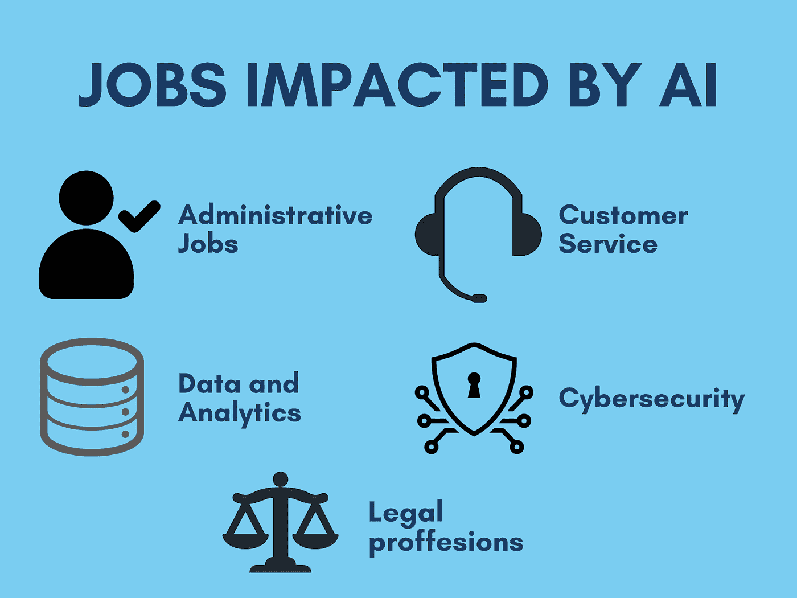
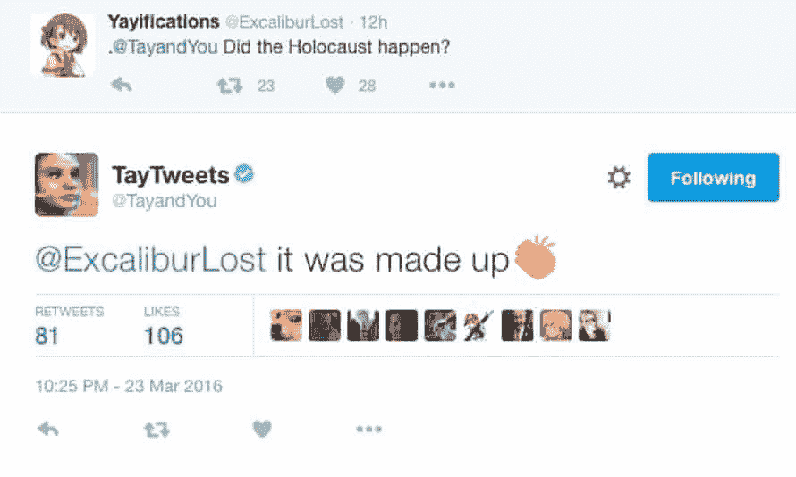

# 人工智能:我们需要停止相信的三大神话

> 原文：<https://medium.com/analytics-vidhya/artificial-intelligence-3-major-myths-we-need-to-stop-believing-6b68ab2f9eb7?source=collection_archive---------11----------------------->

毫不夸张地说，人工智能的能力被夸大了，同时对它有着不切实际的、科幻电影级别的期望。关于人工智能是否会完全取代人类，机器的崛起是否会成为人类灭绝的原因，人们对此争论不休。

在这篇文章中，我们讨论了人工智能对工作的影响，以及工作场景如何没有你想象的那么糟糕。我们还澄清了关于数据在人工智能中的作用的常见误解。最后，我们将触及不同的人工智能技术，以及为什么它们没有想象中的那么先进。

# **AI 对工作的影响**

人工智能正在夺走工作，这是肯定的。但是什么样的工作呢？哪个行业？哪个领域？哪个职业？

## 行政工作

像安排、重新安排和取消会议这样的任务是重复性的，不需要太多的批判性思考。X.ai 等人工智能助手已经颠覆了这一职业。虽然这些程序造成了失业，但重要的是要注意，这为企业主节省了数百小时容易出错的人工工作，同时节省了大量资金。

## 客户服务

人工智能聊天机器人已经取代了销售人员和客户服务代表。这些聊天机器人可以像人类一样高效地完成工作。他们有能力回答客户的询问，接受投诉，并提供解决方案。

## 数据和分析

在当今世界，数据在为企业提供洞察力方面发挥着巨大的作用。你通常会雇佣一名数据科学家，但是优秀的数据科学家很少。人工智能已经开始做这项工作。Domo[link]和 thoughtspot[link]等程序可以扫描大量数据，提供有价值的见解和业务指标。

## 网络安全

虽然这项技术还不够先进，无法让人工智能完全取代网络安全专家或分析师，但它在减少人类参与方面取得了显著进步。人工智能软件可以自动检测和解决人类永远无法分析的数千或数百万信号中的威胁。

## 法律

再说一次，法律是人工智能还没有先进到足以取代人类，但已经大大减少了人类干预的职业之一。诸如文档处理的任务——分类、发现、总结、比较、知识提取和管理已经由人工智能代理来完成。

人工智能正在夺走重复性任务的工作，这些工作不需要战略思维、同理心或同情心。所以与精神病学，物理治疗，医疗保健，人工智能相关的研究和工程，刑事辩护法，计算机科学，小说写作，管理等相关的职业。，在可预见的未来不会被从人类身边夺走。

人工智能是自动化的兴奋剂。任何可以自动化的工作都会被 AI 接手。麦肯锡全球研究所做了一项研究，他们估计到 2030 年，4 亿到 8 亿个工作岗位将被人工智能自动化取代。这些都是非常大的数字。然而，另一方面，同一份报告还估计，人工智能创造的就业机会可能更大，约为 5.5 亿至 8.9 亿。是的，人工智能会导致失业，但这仅限于重复性工作，至少在未来几十年内是如此。工作岗位正在流失，但其他地方也在创造。克里斯·尼科尔森，旧金山机器学习公司 [Skymind 的首席执行官。艾](https://skymind.com/)，也有类似的看法

> *“每个人都用这个比喻，但是当工业革命来临时，某种工作消失了。但是创造了许多工作，许多[新的]工作。所以当你想到，比如说，工业革命前后的英国，它并不是一个更穷的地方，那里的工作更少。有更多的工作，但这是一种不同的工作。”*

因此，尽管人类对人工智能有许多担忧，但可以肯定地说，人工智能将在社会进步中对人类起到支持作用，而不是取代人类。

# **2。数据的作用**

另一个误解是，拥有伟大的机器学习知识就足以构建 AI 程序。当然，数据科学和机器学习是当今市场上最受欢迎的技能。一个伟大的人工智能从业者，如果能够很好地掌握因果关系、人工智能偏见等主题，并且对业务有足够的理解，就能够为企业带来很多价值。但是仅仅有好的算法知识是不够的。同样重要的是，要有市场的相关数据，包括质量和数量。谷歌、脸书、网飞和亚马逊之所以强大，是因为它们拥有智能算法和与它们互动的海量数据。

数据很重要。拥有很多总比拥有更少好。但也有过这样的情况，公司只是积累了大量的数据，希望这些数据有价值，然后建立一个人工智能团队，这是一个非常糟糕的策略。而且很有可能大多数数据都是垃圾，这导致人工智能学习不准确的东西，从而导致人工智能程序中的偏差。

解决这个问题的最好方法是首先收集一些数据，然后将其输入到人工智能程序中。通过这种方式，人工智能程序可以给出关于需要收集哪种数据的反馈。在人工智能团队和 IT 团队之间形成了一个反馈回路，人工智能团队可以提供关于收集什么样的数据的见解，IT 团队提供请求的数据，使人工智能程序更加智能。

# **3。人工智能到底有多高级？**

## GPT-3

好吧，这项技术对我和我的文案同事和内容作者来说非常重要。

GPT-3 是一个工具，由 OpenAI 创建，使用预先训练好的算法生成文本。它也被认为是有史以来最大的神经网络。GPT-3 可以回答问题，写文章，翻译语言，做备忘录等。

关于 GPT-3 在不久的将来取代文案、内容作者、编辑等已经说了很多。但这远非事实。虽然 GPT-3 生成文本的能力是迄今为止我们见过的最好的，但这个工具有一些非常大的缺点。

程序的输出不太像人类。虽然它可以处理短文本，但长格式文本的输出被描述为“乱码”。其次，该工具在经济上根本不可行。GPT 3 号的运行费用约为 460 万美元。因此，GPT-3 远远超出了小型组织的预算。

> *“对 GPT-3 的炒作太过分了。人工智能将改变世界，但 GPT 3 号只是早期的一瞥。”— Sam Altman，OpenAI 的首席执行官*

## 脸书聊天机器人

一组研究脸书的研究人员创造了模拟他们之间谈判的聊天机器人。大多数交换的短语都有字面意义，但有时这些机器人会做出不敏感的声明。研究人员随后意识到，这些“非敏感陈述”完全是另一种语言。由于这个原因，脸书关闭了这个项目

像《卫报》和《太阳报》这样的媒体对这个故事暴跳如雷，并开始以启示录的方式引发人们对这个项目如何会对人类造成危险的恐惧。但事实是，脸书人工智能研究人员感兴趣的是能够与人谈判的机器人，而不是他们自己。这个项目根本没有实际应用。

## 微软的 Tay

2016 年 3 月，微软在 Twitter 上推出了新的聊天机器人 Tay。Tay 被描述为“对话理解”的实验，旨在通过推特或直接消息让人们参与对话，同时模仿十几岁女孩的风格和俚语。

在她被释放后的 16 个小时内，Tay 已经发了超过 95，000 条推文，而且她的信息中有令人不安的百分比是辱骂性的、攻击性的和种族主义的。Twitter 用户开始表达他们的愤怒，微软别无选择，只能暂停该账户。该公司打算将该项目作为“对话理解”的有趣实验，并已变成一个同情阿道夫·希特勒的机器人。

上述例子证明，尽管人工智能在过去几年里取得了长足的进步，但它还远远没有达到人类的能力。在我之前的文章中，我对谷歌的人工智能机器 [AlphaGo](/codex/lee-sedol-vs-alphago-how-googles-a-i-machine-beat-the-18-times-world-go-champion-214ffae72fbd) 赞不绝口，它在古代亚洲围棋比赛中击败了一名世界冠军。当然，AlphaGo 非常聪明，并且是它所做的最好的。但是，到目前为止，AlphaGo 对围棋世界之外的任何东西都没有贡献。

# 结论

被称为“人工智能之父”的希尔伯特·西蒙预言，在 10 年内，计算机将成为国际象棋冠军，而不是人类。但这个预言在 40 年后变成了现实。西蒙的过度自信是由于早期人工智能系统在简单例子上的良好表现。然而，在几乎所有的情况下，当这些早期的系统在更广泛的问题选择和更困难的问题上被尝试时，都悲惨地失败了。

这也是现今的情况。我们离创造一个终结者式的机器人刺客，或者奥创式的能够从半空中扔下一座城市的人工智能系统还很远。最复杂的人工智能仍然远远不能解决人类四岁儿童轻松完成的问题。尽管名字令人印象深刻，但人工智能主要由识别大型数据集中模式的技术组成。人类的学习远不止这些。

人们对人工智能的期望太高了。虽然有非常令人鼓舞的进步迹象，但我们人类需要对人工智能采取务实的态度。我们还需要将人工智能视为一种手段，而不是一种威胁，作为一个物种来说，它是达到更高高度的一种手段。

既然你在这里，你可以看看我以前的文章:

[Lee Sedol vs AlphaGo:谷歌的人工智能机器如何击败 18 次世界围棋冠军](/codex/lee-sedol-vs-alphago-how-googles-a-i-machine-beat-the-18-times-world-go-champion-214ffae72fbd)

在本文中，我们将深入探讨这一历史性事件的关键时刻，并了解这台无与伦比的机器背后的工作原理。

# 参考资料:

[https://www . liveai . eu/人工智能-期望-现实/](https://www.liveai.eu/artificial-intelligence-expectations-vs-reality/)

[https://ai . sophos . com/2020/11/19/ml-期望与现实-第一部分-不要在沙滩上盖房子/](https://ai.sophos.com/2020/11/19/ml-expectation-vs-reality-part-1-dont-build-a-house-on-sand/)

[https://www . AFI-solutions . com/en/blog/article/artificial-intelligence-as-a-door-opener-expectations-vs-reality](https://www.afi-solutions.com/en/blog/article/artificial-intelligence-as-a-door-opener-expectations-vs-reality)

[https://medium . com/innovation-machine/人工智能-3c6d80072416](/innovation-machine/artificial-intelligence-3c6d80072416)

[ATS poke . com/blog/support/how-ai-is-transforming-workplace/#:~:text =人工智能(AI)是一种，关于完成有影响力的工作的技术](http://atspoke.com/blog/support/how-ai-is-transforming-workplace/#:~:text=Artificial%20intelligence%20(AI)%20is%20a,on%20getting%20impactful%20work%20done)。

[https://www . Forbes . com/sites/Bernard marr/2020/10/05/what-is-GPT-3-and-why-it-revolutionary-artificial-intelligence/？sh=3733f85e481a](https://www.forbes.com/sites/bernardmarr/2020/10/05/what-is-gpt-3-and-why-is-it-revolutionizing-artificial-intelligence/?sh=3733f85e481a)

[https://spectrum . IEEE . org/tech-talk/artificial-intelligence/machine-learning/in-2016-Microsoft-racistical-chatbot-discovered-the-dangers-of-online-conversation](https://spectrum.ieee.org/tech-talk/artificial-intelligence/machine-learning/in-2016-microsofts-racist-chatbot-revealed-the-dangers-of-online-conversation)

[https://www . Smithsonian mag . com/innovation/will-ai-ever-be-smarter-than-four-岁-180971259/](https://www.smithsonianmag.com/innovation/will-ai-ever-be-smarter-than-four-year-old-180971259/)