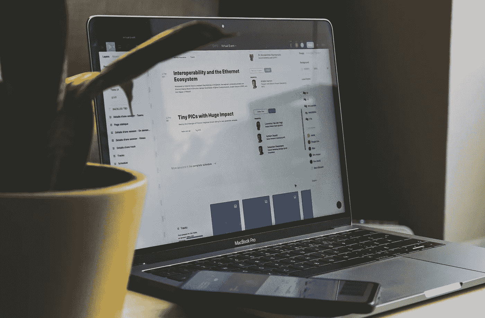

# 人工智能在我们的日常生活中…

> 原文：<https://medium.com/analytics-vidhya/artificial-intelligence-in-our-day-to-day-life-aff9d529b430?source=collection_archive---------5----------------------->

随着大多数技术世界对人工智能及其可以为不同企业和组织增加的价值狂热，我们在日常活动中看到了多少人工智能。

当你在**早晨**醒来时:

*   用面部识别打开你的手机
*   查看您的 twitter 订阅源:您的订阅源由模型定义，以实现最大程度的互动
*   看看你的脸书帖子，也有类似的个性化

吃早餐时，你问 Alexa/Siri 几点了

*   它理解、解释、查询并说出结果！(语音到文本和文本到语音)

**去办公室:**在那个美好的非 Covid 时代，要么是:

*   谷歌地图帮助我们确定去办公室的最佳路线
*   或者，优步告诉我们出租车的预期等待时间

两人都在实时观察交通模式，比较历史上的多种选择，并给出可能的最佳路线

**在办公室:**在你的办公室里，你可能会:

*   用于办公室进入的面部识别技术

你的第一个接触点是 Google.com 或者微软的 Outlook

*   谷歌的自动完成搜索，最佳结果优先，通过了解你的搜索历史等个性化
*   Outlook 通过提供自动回复、自动完成句子或最重要的垃圾邮件过滤

您可能正在使用 MS Teams 或 Zoom meetings，它们具有以下特性:

*   将会议讨论自动转录为可搜索文本
*   如果你的房间和我的一样乱，视频中的背景会自动模糊:)
*   或者它试图通过实时消除背景噪音来提高语音质量！

您的公司中可能有一些部门正在通过以下方式使用人工智能来支持员工:

*   自动发送他们的票
*   聊天机器人提供用户查询的答案等。

也许你在网上看到的所有东西都会被人工智能以某种形式触及

*   它可能是你在你最喜欢的搜索引擎上看到的广告的相关性
*   或者你得到的媒体博客推荐
*   或者 Linkedin 订阅源和他们征求的关于每个帖子的建议(为了了解你的喜好/厌恶)

回到家里，喝一杯热茶/咖啡

*   你可以观看任何 OTT 平台，如 Prime、网飞、Hotstar，这些平台会推荐最适合你口味的电影和连续剧，你可能会通过个性化模型了解这些内容
*   在进行网上购物的信用卡交易时，银行 AI 会验证和批准所有非欺诈性交易

如果你真的对技术感兴趣，你可能会

*   通过语音命令控制灯光和其他支持互联网的设备
*   你可能有人工智能供电的安全摄像头，它会发出警报，并在发现任何可疑活动时通知你，或者
*   你可能生活在一个智能家居中，它会根据人的存在和长期学习的偏好自动管理照明和温度

因此，简而言之，如果我们对它的使用持怀疑态度，那么知道你是如何频繁使用它以及它在大多数情况下增加了它所承诺的价值，应该会令人感到欣慰。许多基于人类的认知功能，如驾驶、语音识别、解决问题，也正在转移到基于人工智能的系统/机器人。

毫无疑问，随着这项技术成为主流和无处不在，并成为学术界、政府和整个社会的焦点领域，许多伦理问题正在被提出。