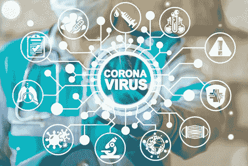
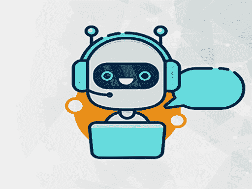
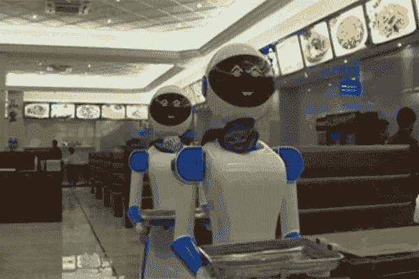

# 管理 Covid 资源的人工智能

> 原文：<https://medium.com/analytics-vidhya/artificial-intelligence-to-manage-covid-resources-64a69d632754?source=collection_archive---------13----------------------->

全世界都在和 covid 作对。预防这种病毒的感染或传播应该是一个国家和世界公民的最高优先事项。

在人口密集的地方提供 covid 治疗非常具有挑战性，因为与医院床位总数相比，人数太多了。在这种情况下，病床管理必须由权威机构或人工智能辅助系统来执行。

**患者诊断**

应自患者首次进行 covid 实验室检测开始对其进行追踪。在实验室报告交付给他之前，应收集病人的所有主要医疗细节。

**所需数据**

以下是需要收集的关于患者的一些最重要的医疗细节:

*   有高血压或高血糖病史。
*   当前氧气水平，体温
*   年龄
*   以前的医疗手术类型和日期
*   持续每日用药
*   他感觉到的所有与 covid 相关的症状
*   住所详细信息，如地址、带卫生间的房间数量
*   家庭详情，如家庭成员人数、每个人的年龄
*   感觉有症状的家庭成员总数和症状详情
*   接触者追踪

上述细节可用于做出有益的决定，采取预防措施治愈患者并阻止扩散。

**衍生动作**

基于上述数据收集，可以得出以下行动:

*   预约医生、病床或检疫中心的要求。
*   未来特殊药物的预测(如雷地昔韦)
*   目前或不久的将来是否有资格使用氧气床
*   频繁的监测对症状较轻的患者有效
*   状况改善的跟进频率
*   跟进其他家庭成员的情况
*   提前或紧急安排实验室测试预约

# 基于人工智能的系统如何帮助我们？

人工智能系统可以根据患者的医疗细节创建患者档案(如上所述)。分类模型可以立即将患者概况分类为以下类别之一。

**剖面分类**

*   无症状的
*   温和的
*   常态
*   批评的

基于以上分类，系统可以导出诸如随访、医生预约、实验室预约和药物安排的动作。例如，一个无症状的病人需要每天跟踪任何症状，一旦出现症状，他应该优先得到治疗。

**治疗建议**

患者资料、实验室结果和医院床位可用性可用于建议治疗，如医院床位、床位类型或隔离中心。此外，系统需要推荐附近的中心，或者帮助患者的交通工具。

以下是一些基于患者资料的治疗建议。

*   CT 值高的患者应立即转移到隔离中心，以免传染给家人。
*   没有家庭隔离设施的病人应该转移到隔离中心。
*   患有发烧、低氧或其他严重症状的患者可能在不久的将来需要氧气瓶，因此他们可能很快需要氧气床。
*   由于缺乏特定类型的床位而处于隔离中心的患者应在床位可用时转移。
*   病床的可用性也应该根据病人的治疗进展来预测。
*   患者需要或在不久的将来可能需要特定类型的医生或医务人员的关注。

**后处理动作**

仅仅进行 covid 治疗是不够的。许多患者遭受了严重的副作用，如糖尿病患者更容易感染毛霉菌病。

系统应在日常观察中对治愈的患者进行随访。以下是容易被忽略的症状，但它们可能是危险的:

*   头痛
*   咳嗽或流鼻涕
*   红眼睛
*   模糊的视觉
*   糖水平
*   血压

根据以上详细信息，应向患者推荐实验室报告:

*   1 类实验室报告(实验室流体试验)
*   2 型实验室报告(肺部或鼻窦 CT 扫描)

如果患者被检测为毛霉菌病阳性，应将其紧急送入合适的医院，并提前通知医院做好准备。

每个人都有必要参加反对疫情的斗争。每个人都可以通过努力、解决方案和预防措施做出贡献。这个疫情提供了一个简单的贡献，那就是社交距离😂

> પારકી આશ સદા નિરાશ:对他人的依赖总是以失望告终

我们作为社会的一部分，必须采取行动，而不是依赖政府。为这种情况制造基于人工智能的自动化系统不仅可以节省人力，而且可以帮助制定有效的行动，我们可以将决策机构的人力用于资源规划和其他相关活动。我向任何个人、组织或政府推荐这个人工智能系统来发展和拯救世界公民。

像 AI 或机器人这样的技术永远无法完全取代人类的工作，它们只能简化或减少工作量，提高人类的效率。然而，如果有一种技术正在取代人类的工作，这是使用它的最佳情况。