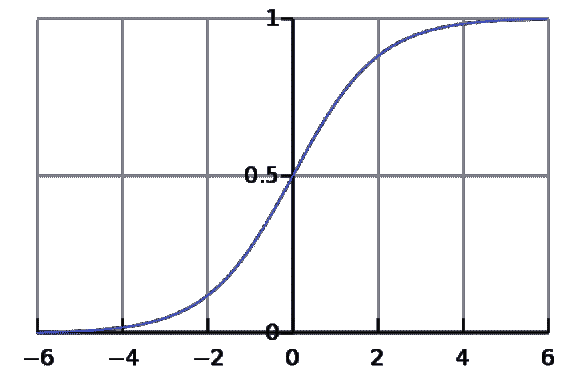

# 人工神经网络；你只需要在 6 分钟内知道。

> 原文：<https://medium.com/analytics-vidhya/artificial-neural-networks-all-you-need-to-know-in-just-6-minutes-3db9989f8b81?source=collection_archive---------32----------------------->

我们都知道人工智能是什么，它是计算机科学的一个分支，旨在使机器变得智能。人工神经网络是人工智能的基础。人工神经网络被设计用来模拟我们人类如何思考和处理信息；ANN 使用人工神经元来教机器完成需要智能的任务。

[刘宇英](https://unsplash.com/@yuyeunglau?utm_source=medium&utm_medium=referral)在 [Unsplash](https://unsplash.com?utm_source=medium&utm_medium=referral) 上的照片

## 一点神经科学 **🧬**

我们的大脑由数十亿个神经元组成。神经元允许我们接收输入，并产生输出(运动、情绪反应等)..).我可以花几个小时解释神经元，但这不是我们在这里的目的。相反，我们将进入真正重要的东西，神经元的**结构。**

神经元结构**(medicalnewstoday.com 图片)**

**树突**是你在神经元最开始看到的，它们接收输入。把树突想象成一根电力电缆，它接收电力并将其发送给它供电的任何东西(与电缆不同)。

轴突是你在神经元中间看到的。轴突充当电信号通过其传播以被其他神经元接收的路径。神经元底部的**轴突末端**或触须是发送产生和输出信号的东西。你可能想知道“但是神经科学和 ANN **有什么关系？”**嗯，这有关系。神经元是人工神经网络，但**是有机的。现在，我们进入有趣的话题。现在我们来谈谈人工神经网络。**

## 那么，什么是人工神经网络呢？

人工神经网络是一种深度学习人工智能，它复制了我们人类处理信息的方式。所有的人工神经网络都有三个部分:**输入**、**我们将在后面讨论的秘密中间部分**和**输出**。这是一段关于安的视频:

图片来自 persagen.com

## **安输入单元:**

如上图所示，输入层或图片最左边的 4 个圆圈**接收** **输入，并直接传递给隐藏层。**相当基础，但在我看来，这是 ANN 最基础的部分。

## 激活:

每个圆圈，或者每个神经元都有一个数字，这个数字被称为**激活**。理想情况下，激活**应该是**1 和 0**之间的一个数。开始时，激活可以是任何数字，但是通过使用**激活功能**，我们可以强制将激活“压缩”为 1 到 0 之间的数字。激活帮助人工神经网络**学习复杂的模式**，激活决定什么将被激发给人工神经网络中的下一个“神经元”。**

## 重量:

权重是**参数**，有助于在人工神经网络的隐藏层中转换输入数据。权重决定**输入对输出**的影响有多大，简而言之，权重只是 0 和 1 之间的**数字，代表单元之间连接的强度。权重在人工神经网络中非常重要，因为**它们帮助你获得想要的输出**。(改变重量 X 很多你得到 E)。**

## 这是我发现的另一个很好地解释了 ann 的视频:

图片来自维基百科

## 激活功能:

激活函数将相加的**加权输入**(每个输入都乘以与将它连接到神经元的突触相关的权重)转换为该节点或输出的期望激活(例如:1 和 0 之间的数字)。激活函数最重要的方面是它们可以给神经网络增加非线性。在某种意义上，不是所有的模式都是“线性”的，所以激活有助于解决非线性问题。

**激活功能类型:**

*   **ReLU** (矫正线性单元)是一类解决消失梯度问题的激活函数，可以让模型学习得更快更好。
*   **双曲正切**是一个**以零为中心的**函数，这意味着很容易用强负值、中性值或正值来模拟输入。我
*   **sigmoid 函数**将每个神经元的输出标准化(使其为 1 或 0)，sigmoid 还允许清晰的预测。然而，这个函数**产生了消失梯度**的问题。
*   **泄漏的 ReLU** 众所周知可以防止将死的 ReLU 问题。它在负区域有一个小的正斜率，因此即使输入值为负，它也能反向传播。
*   **Softmax** 是一种可以处理多个类(int，str，float)的激活函数。Softmax 还对每个类的输出进行标准化，使其成为一个介于 1 和 0 之间的数字。
*   **Swish** 是一种新型的激活函数，性能比 ReLU 更好。研究表明，swish 的性能比 ReLU 大约好 0.6%到 0.9%。
*   **参数重置**允许学习负斜率。使用参数 ReLU，可以执行反向传播。

这只是一个**的基本**解释，如果你想了解更多关于激活功能的信息，请访问[这个](https://missinglink.ai/guides/neural-network-concepts/7-types-neural-network-activation-functions-right/)网站。

## 偏见:

当训练一只安的时候，百色是非常重要的，它们帮助安有效地学习。偏差本质上是神经网络中的常数，可以将激活向左或向右移动。把偏差想成方程 **Y=m(x)+b** (线性直线方程)中的值“ **b** ，它是一个固定的数字，影响总“Y”。

## 隐藏层(激活层):

本质上，激活层通过使用输入到神经网络中的输入来执行非线性变换。非线性变换意味着取加权和、偏差，并通过激活函数进行处理。激活层被设计为产生预期结果的输出。例如，如果您希望您的输出压缩成数字 1 或 0，只需将激活函数更改为 sigmoid 函数。

## 输出单元:

人工神经网络的输出是神经网络进行的所有计算的产物。输出单元非常简单。你只需要知道输出单元显示的是人工神经网络的输出；这就完成了我对 ann 的解释！

## 使用人工神经网络的公司:

[IBM](https://www.ibm.com/ca-en) ，[谷歌](https://www.google.com/?client=safari)，[微软](https://www.microsoft.com/en-ca?ql=2)，[英特尔](https://www.intel.com/content/www/us/en/homepage.html)

## 人工神经网络的应用和未来可能的样子

人工神经网络是一项改变世界的技术，具有识别能力(**语音、图像等)..**)，以及做需要智力的事情**(大部分需要智力的事情，像股票预测甚至复杂的计算)**。要了解更多关于人工神经网络应用的信息，请访问这个网站。

我预见安有一个光明的未来。很多人认为人工智能有一天会走在我们中间，会像我们一样有感情，甚至可能会超越我们。我相信人类总有一天会和 AI 一起解决世界上最紧迫的问题。

## TL；速度三角形定位法(dead reckoning)

*   人工神经网络被设计用来模仿人类的思维和感觉。
*   人工神经网络与我们大脑中的神经元极其相似。
*   人工神经网络由三个主要部分组成:输入、激活层和输出。
*   许多受欢迎的公司如谷歌、微软、IBM 和英特尔都使用人工神经网络。
*   ann 是深度学习。