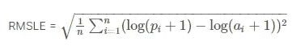
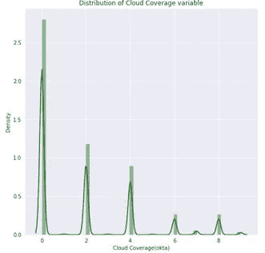
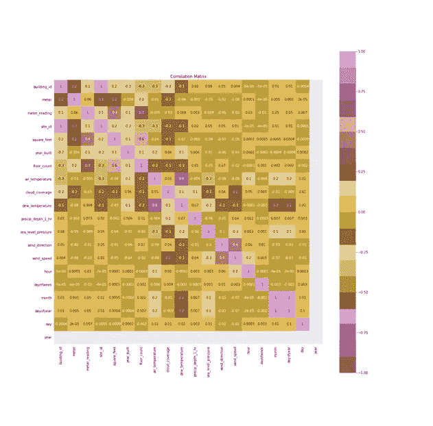

# ASHRAE-大能量预测器 III-机器学习案例研究

> 原文：<https://medium.com/analytics-vidhya/ashrae-great-energy-predictor-iii-a-machine-learning-case-study-a01a67eb048d?source=collection_archive---------3----------------------->

图片来自[https://www.ashrae.org](https://www.ashrae.org/about)

**目录:**

1.商业问题

2.将业务问题映射到机器学习问题

3.资料组

4.探索性数据分析

5.特征工程

6.模型和超参数调整

7.结果

8.未来的工作

9.源代码

10.参考

# **1。商业问题**

这是由 ASHRAE(美国供暖和空调工程师协会)举办的卡格尔竞赛。它成立于 1894 年，旨在推进供暖、通风、空调和制冷的艺术和科学。

已经进行了大量投资来提高建筑物的能效，以降低成本、排放和能耗。建筑物所有者根据实际使用的能源量和他们在没有任何效率改进过程的情况下使用的能源量之间的差异来支付费用。后面的值来自机器学习模型。给定 1 年内 1400 多栋建筑的历史能源使用量，预测未来的能源使用量。然后将它与效率流程的实际能耗进行比较，以了解成本和节能情况。

 [## ASHRAE -大能量预言 III

### 一栋建筑会消耗多少能源？

www.kaggle.com](https://www.kaggle.com/c/ashrae-energy-prediction/) 

# **2。将业务问题映射到机器学习问题**

我们将把这个能源预测问题作为回归问题来处理，给我们 2016 年的电表消耗数据，我们将预测未来两年(2017-2019 年)的电表消耗。

本次比赛给出的评价指标是均方根对数误差。

其中 pi 是目标的预测值

ai 是目标的实际值

n 是数据点的总数。

# **3。数据集**

我们有 5 个 csv 文件。

**train.csv/test.csv**:包含建筑物 id、电表 id、电表测量时间的时间戳以及电表读数，这是我们的目标变量。

building _ id 建筑物元数据的外键。

血糖仪—血糖仪 id 代码。读作{0:电，1:冷水，2:蒸汽，3:热水}。并非每栋建筑都有所有类型的电表。

时间戳—进行测量的时间

仪表读数—目标变量。能耗，单位为千瓦时(或同等单位)

**Weather _ train . CSV/Weather _ test . CSV**:尽可能靠近现场的气象站的气象数据。

site_id-建筑物所在位置的 id

空气温度——摄氏度

cloud _ coverage——在奥克塔斯，天空中被云覆盖的部分

露点温度——摄氏度

精确深度 1 小时—毫米

海平面气压—毫巴/百帕

风向-罗盘方向(0–360 度)

风速—米每秒

**building_metadata.csv** :各个站点所有建筑的建筑元数据。

site_id —天气文件的外键。

building _ id-training . CSV 的外键

primary _ use——基于 EnergyStar 物业类型定义的建筑主要活动类别的指示器

平方英尺—建筑的总建筑面积

建造年份——建筑开放的年份

floor_count —建筑物的层数

# **4。探索性数据分析-**

EDA 是任何数据科学项目中非常关键的一步。它有助于更好地理解我们的数据，探索我们数据中的各种模式，并发现变量之间有趣的关系。这反过来帮助我们设计更好的功能并获得更好的结果。

**加载数据-**

如前所述，我们的训练数据有 3 个 csv 文件。我们已经将这些文件加载到 pandas 数据帧中，并将这些数据帧合并成一个数据帧。该组合数据框架由建筑元数据、天气数据和仪表细节组成。

我们将首先基于给定的时间戳特性在我们的数据集中添加日期时间特性，以便我们可以在粒度级别上分析我们的数据，并探索是否存在季节性模式。

我们将首先分析我们的目标变量:仪表读数

抄表的基本统计数据-

仪表读数严重失真，从上面的图中无法获得太多的信息。因此，我们将对数转换。

目标变量现在有一个很好的方差，而且很多值为零。

以下是改造后的抄表汇总-

现在，我们将及时查看仪表读数模式，并检查我们的数据中是否存在任何季节性模式。

从图中可以明显看出，在午夜过后的早些时候到凌晨，能量消耗最小。早上 6 点以后，随着大多数教育机构、住宅建筑、工业和工作场所开始营业，消费开始上升。

让我们看看每天的阅读量。

正如我们所见，每天的消耗量没有太大差异，但周日的消耗量比其他几天略低。这可能是由于许多因素，如教育机构和工作场所大多在周日关闭。但是住宅区、餐馆、娱乐中心在星期天仍然消耗能源。

平均月消耗量在最初几个月最低，然后在 4 月份春季开始时上升。这可能是由于在春季和夏季空调的使用增加。它在八月达到顶峰，在秋季和冬季又开始下降。

让我们看看每种仪表类型及其分布。

我们有大部分电表类型的读数，其次是冷却水。这意味着大多数建筑物都有电表类型，一些建筑物使用多种电表类型。

从上图可以明显看出，蒸汽表消耗的能量最多，其次是冷却水。热水器消耗的能量最少。

让我们看看主要的使用智能仪表读数分布。

在我们的数据集中，教育建筑的读数最多，其次是办公和娱乐/公共集会。

让我们分析一下每小时的使用量是如何随着建筑物的主要用途而变化的。

以下是对主要用途每小时能耗的观察结果:

*   教育机构的使用高峰是从上午 9 点到下午 3 点，然后使用量下降。这是因为大多数教育机构只在白天开放。
*   娱乐和食品销售建筑的消费在 10 点后上升，并持续稳定到晚上 8 点。
*   医疗保健和住宅建筑的使用模式类似，在下午 4 点左右达到峰值，然后在晚上下降。
*   办公建筑、零售、技术和公共服务建筑也在白天消耗大部分能量，主要是从上午 10 点到下午 4 点。
*   停车场在早上使用量最少，下午 3 点以后使用量增加。
*   宗教建筑消耗最少的能源，而公共设施消耗最多。

现在，我们需要了解建筑物的平均能耗:

上图显示了其中一栋建筑的使用率出现了巨大的峰值。这清楚地表明异常值的存在。让我们来看看哪栋楼的消费如此之高。

1099 号楼有异常值。我们将从这座建筑中移除这些排。

根据站点平均仪表读数图，我们可以看到站点 13 的能耗非常高。这是因为在场地 13 中存在建筑物 1099，这是一个异常值。

现在让我们看看我们的其他变量和它们的分布。

气温变量服从正态分布，大部分值在 0-30 摄氏度之间。

让我们看看气温是如何影响能耗的。

当温度为负时，平均仪表读数较高，一旦温度开始上升，仪表消耗量就会减少。当温度上升到 15℃以上时，它再次增加。这种行为可以理解为当温度极低时使用加热器，而当温度高时使用空调。这两者都会导致更高的能耗。

上图显示了现场的平均温度。我们可以看到不同的地点有不同的平均温度。这证明这些遗址不属于一个地点。它们分布在不同的地理位置。这可能是我们将在特征工程中使用的有用信息。

以下是天气数据中其余变量的分布图:

**观察:**

露点温度分布稍微向右倾斜，最大值在 0–20 摄氏度之间

大多数观测的云覆盖率为零。

Precip_depth_1_hr 变量高度倾斜，大部分值为零。

海平面气压遵循正态分布，大部分数值在 1000-1030 毫巴之间

风玫瑰图显示，在大多数情况下，大部分时间风向为北(90 度)，其次为南(270 度)。它还表明，从东北方向(45 度)吹来的风最少。当风从北方吹来时，大多数时候风速是 0-3.8 米/秒

现在让我们来看一下楼层数、平方英尺和年建特征:

**观察:**

我们在 floor_count 中有很多缺失值。

大多数建筑都有 1 层或 2 层。

当楼层数超过 10 层时，仪表读数达到峰值，然后下降。这可能是由几个原因造成的，例如在给定的时间点不是所有的楼层都在使用。

**观察:**

该列也缺少许多值。

分布在 120 年间，但大多数建筑建于 1960 年以后。

1940 年前建造的建筑平均能耗更高。

**观察:**

平方英尺变量严重倾斜，数值范围很大，因此我们对此变量进行了对数变换。

平方英尺和仪表读数之间有明显的正相关关系。

随着建筑规模的增加，能源消耗也在增加。

**相关矩阵:**

我们绘制了数据集中可用要素的相关矩阵。平方英尺和楼层数特征与目标变量正相关。

众所周知，建筑的大小是影响建筑能耗的一个重要因素。建造年份也与目标变量正相关，因为旧建筑往往比新建筑消耗更多的能源。

# 5.特征工程:

## **异常值处理:**

正如我们在 EDA 中看到的，1099 号建筑是一个异常值。因此，我们将放弃对 1099 号建筑的观察。

## **缺失值插补:**

我们将检查在我们的训练和测试数据中每一列缺少的值的百分比。

year _ built 和 floor_count 特性中有超过 50%的值缺失，因此我们将删除这两列。

我们现在将估算来自天气数据的其他列中的所有缺失值。

众所周知，一个地方和另一个地方的天气变化很大，月与月之间、白天与夜晚之间也是如此。

利用这些信息，我们将估算缺失值。我们将找到该月每天的平均现场温度，并用它来估算缺失值。

由于一些切片在云覆盖率、降水深度 1 小时和海平面气压方面完全不符合要求，我们将使用中值估算其余值。

## **添加新功能:**

现在，我们将开始向现有数据添加新功能。

**增加度假特色**—

节假日会影响日常的能量消耗。

关于站点 id 的位置信息可以通过互联网获得，因此，我们将使用这些信息并添加假日功能。

**增加季节功能:**

我们有月份信息，可以用来将季节特征添加到数据中。

**添加 isDaytime 功能**:

**增加相对湿度特性**:

我们的数据中有空气温度和露水温度，利用这两个特性，我们可以添加相对湿度特性，它实际上会影响一个人在那个时刻的感觉，进而影响能耗。我们将根据给定的公式计算相对湿度。

[图片来自 https://www.calcunation.com](https://www.calcunation.com/calculator/humidity-calculator.php)

## **数据预处理-**

1.  平方英尺变量是对数转换。

2.仪表读数经过对数转换后用于预测。我们将使用 RMSE 和我们的对数转换值。在对测试数据进行预测时，我们会在提交之前将其转换回原始规模。

3.标签编码主要用途和季节特征。

4.删除零米读数。

5.使用方差膨胀因子检查所有列的多重共线性。删除具有高度多重共线性的要素。

# **6。模型和超参数调整-**

训练数据再次被分成 80-20 的比例。80%的数据将用于训练，20%将用于交叉验证集，以检查我们模型的性能。

## **基线模型-**

对于基线模型，我们使用了站点方式和主要使用方式方式的平均值。

## **决策树回归器-**

决策树回归器给了我们一个漂亮的下降分数。让我们来看看一些集合模型

## **LGB 随机森林-**

随机森林没有为我们的决策树模型提供任何即兴创作。让我们检查 GBDT 模型。

## **LGB·GBDT-**

这是目前为止我们使用轻量级 GBM 的最好成绩。

## **Catboost GBDT-**

## **MLP 回归量-**

我们用 LGB·GBDT 模型得到了最好的结果。也在数据上尝试了定制叠加系综，但是它没有改善 GBDT 的结果。手动网格搜索在这里用于超参数调整，因为我们有巨大的数量和 k 倍交叉验证在这里很难使用，因为它会遇到内存问题。

# 7。结果-

我们已经用我们最好的模型获得了 1.292 的公开分数，考虑到这个数据集所具有的挑战，如巨大的规模，这使得交叉验证和超参数调整非常令人生畏，这是相当不错的。当然还有改进的余地，我们将在今后努力。该模型使用 Streamlit 部署在本地机器上。

# **8。未来工作-**

1.  使用 CV 调整更多的超参数，这将需要更高的计算能力。

2.为每个站点和每种仪表类型训练单独的模型。

3.使用 LSTM 模型。

4.可以探索更多的特征工程，并添加新的特征。

# **9。源代码-**

 [## vdhar1992/ASHRAE 能源预测 III 案例研究

### ASHRAE 大能量预报器-ⅲ-vdhar 1992/ASHRAE 大能量预报器ⅲ_ 案例研究

github.com](https://github.com/vdhar1992/ASHRAE_Great_energy_predictorIII_CaseStudy) 

# **10。参考文献-**

1.[https://www . ka ggle . com/gemartin/load-data-reduce-memory-usage](https://www.kaggle.com/gemartin/load-data-reduce-memory-usage)

2.[https://www . ka ggle . com/Patrick 0302/locate-cities-against-weather-temperature](https://www.kaggle.com/patrick0302/locate-cities-according-weather-temperature)

[3。https://Martian 1231-py . medium . com/ASHRAE-great-energy-predictor-iii-a-machine-learning-self-case-study-5c 9 e 9d 0 ea 11d](https://martian1231-py.medium.com/ashrae-great-energy-predictor-iii-a-machine-learning-self-case-study-5c9e9d0ea11d)

[4。https://www . ka ggle . com/c/ASHRAE-energy-prediction/discussion/112872](https://www.kaggle.com/c/ashrae-energy-prediction/discussion/112872)

[5。https://github . com/grapestone 5321/Great _ Energy _ Predictor _ Shootout _ 1 _ 2/blob/master/papers/R-ESL-PA-96-07-03-4 . pdf](https://github.com/grapestone5321/Great_Energy_Predictor_Shootout_1_2/blob/master/papers/R-ESL-PA-96-07-03-4.pdf)

6.[https://www.appliedaicourse.com/](https://www.appliedaicourse.com/)