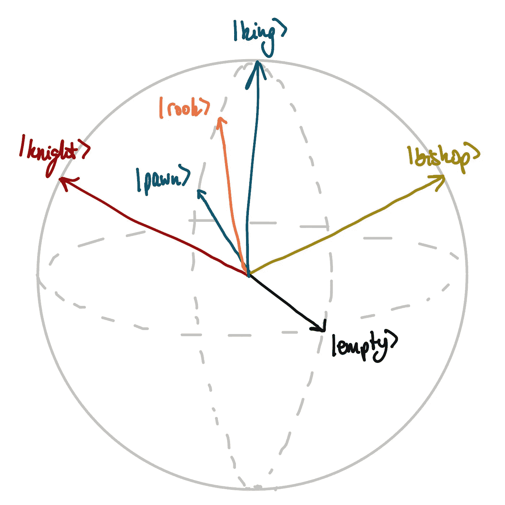
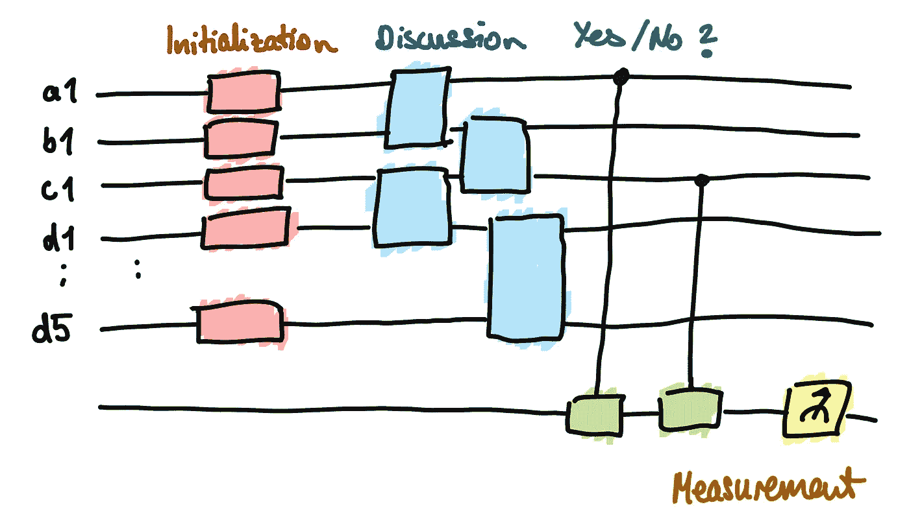

# 让量子计算机学习国际象棋

> 原文：<https://medium.com/analytics-vidhya/asking-a-quantum-computer-to-learn-chess-8670891770a0?source=collection_archive---------8----------------------->

## 等待它的回答

哈桑·帕夏在 [Unsplash](https://unsplash.com?utm_source=medium&utm_medium=referral) 上的照片

对大多数人来说，量子计算机仍然是下一个神奇的东西。一个可以解决我们所有人类问题的东西。为了防止气候变化，寻找新的药物，预测任何人想预测的事情。

对于少数人来说，量子计算机更多。经典计算机无法提供的一套工具。这是一个具有挑战性的研究领域，仍处于早期阶段，需要创造性的想法才能找到基本的应用。

为这些人，组织了 [QHack](https://qhack.ai) 活动。关于量子机器学习(QML)主题的相关讨论，关于基础和更复杂应用的众多挑战，以及最后一个希望在 QML 领域产生新的和创造性想法的公开挑战。

在这次挑战中，我和我的队友请了一台量子计算机来学习象棋。该过程由三个主要部分组成。

1.  **初始化。**告诉量子计算机当前的棋盘位置是什么样子。
2.  **变分电路。**要求量子计算机在所有合法的举动中做出选择。
3.  **训练。**帮助量子计算机做出更好的选择，最终学会象棋。

# 棋子的初始化

首先，我们必须告诉量子计算机国际象棋。令人难以置信的是，它从未听说过。好吧。板子长什么样？哪些作品确实存在？哪些作品比其他作品更有价值，它们有什么不同？老实说，我可能也要告诉你。

这并不是因为我认为你不知道国际象棋的规则。就是因为我觉得你不知道[微切](https://en.wikipedia.org/wiki/Minichess#4×4,_4×5_and_4×8_chess)的规则。这块板不是由 8×8 的正方形组成，而是由 5×4 的正方形组成。我们决定玩这种类型的国际象棋，因为我们用量子计算机的量子位来识别每个棋盘的方格。因为这些很少见，更重要的是，在经典计算机上模拟非常昂贵，所以我们尽可能少用。

在微型象棋中，标准象棋游戏中的所有棋子(除了皇后)都要用一次。这使得五个棋子具有不同的价值:国王(∞)，车(5)，骑士(3)，主教(3)和卒(1)。在传统的计算机上，一个比特不可能区分两个以上的部分，因为一个比特只取离散值 0 或 1 中的一个。相比之下，量子位可以有无限多种状态。这些状态可以用球坐标表示，即布洛赫球上的状态。

量子位的状态代表国际象棋棋盘上自己的棋子。对手的棋子由球体南极一侧的国家代表。因此，一个量子位元可以代表一个正方形所有 11 种可能的状态。

总的来说，我们必须定义 11 种不同的状态来代表单个方块上的任何可能的棋子，因此，完整的 5x4 棋盘有 20 个量子位。11 种状态代表玩家的 5 个不同棋子，对手的 5 个不同棋子，最后是空方块。上面的草图显示了量子位的状态取决于它所代表的部分。注意，状态(箭头)越靠近相应的极点，其值越高。

# 变分电路

量子计算机现在知道棋子在棋盘上的位置。它被嵌入到每个量子位的状态中。现在我们希望量子计算机做出选择。这是如何工作的？正如已经说过的，我们必须问他。不幸的是，量子计算机不会说英语或德语。两人都不懂量子计算机和经典计算机的语言。我们只能用量子操作的语言(单词)来提问，以构建完整的量子电路(句子)。而我们可以以测量的形式来听它的回答(是或不是)。

很悲哀，不是吗？一个量子位可以代表无限多个(在我们的例子中是 11 个)状态，但它所要说的只是是或不是？然而这是真的。我们必须面对它。这就是为什么我们必须提出非常好的问题，并仔细聆听答案。

我们以由两个主要部分组成的多层变分参数化电路的形式提出我们的问题。不涉及太多细节…

不幸的是，量子计算机不会说我们的语言。而且它不喜欢学。正是基于这一事实，我们提出了关于量子计算机语言中最佳可能移动的问题，即量子操作(单词)构建完整的量子电路(句子)。我们接收量子计算机的答案，作为产生简单是或否的测量。

**讨论电路。**第一部分由使量子位相互纠缠的操作组成，迫使量子计算机考虑相邻方块及其碎片之间的关系。你肯定能看出来。这对下棋来说很重要。

**是或否**第二部分帮助量子计算机以简单的是或否的方式成功回答问题。我们用我们唯一的测量量子位来纠缠所有方块的量子位。通过这种方式，量子计算机将所有收集的信息传递到我们的测量量子位中。

**回答。**最后，通过根据(注意:专业术语)PauliZ 矩阵测量测量量子位的状态，我们得到了我们的最终答案。是或否。根据答案，我们希望量子计算机评估并决定它想要采取的合法行动。大多数情况下，法律诉讼远不止一两次。因此，对我们的目的来说，一个是或否的答案是不够的。但是通过一个简单的技巧，我们让量子计算机告诉我们更多。我们只是问了十几次。答案的概率告诉我们哪一步看起来是最好的。

# 培养

作为人类，量子计算机天生就不会下棋。人类必须非常努力地训练，才能变得更好，并最终击败对手。

一方面，他们通过思考可能的动作进行训练，并评估每个动作有哪些优点和缺点。他们根据价值对不同的动作进行排序，并在头脑中建立一套想要的动作。随着时间的推移，人类会改变他们的思维，更经常地想出更好的办法(**监督学习**)。

另一方面，他们通过与其他球员比赛来训练。有时它们会松动。有时他们会赢。玩家通过重放成功游戏的获胜招式并避免失败游戏的松散招式而变得更好(**强化学习**)。

在训练我们的量子计算机时，我们试图复制这两种人类训练方法。

**监督学习。我们为每个合法的移动定义了一个相当容易的成功度量，并训练我们的变分量子电路分别选择最佳移动。为此，我们优化参数化电路中定义操作的参数，以产生最佳结果。(我们通过一种称为梯度下降的优化技术来实现这一点)。**

**强化学习。**监督学习的问题在于，学生(量子计算机)只能变得和老师一样好(量子书呆子，是的，但象棋新手也一样)。我们希望量子计算机比我们更好。来打败我们。所以我们可以开始从中学习。因此，我们让量子计算机扮演一个稍微修改过的自己。这样，它(希望)永远不会停止学习，因为它要么输给自己，要么赢。不管怎样，它下次会学得更好。

所以我们问了量子计算机一个简单的问题。你会下哪一步棋？我们把问题翻译成它的语言。我们甚至努力让量子计算机以怪异的是或否的方式回答我们的问题。然而，它似乎需要多一点时间来练习。

它害羞了。它不想脱口而出错误的答案。这很好。我们会等的。我们会耐心等待。祝我们亲爱的朋友好运。我们期待你的回答。我们会为你提供更好的方法，甚至更好的对手。

如果你想了解更多，请点击这里查看 GitHub 库。