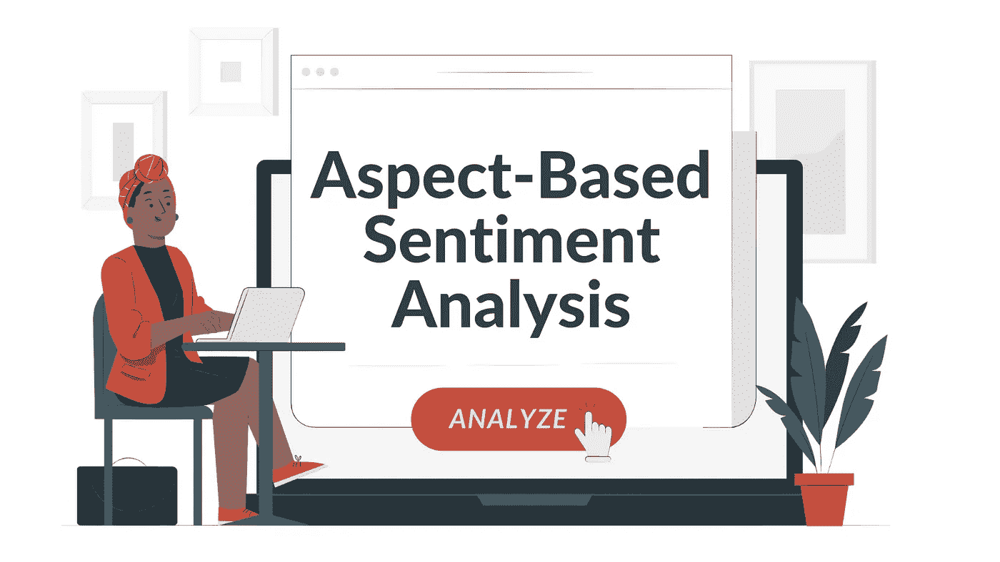
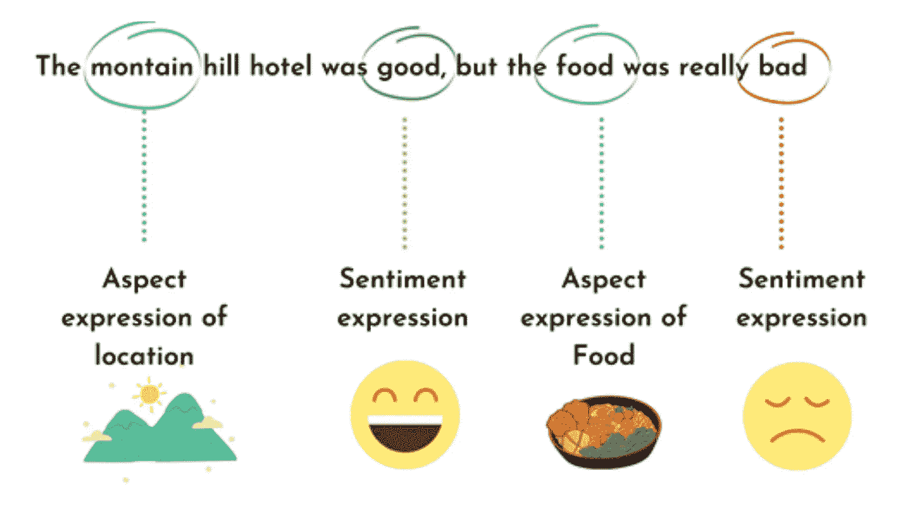

# 简而言之，基于方面的情感分析

> 原文：<https://medium.com/analytics-vidhya/aspect-based-sentiment-analysis-in-a-nutshell-cb4e8d25ec2?source=collection_archive---------1----------------------->

[**基于方面的情感分析**](https://www.bytesview.com/sentiment-analysis) 是一种文本分析技术，将数据划分为多个方面，并帮助确定与每个组成部分相关联的情感。

当我们谈论**方面**时，我们指的是产品或服务的特征或元素，例如“客户体验”、“对投诉做出回应所需的时间”或“整合新软件的便利性”

基于方面的情感分析对所有企业来说都是一个至关重要的组成部分，因为这需要他们倾听消费者的声音，理解他们的感受，分析他们的反馈，并专注于改善他们的**体验**，以及他们对你的产品和服务的期望。

***1)情绪是对某一特定话题的积极或消极的感受。***

***2)方面是正在讨论的类别或特征。***

随着消费者交流情感的渠道的扩展，基于方面的情感分析的价值也在增加。他们越来越多地通过它来表达自己。

他们现在喜欢与品牌互动，并为社交媒体平台做出贡献。**顾客**每次与公司互动时，不管是提及还是关心，都会留下宝贵的暗示，让企业知道他们能做什么。

# 基于方面的情感分析的优势

1.  它使你能够自动地分析大量的数据。
2.  通过对所有文本输入实施相同的规范，它有助于确保一致和准确的结果。
3.  它可以让您快速轻松地深入了解特定的产品和服务。
4.  它可以用来创造以客户为中心的体验。
5.  它使您能够快速识别和解决任何有问题的情况。

# 以下是一些推荐的基于方面的情感分析工具:

**1。** [**字节视图**](https://www.bytesview.com/)

BytesView 是基于方面的情感分析的最佳工具，因为它可以分析复杂的结构化和非结构化文本数据，以帮助您评估用户情感。

您可以利用他们的情感分析工具从不同来源收集文本数据，并利用它来改进您的客户支持服务、员工和客户反馈解决方案等。

如果你是一名数据分析师，这个工具是至关重要的，因为它可以让你迅速分析民意，做市场研究，衡量品牌声誉，并评估用户体验。

训练它支持和分析 30 多种语言很简单；你所要做的就是访问 BytesView API 并集成它。

**2。** [**Talkwalker**](https://www.talkwalker.com/)

Talkwalker 是另一个优秀的基于方面的情感分析工具。它声称提供了最先进的情绪分析技术，使其能够区分讽刺和其他令人困惑的不受欢迎的言论。

因为它可以准确地告诉你人们对你公司账户的感受，这个工具最适合社交媒体渠道。

**3。** [**猴子学**](https://monkeylearn.com/)

MonkeyLearn 是一个基于可定制方面的情感分析工具。只需创建标签并手动突出显示文本的不同部分，以显示每个标签的内容。

该软件随着时间的推移自行学习，现在可以同时处理多个文件。

**4。** [**含义云**](https://www.meaningcloud.com/)

MeaningCloud 还可以分析各种语言的情感。它采用了一种基于方面的情感分析方法来确定哪些主题是积极的、消极的或中立的。

它还使您能够创建一个字典，以便向它的系统添加有用的词汇。

**5。** [**伽弗盖**](https://www.gavagai.io/)

该工具采用主题情感检测算法将文本情感与它们描述的主题联系起来，当与它们先进的主题建模和基于主题的情感分析相结合时，它们的浏览器为您提供了对推动您组织满意度的因素的精确洞察。

Gavagai Explorer 支持 46 种不同语言的情感分析。

希望这是一本好书😀