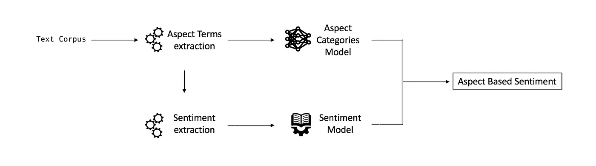

# 使用经典机器学习算法对财经新闻数据进行基于方面的情感分析

> 原文：<https://medium.com/analytics-vidhya/aspect-based-sentiment-analysis-on-financial-news-data-using-classical-machine-learning-algorithms-1ec66447b4cf?source=collection_archive---------1----------------------->

## LinkedIn [简介](https://www.linkedin.com/in/ankit-shah-643ab3217) & GitHub [简介](https://github.com/ankitshah-dev/aspect_based_sentiment_analysis)


基于方面的情感分析的例子

在本案例研究中，我们将浏览以下部分:

1.  问题的介绍和概述
2.  数据概述
3.  将现实世界的问题映射到最大似然问题
4.  电子设计自动化(Electronic Design Automation)
5.  数据预处理
6.  特征工程
7.  机器学习建模

# 1.问题的介绍和概述

## 1.1.什么是基于方面的情感分析？

情感分析是自然语言处理中非常流行的技术。我们可以看到它被应用于获取社交网络帖子、电影评论甚至书籍的极性。

**然而，基本的情感分析可能会受到限制，因为我们在诱发主题方面缺乏精确性。**

让我们以一台电脑的评论为例:我们如何知道什么是好的/坏的？是键盘，屏幕，处理器？

基于方面的情感分析方法直接解决了这个限制。在 2014 年 SemEval 年度比赛期间推出，ABSA 旨在寻找术语提到的方面，并给出相关的情感分数。

回到我们的计算机例子，在下面的评论中:

*   *“我绝对喜欢这款明亮的视网膜屏幕”*
*   *“蝴蝶键盘骗人！”*

有了 ABSA，我们会对屏幕产生积极的情绪，对键盘产生消极的情绪。从商业角度来看，这更可行。

## 1.2.问题陈述

本帖将在财经新闻标题数据集上用 python 实现 **ABSA 任务。**

## 1.3.概观

对于*域外*用例，ABSA 模型可以分解为三个不同的主要流程:

*   学习方面类别(`SCREEN$Quality`、`PROCESSOR$Performance`等)。)
*   在句子中寻找体词(`retina screen`、`butterfly keyboard`等)。)并分类到方面类别
*   计算每个条目中每个方面的极性

然而，我们的财务用例是我们所谓的*域内*。也就是说，我们已经定义了与财经新闻相关的方面类别。然后我们有一个由两个不同的模型组成的模型:方面类别分类器和情感回归模型。



ABSA 高层工作流

# 2.数据概述

[***FiQA 任务 1 数据集【18】***](https://drive.google.com/file/d/1icRTdnu8UcWyDIXtzpsYc2Hm6ACHT-Ch/view)包含关于基于方面的情感分析信息，该信息关于从金融领域网页如 Wikinews、Stocktwits 和 Reddit 提取的帖子和新闻标题。有 435 条带注释的标题和 675 条带注释的财经推文，向每个目标提供了特征和情感分数

## 2.1.示例数据点

*"55": { "sentence": "Tesco 放弃在 Blinkbox 销售中的视频流野心"，" info": [ { "snippets": "['视频流野心']"，" target": "Blinkbox "，" opinion _ score ":"-0.195 "，" aspects": "['企业/战略']" }，{ "snippets": "['Tesco 放弃视频流野心']，" target": "Tesco "，" opinion _ score ":":"-0.335 "，" aspects": "['企业/战略']]*

## 2.2.数据字段

*   **id:** 帖子 id
*   **句子:**帖子正文
*   **目标:**接收意见的实体
*   **情感得分:**标题的真实情感得分(范围从-1 到 1)
*   **aspect_category(1，2，3):** 财务方面由不同的节点级别表示。对于不同的目标，同一个句子可以有一个或多个方面。想法是将第二层节点信息表示为方面输出，以训练/测试模型
*   **aspect_snippet(1，2 和 3):** aspect 文本片段，它提供了更多的信息来识别 aspect 类别。同一个句子可以有一个或多个针对不同目标的片段，也可以没有

# 3.将现实世界的问题映射到最大似然问题

## 3.1.机器学习问题的类型

这个问题有三个方面

1.  二元分类
2.  多类分类
3.  回归

一旦我们到达 ML 建模部分，我们将会看到每一个

## 3.2.评估指标

1.  二元分类: ***roc_auc，混淆矩阵***
2.  多类分类:**微观 f1 得分**
3.  回归:**均方误差**

我将避免详细讨论上面的每一个评估指标，否则这篇文章会太长而无法阅读。

# 4.探索性数据分析

我刚刚在这里添加了所需的代码片段。您应该可以找到我的 GitHub repo 的链接，了解详细的代码实现。

## 4.1.首先让我们导入所有必要的库

```
# importing basic librariesimport pandas as pd
import numpy as np
import seaborn as sns
import matplotlib.pyplot as plt
import json
import re
from sklearn.feature_extraction.text import CountVectorizer
from sklearn.feature_extraction.text import TfidfVectorizer
import os
import csv
from datetime import datetime
from wordcloud import WordCloud
from nltk.corpus import stopwords
```

## 4.2.为简单起见，将所有内容放入熊猫数据框中

```
# putting everything in a dataframe
df = pd.DataFrame({"aspects":aspects_li, 
                      "sentiments":sentiments_li, 
                      "snippets":snippets_li, 
                      "target":target_li, 
                      "sentence":sentence_li})print(df.shape) #(1111,5)
df.head()
```


## 4.3.方面的分布

```
# using CountVectorizer to get unique aspects
vectorizer = CountVectorizer()
aspects_dtm = vectorizer.fit_transform(df.aspects)print("Number of data points :", aspects_dtm.shape[0])
print("Number of unique aspects :", aspects_dtm.shape[1])
```


```
#'get_feature_name()' gives us the vocabulary.
aspects = vectorizer.get_feature_names()#Lets look at the tags we have.
print("Some of the aspects we have :", aspects[:10])
```


## 4.4.每个方面出现的次数

```
#Lets now store the document term matrix in a dictionary.
freqs = aspects_dtm.sum(axis=0).A1
result = dict(zip(aspects, freqs))#Saving this dictionary to csv files.
if not os.path.isfile('../01\. Data/aspect_counts_dict_dtm.csv'):
    with open('aspect_counts_dict_dtm.csv', 'w') as csv_file:
        writer = csv.writer(csv_file)
        for key, value in result.items():
            writer.writerow([key, value])
aspects_df = pd.read_csv("aspect_counts_dict_dtm.csv", names=['aspects', 'Counts'])
aspects_df.head(2)#Sorting aspects in descending order of their counts
aspects_df_sorted = aspects_df.sort_values(['Counts'], ascending=False)
aspects_counts = aspects_df_sorted['Counts'].values#Plotting the aspects
plt.plot(aspects_counts)
plt.title("Distribution of number of times aspects appeared")
plt.grid()
plt.xlabel("aspects number")
plt.ylabel("Number of times aspects appeared")
plt.show()
```


**正如我们在上面的图中看到的，分布是高度偏斜的**

1.  索引为 0 的一个方面在 1111 行中出现了 600 次以上
2.  大多数方面只出现几次
3.  由于一些标签比其他标签出现得更频繁，因此微平均 F1 分数是解决此问题的合适指标

## 4.5.每个项目的方面(行)

```
#Storing the count of aspects in each question in list 'aspects_count'
aspects_quest_count = aspects_dtm.sum(axis=1).tolist()#Converting list of lists into single list, we will get [[3], [4], [2], [2], [3]] and we are converting this to [3, 4, 2, 2, 3]
aspects_quest_count=[int(j) for i in aspects_quest_count for j in i]
print ('We have total {}  datapoints.'.format(len(aspects_quest_count)))print(aspects_quest_count[:5])
```


```
print( "Maximum number of aspects per question: %d"%max(aspects_quest_count))
print( "Minimum number of aspects per question: %d"%min(aspects_quest_count))
print( "Avg. number of aspects per question: %f"% ((sum(aspects_quest_count)*1.0)/len(aspects_quest_count)))# plotting the counts
sns.countplot(aspects_quest_count, palette='gist_rainbow')
plt.title("Number of aspects in the items/rows ")
plt.xlabel("Number of aspects")
plt.ylabel("Number of items")
plt.show()
```


**对上述图的观察:**

1.  每个问题的最大方面数:8
2.  每个问题的最小方面数:1
3.  平均值。每个问题的方面数:3.649865
4.  根据上述计数图，大多数行数/数据点具有 3 或 4 个方面

## 4.6.让我们看看情感专栏

```
#distribution of sentiments
sns.distplot(df.sentiments)
```


```
# general sentiment metrics
print("max sentiment: {} | min sentiment: {} | average sentiment: {}".format(np.max(df.sentiments), np.min(df.sentiments), np.mean(df.sentiments)))
```


```
# lets bucket the sentiments to +ve, -ve and neutral
sentiments_bucket = []
error_bucket = []
for elem in np.array(df.sentiments):
    try:
        if elem > 0:
            sentiments_bucket.append("positive")
        elif elem < 0:
            sentiments_bucket.append("negative")
        else:
            sentiments_bucket.append("neutral")
    except:
        error_bucket.append(elem)# lets get the counts for these
sns.countplot(sentiments_bucket, palette='hls')
plt.title("Sentiment counts ")
plt.xlabel("sentiments")
plt.ylabel("counts")
plt.show()
```


**关于 EDA 的最终想法:**

1.  由于每个项目都有多个方面，我们将继续选择 2 级方面，这样每个项目就有一个方面，这样更容易分类。


2.为简单起见，我们将从较大的数据框架中抽取 2 列**(“句子”、“目标”)**用于我们的**二进制和多类分类问题**以及**(“句子”、“目标”、“情感”)用于我们的回归问题**

# 5.数据预处理

## 5.1.清理数据集:“句子”列

在这里，我们将删除标点符号，html 标签，@提及，#标签，停用词，数字和不需要的空格

```
def remove_punctuation(s):
    list_punctuation = list(punctuation)
    for i in list_punctuation:
        s = s.replace(i,' ')
    return sdef clean_sentence(sentence):
    sentence = sentence.lower()
    #remove multiple repeat non num-aplha char !!!!!!!!!-->!
    sentence = re.sub(r'(\W)\1{2,}', r'\1', sentence) 
    #removes alpha char repeating more than twice aaaa->aa
    sentence = re.sub(r'(\w)\1{2,}', r'\1\1', sentence)
    #removes links
    sentence = re.sub(r'(?P<url>https?://[^\s]+)', r'', sentence)
    # remove [@usernames](http://twitter.com/usernames)
    sentence = re.sub(r"\@(\w+)", "", sentence)
    #remove # from #tags
    sentence = sentence.replace('#','')
    sentence = sentence.replace("'s",'')
    sentence = sentence.replace("-",' ')
    # split into tokens by white space
    tokens = sentence.split()
    # remove punctuation from each token
    tokens = [remove_punctuation(w) for w in tokens]
    # filter out stop words
    stop_words = set(stopwords.words('english'))
    tokens = [w for w in tokens if not w in stop_words]
    remove_digits = str.maketrans('', '', digits)
    tokens = [w.translate(remove_digits) for w in tokens]
    tokens = [w.strip() for w in tokens]
    tokens = [w for w in tokens if w!=""]
    tokens = ' '.join(tokens)
    return tokens#Cleaned sentence column
df["cleaned_sentence"] = [clean_sentence(x) for x in df.sentence]
df.drop(["sentence"], axis=1, inplace=True)
df.head(2)
```


## 5.2.为分类方面创建分类数据集

如上所述，我们将使用二元分类和多元分类。

原因是职业高度不均衡，如 EDA 部分所示。一个类“价格行为”通过出现约 60%的次数来支配数据集，因此为了更好的结果进行了分割。

您可以应用上采样技术来平衡数据集，但这里的问题只是针对一个类，而不是其他类。因此，分类问题有两个模型

*   二元分类—针对最大的类别(价格行为)与其他类别
*   多类分类—其他

```
# binary dataset
df_binary = df.copy(deep=True)
df_binary["target_binary"] = [1 if x == "Price Action" else 0 for x in df_binary.target]
df_binary.drop(["target"], axis=1, inplace=True)
df_binary.head(2)# multiclass dataset
df_multi = df[df.target != "Price Action"]
df_multi.head(2)
```


左:二元分类数据集，右:多类分类数据集

## 5.3.创建用于预测情绪的回归数据集

```
# read train data
df = pd.read_csv("/content/drive/MyDrive/datasets/case study1: aspect based sentiment analysis/01.data/train_final.csv")
print(df.shape)
df.drop(["snippets", "combined", "news"], axis=1, inplace=True)# read train data
df_val = pd.read_csv("/content/drive/MyDrive/datasets/case study1: aspect based sentiment analysis/01.data/val.csv")
df_sentiment = pd.concat([df, df_val])
df_sentiment.head()
```


## 5.4.列车测试分离

我们将以 80:20 的比例分割数据。80%用于培训，其余 20%用于测试

> 以下表示法适用于二元分类数据集，我们也将对多类分类和回归问题进行同样的处理

```
# train test split
from sklearn.model_selection import train_test_split
X_train, X_test, y_train, y_test = train_test_split(X, y, test_size=0.2, stratify=y)
print(X_train.shape, X_test.shape)
```


# 6.特征工程

## 6.1.使用通用句子编码器从“句子”栏生成 512 维特征

简而言之:通用句子编码器(USE)接受文本作为输入，并生成 512 维向量，这些向量可进一步用于我们的下游任务，如分类。

详细的使用文档:[https://tfhub.dev/google/universal-sentence-encoder/4](https://tfhub.dev/google/universal-sentence-encoder/4)

```
# encoding using Universal sentence encoder
# using universal sentence encoder for text embedding
import tensorflow_hub as hub
embed = hub.load("[https://tfhub.dev/google/universal-sentence-encoder/4](https://tfhub.dev/google/universal-sentence-encoder/4)")embeddings_train = embed(X_train.reshape(1,-1)[0])
embeddings_test = embed(X_test.reshape(1,-1)[0])
embeddings_train.shape, embeddings_test.shape
```


# 7.机器学习建模

你可以查看我的 GitHub repo 的所有模型实验。在这里，我将展示二元分类、多类分类和回归问题的最佳模型结果

## 7.1.二元分类模型

## 7.1.1.过采样以平衡类别

```
# oversampling
from imblearn.over_sampling import RandomOverSampler
# define oversampling strategy
oversample = RandomOverSampler(sampling_strategy=0.8)# fit and apply the transform
X, y = oversample.fit_resample(df_binary.drop(["target_binary"], 1), df_binary.drop(["cleaned_sentence"], 1))# plotting to check the difference
sns.countplot(y)
plt.title("Balanced data")
plt.show()
```


## 7.1.2.具有通用语句编码器特征的 KNN

```
# [https://scikit-learn.org/stable/modules/generated/sklearn.metrics.roc_curve.html#sklearn.metrics.roc_curve](https://scikit-learn.org/stable/modules/generated/sklearn.metrics.roc_curve.html#sklearn.metrics.roc_curve)
from sklearn.metrics import roc_curve, auc
embeddings_train = np.array(embeddings_train)
embeddings_test = np.array(embeddings_test)# we will use the above parameters and add regularization to avoid overfitting
mnb = clf.best_estimator_
mnb.fit(embeddings_train, y_train)# roc_auc_score(y_true, y_score) the 2nd parameter should be probability estimates of the positive class
# not the predicted outputsy_train_pred = mnb.predict_proba(embeddings_train) 
y_test_pred = mnb.predict_proba(embeddings_test)train_fpr, train_tpr, tr_thresholds = roc_curve(y_train, y_train_pred[:, 1])
test_fpr, test_tpr, te_thresholds = roc_curve(y_test, y_test_pred[:, 1])plt.plot(train_fpr, train_tpr, label="train AUC ="+str(auc(train_fpr, train_tpr)))
plt.plot(test_fpr, test_tpr, label="test AUC ="+str(auc(test_fpr, test_tpr)))
plt.legend()
plt.xlabel("FPR")
plt.ylabel("TPR")
plt.title("ROC Curve")
plt.grid()
plt.show()# confusion matrix
from sklearn.metrics import confusion_matrix
import seaborn as sns
import matplotlib.pyplot as plt   
cm = confusion_matrix(y_test, mnb.predict(embeddings_test))
sns.heatmap(cm, annot=True,fmt="d",cmap='Blues')
plt.xlabel("Predicted")
plt.ylabel("Actual")
plt.title("Confusion Matrix")
```


## 7.2.多类分类模型

```
from sklearn.metrics import f1_score, log_loss, confusion_matrix
from sklearn.calibration import CalibratedClassifierCValpha = [10 ** x for x in range(-5, 4)]
cv_log_error_array=[]
for i in alpha:
    logisticR=LogisticRegression(penalty='l2',C=i,)
    logisticR.fit(X_train,y_train)
    sig_clf = CalibratedClassifierCV(logisticR, method="sigmoid")
    sig_clf.fit(X_train, y_train)
    predict_y = sig_clf.predict_proba(X_cv)
    cv_log_error_array.append(log_loss(y_cv, predict_y, labels=logisticR.classes_, eps=1e-15))

for i in range(len(cv_log_error_array)):
    print ('log_loss for c = ',alpha[i],'is',cv_log_error_array[i])best_alpha = np.argmin(cv_log_error_array)

fig, ax = plt.subplots()
ax.plot(alpha, cv_log_error_array,c='g')
for i, txt in enumerate(np.round(cv_log_error_array,3)):
    ax.annotate((alpha[i],np.round(txt,3)), (alpha[i],cv_log_error_array[i]))
plt.grid()
plt.title("Cross Validation Error for each alpha")
plt.xlabel("Alpha i's")
plt.ylabel("Error measure")
plt.show()logisticR=LogisticRegression(penalty='l2',C=alpha[best_alpha],)
logisticR.fit(X_train,y_train)
sig_clf = CalibratedClassifierCV(logisticR, method="sigmoid")
sig_clf.fit(X_train, y_train)
pred_y=sig_clf.predict(X_test)predict_y = sig_clf.predict_proba(X_train)
print ('log loss for train data',log_loss(y_train, predict_y, labels=logisticR.classes_, eps=1e-15))
predict_y = sig_clf.predict_proba(X_cv)
print ('log loss for cv data',log_loss(y_cv, predict_y, labels=logisticR.classes_, eps=1e-15))
predict_y = sig_clf.predict_proba(X_test)
print ('log loss for test data',log_loss(y_test, predict_y, labels=logisticR.classes_, eps=1e-15))
print("Micro F1 score: {}".format(f1_score(y_test, pred_y, labels=logisticR.classes_, average="micro")))
print("Macro F1 score: {}".format(f1_score(y_test, pred_y, labels=logisticR.classes_, average="macro")))
```


## 7.3.回归模型

```
# Randomforest
from sklearn.ensemble import RandomForestRegressor
rf = RandomForestRegressor()
distributions = dict(n_estimators = [10,50,100,300,500,1000])
clf = RandomizedSearchCV(rf, distributions,n_jobs=-1, cv=5)
search = clf.fit(x_train, y_train)
print("Best Params :{}".format(search.best_params_))
rf = clf.best_estimator_
rf.fit(x_train, y_train)
pred_y = rf.predict(x_train)
prediction = rf.predict(x_test)
print("training mse: {} and r2 score: {}".format(mean_squared_error(y_train, pred_y), r2_score(y_train, pred_y)))
print("testing mse: {} and r2 score: {}".format(mean_squared_error(y_test, prediction), r2_score(y_test, prediction)))
```


# 进一步的改进

1.  我们可以微调 BERT 以获得更好的分类结果
2.  如果我们设法获得更多的训练数据，我们可以简化分类的多模型架构

# 参考

[https://remicnrd.github.io/Aspect-based-sentiment-analysis](https://remicnrd.github.io/Aspect-based-sentiment-analysis/)