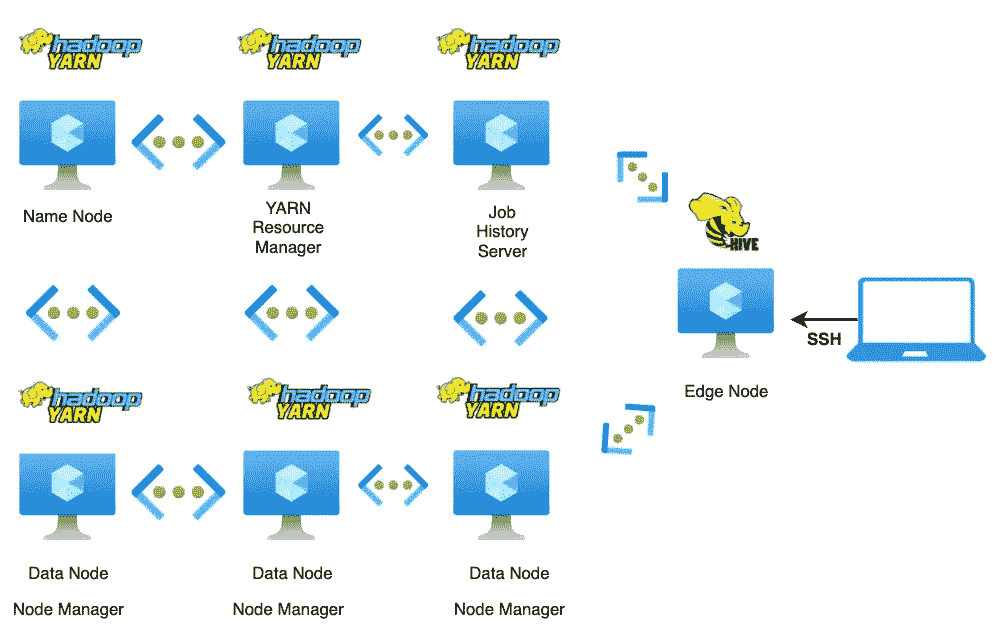

# 评估匿名共享数据的批处理分析

> 原文：<https://medium.com/analytics-vidhya/assessing-batch-processed-analytics-of-anonymized-rideshare-data-b02323824530?source=collection_archive---------15----------------------->


作者图片

> 分享我使用一些最著名的数据存储、管理、可视化和批量 ETL 处理分析工具成功实施大数据的经验。

**[**芝加哥**](https://chicago.curbed.com/2019/4/15/18311340/uber-lyft-chicago-data-fares-drivers) **市是美国第一个公布匿名拼车数据的城市，这些数据来自优步、Lyft 和 Via 等公司。这种叫车平台在许多层面上严重依赖数据驱动的决策来提供安全可靠的运输。我探索了一个公共** [**数据集**](https://data.cityofchicago.org/Transportation/Transportation-Network-Providers-Trips-2018/rpfj-eb3a) **的大数据解决方案，考虑到产生数 Pb 分析数据的洞察需求。****

## **我的解决方案建议的不同阶段如下:**

*   **为有意义的洞察创建数据策略**
*   **构建基于云的大数据架构**
*   **设计维度数据模型**
*   **使用 HDFS 和 Hive 进行大数据处理**
*   **部署有效的分析以获得洞察力和数据可视化**

# **为有意义的洞察创建数据策略**

****

**[优步工程](https://1fykyq3mdn5r21tpna3wkdyi-wpengine.netdna-ssl.com/wp-content/uploads/2016/05/allenkey.gif)**

**与司机和出行相关的数据报告由芝加哥许可的打车服务提供(**优步、Lyft、**和**通过**)。匿名化的 rideshare 数据提供了一个感知步骤来说明芝加哥和其他大都市地区的常见出行模式。我决定评估打车服务在经济联系紧密的地区和上下班高峰期的影响，以及产生真正商业价值的其他见解。**

# **构建基于云的大数据架构**

**为了建立一个类似于打车服务所使用的有效数据基础设施，我的大数据平台主要由 Hadoop 生态系统组成。Apache Hadoop 通过分布式处理和集群分析为分析数据提供了一个快速、高效和可靠的平台。按照 Apache Hadoop 文档，集群是在 Azure 中的 Linux 虚拟机上构建的。**

****

**Azure 虚拟机的配置遵循限于数据集的约束，其中每个虚拟机代表集群的一个节点。**

****在创建适当的虚拟机之前，考虑了以下因素:****

****

**作者图片**

*   **应用资源组**
*   **存储资源区域**
*   **基本操作系统**
*   **数据磁盘大小和加密类型**
*   **可以创建的最大虚拟机数量**
*   **虚拟机相关资源**

**在创建由所有虚拟机共享的资源组' **BigData** 时，为了安全起见，每个虚拟机都属于同一个存储资源区域'**美国东部**'。由于高要求的工作负载，我选择了 128 和 64 GB 基于 SSD 的磁盘和 Ubuntu Server，以产生低延迟和高性能。所有的虚拟机共享一个 SSH 公钥' **bigdata_azure** '来过滤 azure 虚拟网络中的网络流量。“ **Hadoop** ”标签是简单的名称-值对，有助于访问控制和资源分类。**

****

**作者图片**

## **Hadoop HDFS 和 YARN 配置**

****

**作者图片**

```
[**Site-specific configurations**](https://hadoop.apache.org/docs/stable/hadoop-project-dist/hadoop-common/ClusterSetup.html) **for a fully distributed Hadoop cluster:** etc/hadoop/core-site.xml etc/hadoop/hdfs-site.xml etc/hadoop/yarn-site.xml etc/hadoop/mapred-site.xml
**Standalone Operation:** $ mkdir input
$ cp etc/hadoop/*.xml input
$ bin/hadoop jar share/hadoop/mapreduce/hadoop-mapreduce-examples-3.3.0.jar grep input output 'dfs[a-z.]+'
$ cat output/*
**Pseudo-Distributed Operation:** $ vi etc/hadoop/core-site.xml
<configuration>
<property><name>fs.defaultFS</name><value>hdfs://localhost:9000</value>
</property>
</configuration> $ vi etc/hadoop/hdfs-site.xml
<configuration>
<property>
<name>dfs.replication</name>
<value>1</value></property></configuration>
```

****

**[**Hive 3.1.2 设置**](https://www.apache.org/dyn/closer.cgi/hive/)**

# **设计维度数据模型**

****

**作者图片**

***维度建模技术摘自* [*数据仓库工具包第三版*](https://www.kimballgroup.com/data-warehouse-business-intelligence-resources/books/data-warehouse-dw-toolkit/)**

1.  ****选择要建模的业务流程:**包括拼车在内的客户出行**
2.  ****申报粮食的业务流程:**跨国公司 trips**
3.  ****选择应用于每个事实表行的维:**位置和时间**
4.  ****确定将填充每个事实表行的数字事实:**收入、英里数、行程和乘车时长**

****

**优步的一天**

# **使用 HDFS 和 Hive 进行大数据处理**

****

**Hadoop UI**

****读取时的模式:**数据集被移动到 Hadoop 中的 HDFS，Hive 中的外部表被构建为从 CSV 文件中读取。**

## ****维度丰富:****

*   ****位置维度** ( **Location_text** ):行程数据集包含接送质心位置的纬度和经度坐标。使用反向地理编码 API，地理坐标被转换为人类可读的地址以供分析。**

*   ****日历日期维度** ( **Dates_text** ):行程数据集时间戳为 MM/DD/YYYY 格式。使用 PostgreSQL，为工作日、周末和公共假日等属性创建了一个关系表。**

## ****暂存数据的外部表:****

```
locations_text -> user/data/dimensions/locations
dates_text -> user/data/dimensions/date
time_buckets -> user/data/dimensions/time
trips_data -> user/data/fact
```

## **填充托管表**

****

**使用外部表，为每个维度创建了托管表。然后使用维度键加载事实表。**

```
CREATE TABLE IF NOT EXISTS fact_trips(
trip_id string
,pickup_date_id int
,dropoff_date_id int
,pickup_location_id int
,dropoff_location_id int
,pickup_time_id int
,dropoff_time_id int
,fare DOUBLE
,tip DOUBLE
,additional_charges DOUBLE
,total DOUBLE
,trip_duration_seconds INT
,trip_miles DOUBLE
,trip_pooled int)
PARTITIONED BY (trip_part_date INT);
```

**平均每天生成超过 280，000 条记录，包含 74 MB 数据。使用外部表和 SQL，我为维度数据模型中提到的属性构建了分区事实表和维度表。由于处理的数据量在增长，按天分区有助于更轻松地控制和更快地解决查询。**

****

**作者图片**

**创建了一个非规范化的聚合表来支持即席查询。该表可以进一步汇总，以生成每周和每月的快照。**

****

**批处理(图片由作者提供)**

# **洞察和数据可视化分析**

**乘客行为数据揭示了打车平台如何利用信息技术来改善服务，并说明了它们对城市交通系统的影响。使用[Apache Superset](https://superset.apache.org/)进行可视化强调了收集和生成大数据对于推动业务增长的重要性。**

****

**总行程—第 44 周(图片由作者提供)**

****

**作者图片**

****在 2018 年 11 月 1 日至 2018 年 12 月 31 日的两个月期间，由于重大节假日的影响，出行模式出现了部分异常。****

*   **每周平均超过 120 万次旅行，其中 84%为个人预订，其余为共享预订。**
*   **行程开始和结束时间四舍五入到最近的 15 分钟，行程的中值长度为 3.4 英里。他们往往聚集在清晨通勤时间和“夜生活”时间。在传统通勤时间和跨国公司使用高峰期间，跨国公司的平均出行速度下降。**
*   **往返于经济相关地区的旅行(1200 万次跨国公司旅行中的 83%)是旅行的最大来源，旅行时间较短，与在本地区以外的旅行相比，共乘比例较低。**
*   **根据地图，取货地点主要在中央商务区、西环路、河北、中途岛和奥黑尔国际机场周围。**

****

**作者图片**