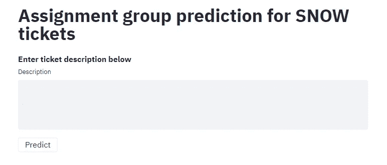

# 票务工具的分配组预测— SERVICENOW

> 原文：<https://medium.com/analytics-vidhya/assignment-group-prediction-for-ticketing-tool-servicenow-f46f972c82e?source=collection_archive---------10----------------------->

# 1.问题陈述

几乎每个大中型组织都使用支持票系统。ServiceNow 是所有组织中最常用的票证系统之一。


现在服务中的用户针对任何硬件或软件相关问题提出支持请求，例如采购新台式机、创建 open office 365 帐户等。然后，L1 工程师将这些票据分配给相应的技术支持团队。

我们的目标是自动化这个 L1 工程师的工作，并将票证分配给适当的技术支持团队。

# 2.数据收集

现在进入第二步，即数据收集。我们很幸运，因为 ServiceNow 具有以 CSV 文件形式导出数据的功能。

*   首先，我们将移除所有过滤器。右键单击汉堡图标→选择过滤器→无。


*   现在右击任意一列上面的汉堡图标→导出→CSV。


就是这样。我们有数据了。

# 3.数据清理

```
# To read and manipulate dataframe
import pandas as pd# For EDA
import matplotlib.pyplot as plt
import seaborn as sns
from wordcloud import WordCloud, STOPWORDSstopwords = set(STOPWORDS)
%matplotlib inline
```

作为开始，我已经导入了一些模块，以后我们可以在需要时导入更多。

由于数据是表格形式的，我使用 [**熊猫**](https://pandas.pydata.org/) 来读取和操作我们的数据。

对于 EDA 我用过[**matplotlib . py plot**](https://matplotlib.org/api/pyplot_api.html)， [**seaborn**](https://seaborn.pydata.org/) **，**和 [**wordcloud**](https://amueller.github.io/word_cloud/generated/wordcloud.WordCloud.html) 。

此外，我还创建了一个名为 stopwords 的变量，它将存储所有的英语停用词，如 the、is 等。

**%matplotlib inline** 命令将帮助显示笔记本本身中的所有图表。

现在我们需要读取我们的数据。

```
incident_df = pd.read_csv('incident.csv', encoding='ISO-8859-1')
```

我使用 pd.read_csv 来读取 csv 文件，并给出文件名和编码类型作为参数。我的文件在根目录下，如果你在其他地方有它，那么你可以提到完整的路径。

一旦我们准备好数据，现在我们需要清理它。我只保留了三列，即简短描述和分配组，并删除了其余不需要的列。

```
df1 = incident_df[[‘Short description’,’Description’,’Assignment group’]]
```

首先，我们需要检查缺失值，因为我已经创建了一个函数，它将数据帧作为输入，并以数据帧的形式返回缺失的计数和百分比。

```
# Function to check and create dataframe for missing valuedef check_miss(df):'''This function will check number and % of missing value in each columnif it is more than 0 then it will return a dataframe'''#Column which have missing valuemiss_col = [col for col in df.columns if df[col].isnull().sum()>0]#DataFrame that contains no. and % of missing valuemiss_df = pd.DataFrame([df[miss_col].isnull().sum(),df[miss_col].isnull().mean()*100],index=['Missing Value','Missing Value %'])return miss_dfcheck_miss(df1)
```


由于缺失值的百分比非常低，因此我们可以直接删除这些行，因为我已经创建了数据框的副本，并使用了 dropna 命令来删除缺失值的行。

```
df2 = df1.copy()df2.dropna(inplace=True)
```

创建票证有两种方式。用户可以打电话给 L1 团队，他们可以代表用户提出问题，或者用户自己可以提出问题。当 L1 团队开罚单时，他们遵循的格式包含许多不必要的文本描述，我已经用正则表达式删除了这些描述。

```
df3 = df2.copy()df3['Description'] = df2['Description'].apply(lambda x: x[:x.find('Issue Status:')])
```

现在我们可以开始我们的 EDA 过程了。

# 4.电子设计自动化(Electronic Design Automation)

我们将对三列进行 EDA，即目标列、简短描述和描述。我用 countplot 查看了任务组的数量，用 wordcloud 查看了出现次数最多的单词。

## 4.1 目标变量

```
plt.figure(figsize=(10,20))
sns.countplot(y=df3[‘Assignment group’],order=df3[‘Assignment group’].value_counts().index)
plt.show()
```


许多分配组的数据不充分。我已经删除了值计数小于 200 的组。

我分两步做到了这一点:

1.  创建值计数小于 200 分配组列表。
2.  删除不在分配组列表中的行。

```
assignment_group=[]
for key,value in df3[‘Assignment group’].value_counts().iteritems():
 if value>=200:
 assignment_group.append(key)df4 = df3[df3['Assignment group'].isin(assignment_group)]
```

## 4.2 简短描述

我把它分成了两部分。

1.  每个分配组的简短描述的长度。
2.  每个作业组的简短描述中使用最多的词。

```
df5 = df4.copy()
df5[‘short_count’] = df4[‘Short description’].apply(lambda x: len(x))plt.figure(figsize=(10,8))
sns.barplot(x=df5['short_count'],y=df5['Assignment group'])
plt.show()
```


## Wordcloud

```
text = df5.groupby(‘Assignment group’)[‘Short description’].apply(lambda x: “ “.join(x))index = 0
plt.figure(figsize=(20,30))
for key,value in text.iteritems():
    # Create and generate a word cloud image:
    wordcloud = WordCloud(stopwords=stopwords).generate(str(value))
    index+=1
    plt.subplot(12,3,index)
    plt.imshow(wordcloud, interpolation='bilinear')
    plt.axis("off")
    plt.title(key)
plt.tight_layout()
```


我在描述栏也做了同样的分析。完整代码请查看 GitHub。

我注意到，对于每个作业组，在简短描述和说明中都有一些常用词。

例如，在 EC&C 中——project wise**project wise**是常用的词。

# 5.模型创建

我为模型创建和预测创建了一个单独的文件。

同样，我们需要导入熊猫并读取我们的数据。

这次我只保留了两列，即描述和分配组。

```
import pandas as pd # Read data
df = pd.read_csv(‘incident.csv’, encoding=’ISO-8859–1')

# Dropping rows with NaN target value
df.dropna(subset=[‘Assignment group’, ‘Description’], inplace=True)
```

我已经将输入变量 Description 列分配给 X，将目标变量 Assignment group 分配给 y。

```
# NLP Modeling
X = df['Description']
y = df['Assignment group']
```

在下一步中，我导入了 LabelEncoder 并将目标列从文本数据转换为数字数据。例如，如果我们有 100 个唯一的目标变量，那么每个变量都有一个唯一的编号。

```
# Encoding target variable
from sklearn.preprocessing import LabelEncoder 
le = LabelEncoder().fit(y)
y = pd.Series(le.transform(y))
```

现在我正在导入 train_test_split，我用它将我们的数据分成训练和测试。

```
# Splitting Data
from sklearn.model_selection import train_test_split 
X_train, X_test, y_train, y_test = train_test_split(X, y, random_state=0)
```

我正在使用 CountVectorizer，它将标记每个描述中的文本，将删除停用词，将删除总数小于 5 的词，并将保持每个词的频率。

```
# Vectorisation of description
from sklearn.feature_extraction.text import CountVectorizer 
cv = CountVectorizer(stop_words=’english’, min_df=5).fit(X_train)
vector = cv.transform(X_train)
```

对于 NLP，两种算法给出了很好的精度，一种是逻辑回归，另一种是朴素贝叶斯。我已经测试了这两个项目，我在逻辑回归中获得了更多的准确性，所以我使用了这种算法。

```
# Logistic regression
from sklearn.linear_model import LogisticRegression 
clf = LogisticRegression().fit(vector, y_train)
```

一旦我们训练了我们的模型，现在我们需要以文件的形式保存每个预处理步骤，以便以后使用。为此，我用了泡菜。

```
# Pickleing model
import pickle file = open(‘cv.pkl’, ‘wb’)
pickle.dump(cv, file)
file.close() file2 = open(‘clf.pkl’, ‘wb’)
pickle.dump(clf, file2)
file2.close() file3 = open(‘le.pkl’, ‘wb’)
pickle.dump(le, file3)
file3.close()
```

最后，我创建了一个函数，它将文本数据作为输入，并将做所有的预处理和预测分配组作为输出。

```
# Predictiondef 
predict(description): 
  prediction = clf.predict(cv.transform([description])) 
  return le.inverse_transform(prediction)[0]
```

# 6.部署

一旦我们准备好模型，我们需要部署它。

我在 Heroku 部署我的模型，你们可以使用任何其他平台。

我已经为我的前端 UI 简化了库。我也尝试过 flask，但对于这个项目，streamlit 是比 flask 更好的选择，因为它非常容易。

一旦我们运行这个应用程序，它将在网络浏览器中显示用户界面，我们可以输入门票描述，并点击预测按钮。



查看下面的详细信息。

## 开源代码库

[](https://github.com/anurodhmohapatra/NLP-Assignment_Group_Predictor) [## anurodhmohapatra/NLP-赋值 _ 组 _ 预测值

### 几乎每个大中型组织都使用支持票系统。ServiceNow 是最常见的…

github.com](https://github.com/anurodhmohapatra/NLP-Assignment_Group_Predictor) 

## 应用

 [## 细流

assignment-group-prediction.herokuapp.com](https://assignment-group-prediction.herokuapp.com/) 

## 投资组合

[](https://www.anurodhmohapatra.com/) [## 阿努罗德·莫哈帕特拉

www.anurodhmohapatra.com](https://www.anurodhmohapatra.com/) 

如果你喜欢这篇文章，请鼓掌，如果你有任何疑问，可以在下面的评论区联系我。