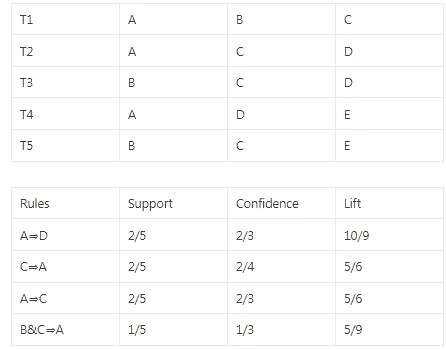

# 包含 Apriori 算法的关联规则挖掘

> 原文：<https://medium.com/analytics-vidhya/association-rule-mining-including-apriori-algorithm-8c0f9888e125?source=collection_archive---------1----------------------->

超市有大量的顾客进入商店，作为店主，他们需要决定什么产品可以放在哪个货架上等等。所以下周商店决定推出新的 Iphone，但是他们需要决定用什么来搭配它，我们如何吸引顾客等等..因此，为了回答这些问题，该公司进行了数据挖掘，并试图找到项目之间的关联。

# 项目集

项目集是客户一起购买的两个或更多相似项目的集合。

例如，面包和黄油、纸和笔、笔记本电脑和充电器等

如果我们把这种面包和黄油作为顾客经常购买的商品。商店决定在优惠活动中推出*鸡蛋，那么顾客可能也会购买鸡蛋。所以这些都是*物品之间的关联**

# 关联规则

关联规则是 if→then 格式。所以如果用户买 A，那么他就买 b。这被称为*单一基数。*

> 基数是特定集合中项目的数量。所以如果有一个集合，比如 A={1，2，3}，那么它的基数是 3。

表示在同一笔交易中，人们会一起购买 A 和 B。

a 称为前因，B 称为后果。

所以这些联想可以增加如面包、黄油、鸡蛋和钢笔、纸、铅笔等。当它增加时，基数变成倍数

# 关联规则的度量

这些规则通过以下方式进行衡量

*   支持
*   信心
*   电梯

# 支持

它是用户购买商品的频率和用户在同一交易中购买商品的频率的组合

支持的用途是过滤掉不太频繁购买的物品，将其剔除。

***Support = freq(A)/N***

***Support = freq(A，B)/N*** 其中 N 为事务数，freq 为 A 出现或 A 和 B 出现的事务数。

# 信心

它表示在给定 A 一个接一个出现的次数的情况下，A 和 B 一起出现的频率。

置信度的用途是发现当用户频繁地购买 A、B 而不是 C 时，我们可以消除关联规则

***置信度=freq(A，B)/freq(A)***

虽然我们制定了这些规则，比如说对于交易，我们有 5000 条规则，但是对于每一个项目来说，计算规则是不可能的。所以我们引入了另一个度量，即 Lift。

# 电梯

它表示任何规则的力量。

电梯的使用是我们可以确定随机性的发生，而不是协会和消除规则。

***Lift = Support/Support(A)* Support(B)***

尽管我们发现规则的强度和关联，但公司的要求每次都不同。所以公司固定 ***最低支持和信心。*** 所以超出特定阈值的只有关联规则被选中。

# 支持、信心和提升的例子

有五个项目被命名为 A、B、C、D、E，并且有 5 个交易与规则一起给出。计算支持度、置信度和提升表如下。

# 频繁项目集

频繁项集是那些支持度大于阈值或用户指定的最小支持度的项。这意味着如果 A & B 一起是频繁项集，那么单独的 A 和 B 也应该是频繁项集。

假设有两个事务:A= {1，2，3，4，5}和 B= {2，3，7}，在这两个事务中，2 和 3 是频繁项集

# Apriori 算法

它用于高效地逐级生成频繁项集，从而减少搜索空间

> *规则:所有 aa 频繁项集的非空子集也必须是频繁的。*

先验有两个步骤

*   Join — (K+1)来自 K 的项目集
*   修剪——计数

# Association Rule Mining

There are 2 steps.

*   Find all frequent itemsets using Apriori Algorithm or FD-Growth
*   Association Rules from Frequent Item Sets ( Minimum Support and Confidence threshold)

# Eg for Association Rule Mining using Apriori

Minimum Support = 2 and Minimum Confidence = 60%

Each Candidate/Product are I1, I2, I3, I4 and I5

*   We have to start with single cardinality find the support count
*   Then check whether the support_count
*   Increase the cardinality and do the previous steps again until the set becomes empty

The above step is called as C1 or 1 frequent Itemset .

If we compare that with the Minimum Support = 2 all the items are satisfying the criteria so we can call that as L1.

So from L1 → we have to compute C2 and from there we derive L2.

Increase the cardinality or frequent itemsets as 3 and find the itemsets satisfying computing L3.

The solution is L3 and it is computed using the formula given below

The frequent itemsets are ***I1，I2，I3 和 I1，I2，I5。***

# 关联规则

*   对于每个频繁项集 l，生成 l 的所有空子集
*   对于 l 的每个非空子集 S，输出规则$S=> (l-S)$

让我们以频繁项集 I1，I2，I5 为例。

I1 → I2 ^ I5

I2 → I1 ^ I5

I5→I2^I5

I1^I2→I5

I1^I5→I2

I2^I5→I1

I1^I2^I5→empty 所以我们可以忽略这条规则

计算置信度，如果它小于最小置信度，那么我们可以忽略这个规则

# 先验的应用

*   电子商务中的推荐系统
*   数据挖掘
*   超市提高销售业绩
*   具有病历记录的医疗领域