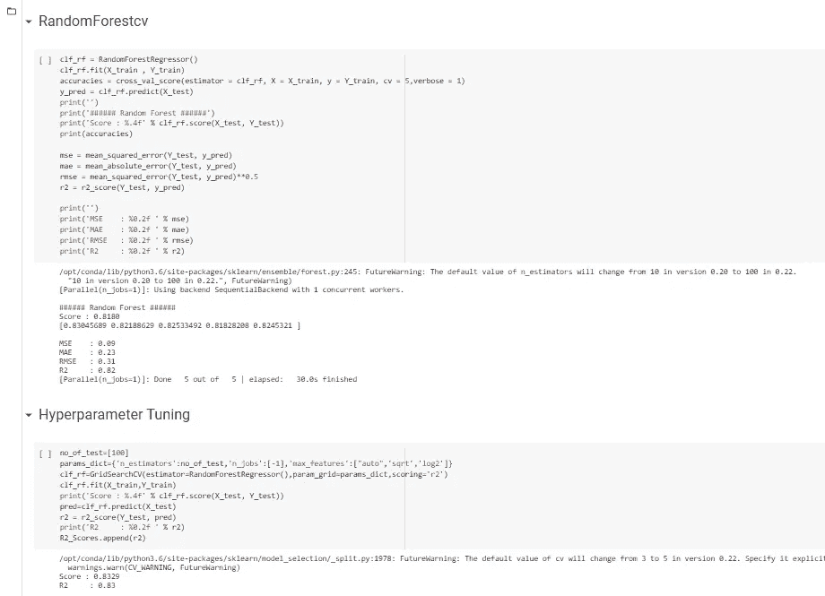

# 利用机器学习预测小行星直径

> 原文：<https://medium.com/analytics-vidhya/asteroid-diameter-prediction-using-machine-learning-3e81eb14dd7a?source=collection_archive---------6----------------------->

Linkedin [个人资料](https://www.linkedin.com/in/chaitanyakatepalli/)

想过如果一颗和公寓一样大的小行星撞击地球会怎么样吗？如果它撞击地球，这个打击可能会摧毁整个城市。所以我们关心的是预测小行星的直径，因为如果我们可以估计小行星的直径，我们就可以估计小行星撞击地球可能造成的损害。在深入研究这个项目之前，让我们快速了解一下小行星到底意味着什么？

**那么什么是小行星呢？**

小行星是像行星一样围绕太阳旋转的小岩石物体，尽管它们像我们的行星一样围绕太阳旋转，但它们比我们的行星小得多，有数百万颗小行星，但它们大多数主要生活在火星和木星之间的小行星带。

**为什么小行星会撞击地球？**

由于地球的逃逸速度，最小撞击速度为 11 公里/秒，小行星撞击地球的平均速度约为 17 公里/秒。最有可能的撞击角度是 45 度。小行星的大小和速度以及密度和撞击角度等撞击条件决定了撞击事件中释放的动能导致小行星撞击地球。所以为了防止小行星造成的破坏，我们可以使用机器学习来预测小行星的直径。

**内容**

1.  问题直觉
2.  数据描述
3.  探索性数据分析
4.  机器学习模型
5.  模型的性能
6.  结论
7.  进一步增强
8.  参考

**问题直觉**

由于小行星是围绕太阳旋转的小型岩石物体，我们主要关心小行星直径的估计，但实际上小行星直径的预测并不是一件容易的工作，因为有许多方法来估计小行星的直径，并且每种方法都试图超过前一种方法。因此，我们关心的是找到正确的方法来估计小行星的直径，因为它是小行星的物理直径，通过估计方法，即使小行星将要撞击地球，我们也可以减少损失。

**数据集描述**

在这个数据集中，我们提供了关于各种小行星及其轨道速度、直径和星等以及许多其他特征的信息，下面的数据集取自 Kaggle，该数据集取自 Nasa 的 JPL 数据库，您可以在这里找到数据集[的链接](https://www.kaggle.com/basu369victor/prediction-of-asteroid-diameter)，这是一个非常大的数据集，由大约 80 万元组和 27 列组成。但是在下面的数据集中，我只考虑了一些重要的特征

**提供的功能**

1.  小行星全名
2.  长半径
3.  古怪
4.  震级斜率参数
5.  相对于 x-y 黄道平面的倾斜度(度)
6.  上升节点的经度
7.  近日点距离
8.  远日点距离
9.  轨道周期
10.  数据弧
11.  轨道条件代码
12.  使用的观察次数
13.  小行星直径
14.  绝对星等
15.  几何反照率
16.  旋转周期
17.  近地物体

**探索性数据分析**

# **加载数据**

# 绘制热图

上图可以用来找出变量之间的相关程度，从图中我们可以发现变量之间存在很高的相关程度。

# 绘制因子图

上面的图给出了属于每一类的小行星数量的信息，Factorplot 用于产生关于分类数据的信息

从上图我们可以推断出观测值和轨道周期的分布以及数据弧频率的分布。

从上面的图中，我们可以通过在 x 轴上取 data_arc 并将分布类型指定为核密度估计来推断数据的分布。

S

因此，为了指定数据集中的成对关系，我们需要使用上图中的成对图。我们可以推断 x 轴上的绝对星等和 y 轴上的反照率之间的成对关系。通过指定散点图的类型，我们可以推断绝对星等和反照率之间的关系

从下图中，我们可以推断出数据弧和观测值之间的关系，我们可以说大部分小行星都在数据弧中，只有很少的异常值

# **机器学习模型**

我使用了各种模型来预测小行星的直径

# 使用的指标

1.  R2 分数

2.均方误差

3.绝对平均误差

4.均方根误差

1.  **R2 评分** : R 平方是数据与拟合回归线接近程度的统计指标。它也被称为决定系数，或多元回归的多重决定系数。
2.  **均方误差**:**均方误差** (MSE)告诉你回归线离一组点有多近。它通过从点到回归线的距离(这些距离就是“误差”)并平方它们来实现。平方是必要的，以消除任何负号。它也给予较大的差异更多的权重。它被称为 [**均值**](https://www.statisticshowto.com/mean/) 平方误差，因为您正在寻找一组误差的平均值。MSE 越低，预测越好。
3.  **平均绝对误差** : **绝对误差是你测量中的误差量。**是测量值与“真”值之差，**平均绝对误差** (MAE)是所有绝对误差的[平均值](https://www.calculushowto.com/average-value-of-a-function/#def)。公式是:

4.**均方根误差** : **均方根误差** (RMSE)是[残差](https://www.statisticshowto.com/residual/) ( [预测误差](https://www.statisticshowto.com/prediction-error-definition/))的[标准差](https://www.statisticshowto.com/probability-and-statistics/standard-deviation/)。残差是数据点离回归线有多远的度量；RMSE 是对这些残差分布程度的一种度量。换句话说，它会告诉您数据在最佳拟合线周围的集中程度。均方根误差常用于气候学、预测和[回归分析](https://www.statisticshowto.com/probability-and-statistics/regression-analysis/)来验证实验结果。

在这个项目中，我使用了各种模型来预测小行星的直径，为此，最初我将数据集分为训练集和测试集，并将目标值作为直径。

# **线性回归**

线性回归用于找出输入变量和单个输出变量之间的线性关系，为该模型产生的 r2 得分为 73.5

# 交叉验证线性回归

我们使用线性回归进行交叉验证

通过交叉验证，我们可以看到 r2 得分提高到 78.56

与线性回归相比，使用交叉验证的线性回归的 rmse 和 mse 较小

# 里脊回归

**岭回归**是一种模型调整方法，用于分析任何存在多重共线性的数据。

用交叉验证进行岭回归得到的 R2 分数是 70.56

# 弹力网 CV

**ElasticNetCV** 是一个交叉验证类，可以搜索多个 alpha 值并应用最好的一个。我们将用 alphas 值定义模型，并用 xtrain 和 ytrain 数据拟合它

具有交叉变型的弹性网的 R2 得分为 72.4

**决策树回归**

决策树以树结构的形式建立回归或分类模型。它将一个数据集分解成越来越小的子集，同时一个相关的决策树被增量开发。最终结果是一个有决策节点和叶节点的树。决策节点(例如，Outlook)具有两个或多个分支(例如，晴天、阴天和雨天)，每个分支代表所测试的属性值。叶节点(例如，玩的小时数)代表关于数字目标的决策。树中最顶端的决策节点，对应于称为根节点的最佳预测器。决策树可以处理分类数据和数值数据。

决策树回归获得的 R2 分数是 65.8

**随机森林回归**

随机森林是一种**监督学习算法**，使用集成学习方法进行**分类和回归**。

**随机森林**是一种**套袋**技术，**不是助推**技术。**随机森林**中的树并行运行。在构建树时，这些树之间没有交互。它通过在训练时构建大量决策树并输出作为类别的**模式**或单个树的平均预测的类别来运行。

随机森林回归获得的 r2 分数为 70.5，我们对随机森林进行了交叉验证，得出的 r2 分数为 81.80。通过进一步的超参数调整，我们能够计算出随机森林的 R2 分数为 83.2

**支持向量机**

支持向量机算法的目标是在 N 维空间(N-特征的数量)中找到一个超平面，该超平面清楚地分类数据点。用该模型获得的 R2 分数是 76.7

**XG 增强回归**

[XGBoost](https://xgboost.ai/) 是一种基于决策树的集成机器学习算法，使用梯度推进框架。在涉及非结构化数据(图像、文本等)的预测问题中。)人工神经网络往往优于所有其他算法或框架。然而，当涉及到中小型结构化/表格数据时，基于决策树的算法目前被认为是同类最佳的。请参见下图，了解这些年来基于树的算法的演变。它可以用于基于分类和回归的算法。该模型的 R2 得分为 80.4

**结论**

下面的模型给出了关于各种模型性能的信息，从下图中我们可以观察到随机森林表现良好，因此我们使用了超参数调整来进一步微调模型，因此我们可以根据上面的分析得出结论，随机森林将是估计小行星直径的最佳选择。

比较模型的性能

**参考文献**

1.  [https://machine learning mastery . com/gentle-introduction-xgboost-applied-machine-learning/](https://machinelearningmastery.com/gentle-introduction-xgboost-applied-machine-learning/)
2.  【https://spaceplace.nasa.gov/asteroid/en/ 
3.  [https://www . space . com/51-asteroids-formation-discovery-and-exploration . html](https://www.space.com/51-asteroids-formation-discovery-and-exploration.html)