# 天文图像分类

> 原文：<https://medium.com/analytics-vidhya/astronomical-images-classification-18d39a7f323f?source=collection_archive---------5----------------------->

## **使用深度学习 CNN**

# 介绍

最近，天文学在探测器、仪器、望远镜，甚至是发送到外层空间和遥远行星以收集巡天数据来绘制宇宙地图的探测器方面经历了巨大的飞跃和进步。这些收集的数据被组织成非常大的数据集，形成了所谓的面向数据的天文学。不幸的是，不可能手动处理这些大规模数据集以获得有效的结果，因此，天文学家正在寻求方法来自动化人工扫描的人为错误，以便通过最先进的数据挖掘技术、统计方法和数据科学工具(这是一门新学科，称为*天文信息学*[【1】](#_ftn1))从这些大型原始数据集中发现天文知识和信息。我和许多其他人一样认为，在这里没有比通过使用光度图像、红移或射电天文学收集的信号数据集，在大规模天文数据集上应用机器学习算法和技术来分类恒星、类星体和星系更好的玩家了。从历史上看，早期的努力始于 2010 年，由美国国家研究委员会发起。这一步为后来的研究贡献奠定了基础[【3】](#_ftn3)使用大型全球分布式数字天文数据库(如大型综合巡天望远镜(LSST)、平方公里阵列天文台和斯隆数字巡天(SDSS))聚焦并丰富了该领域。但该领域仍然年轻，需要更多的研究来找到新的精确技术，特别是在机器学习方面，特别是利用深度学习和现在向公众开放的大规模天文数据集的可用性。这些分类问题应该得到解决，以便正确绘制我们的宇宙，以获得对它的更多了解，并认可现有的和新的宇宙学理论，当然，这里完美的候选技术是深度学习，因为它已经在大规模图像数据集上证明了它的成功，如我们领域的情况。从这个角度来看，我选择了具体的天文分类问题来研究应用深度学习算法，以便使用斯隆数字巡天(**SDSS**)[【4】](#_ftn4)超新星巡天，特别是 SDSS 遗留巡天 SDSS-II SN 巡天的著名公共数据集来验证上述可能性。

【https://en.wikipedia.org/wiki/Astroinformatics】T2

[【2】](#_ftnref2)【天文学和天体物理学十年调查】[【https://www.nap.edu/read/12951/chapter/1】](https://www.nap.edu/read/12951/chapter/1)

[【3】](#_ftnref3)相关学术研究举例:[http://iopscience.iop.org/article/10.1086/507440](http://iopscience.iop.org/article/10.1086/507440)，[https://arxiv.org/abs/astro-ph/0106481](https://arxiv.org/abs/astro-ph/0106481)，[https://arxiv.org/abs/1711.05744](https://arxiv.org/abs/1711.05744)，[https://arxiv.org/abs/1706.02467](https://arxiv.org/abs/1706.02467)。

[【4】](#_ftnref4)[https://classic.sdss.org/supernova/aboutsupernova.html](https://classic.sdss.org/supernova/aboutsupernova.html)

# 问题陈述

巡天提供了大量不同形式的天文数据集，如光谱、红外光谱、光度红移、光变曲线和成像数据，这些数据代表了各种天文信息和天体。考虑到成像数据，天文学家通过扫描手头的图像来手动开始分类过程，以检测哪些是真实的，哪些不是，然后将它们分组为可能的恒星、类星体和星系。成像数据通常包含短暂出现的物体，称为瞬变，如伽马射线、小行星和超新星。超新星[【1】](#_ftn1)(SN)发生在恒星寿命结束时，即当一颗恒星被爆炸摧毁时，它将在整个星系中发出极其明亮的光。产生的超新星(SNe)根据它们在最大光线下的光谱特征分为五个主要类别(I 型、II 型、Ib 型、Ic 型、Ia 型),不同之处在于它们的光谱中存在氢、氦和其他元素。这些超新星爆炸要么是白矮星的热核爆炸(对于大约 1.4 个太阳质量的恒星和偶极子)，要么是恒星的核心坍塌(大约 9 个太阳质量的大质量恒星)，这释放出引力能量并保持为中子星(脉冲星)或黑洞。这里的问题是，对这些物理现象的人工制品和对象的分类是手动完成的，这是一项非常耗时的工作，并且还受到因人而异的人类偏见的影响，并且手动扫描对于大量的图像是不可行的。作为这个问题的解决方案，人们正在努力探索应用机器学习算法来自动化知识发现和提取这些大型原始数据集中的天文信息的过程，而不是不可行的手动和人工处理的可能性。在我们的项目中，我们研究了深度学习算法的应用，以验证上述可能性，但为了与我们的基准模型进行比较，我选择了天文学家的第一步，即在二元分类问题中寻找有趣的对象，以确定底层成像数据中什么是真实的，什么不是。

【https://spaceplace.nasa.gov/supernova/en/】

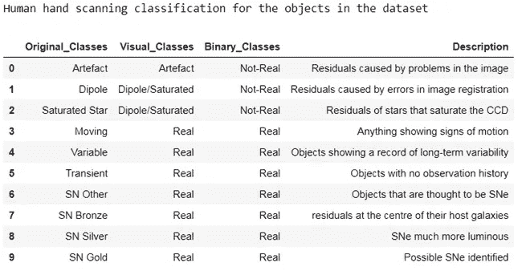

# **指标**

为了评估我的工作结果并将其与所选的基准模型进行比较，我使用了与那里使用的相同的四个性能度量指标。在这种比较中使用的四个度量通常应用于分类问题，它们是 **A** 精确度(A)**P**精确度(P)**R**ecall(R)和**F1-得分**。它们根据真/假阳性/阴性(tp、tn、fp、fn)来定义。其中正类是那些对应于真实对象的类。我们还引入了一些其他指标，如**混淆矩阵**和曲线下面积( **AUC** )以及接收器工作特性( **ROC** )曲线，该曲线是在不同阈值下真阳性率( **TPR** )对假阳性率( **FPR** )的曲线图，以研究我们的二元分类器的区分阈值如何变化，并展示假阳性和假阴性之间的权衡**。**

**准确度**

准确性定义为我们的模型获得正确预测的比例，它可能是一个合理的初始度量，因为我们数据集中的类都具有相似的大小，计算如下

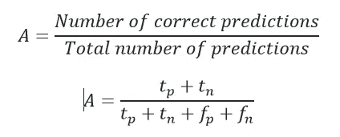

*其中 TP =真阳性，Tn =真阴性，FP =假阳性，Fn =假阴性* ***。***

**精度**

精度反映了报告的真实对象的比例(肯定识别的比例实际上是正确的)。它由以下公式计算得出:-

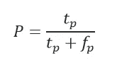

**回忆(**真阳性率或 **TPR)**

回忆为分类器找到的真实对象的比例(实际阳性的比例被正确识别)。其计算如下:-

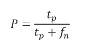

**F1-得分**

F1-Score 是对测试准确性的一种度量，用精确度和召回率(精确度和召回率之间的调和平均值)来表示，它可以被认为是一种同等地惩罚假阴性和假阳性的度量，但通过它们对完整集的反向分数贡献来加权，以考虑大的类别号层次结构。它计算如下:-

**假阳性率(**掉出 **)**

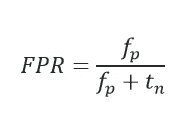

**混淆矩阵**

混淆矩阵包含所有可能的模型预测结果的出现次数，对于每个分类，有四种可能的结果:如果模型正确地预测“真实”对象，则它被称为真阳性(Tp ),如果被错误地分类为“非真实”对象，则它是假阴性(Fn)。另一方面，如果模型正确地预测对象是“非真实的”,则它是真实否定的(Tn)。但如果归类为“真实”时却不是，那么它就是假阳性(Fp)。简而言之，它包含真/假阳性/阴性的总数。并且可以如下所示进行构造:

**曲线下面积**(ROC 曲线下面积或 AUC)

它是机器学习社区中经常用于模型比较的统计量，它等于分类器将正确分类随机选择的实例的概率。这是用一种单一的方法来比较不同的模型的一种常见方式。

# 分析

# 数据探索

该项目中使用的数据集是 SDSS 超新星巡天中发现的数据发布之一，特别是 SDSS 遗留巡天 SDSS-II SN 巡天，在 300 度赤道条纹 82 处拍摄。这个数据集发布于 2005 年至 2008 年之间，但它是一个校准良好的宇宙统一地图，仍然适合用于未来几十年的科学研究。它包含大约 21，785 张大小为 69x69 像素的图像，并被手动[【1】](#_ftn1)分为十类

[【1】](#_ftnref1)手扫描指南:[http://spiff . rit . edu/Richmond/SDSS/sn _ survey/scan _ manual/sn _ scan . html](http://spiff.rit.edu/richmond/sdss/sn_survey/scan_manual/sn_scan.html)

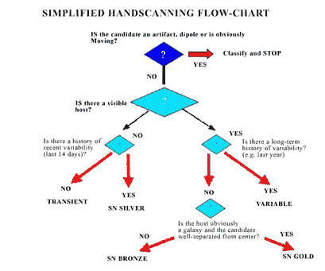

天文学家使用上述流程图作为手动决策树，对收集的成像数据进行手动扫描，得出以下原始类别

**伪影**:图像中的问题导致的残留(例如衍射尖峰)，这被认为**不真实**。

**偶极子**:正负通量大致相等的残差，由图像配准误差引起，这被认为**不真实**

饱和恒星:使 CCD 饱和的恒星残差，这被认为是**真实的**

**移动**:任何在不同通带之间显示出移动迹象的东西，这被认为是**真实的**

**变量**:显示长期可变性的记录对象，这被认为是**真实的**

**瞬变**:没有观测历史的物体，在搜索图像中没有明显的宿主星系，没有运动，这被认为是**真实的**

**SN Other** :被认为很有可能成为 SNe 的物体，但是不符合上面的任何一类，这被认为是**真实的**

**锡青铜**:在其宿主星系中心的点状残留物，这一类中的大多数物体后来被证明是类星体(类星体)、活动星系核(AGN)或前景变星，而不是 SNe，这被认为是**真实的**

**SN 银**:没有明显主星系的点状残留物，通常比其主星系亮得多，属于这一类，这被认为是**真实的**

**SN 金:**可能的 SNe 被识别为点状残留物，不在其宿主星系的精确中心，这被认为是**真实的**

# 探索性可视化

这十个类别(偶极子、人工制品、饱和星、瞬变、变量、移动物体、锡金、锡银、锡青铜、锡其他)称为原始类别，下图探究了它们在 or 数据集中的总数。

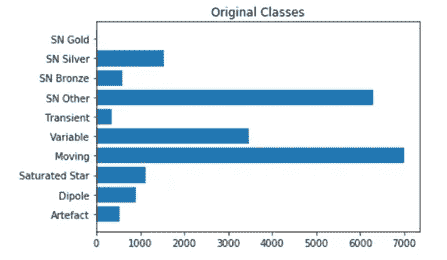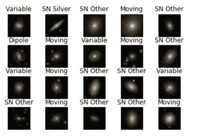

出于简化的目的，数据集被简化为三个视觉类别(**真实**、**伪影**、**饱和/** **偶极**)，如下所示。

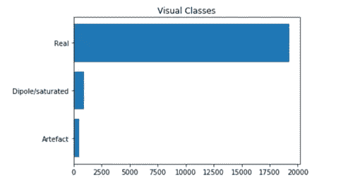

为了与我们的基准模型进行比较，我们考虑了一个二元分类来确定底层成像数据中什么是**真实**什么是**不是**，下图解释了数据点的**真实/非真实**分类的人工标记统计。有 88.24 %的数据被人体扫描仪归类为真实数据。

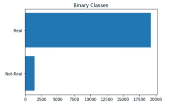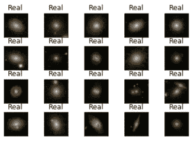

算法和技术

为了减少因人工扫描者的情绪和疲劳而产生的人为偏差，在 SDSS 数据集的原始图像中随机注入一定数量的伪目标图像。问题的其余部分是由人类每晚对成百上千的图像进行分类是不可行的，所以它们应该被机器取代，这就是我在我的项目中试图验证的。我将构建一个卷积神经网络来自动化将来自 SDSS 超新星调查的瞬态成像数据分类为真实物体和人工制品的手动过程，因为这种算法提供了令人印象深刻的图像识别结果。通过从天空给定部分的最新图像中减去参考图像来创建差异图像，这将留下纯噪声图像，除非存在瞬态[【1】](#_ftn1)。为了简化我们的问题，我将把它转换为二进制分类任务，即任务将是从非真实瞬态中检测真实瞬态[【2】](#_ftn2)。

**瞬变**是短暂出现的天体，如超新星、小行星、变星等。

[【2】](#_ftnref2)[http://spiff . rit . edu/Richmond/SDSS/sn _ survey/scan _ manual/sn _ scan . html](http://spiff.rit.edu/richmond/sdss/sn_survey/scan_manual/sn_scan.html)

# 基准

大多数与本项目类似的工作都集中在 SN Factory[【1】](#_ftn1)之前的工作(Roman，Aragon & Ding 在 2006 年，Bailey 在 2007 年)上，利用经典的监督学习算法来完成自动分类的任务。作为我工作的基准模型，我将推荐名为“SDSS 瞬态勘测图像的机器学习分类”的出版物[【2】](#_ftn2)。这项研究在相同的数据集上进行，但使用了不同的学习算法，如随机森林，k-最近邻，朴素贝叶斯和支持向量机(SVM)。然后，它使用我使用的相同测量指标来比较它们的性能，换句话说，我重新进行了这项研究，但使用了深度学习卷积网络，然后将我的工作与之前的工作进行了比较。但相比之下，它们依赖于主成分分析算法(PCA)来提取特征，如形状、位置、半高宽(FWHM)和到差异图像中最近物体的距离等属性，以及 SDSS 相机滤波器(g，r，I，z，u)[【3】](#_ftn3)，在我们的解决方案中，不需要通过使用 PCA 来处理特征提取，但我们的 CNN 会学习它们。基准模型取得了以下结果，我正在将我的结果与它们进行比较。

[【1】](#_ftnref1)[https://snfactory.lbl.gov/](https://snfactory.lbl.gov/)

[【2】](#_ftnref2)[https://academic.oup.com/mnras/article/454/2/2026/1051683](https://academic.oup.com/mnras/article/454/2/2026/1051683)

[【3】](#_ftnref3)[http://sky server . SDSS . org/dr2/en/proj/advanced/color/SDSS filters . ASP](http://skyserver.sdss.org/dr2/en/proj/advanced/color/sdssfilters.asp)，[https://www.sdss.org/instruments/camera/](https://www.sdss.org/instruments/camera/)

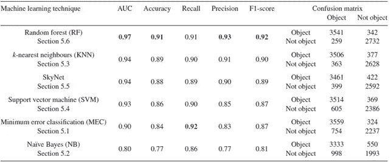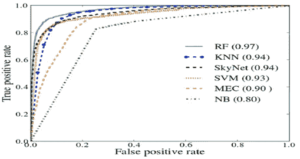

# 方法学

# 数据处理

> 为了进行无偏比较，我将数据集分成 25%作为测试集，75%用于训练(其中 30%用于交叉验证)。

> 在我们的模型中使用输入数据集之前，我已经对数据进行了预处理，以适合 Keras，例如将 PIL 图像转换为 3D 张量，然后将这些张量依次转换为具有适当形状的 4D 张量。

> 此外，我还对图像的像素值进行了重新缩放，使其为 float32 值，范围是(从 0 到 1)而不是(从 0 到 255)。

之后，我将十个原始类转换为二进制类(真实和非真实对象)作为我们的输出类标签，然后使用一种热编码(OHE)将它们的分类数据转换为数字向量。对于问题陈述，一个热编码是行向量，并且对于每个图像，它是 1×2 的维度。这里需要注意的重要一点是，除了它所代表的类之外，向量由所有的零组成，因此，它是 1。

# 履行

为了解决所提出的问题，我使用深度学习算法建立了学习模型，该算法受人脑中生物视觉皮层的启发，命名为深度前馈卷积神经网络( **CNN** 或 ConvNet)。我已经用 **Python** 编程语言和 **Keras** 在 Jupiter Notebook (IPython)内部实现了它，依赖于使用 Numpy、Pandas 和 Scikit-Learn 包。选择这种算法的原因是它减少了参数的数量，并且提取了高度鲁棒的非线性特征。此外，它还使用本地感受域、稀疏连接、共享权重、池化和深度架构来学习数据的分层表示。我们通过添加许多图层来构建这个网络，其中一些图层用于要素制图表达。在构建、编译、训练和评估我们的模型之后，我们调整了它的超参数，然后再次重新训练和评估它，然后将我们的最终结果与基准模型进行比较。

> 如上所示，我们将图像作为网络的输入，网络经过多次卷积、二次采样、完全连接层，最后输出图像类。卷积层计算连接到输入中的局部区域或感受野的神经元的输出，每个神经元计算它们的权重和它们在输入体积中连接到的小感受野之间的点积。每次计算都导致从输入图像中提取特征图。二次采样的目的是通过减少输入表示的维数来获得输入表示，这有助于减少过拟合。二次抽样的技术之一是最大池。使用这种技术，可以根据区域的大小从区域中选择最高的像素值。换句话说，max pooling 从内核当前覆盖的映像窗口中获取最大值。最后，全连接层的目标是展平卷积层学习的高级特征，并组合所有特征。它将展平后的输出传递到输出图层，在该图层中，我们使用 softmax 激活函数来预测输入影像类标签。

## 我们的解决方案从由如下三个卷积层构成的 CNN 网络的初始模型开始:

*   第一层包含 32 个大小为 3×3 的过滤器，
*   第二层包含 64 个大小为 3×3 的过滤器，并且
*   第三层包含 128 个大小为 3×3 的过滤器。

## 此外，还有三个最大池层，每个大小为 2 x 2。

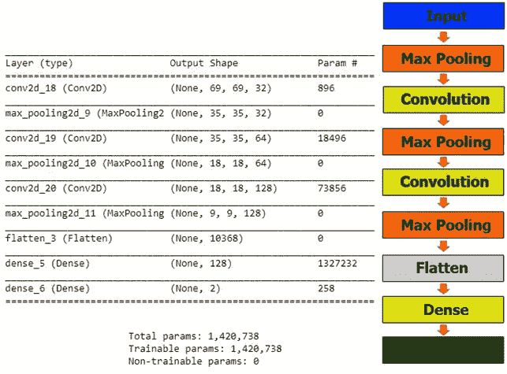

> 在所有卷积和密集层之后，我使用了“RelU”类型的激活函数，除了输出层我使用了“Sigmoid”。这里的权重更新方法是通过使用 RMSprop 优化器编译模型来完成的，批量大小等于 64，时期数为 50。我使用了 RMSprop 优化器，这是最流行的优化算法之一，类似于具有动量的梯度下降算法，它限制了垂直方向上的振荡。因此，我们可以提高我们的学习速率，并且我们的算法可以在水平方向上更快地收敛。此外，我将损失类型指定为二进制交叉熵，并将度量标准指定为准确性。

## 上述设置产生以下结果:

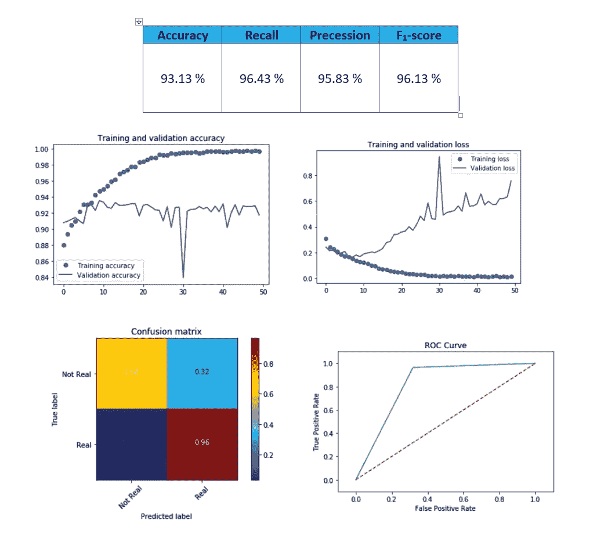

# 精炼

在对我们的初始训练和评估之后，并且通过观察训练精度和损失，我可以说该模型做得很好，因为在 50 个时期之后，训练精度是 93.13 %，并且训练损失相当低。然而，看起来模型**过度拟合**，给人一种直觉，即网络已经很好地记住了训练数据，但不能保证对看不见的数据起作用，这就是训练和验证准确性存在差异的原因。因此，我尝试了一些优化技术，如尝试添加更多卷积滤波器的隐藏层，改变 MaxPool 层的窗口大小以获得增强的特征提取，执行数据扩充，通过放置**丢弃**层以避免过度拟合的正则化以及其他技术，直到模型更好地概括并提供所需的输出，该输出很好地用于天文图像的真实物体和非真实物体的二进制分类任务。我也改变了

通过使用 **Adam** 优化器并将**的历元数增加到 200** 并将**的批量增加到 128** 的优化算法。

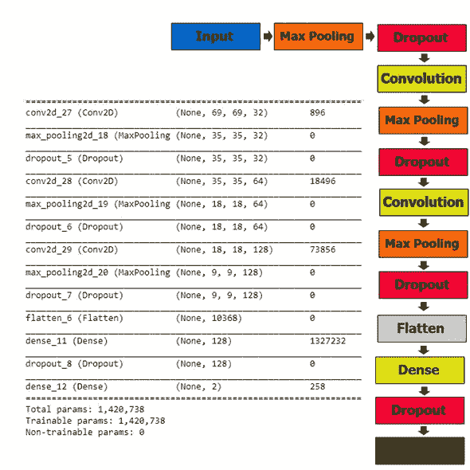

# 结果

# 模型评估和验证

我已经使用训练集来调整模型参数，其中模型从训练数据中学习。但是，为了产生模型性能的独立度量，使用了一个测试集。在这里，我将介绍最终的测试和评估结果，包括我们的分类器的接收器操作特性(ROC ),基于它在 final 上的性能，以与以前的工作进行比较。

如上所示，我们试图减少过度拟合。我们在测试数据上获得了合适的和可接受的精度。具有**下降**层的模型在测试数据上表现最佳。

# 正当理由；辩解

> 在我们的解决方案中，正如在基准模型中一样，我们认为准确性和召回率是最重要的性能指标，因为我们的数据中的两个主要类别(真实对象和非真实对象)具有相似的大小，准确性是一个很好的性能通用衡量标准，而选择召回率是因为我们更关心丢失的真实对象(假阴性)，而不是我们的预测对象集被假阳性污染，因为这些很容易被人排除。这些结果表明，它实际上在未来的天文观测中起着积极的作用。深度学习方法被证明是这个领域的完美玩家，如果不是比人类扫描仪更好的话；但是与天文学家不同的是，他们可以在一秒钟内对数以千计的瞬变进行分类。与传统的机器学习算法不同，卷积神经网络不需要制作复杂和特定情况的特征。在训练期间，仅通过数据扩充，卷积神经网络发现它们自己的用于分类的抽象特征。与人类扫描仪不同，深度模型可以为分类确定性提供连续值的分数，这些分数可以进行调整，以获得最佳的召回率和精确度。此外，它们能够通过大量使用 GPU 来处理大型综合巡天望远镜可能产生的如此大的数据吞吐量。深度模型，特别是卷积神经网络，对于未来的天文巡天(如 LSST)是不可或缺的。

# 结论

> 我们正在比较的基准模型正在检查用于瞬时分类的各种机器学习算法，该模型被简化以执行将天文成像数据中的物体二进制分类为真实和非真实物体的主要过程。从基准测试结果中，我们注意到使用的最佳分类器是随机森林(RF ),准确率和召回率为 91%。它使用名为天网的神经网络，准确率为 88%，召回率为 89 %。但是我们使用深度学习卷积网络(CNN)的最终结果给出了 92.36 %的良好可接受准确度和 96.51 %的召回率，我试图获得问题的最佳解决方案，并表明使用机器学习算法特别是深度学习可以超过人类手动扫描过程，我认为我已经在某种程度上达到了这个目标。

# 未来作品

> 关于未来的工作，我的解决方案模型现在正在进行二进制分类，但我认为作为改进，它应该升级以执行成像数据中不同类别的多分类，从而成为天文成像数据中超新星和其他物体分类的更实用和有用的工具。以及考虑到要在 GPU 上完成的训练，用真正的海量数据集注入我的未来模型。此外，可以开发预处理算法，用于处理信噪比、准备差分图像以及对候选瞬态进行居中。此外，我可以包括所讨论区域的时间序列图像，包括扫描图像之间的持续时间作为特征。

> 发表链接:[研究门](https://www.researchgate.net/publication/349053896_Astronomical_Images_Classification_Using_Deep_Learning_CNNs)、[学术界](https://www.academia.edu/45004968/Astronomical_Images_Classification_Using_Deep_Learning_CNNs)、 [GitHub](https://github.com/yosrinegm/Astronomical-Images-Classification)