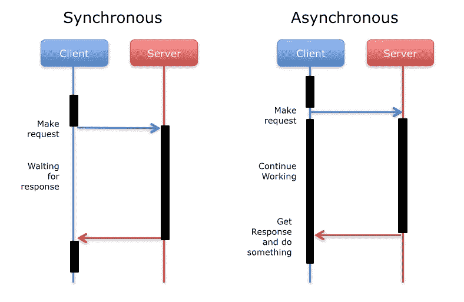
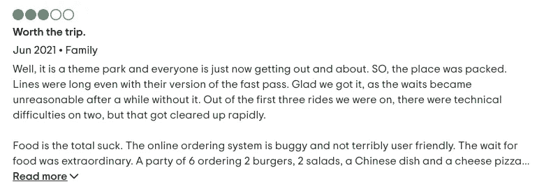

# 异步 Web 抓取 101:使用砷获取多个 URL

> 原文：<https://medium.com/analytics-vidhya/asynchronous-web-scraping-101-fetching-multiple-urls-using-arsenic-ec2c2404ecb4?source=collection_archive---------5----------------------->


卢卡·布拉沃在 [Unsplash](https://unsplash.com?utm_source=medium&utm_medium=referral) 上的照片

随着越来越多的数据出现在网上，网络抓取服务的需求空前高涨。许多企业依靠数据驱动的方法来推动他们的组织目标。使用同步 web 抓取，大多数通常的数据请求都可以完成，这些请求通常围绕着小数据集。虽然前面的部分工作得很好，但是在大量数据删除的情况下，web 抓取的执行时间仍然很短。

# 什么是网络抓取

[**网页抓取**](https://en.wikipedia.org/wiki/Web_scraping) 、**网页抓取**或**网页数据提取**是[数据抓取](https://en.wikipedia.org/wiki/Data_scraping)用于[从](https://en.wikipedia.org/wiki/Data_extraction)[网站](https://en.wikipedia.org/wiki/Website)提取数据。收集这些信息，然后将其导出为对用户更有用的格式。无论是电子表格还是 API。

# 网络抓取的挑战

对于希望从在线资源中检索数据的用户来说，Web 抓取很简单。正常的网页抓取对大多数用例是有益的，但是当提取的数据量很高时 ***会失败，因为这是一个非常耗时的过程*** 。迫切需要一种解决方案来从网站中提取大量内容，而不影响整个过程的执行速度。为了迎合前面提到的限制，异步编程的好处得到了充分发挥。在下一节中，我们将探索异步编程如何快速有效地解决提取大量内容的问题。

# 同步与异步执行

顺序执行代码的程序是同步的。这种程序调用一个函数，并在执行下一个命令之前等待该函数返回响应。另一方面，异步程序调用一个函数并继续执行下一个命令，而不是等待响应。一旦响应可用于先前调用的函数，程序返回到该函数调用并处理响应。简而言之，异步执行可以被看作是任务切换的一种方式，可以最小化空闲时间。



同步与异步的类比

同步和异步程序的一个类比是，我计划和我的好朋友 Justin 交流。给贾斯汀打电话是同步的，而通过电子邮件交流是异步的。通过电话，我先键入贾斯汀的号码，然后等他来接。一旦他接了电话，我就说点什么，然后等他回应。如果你把我当成一个程序，我在执行我的下一个命令(说点什么)之前，等待服务器(这里是 Justin)返回一个响应。这是典型的同步程序的工作方式。如果我选择通过电子邮件交流，一旦我起草并发送了电子邮件，我就开始工作，而不是等待回复。这是一个异步程序的例子，其中程序继续执行其他任务，而不是等待响应。

# Python 中同步与异步编程的比较

在这一节中，我们将看到 python 中同步和异步编程的区别以及时间执行。

> 它需要 10 秒钟

Python 中有几个用于进行异步编程的包。其中一个包是 asyncio，它是 Python 3.4 中添加的标准库。在幕后，asyncio 使用事件循环、协程和任务来最小化空闲时间。

> 它需要 5.88893e-05 秒

从两种代码生成的执行时间的比较中，我们可以得出结论，当我们使用异步方法从网站抓取数据时，它会更有效。尤其是当我们需要的是抓取多个网址的时候，会节省很多时间吧？

在这一节中，我将向您展示两种从网站抓取数据的技术。但在此之前，我先说明一下我要刮的是什么。

我想刮的网站来自[猫途鹰](https://www.tripadvisor.com/)。Tripadvisor 是一个人们可以用来预订航班、住宿和体验的网站。用户还可以留下对酒店、餐馆、旅游等的评论。因此，网站本身包含了大量的评论数据和价格数据。对于消费者来说，这些数据可以帮助你找到最好的交易，包括捆绑包，并编辑评论，以了解照片之外的地方。

我想收集的是环球影城的一篇评论，分为三个分支。我会把网站上的组成部分，如审查者的姓名，审查的日期，审查的标题和审查的文本。在一个分支机构，环球影业有大约 10，000 多页的评论网站。所以这里我将比较使用同步和异步方法抓取多个 URL。

# 使用 Selenium 和 Chromedriver 的同步网页抓取方法

在同步方法中，我使用 selenium 和 chromedriver 的库。当我们在这个猫途鹰网站上做抓取时，我们会发现一些挑战。

## 链接越多

正如下面的截图所强调的，猫途鹰最初只加载评论的一部分，等到用户点击**阅读更多**来加载其余部分。



当进一步点击时，JavaScript 被执行(代码如下),很可能使抓取变得更加困难。

```
<div class="DrjyGw-P _1l3JzGX1">Read More</span> == $0
```

最终结果是，使用像 Beautiful Soup 这样的抓取库是不够的，我们需要启动一个浏览器并使用 Selenium 进行控制，以模拟按下 **Read More** 链接并执行 JavaScript 代码。

这里是使用 Python 和 Selenium 抓取网站的代码，用来抓取某个特定的 Universal Studio 评论的所有评论。我需要从所有页面刮评论，并保存到一个 csv 文件。

从上面的代码来看，需要很长时间。平均一页，大概需要 10 秒。试想一下，刮三万页需要多长时间。

# 使用砷和 Chromedriver 的异步网页抓取方法

在这一节中，我将向您展示用 Python 实现异步程序的过程，并观察异步编程为网站抓取提供的优势。

假设我们有一个 30.000 个 URL 的列表，我们想为每个 URL 下载 HTML 页面，并做一些后处理和提取数据。

我们有一个函数运行，将从前面提到的 30.000 个网址收集数据。

如果我们要同步进行，那么获得一个请求需要 100 乘以平均时间(假设后处理时间微不足道)。但是相反，如果我们将 100 个 URL 分成 4 个独立的线程/进程，那么所需的时间将是原来时间的 1/4，至少理论上是这样。

接下来，我们将创建一个异步函数来使用 Chromedriver 打开浏览器。这将自动打开一个页面，我们可以直接访问我们想要的元素来检索信息。

通过使用异步代码，我们不需要为**阅读更多**按钮而烦恼，因为在一个会话中我们将能够获得完整的信息。所以我们需要做的就是取我们需要的元素。

当使用 asyncio 和 chromedriver 抓取多个页面时，我们将使用以下模式创建多个会话，这些会话将在 asyncio 事件循环中同时执行。而在同步代码中，我们需要遍历 URL 列表，一次处理一个。

最后，我们可以通过使用这段代码来获取我们需要的元素

使用异步代码将大大减少执行时间。对于一个页面，我们只需要大约 1 秒钟来获取我们想要检索的数据。与使用同步方法相比，这非常节省时间。

# 环球影城分支机构评论数据集

你可以在 [Kaggle](https://www.kaggle.com/dwiknrd/reviewuniversalstudio) 下载抓取的数据集。该数据集包括游客在 Trip Advisor 网站上发布的对环球影城 3 个分支(佛罗里达、新加坡、日本)的 50，000+评论。

您可以从我的 GitHub 查看完整的源代码

[](https://github.com/dwiknrd/scraping-tripadvisor) [## dwiknrd/scraping-tripadvisor

### 猫途鹰环球影城评论。通过在…上创建帐户，为 dwiknrd/scraping-tripadvisor 的发展做出贡献

github.com](https://github.com/dwiknrd/scraping-tripadvisor)