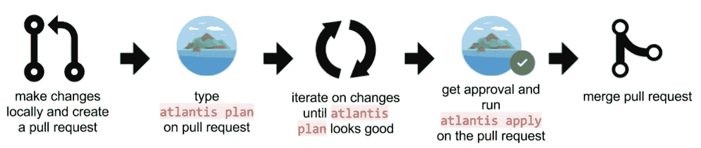

# AWS 上的亚特兰蒂斯 EKS 法盖特

> 原文：<https://medium.com/analytics-vidhya/atlantis-on-aws-eks-fargate-666ed21d09f4?source=collection_archive---------1----------------------->

Terraform 拉式请求自动化

[Terraform](https://www.terraform.io/) 是应用最广泛的 Iaac 工具之一。这是 HashiCorp 提供的免费开源工具。使用 Terraform，你可以在 AWS、GCP 和 Azure 等多个云平台上提供基础设施。

每个组织都在版本控制系统(VCS)上维护代码，如 GitHub、Bitbucket 等。每当开发人员在 IaaC 中进行更改时，他们会提出一个拉请求，然后经过**【N】**次审查和评论后，该请求被接受，在此期间，开发人员将从本地系统或自动化工作站多次运行 terraform 命令。这就是亚特兰蒂斯出现的原因。

[Atlantis](https://www.runatlantis.io/) 是一个工具，它允许你直接从在拉请求上创建的注释中运行 terraform 命令，Atlantis 将通过输出对拉请求进行评论，团队中的每个成员都将知道什么将被创建或销毁，以及谁在做什么。你可以在[https://www . run Atlantis . io/guide/# why-you-run-Atlantis](https://www.runatlantis.io/guide/#why-would-you-run-atlantis)上了解更多信息



亚特兰蒂斯流

在这篇博文中，我将告诉你如何在 [AWS EKS 法盖特](https://docs.aws.amazon.com/eks/latest/userguide/fargate.html)上配置 Atlantis

# 我们开始吧

在这篇文章中，我使用 **BitBucket** 作为 VCS，但是无论你使用哪个 VCS，实现都是一样的。

## 先决条件

*   VPC
*   VPC 的子网应该有以下标记

一、公共子网:—kubernetes.io/role/elb = 1

二。专用子网:—kubernetes.io/role/internal-elb = 1

*   具有活动 Fargate 轮廓的 EKS 群集
*   库贝特尔
*   使用链接[https://www.runatlantis.io/docs/access-credentials.html](https://www.runatlantis.io/docs/access-credentials.html)根据您的 VCS 配置 VCS 的访问凭证
*   Web-hook Secret——使用链接[https://www.runatlantis.io/docs/webhook-secrets.html](https://www.runatlantis.io/docs/webhook-secrets.html)创建 web-hook Secret(对于 BitBucket，这不是必需的，因为不应该这样做)

我已经在 **Kubernetes 版本 1.19** 上进行了配置，所有 K8s 相关资源都在**默认名称空间**和 **kube-system 名称空间**中

## 亚特兰蒂斯运行时间

亚特兰蒂斯是一个简单的[去](https://golang.org/)应用程序。它从您的 Git 主机接收 webhooks，并在本地执行 Terraform 命令。有亚特兰蒂斯官方 [Docker 形象](https://hub.docker.com/r/runatlantis/atlantis/)。我们将使用 **v0.17.0**

## 亚特兰蒂斯数据

亚特兰蒂斯没有外部数据库。Atlantis 在磁盘上存储 Terraform 计划文件。如果亚特兰蒂斯在`plan`和`apply`周期之间丢失了数据，那么用户将不得不重新运行`plan`。因此，我们将为亚特兰蒂斯使用永久磁盘。

## 亚特兰蒂斯仓库

我们将使用 **AWS 弹性文件系统**来存储我们所有的 Atlantis 数据，因为 AWS Fargate 不支持 EBS 卷，所以唯一的选择是使用 AWS EFS 作为持久存储。

## 创建 AWS 弹性文件系统

*   转到 EFS 控制台，单击“创建文件系统”
*   给你的文件系统命名
*   为您的文件系统选择 VPC
*   点击创建

## 创建文件系统访问点

亚马逊 EFS *访问点*是进入 EFS 文件系统的特定于应用程序的入口点，这使得管理应用程序对共享数据集的访问变得更加容易。对于通过接入点发出的所有文件系统请求，接入点可以强制实施用户身份，包括用户的 POSIX 组。访问点还可以对文件系统强制使用不同的根目录，以便客户端只能访问指定目录或其子目录中的数据。

我们将使用 **"/atlantis"** (将由 k8s 自动挂载)作为我们在 EFS 的挂载点，所有的数据都将存储在这个目录下。Atlantis 创建的文件将使用**“Atlantis:Atlantis”**作为用户和组。我们将使用此路径以及用户和组来限制我们的接入点。

*   选择您的文件系统并选择**访问点**选项卡
*   点击创建接入点

a.系统会自动选择您的文件系统 ID，如果没有，请选择您的文件系统

b.输入接入点的名称

c.在根目录路径中写下 **"/atlantis"**

d.在 POSIX 用户中写下以下内容

一、用户 ID — **100** (亚特兰蒂斯用户 ID)

二。组 ID — **1000** (亚特兰蒂斯组 ID)

e.在根目录创建权限中写入以下内容

一、业主用户 ID — **100**

二。所有者群组 ID — **1000**

三。权限— **777**

f.点击创建接入点

**重要提示:**

1.  记下 **AWS EFS ID** 和**接入点 ID** 。
2.  您需要更新 EFS Sg 以允许来自 EKS 集群的流量。您可以将 EKS 集群 Sg ID 添加到具有所有流量和所有端口的 EFS Sg 的入站规则中。

## AWS 负载平衡器控制器

AWS 负载平衡器控制器为 Kubernetes 集群管理 AWS 弹性负载平衡器。当您创建 Kubernetes `Ingress`时，控制器会提供一个 AWS 应用程序负载平衡器(ALB)

**使用 AWS 管理控制台为您的集群创建 OIDC 提供者**

*   查看您的群集的 OIDC 提供程序 URL

```
aws eks describe-cluster --name <cluster_name> --query "cluster.identity.oidc.issuer" --output text
```

*   打开 IAM 控制台
*   在导航面板中，选择身份提供者。如果列出了与您的群集的 URL 匹配的提供程序，那么您的群集已经有了一个提供程序。如果没有列出与您的群集的 URL 匹配的提供程序，则您必须创建一个。
*   要创建提供商，选择**添加提供商**
*   对于**提供者类型**，选择 **OpenID 连接**
*   对于**提供者 URL** ，粘贴您的集群的 OIDC 发行者 URL，然后选择**获取指纹**
*   对于**受众**，输入`sts.amazonaws.com`并选择**添加提供商**

**创建 IAM 策略**

*   下载 AWS 负载平衡器控制器的 IAM 策略，允许它代表您调用 AWS APIs。可以在 GitHub 上查看[政策文件](https://raw.githubusercontent.com/kubernetes-sigs/aws-load-balancer-controller/v2_ga/docs/install/iam_policy.json)。

```
curl -o iam_policy.json [https://raw.githubusercontent.com/kubernetes-sigs/aws-load-balancer-controller/v2.1.3/docs/install/iam_policy.json](https://raw.githubusercontent.com/kubernetes-sigs/aws-load-balancer-controller/v2.1.3/docs/install/iam_policy.json)
```

*   使用上一步中下载的策略创建 IAM 策略

```
aws iam create-policy \
    --policy-name **AWSLoadBalancerControllerIAMPolicy** \
    --policy-document file://iam_policy.json
```

**创建 IAM 角色和 K8s 服务账户**

我们将创建一个 IAM 角色，并使用 AWS 管理控制台和`kubectl`为 AWS 负载平衡器控制器在`kube-system`名称空间中标注名为`aws-load-balancer-controller`的 Kubernetes 服务帐户

*   打开 IAM 控制台
*   在导航面板中，选择**角色**，**创建角色**
*   在**选择可信实体类型**部分，选择 **Web 身份**
*   在**选择 web 身份提供者**部分

I .对于**身份提供者**，选择您的集群的 URL

二。对于**观众**，选择`sts.amazonaws.com`

*   选择**下一步:权限**
*   在**附加策略**部分，选择您之前创建的用于您的服务帐户的`*AWSLoadBalancerControllerIAMPolicy*`策略
*   选择**下一步:标签**
*   在**添加标签(可选)**屏幕上，您可以为帐户添加标签。选择**下一步:查看**
*   对于**角色名称**，输入您的角色名称，如`*AmazonEKSLoadBalancerControllerRole*`，然后选择**创建角色**
*   创建角色后，在控制台中选择角色以打开它进行编辑
*   选择**信任关系**选项卡，然后选择**编辑信任关系**

找到类似如下的行:

```
"oidc.eks.<*region-code*>.amazonaws.com/id/EXAMPLED539D4633E53DE1B716D3041E:aud": "sts.amazonaws.com"
```

将该行更改为如下所示。将`*<EXAMPLED539D4633E53DE1B716D3041E>*`(包括`*<>*`)替换为您的集群的 OIDC 提供商 ID，将`*<region-code>*`替换为您的集群所在的地区代码

```
"oidc.eks.*<region-code>*.amazonaws.com/id/*<EXAMPLED539D4633E53DE1B716D3041E>*:sub": "system:serviceaccount:kube-system:aws-load-balancer-controller"
```

*   选择**更新信任策略**结束
*   记下角色的 ARN，以便在后面的步骤中使用
*   将以下内容保存到名为`*aws-load-balancer-controller-service-account.yaml*`的文件中

```
apiVersion: v1
kind: ServiceAccount
metadata:
  labels:
    app.kubernetes.io/component: controller
    app.kubernetes.io/name: aws-load-balancer-controller
  name: aws-load-balancer-controller
  namespace: kube-system
  annotations:
      eks.amazonaws.com/role-arn: arn:aws:iam::<AWS_ACCOUNT_ID>:role/<YOUR_ROLE_NAME>
```

**重要提示:**不要更改服务帐户名，因为我们已经在 IAM 角色的信任策略中配置了该名称

*   在群集上创建服务帐户

```
kubectl apply -f aws-load-balancer-controller-service-account.yaml
```

**使用 Helm V3** 安装 AWS 负载平衡器控制器

**重要提示**:最好将 **Helm 与 Fargate** 一起使用，而不是使用 cert-manager，后者是 Jetstack 的一个 Kubernetes 插件。证书管理器对 Fargate 有一些问题。

*   将亚马逊 EKS 图表 repo 添加到 Helm，运行以下命令

```
helm repo add eks https://aws.github.io/eks-charts
```

*   安装 **TargetGroupBinding** 自定义资源定义(CRDs)，运行以下命令

```
kubectl apply -k "github.com/aws/eks-charts/stable/aws-load-balancer-controller//crds?ref=master"
```

*   安装舵图，运行以下命令

```
helm install aws-load-balancer-controller eks/aws-load-balancer-controller \
    --set clusterName=YOUR_CLUSTER_NAME \
    --set serviceAccount.create=false \
    --set region=<REGION_CODE> \
    --set vpcId=<VPC_ID> \
    --set serviceAccount.name=aws-load-balancer-controller \
    -n kube-system
```

*   验证控制器是否已安装

```
kubectl get deployment -n kube-system aws-load-balancer-controller
```

恭喜🥳，您已经成功安装了 AWS 负载平衡器控制器。你可以在这里找到更多细节[，在这里](https://aws.amazon.com/premiumsupport/knowledge-center/eks-alb-ingress-controller-fargate/)找到[。](https://docs.aws.amazon.com/eks/latest/userguide/aws-load-balancer-controller.html)

## AWS EFS CSI 驱动程序

我们不能在 EKS 的 Fargate 模式下使用动态预配置。我们必须使用静态配置。带有 Fargate 模式的 AWS EKS 已经带有 EFS CSI 驱动程序，您可以通过运行以下命令进行验证

```
kubectl get csidriver
```

您将看到类似这样的输出

```
NAME              ATTACHREQUIRED   PODINFOONMOUNT   MODES        AGE
efs.csi.aws.com   false            false            Persistent   1d
```

我们已经完成了设置亚特兰蒂斯所需的所有资源，现在我们将创建与亚特兰蒂斯设置相关的资源。

# 亚特兰蒂斯设置

## 存储类

创建一个名为`atlantis-storage-class.yml`的文件，在你最喜欢的文本编辑器中打开它，添加以下几行

```
kind: StorageClass
apiVersion: storage.k8s.io/v1
metadata:
  name: atlantis-sc
provisioner: efs.csi.aws.com
```

创建存储类

```
kubectl create -f atlantis-storage-class.yml
```

验证存储类是否已成功创建

```
kubectl get sc atlantis-sc#OutputNAME          PROVISIONER       RECLAIMPOLICY   VOLUMEBINDINGMODE   ALLOWVOLUMEEXPANSION   AGE
atlantis-sc   efs.csi.aws.com   Delete          Immediate           false                  10s
```

## 持久卷

如前所述，Atlantis 将所有数据存储在本地文件磁盘上，我们将创建持久卷来存储数据

创建一个名为`atlantis-pv.yml`的文件，并添加以下内容

```
apiVersion: v1
kind: PersistentVolume
metadata:
  name: atlantis-pv
spec:
  capacity:
    storage: 5Gi
  volumeMode: Filesystem
  accessModes:
    - ReadWriteMany
  persistentVolumeReclaimPolicy: Retain
  storageClassName: atlantis-sc
  csi:
    driver: efs.csi.aws.com
    volumeHandle: **<YOUR_FILE_SYSTEM_ID>::<YOUR_FS_ACCESS_POINT_ID>**
```

我已经在 PV 中给了 5Gi 的储备，这对于亚特兰蒂斯是足够的。如果需要，您可以添加更多存储空间。当您创建拉式请求时，Atlantis 将从回购中降级代码，一旦 PR 被合并，Atlantis 将从本地系统中删除代码。

创建永久卷

```
kubectl create -f atlantis-pv.yml
```

验证是否创建了永久卷

```
kubectl get pv atlantis-pv
```

您将看到持久卷处于可用状态。

**重要:**

1.  确保写入正确的文件系统 ID 和文件系统访问点
2.  不要更改存储类名称，因为我们在上一步创建存储类时已经使用了该名称

## 持续量索赔

如果您熟悉 K8s 概念，那么在创建 Statefulset 或 Pod 或部署时，每个 PV 只能使用 PVC 进行安装

创建一个名为`atlantis-pvc.yml`的文件，并添加以下几行

```
apiVersion: v1
kind: PersistentVolumeClaim
metadata:
  name: atlantis-claim
spec:
  accessModes:
    - ReadWriteMany
  storageClassName: atlantis-sc
  resources:
    requests:
      storage: 5Gi
```

创建永久卷索赔

```
kubectl create -f atlantis-pvc.yml
```

验证是否创建了永久卷声明

```
kubectl get pvc atlantis-claim#OutputNAME             STATUS   VOLUME        CAPACITY   ACCESS MODES   STORAGECLASS   AGE
atlantis-claim   Bound    atlantis-pv   5Gi        RWX            atlantis-sc    5s
```

**重要提示:**

1.  不要更改存储类名和存储值，这些值应该与 PV 的配置相匹配
2.  确保 PVC 的**状态**为**绑定**

## 秘密

我们将在 kubernetes 秘密中存储我们的应用程序密码和 Web-hook 令牌(BitBucket 不需要),然后我们将这个秘密注入 statefulset，这样 Atlantis 就可以从 repo 中克隆我们的代码

如果您正在使用 BitBucket

```
# Write your token in fileecho -n "yourtoken" > token# Create secretkubectl create secret generic atlantis-vcs --from-file=token
```

如果您使用的是其他 VCS

```
# Write your token and webhook secret in fileecho -n "yourtoken" > token
echo -n "yoursecret" > webhook-secret# Create Secretkubectl create secret generic atlantis-vcs --from-file=token --from-file=webhook-secret
```

验证机密是否已成功创建

```
kubectl get secret atlantis-vcs
```

## Atlantis 服务器端配置

服务器端回购配置文件用于控制每次回购的行为。例如，如果您想要求所有(或特定)回购必须在 Atlantis 允许运行`apply.`之前获得批准

我们将创建一个 K8s ConfigMap 对象来存储 Atlantis 的服务器端配置，并且我们将在 Atlantis 中使用这个配置

**注意:**你可以在这里阅读更多关于 Atlantis 服务器端配置[的内容。](https://www.runatlantis.io/docs/server-side-repo-config.html)

创建一个名为`atlantis-repo-config-configmap.yml`的文件

```
apiVersion: v1
kind: ConfigMap
metadata:
  name: atlantis-repo-config
data:
  repos.yaml: |
    repos:
      # id can either be an exact repo ID or a regex.
      # If using a regex, it must start and end with a slash.
      # Repo ID's are of the form {VCS hostname}/{org}/{repo name}
      # ex. github.com/runatlantis/atlantis.
      - id: {VCS hostname}/{org}/{repo name}
        apply_requirements: [approved]
        allowed_overrides: [workflow]
        allow_custom_workflows: true
```

根据您的回购 URL 替换`{VCS hostname}/{org}/{repo name}`

在这个 repo 配置中，Atlantis 将只允许在拉动请求被批准时运行`apply`命令。您可以根据自己的需求进行配置

使用以下命令创建配置映射

```
kubectl create -f atlantis-repo-config-configmap.yml
```

验证配置映射是否已成功创建

```
kubectl get cm atlantis-repo-config# OutputNAME                   DATA   AGE
atlantis-repo-config   1      10s
```

## 亚特兰蒂斯的服务帐户

我们知道 Atlantis 将运行 Terraform 命令，它将创建、更新或销毁资源，但是为了完成所有这些事情，我们的 Atlantis 容器应该具有适当的 IAM 权限来在 AWS 中创建任何资源，因此我们将为服务帐户(IRSA)创建 IAM 角色

你必须知道，每个 Faragte 配置文件都有 Faragte Pod 执行角色，它可以授予调用 AWS API 的权限。由于 Terraform 将拥有执行所有操作的管理员权限，因此不建议在 Pod 执行角色中授予管理员权限，因为这样做会将不必要的管理员权限授予其他 Pod。因此，我们使用 IRSA 来控制 POD 级别的权限。

在部署 AWS 负载平衡器控制器时，我们已经为集群创建了一个 OIDC 提供者。

这包括两个部分，第一部分是我们创建具有必要权限的 IAM 角色，第二部分是我们创建服务帐户并将该 SA 附加到 K8s 中的 POD

**创建 IAM 角色**

*   打开 IAM 控制台
*   在导航面板中，选择**角色**，**创建角色**
*   在**选择可信实体类型**部分，选择 **Web 身份**
*   在**选择网络身份提供商**部分

I .对于**身份提供者**，选择您的集群的 URL

二。对于**观众**，选择`sts.amazonaws.com`

*   选择**下一步:权限**
*   在**附加策略**部分，选择`AdministratorAccess`策略
*   选择**下一步:标签**
*   在**添加标签(可选)**屏幕上，您可以为帐户添加标签。选择**下一步:复习**
*   对于**角色名称**，输入您的角色名称，如`*Atlantis-Admin-Role*`，然后选择**创建角色**
*   创建角色后，在控制台中选择角色以打开它进行编辑
*   选择**信任关系**选项卡，然后选择**编辑信任关系**

找到类似如下的行:

```
"oidc.eks.<*region-code*>.amazonaws.com/id/EXAMPLED539D4633E53DE1B716D3041E:aud": "sts.amazonaws.com"
```

将该行更改为如下所示。将`*<EXAMPLED539D4633E53DE1B716D3041E>*`(包括`*<>*`)替换为您的集群的 OIDC 提供商 ID，将`*<region-code>*`替换为您的集群所在的地区代码

```
"oidc.eks.*<region-code>*.amazonaws.com/id/*<EXAMPLED539D4633E53DE1B716D3041E>*:sub": "system:serviceaccount:default:atlantis-sa"
```

*   选择**更新信任策略**完成
*   记下角色的 ARN，以便在后面的步骤中使用

**创建服务账户**

将以下内容保存到名为`*atlantis-service-account.yml*`的文件中

```
apiVersion: v1
kind: ServiceAccount
metadata:
  name: atlantis-sa
  annotations:
      eks.amazonaws.com/role-arn: arn:aws:iam::<AWS_ACCOUNT_ID>:role/<YOUR_IAM_ROLE_NAME>
```

**重要提示:**不要更改服务帐户名称，因为我们已经在 IAM 角色的信任策略中配置了该名称

## 有状态集合

我们已经拥有了所有需要的 K8s 资源，现在我们准备创建有状态的 Set，它将在 AWS EKS Faragte 集群中运行 Atlantis 服务器

创建一个名为`atlantis-stateful-set.yml`的文件，如下所示:

**注意:**我使用 BitBucket 作为我的 VCS，所以下面的文件有基于 BitBucket VCS 的环境变量。

如果您使用的是 VCS 而不是位存储桶，则替换 **###位存储桶配置# # #**…………**# # # End bit bucket Config # # #**您可以将此[链接](https://www.runatlantis.io/docs/deployment.html#deployment-2)用于您的 VCS 特定环境变量。

```
apiVersion: apps/v1
kind: StatefulSet
metadata:
  name: atlantis
spec:
  serviceName: atlantis
  replicas: 1
  updateStrategy:
    type: RollingUpdate
    rollingUpdate:
      partition: 0
  selector:
    matchLabels:
      app: atlantis
  template:
    metadata:
      labels:
        app: atlantis
    spec:
      serviceAccountName: atlantis-sa
      securityContext:
        fsGroup: 1000 # Atlantis group (1000) read/write access to volumes.
      volumes:
        - name: repo-config
          configMap:
            name: atlantis-repo-config
        - name: atlantis-data
          persistentVolumeClaim:
            claimName: atlantis-claim
      containers:
      - name: atlantis
        image: runatlantis/atlantis:v0.17.0 # 1\. Replace <VERSION> with the most recent release.
        env:
        - name: ATLANTIS_REPO_ALLOWLIST
          value: **{VCS hostname}/{org}/{repo name}** # 2\. Replace this with your own repo allowlist. - name: ATLANTIS_DEFAULT_TF_VERSION
          value: **<YOUR_TF_VERSION>** ### Bitbucket Config ###
        - name: ATLANTIS_BITBUCKET_USER
          value: **<YOUR_BITBUCKET_USER>** # 5i. If you're using Bitbucket replace <YOUR_BITBUCKET_USER> with the username of your Atlantis Bitbucket user without the `@`.
        - name: ATLANTIS_BITBUCKET_TOKEN
          valueFrom:
            secretKeyRef:
              name: atlantis-vcs
              key: token
        ### End Bitbucket Config ### - name: ATLANTIS_DATA_DIR
          value: /atlantis
        - name: ATLANTIS_PORT
          value: "4141" # Kubernetes sets an ATLANTIS_PORT variable so we need to override.
        - name: ATLANTIS_REPO_CONFIG
          value: /atlantis/repos.yaml
        volumeMounts:
        - name: atlantis-data
          mountPath: /atlantis
        - name: repo-config
          mountPath: /atlantis/repos.yaml
          subPath: repos.yaml
          readOnly: true
        ports:
        - name: atlantis
          containerPort: 4141
        resources:
          requests:
            memory: 256Mi
            cpu: 100m
          limits:
            memory: 256Mi
            cpu: 100m
        livenessProbe:
          # We only need to check every 60s since Atlantis is not a
          # high-throughput service.
          periodSeconds: 60
          httpGet:
            path: /healthz
            port: 4141
            # If using https, change this to HTTPS
            scheme: HTTP
        readinessProbe:
          periodSeconds: 60
          httpGet:
            path: /healthz
            port: 4141
            # If using https, change this to HTTPS
            scheme: HTTP
```

需要注意的要点:

1.  我们正在使用`/atlantis`作为数据目录来存储所有亚特兰蒂斯相关的数据，我们已经在 EFS 接入点配置了相同的路径
2.  亚特兰蒂斯将监听端口`4141`
3.  我们使用`Service Account`来授予调用 AWS API 调用的权限
4.  我们已经安装了`PersistentVolumeClaim`，它将把我们的数据存储在 AWS 弹性文件系统中
5.  我们用的是亚特兰蒂斯版本`v0.17.0`
6.  带有`v0.17.0`的 Atlantis 映像带有默认的 Terraform 版本`0.15.1`，因此如果您使用的是除此之外的 Terraform 版本，那么您需要设置`ATLANTIS_DEFAULT_TF_VERSION` Env 变量。
7.  我们已经从 ConfigMap 挂载了我们的服务器端 repo 配置

Atlantis 提供了多个服务器参数，你可以在这里参考支持的参数[。每个服务器参数都可以在我们的容器中设置为环境变量。设置环境变量的格式可以在](https://www.runatlantis.io/docs/server-configuration.html)[这里](https://www.runatlantis.io/docs/server-configuration.html#environment-variables)找到。我们有状态设置文件中的每个环境变量都使用相同的语法。

使用以下命令创建有状态集

```
kubectl create -f atlantis-stateful-set.yml
```

验证有状态集正在运行您的容器

```
kubectl get sts atlantisNAME       READY   AGE
atlantis   1/1     200s
```

验证 pod 正在运行

```
kubectl get poNAME         READY   STATUS    RESTARTS   AGE
atlantis-0   1/1     Running   0          300s
```

查看亚特兰蒂斯号的日志

```
kubectl logs atlantis-0 --tail=100
```

要调试该问题，您可以检查日志或描述 pod

```
kubectl describe po atlantis-0
```

恭喜你，🥳，你已经成功运行了亚特兰蒂斯服务器

## **公开有状态集合**

我们已经成功配置了我们的 Atlantis 服务器，现在我们将创建一个 NodePort 和 Ingress 资源类型的服务来公开我们的 Atlantis 服务器。

**创建服务**

创建名为`atlantis-service.yml`的文件，并添加以下行

```
apiVersion: v1
kind: Service
metadata:
  name: atlantis
spec:
  type: NodePort
  ports:
  - name: atlantis
    port: 80
    targetPort: 4141
  selector:
    app: atlantis
```

**重要提示:**

1.  不要更改服务名，因为我们已经在有状态集中使用了这个名称
2.  它建议不要选择任何特定的节点端口，让 K8s 为我们决定端口，因为我们将使用入口来控制流量的路由

**创建入口**

现在，我们将创建入口，将流量路由到我们的服务。它将创建应用程序负载平衡器(ALB ),因为我们已经部署了 ALB 入口控制器。我还配置了注释来设置来自 ACM 的 SSL 证书，并将 HTTP 重定向到 HTTPS

创建一个名为`atlantis-ing.yml`的文件，并添加以下几行

```
apiVersion: extensions/v1beta1
kind: Ingress
metadata:
  name: atlantis-ingress
  annotations:
    kubernetes.io/ingress.class: alb
    alb.ingress.kubernetes.io/scheme: internet-facing
    alb.ingress.kubernetes.io/target-type: ip
    alb.ingress.kubernetes.io/certificate-arn: <YOUR_ACM_ARN>
    alb.ingress.kubernetes.io/listen-ports: '[{"HTTP": 80}, {"HTTPS":443}]'
    alb.ingress.kubernetes.io/actions.ssl-redirect: '{"Type": "redirect", "RedirectConfig": { "Protocol": "HTTPS", "Port": "443", "StatusCode": "HTTP_301"}}'
spec:
  rules:
    - http:
        paths:
          - path: /*
            backend:
              serviceName: ssl-redirect
              servicePort: use-annotation
          - path: /*
            backend:
              serviceName: atlantis
              servicePort: 80
```

如果您没有域名或不想使用 SSL 和证书，请使用以下入口配置

```
apiVersion: extensions/v1beta1
kind: Ingress
metadata:
  name: ingress-resource
  annotations:
    kubernetes.io/ingress.class: alb
    alb.ingress.kubernetes.io/scheme: internet-facing
    alb.ingress.kubernetes.io/target-type: ip
    alb.ingress.kubernetes.io/listen-ports: '[{"HTTP": 80}]'
spec:
  rules:
    - http:
        paths:
          - path: /*
            backend:
              serviceName: atlantis
              servicePort: 80
```

**重要提示:**

1.  对于 EKS 法盖特发射类型，`target-type`必须是 ip

你可以在这里阅读更多关于 ALB 入口控制器支持的注释。

使用以下命令创建入口

```
kubectl create -f atlantis-ing.yml
```

验证入口是否已创建

```
kubectl get ing ingress-resourceWarning: extensions/v1beta1 Ingress is deprecated in v1.14+, unavailable in v1.22+; use networking.k8s.io/v1 Ingress
NAME               CLASS    HOSTS   ADDRESS                                                                   PORTS   AGE
atlantis-ingress   <none>   *       k8s-default-xxxxxxx-xxxxxxxxx-xxxxxxxxx.<your_region>.elb.amazonaws.com   80      10s
```

**注意:**如果几分钟后仍未创建入口，请运行以下命令查看负载平衡器控制器日志。这些日志可能包含有助于您诊断部署问题的错误消息。

```
kubectl logs -n kube-system deployment.apps/aws-load-balancer-controller
```

## 在 Route53 中创建别名

一旦使用 SSL 证书创建了入口，您就可以通过在路由 53 中创建**别名记录集**来将 ALB 的 URL 映射到路由 53

## 配置 Webhooks

Atlantis 需要从您的 Git 主机接收 Webhooks，以便它能够响应 pull 请求事件

您可以使用链接[https://www.runatlantis.io/docs/configuring-webhooks.html](https://www.runatlantis.io/docs/configuring-webhooks.html)根据您的 VCS 配置 Webhooks

**重要:**

1.  写入 URL 时，请确保写入 Route 53 记录名称或 K8s 入口资源地址。

# 恭喜你！

您已经成功地完成了配置 Atlantis 服务器的所有步骤，现在您可以测试它了。

在您的 repo 中创建一个分支，进行一些代码更改，将您的代码推送到 Repo 中，而不是从本地或自动化服务器运行 Terraform，创建一个 pull 请求，一旦您创建了它，Atlantis 将开始对它进行操作，它将使用`plan`对您的 PR 进行评论。Atlantis 需要一些时间对您的 PR 进行评论，因为它将在内部运行命令，一旦完成，它将对 PR 进行评论

您可以从容器中查看日志来调试任何问题。它对我来说也是新的，但是如果你有任何问题或者你面临任何问题，你可以联系我。

***谢谢！***

# 参考

*   [https://AWS . Amazon . com/premium support/knowledge-center/eks-ALB-ingress-controller-fargate/](https://aws.amazon.com/premiumsupport/knowledge-center/eks-alb-ingress-controller-fargate/)
*   [https://docs . AWS . Amazon . com/eks/latest/user guide/AWS-load-balancer-controller . html](https://docs.aws.amazon.com/eks/latest/userguide/aws-load-balancer-controller.html)
*   [https://docs . AWS . Amazon . com/eks/latest/user guide/al b-ingress . html](https://docs.aws.amazon.com/eks/latest/userguide/alb-ingress.html)
*   [https://docs . AWS . Amazon . com/eks/latest/user guide/iam-roles-for-service-accounts . html](https://docs.aws.amazon.com/eks/latest/userguide/iam-roles-for-service-accounts.html)
*   [https://kubernetes-sigs . github . io/AWS-load-balancer-controller/v 2.2/guide/ingress/annotations/](https://kubernetes-sigs.github.io/aws-load-balancer-controller/v2.2/guide/ingress/annotations/)
*   [https://kubernetes-sigs . github . io/AWS-load-balancer-controller/v 2.2/guide/tasks/SSL _ redirect/](https://kubernetes-sigs.github.io/aws-load-balancer-controller/v2.2/guide/tasks/ssl_redirect/)
*   [https://AWS . Amazon . com/blogs/containers/running-stateful-workloads-with-Amazon-eks-on-AWS-fargate-using-Amazon-EFS/](https://aws.amazon.com/blogs/containers/running-stateful-workloads-with-amazon-eks-on-aws-fargate-using-amazon-efs/)
*   [https://dev . to/k8s dev/deploying-stateful set-on-private-eks-on-fargate-cluster-with-EFS-4gph](https://dev.to/k8sdev/deploying-statefulset-on-private-eks-on-fargate-cluster-with-efs-4gph)
*   【https://www.runatlantis.io/docs/server-configuration.html 
*   [https://www . run Atlantis . io/docs/deployment . html # deployment-2](https://www.runatlantis.io/docs/deployment.html#deployment-2)
*   [https://www . run Atlantis . io/docs/server-side-repo-config . html # do-I-need-a-server-side-repo-config-file](https://www.runatlantis.io/docs/server-side-repo-config.html#do-i-need-a-server-side-repo-config-file)
*   [https://www.runatlantis.io/docs/apply-requirements.html](https://www.runatlantis.io/docs/apply-requirements.html)
*   [https://www . run Atlantis . io/docs/custom-workflows . html #用例](https://www.runatlantis.io/docs/custom-workflows.html#use-cases)
*   [https://www . run Atlantis . io/docs/repo-level-Atlantis-YAML . html](https://www.runatlantis.io/docs/repo-level-atlantis-yaml.html)
*   [https://github . com/run Atlantis/helm-charts/blob/main/charts/Atlantis/templates/stateful set . YAML](https://github.com/runatlantis/helm-charts/blob/main/charts/atlantis/templates/statefulset.yaml)
*   [https://github.com/runatlantis/atlantis/issues/910](https://github.com/runatlantis/atlantis/issues/910)
*   [https://github.com/runatlantis/atlantis/issues/982](https://github.com/runatlantis/atlantis/issues/982)
*   [https://github.com/runatlantis/atlantis/issues/794](https://github.com/runatlantis/atlantis/issues/794)